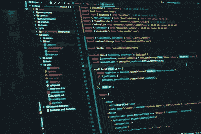

# 初学者反应中的核心概念

> 原文：<https://javascript.plainenglish.io/core-concepts-in-reactjs-for-beginners-a0bffaba49ce?source=collection_archive---------6----------------------->

React 是构建用户界面最受欢迎的 JavaScript 库之一。难怪许多人想学习反应。但是，当你第一次学习反应时，你应该关注什么？

在本文中，我将解释在开始学习反应时您需要首先理解的概念。这是一个正在进行的关于反应的系列的开始。订阅更多内容，敬请关注。

Photo by Juanjo Jaramillo on Unsplash

学习反应时，有几个重要的概念需要理解:

*   [组件](https://pandaquests.medium.com/components-in-reactjs-3974f7a65874):在反应中，组件是代表用户界面一部分的代码。组件可以在整个应用程序中重用，这有助于使代码更容易重用和维护。
*   [JSX](https://pandaquests.medium.com/jsx-in-reactjs-767225e7ac27) : JSX 是一个语法扩展，允许您在 JavaScript 文件中编写类似 HTML 的代码。不要求使用 React，但这是编写 React 组件的常用方法，因为这样更容易阅读和理解。
*   [道具](https://pandaquests.medium.com/props-in-reactjs-3f24d6414d2c):道具是将数据从父组件传递到子组件的一种方式。它们在子组件中是只读的，用于自定义子组件的行为。
*   [状态](https://pandaquests.medium.com/state-in-reactjs-a8392a7bbcb3):状态是存储可用于更新 UI 的数据的对象。它应该小心使用，因为状态的改变会触发组件的重新呈现。
*   [生命周期](https://pandaquests.medium.com/lifecycle-methods-in-reactjs-78dcda71cc61)方法:生命周期方法是在组件生命周期的不同阶段调用的函数，例如当组件被装载、更新或卸载时。了解这些方法可以帮助您更好地控制组件的行为。
*   [事件](https://pandaquests.medium.com/events-in-reactjs-c664d99a5492):事件是用户可以触发的动作，如点击按钮或在文本字段中键入内容。React 提供了一种将事件处理程序绑定到组件的方法，允许您执行代码来响应事件。
*   [虚拟 DOM](https://pandaquests.medium.com/the-virtual-dom-in-reactjs-85ed233eaa99) :虚拟 DOM 是实际 DOM 的轻量级内存表示。React 使用虚拟 DOM 来确定当组件的状态发生变化时，需要对实际 DOM 进行的最少更改数。这有助于通过最小化 DOM 更新的数量来提高 React 应用程序的性能。

你需要学习更多的概念。但这些是重要的。在接下来的文章中，我将更详细地介绍这一点。评论，分享，关注我，了解最新动态。

*报名参加我们的* [***免费周报***](http://newsletter.plainenglish.io/) *。关注我们关于*[***Twitter***](https://twitter.com/inPlainEngHQ)，[***LinkedIn***](https://www.linkedin.com/company/inplainenglish/)*，*[***YouTube***](https://www.youtube.com/channel/UCtipWUghju290NWcn8jhyAw)*，以及* [***不和***](https://discord.gg/GtDtUAvyhW) ***。***

***有兴趣缩放你的软件启动*** *？检查* [***电路***](https://circuit.ooo?utm=publication-post-cta) *。*