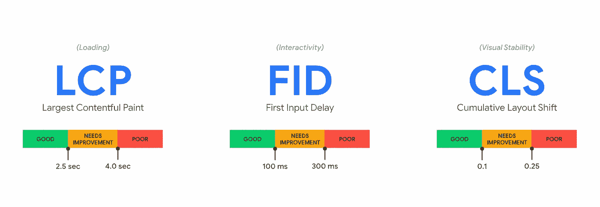
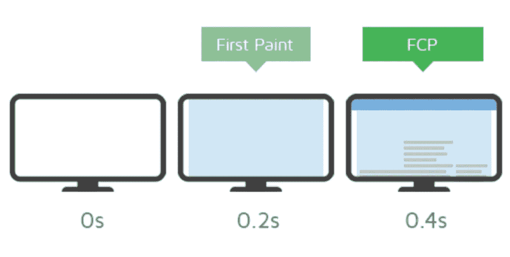
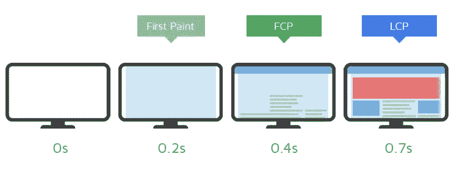
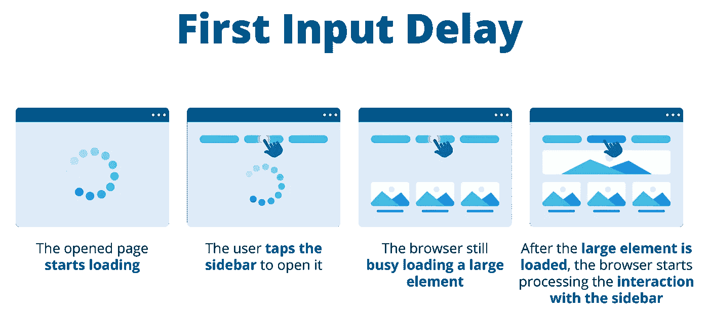
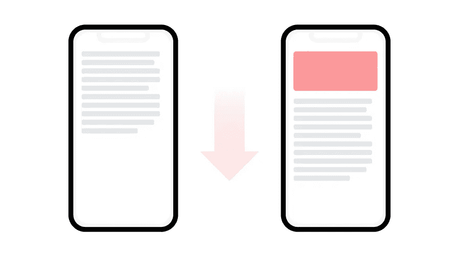

# 核心网站要害&提高网站速度！

> 原文：<https://javascript.plainenglish.io/core-web-vitals-boosting-your-websites-speed-a2ea4d595f0d?source=collection_archive---------6----------------------->

## 在这篇文章中，我们将快速浏览一下 web 关键点&使用它们来提高我们的 Web 应用程序性能

我们有一些指标来确定我们的 web 应用程序的性能、速度、可用性……它被称为 Web Vitals。

# 1.网络生命

让我们从 [web.dev 官方的一篇](https://web.dev/vitals/)文章中来解释一下，“ ***Web Vitals 是谷歌的一项举措，旨在为质量信号提供统一的指导，这些信号对于在网络上提供出色的用户体验至关重要”。***

简单地说，它意味着一个好的网站应该是什么样子&如何为大多数用户服务！但是大部分重要的事情都可以归为一类，即核心网络生命要素。

# 2.核心网络生命

我们再次参考 https:// [web.dev 官方文章](https://web.dev/vitals/)来解释什么是核心要素。
核心网络生命体征是网络生命体征的子集，适用于所有网页，必须由所有网站所有者进行测量，并显示在所有谷歌工具中。每一个核心 Web 生命周期都代表了用户体验的一个特定方面，可以在现场进行测量，并反映了以用户为中心的重要结果的实际体验。2022 年的当前设置侧重于用户体验的三个方面:**负载**、**交互**和**视觉稳定性**，包括以下指标(及其各自的阈值)

在上图中，我们看到了可能最重要的指标，我们并不太关心它们，但我们在日常生活中通过不同的网站体验到了它们，它称为“**字段数据**”，这意味着我们在现实生活中如何体验这些指标，但让我们逐一解释它们！

# **2.1 FCP，第一幅心满意足的画**

假设你点击了谷歌搜索结果中的一个链接，你等待浏览器呈现目标网页的第一部分，从导航点击开始的时间，显示的第一个东西被称为 **FCP** 。我认为这是一个重要的指标，因为它是你网站的第一印象，决定了用户的耐心。根据谷歌的说法，第一次令人满意的绘画将发生在 **1.8 秒或更短的时间内**。这为你的网站访问者提供了良好的用户体验。如果你的网站的 FCP 超过 3 秒，它被认为是慢的。根据一项研究，超过 53%的移动用户会离开一个加载时间超过 3 秒的网站。

First Paint & the contentful one

# 2.2 LCP，最大含量的涂料

有一个地方，你会想，是的，这个网站终于加载，我想我可以开始与它互动！实际上，大多数页面内容都是由浏览器加载和呈现的，并且看起来已经准备好了。顺便说一下，从导航到看到这个场景的时间称为 LCP，它应该在页面首次开始加载的 2.5 秒内发生。

# 2.3 FID，第一次输入延迟

从用户第一次与您的站点进行交互(例如，单击链接、按下按钮或使用支持 JavaScript 的自定义控件)到浏览器能够实际响应交互的时间。当用户点击一个元素时，你已经在 LCP 上可见，直到浏览器响应，该元素被称为 **FID** 。

# 2.4 CLS，累积布局偏移

它比其他主题更抽象，但实际上它都是关于视觉稳定性的，让我们想象你点击了一个网站链接并进入该网站，还看到了 LCP，现在你想与该网站互动，但实际上一个横幅只是加载和转移网站内容，就像你想点击一个按钮，但一个图像刚刚加载，你突然点击图像而不是按钮，这叫 CLP，意味着在网站的使用过程中布局内容的转移。

# 3.灯塔

现在的一个重要问题是，我们应该如何测试我们的 web 应用程序的核心 web vitals 性能，并衡量我们对它所做的更改？答案是 Chrome 灯塔！
你也可以用 Javascript 编写你的定制性能实用程序，但是我更喜欢使用能帮助我们更快测试的东西，否则就从头开始写！从 [https://web.dev](https://web.dev/vitals/#measure-core-web-vitals-in-javascript) 学习如何操作。
Lighthouse 是一款提高网页质量的自动化工具。你可以在任何网站上运行它，无论是公共网站还是需要认证的网站。它的特点是测试性能、可访问性、渐进式网络应用、搜索引擎优化等等。你可以在 Chrome DevTools 中运行 Lighthouse，从命令行运行，或者作为 Node 运行。您给 Lighthouse 一个要测试的 URL，它在页面上运行一系列测试，然后生成一个页面性能报告

# 4.获得速度！

太好了，现在我们了解了什么是核心网络要素**,现在是时候通过改进我们所学的东西来为我们的网络应用获得最大速度了。**

## **服务器响应时间**

**当用户想要导航到你的网站时，浏览器首先向你的服务器发出请求并获取静态文件，然后渲染到可视画面，所以如果你反应晚了，你的渲染速度会变慢，FCP 分数也会降低！**

## **静态文件大小**

**再次像上面的解决方案一样发送尽可能小的文件、资产和包！这很简单，更大的文件需要更多的时间来获取，当浏览器需要这些文件来渲染时，也需要时间来获取，所以我们会有一个低的 FCP 和 LCP 分数**

## **压缩！**

**这里，我们再次希望减少从服务器接收的文件大小，所以我们应该使用像`gzip`这样的技术来压缩来自服务器的文件。你可以在这里了解更多关于他们的信息[。](https://www.pingdom.com/blog/can-gzip-compression-really-improve-web-performance/)**

## **HTTP/2**

**HTTP/2 比它的第一个版本更快更可靠。HTTP/1 为每个连接加载一个请求，而第二个版本使用多路复用来避免延迟。**

## **装载顺序**

**如果你有这么多需要导入的嵌套文件，这会浪费很多时间，伤害我们的 FCP、LCP、CLS 和 FID，所以我们应该使用像`defer`、`import order`、`preload & preconnect`这样的技术来删除这里的大部分延迟部分，你可以搜索一下网络瀑布来查找**

## **事先装好**

**您可以为您的`<link>`元素`rel`设置`preload`值，以指定您很快就需要该资源，并在主要渲染阶段之前的生命周期中开始更快地加载，这将不会在将来阻塞渲染。**

## **预连接**

**使用`Preconnect`与 preload 非常相似，但是`Preconnect`将告诉浏览器记住这个原点，因为我们将从目标资源的原点重新加载资源，这将对加载过程进行优先级排序。**

## **[延期](https://javascript.info/script-async-defer#defer)**

**属性强制浏览器不要等待脚本。它可以生成 DOM，在渲染 DOM 之后，我们可以加载脚本，这个特性可以在`non-blocking`渲染阶段帮助我们！**

## **固定尺寸**

**为了减少 CLS 的问题，你需要在主要内容加载之前组织好你的布局事件！例如，你应该有一个固定的图像，它的宽度和高度，然后让浏览器加载图像，同样，如果失败，我们不能有一个空的地方来存放图像！**

## **分辨率切换**

**这个主题有点复杂，但都是关于为每个断点选择合适的图像！就像你有一个`600px`屏幕，所以你不需要加载一个`1200px`分辨率的图像。你可以从下一个链接了解这个主题以及如何使用它。[https://developer . Mozilla . org/en-US/docs/Learn/HTML/Multimedia _ and _ embedding/Responsive _ images](https://developer.mozilla.org/en-US/docs/Learn/HTML/Multimedia_and_embedding/Responsive_images)**

## **惰性装载**

**首先只加载必要的和视觉中的东西！我们不需要首先加载顶部元素的页脚地图或 youtube embed！在这里了解更多关于惰性加载的信息:[https://developer . Mozilla . org/en-US/docs/Web/Performance/Lazy _ loading](https://developer.mozilla.org/en-US/docs/Web/Performance/Lazy_loading)**

## **小块**

**我们大多数人都在使用新的 JavaScript 框架来构建现代的 web 应用程序，我们最终的 web 应用程序是我们的总 JavaScript 包和块大小，为了减少这个大小，我们应该使用像`Code Splitting`这样的方法，并减少我们使用的 npm 包的数量。**

## **隐藏物**

**就是这么简单，每次都请缓存不需要处理的东西就行了。**

# **包扎**

**感谢所有阅读这篇文章的读者，如果你喜欢这篇文章并支持我在未来写更多，请为我鼓掌，关于网络生命的更多信息，我强烈推荐关于这个主题的 [https://web.dev](https://web.dev) 文章，再次感谢阅读。**

***更多内容看* [***说白了就是 io***](https://plainenglish.io/) *。报名参加我们的* [***免费周报***](http://newsletter.plainenglish.io/) *。关注我们关于*[***Twitter***](https://twitter.com/inPlainEngHQ)*和*[***LinkedIn***](https://www.linkedin.com/company/inplainenglish/)*。查看我们的* [***社区不和谐***](https://discord.gg/GtDtUAvyhW) *加入我们的* [***人才集体***](https://inplainenglish.pallet.com/talent/welcome) *。***