# 更正媒体作者:JavaScript 中的一些基本编码挑战

> 原文：<https://javascript.plainenglish.io/correcting-medium-writers-some-basic-coding-challenges-in-javascript-ba86aab5c8f2?source=collection_archive---------8----------------------->

## 当一个作者创作了一篇没有“挑战”的文章，却不能解决它们。

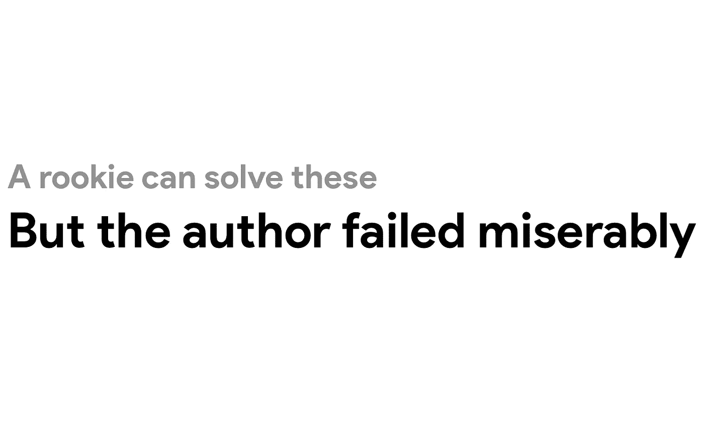

刚看完一篇文章，[*JavaScript 中的一些基本编码挑战*](https://medium.com/javascript-in-plain-english/some-basic-coding-challenges-in-javascript-1270492687e7) *，*作者 Ravi Sharma。我想纠正他清单上的每一项。本文涵盖了基本的 JavaScript“挑战”——甚至不是挑战。然而，代码示例是有缺陷的。不过别担心，我是来纠正拉维的。

如果你读了我在 Medium 上的文章，你会知道我发布了三种类型的文章:

1.  编程指南、提示和技巧、建议和教程
2.  新闻和新的 JavaScript 内容
3.  **我最喜欢的:纠正媒体上的其他作者，并指出他们为什么错了**

我最喜欢的文章是我指出其他作家文章中的缺陷的地方。这通常是因为他们要么对所写的主题一无所知(糟糕的程序员)，要么就是大错特错……但有时，他们只是没有在写作中投入足够的思考。

所以我正在创作一个系列，名为*纠正媒体作者*。开始了。

# **1。创建自定义映射函数的程序。**

## 🧐·拉维的密码

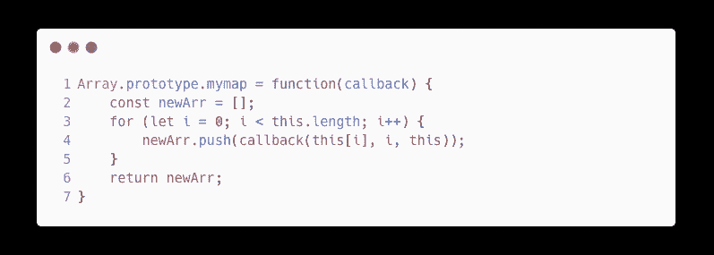

## 🧇我的代码

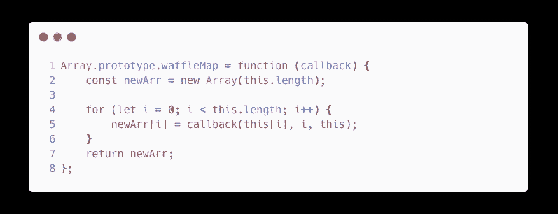

## 👀运行时演示

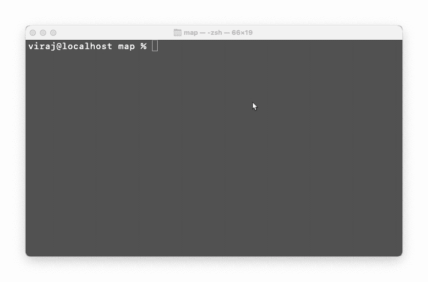

## 🙋‍♂️问题？

*   **第 2 行** : *拉维的* *代码*初始化一个空数组。每次添加新元素时，JavaScript 都必须重新分配数组。我的代码初始化一个正确长度的数组，并预分配所有的内存。
*   **4 号线(我的 5 号线):** *拉维的代码*反复调用`push`。调用函数会增加不必要的开销(增加调用堆栈并重新分配数组)。我的代码把值赋给一个已经被分配的索引。

**但是华夫方式对 100 万个元素只节省 40 毫秒！嗯，在这个演示中，我们正在执行一个简单的算术运算。计算机用简单的乘法运算非常快，尤其是用 2 的幂。假设您想将一个整数数组转换成一个对象集合(反之亦然)。这将转化为秒，有时是分钟。**

# **2。创建自定义过滤函数的程序。**

## 🧐·拉维的密码

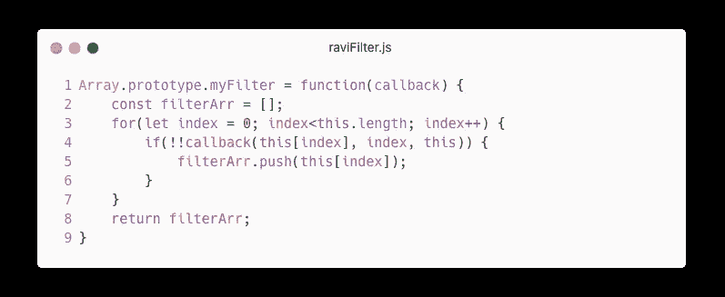

## 🧇我的代码

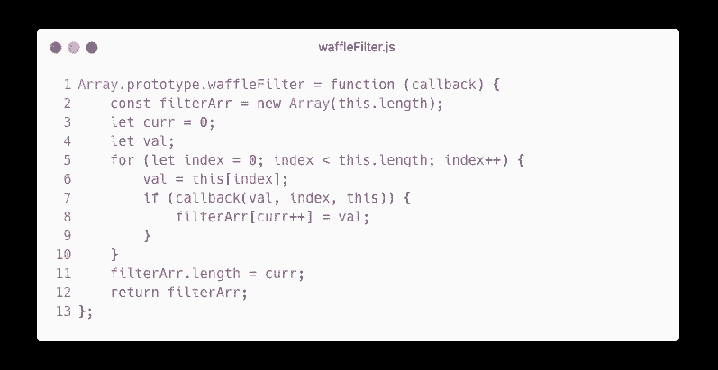

## 👀运行时演示


## 🙋‍♂️问题？

*   **第 2 行** : *Ravi 的代码*初始化一个空数组——同样，这需要大量的重新分配。我的代码用最大可能的索引初始化一个数组。这在`for`循环中节省了时间。
*   **第 3/4 行(我的代码):**因为我不使用`push`，所以跟踪索引是必要的。另外，我创建了一个`val`变量来存储当前值。
*   **第 6 行(我的代码)**:我把当前值赋给`val`。为什么？因为我们要引用`this[index]`。在幕后，JavaScript 使用本机`getters`执行一些额外的代码来检索这个值。⚠️这种方法的效果很小，也无所谓。
*   **第 4 行(我的第 7 行):** *拉维的代码*用了一个巧妙的 JS 招数。[我写过一篇关于 JavaScript/TypeScript 中“falsy”值的文章](/the-7-false-like-values-of-javascript-and-typescript-93df73bda44)。`null`、`undefined`、`''`(空串)、`0`、`void`、`NaN`为 falsy 值。如果回调返回一个 falsy 值， *Ravi 的代码*使用`!`将其转换为相反的布尔值。然后再次使用求反运算符将其转换回原始值(但作为布尔值)。所以`!!0 = false`和`!!true = true`和`!!undefined = false`。*我的代码*不会浪费时间将假值或真值转换成布尔值，因为`if`语句已经将它们视为布尔值。
*   **第 5 行(我的第 8 行):**还是那句话，我直接把值赋给正确的索引，而不是调用一个浪费时间的函数。在这个操作中，我还在递增当前索引时添加了增量`curr`后缀以节省时间。
*   **第 11 行(我的代码):**我通过改变集合的`length`来截断数组中没有被填充的部分。这将自动删除以下所有索引。

**但是 5.5 毫秒跨越 100 万个元素不算什么！**这再次展示了`filter`在立即返回的箭头函数中使用基本算术。想象一下使用字符串操作过滤大型对象、字符串或大多数其他情况。您通常不会只过滤整数。

# **3。创建自定义 reduce 函数的程序。**

## ✅·拉维的密码

这个很好。如果你知道更有效的方法，请在评论或私信中告诉我。


# **4。如何析构嵌套对象**

他的意思是:“如何解构嵌套的对象”——一个不应该指复数的“对象”。

## ✅·拉维的密码

这个也可以。如果你知道更有效的方法，请在评论或私信中告诉我。

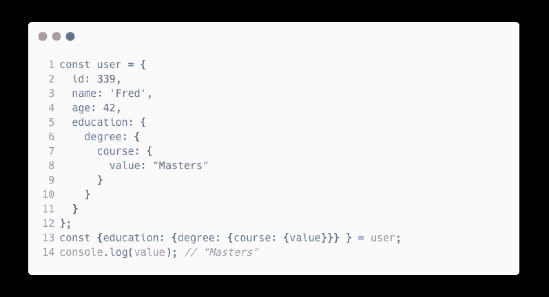

# **5。检查一个数是否是质数的程序？**

不不不为什么？？这是如此简单；拉维怎么可能搞砸这个！

## 🧐·拉维的密码

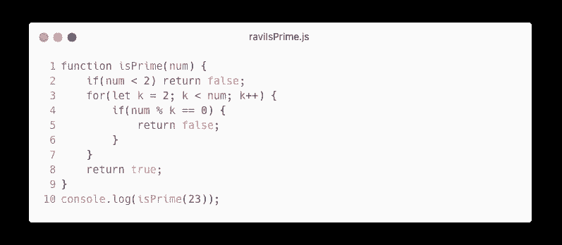

## 🧇我的代码

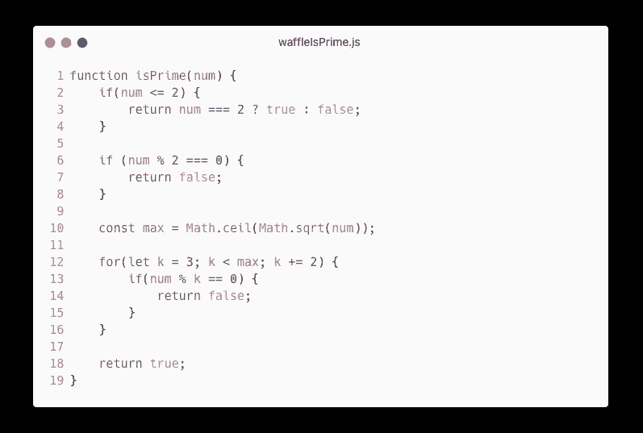

## 👀运行时演示

```
node waffleIsPrime.js
Waffle's Way: 32.69msnode raviIsPrime.js
Ravis Way: 3.845s
```

Ravi 的方法需要 100 多倍的时间…这只是在检查前 100，000 个素数的素性时——想象一下在使用大量数字的加密软件中使用这种算法。

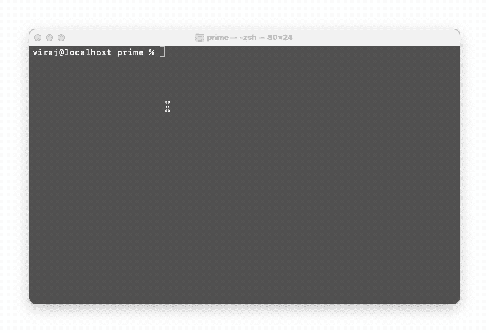

## 🙋‍♂️问题

以下内容适用于我的代码:

*   **第 2–4 行:**我更改了 Ravi 的代码，以检查一个数字是否为`less than or equal to 2`。然后如果数字等于`2`，则返回`true`，否则返回`false`。(`0`和`1`不是质数，但`2`是)。
*   **第 6–8 行:**检查一个数字是否是`2`的倍数。如果是，你知道这个数是**不是**质数(因为它能被 2 整除)。
*   **第 10 行:**你只需要检查这个数是否能被`3`和这个数的平方根之间的数整除。为什么？想想 36。倍数为`1 * 36`、`2 * 18`、`3 * 12`、`4 * 9`、`6 * 6`。那么如果继续下去，我们得到`6 * 6`、`9 * 4`、`12 * 3`。如果你没有注意到这个模式:一旦你到达`n`的平方根，这些数字就会重复。
*   **第 12 行:**我没有从`2`开始递增`1`，而是从`3`开始递增`2`。为什么？我们已经检查过了，以确保数字不是偶数。所以我们可以跳过检查`num`是否能被偶数整除。

**时间复杂度？**拉维代码的[运行时复杂度](https://www.wikiwand.com/en/Time_complexity)为`O(n)`。我的代码的运行时复杂度是`O(sqrt(n/2))`。我的代码会以指数速度运行**。**

# **6。打印前 n 个质数的程序**

**这个太蠢了。我甚至不知道他这么说是什么意思——在他的代码示例中，他将自己的函数命名为`isPrime`，该函数执行相同的行为。**

# **7。打印斐波纳契数列的程序**

## **✅·拉维的密码**

**这个正好。**

**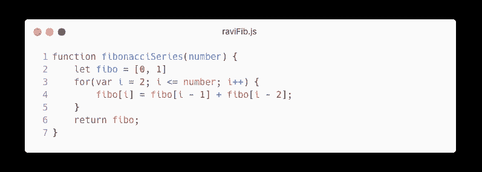**

# **8。反转没有任何内置方法的字符串**

## **✅·拉维的密码**

**这个很好。**

**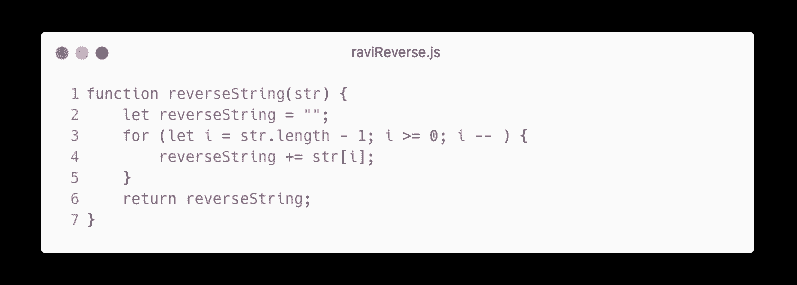**

**我甚至不打算深入下面的三个例子。以下两个示例反转了一个字符串，但对其添加了愚蠢的限制:**

**9。使用内置方法反转句子及其字符: —他的代码示例展示了使用内置方法反转字符串。“以及它的性格”是什么意思？？？这和上一个挑战是一样的。**

****10。使用内置方法反转一个句子中的所有单词:****

****11。仅反转(原地字符串)字符，而不是内置方法的句子****

> **正如你所看到的，他只是想在他的文章中填满空间，以获得更多的阅读时间。但我不会浪费你宝贵的时间**

# ****12。程序执行嵌套对象的深度复制****

**他的意思是“一个嵌套对象的”**

## **❌·拉维的密码**

**这段代码甚至不会像预期的那样工作。**

**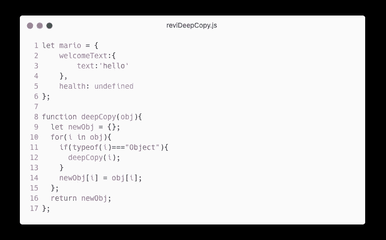**

**Ravi’s code example — with whack indentation**

## **🧇我的代码**

**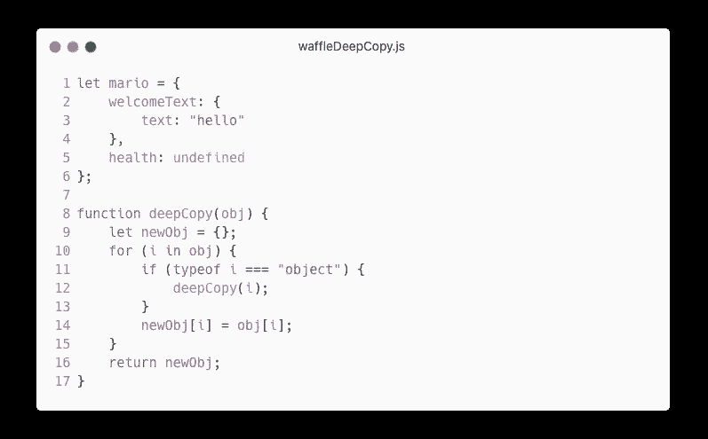**

## **🙋‍♂️问题**

**Ravi 的代码示例是完全错误的。起初它可能看起来有效。仔细看看有什么变化。**

**在**第 11** 行，Ravi 使用`typeof i`检查对象的类型。如果`i`的值是`string`或`number`，那么`typeof i`分别评估为`"string"`或`"number"`。如果`i`的值是一个对象，那么`typeof i`的值就是`"object"`。Ravi 使用带有大写字母“O”的字符串文字`"Object"`。**

**但是正如我们从前面的例子中了解到的，拼写不是 Ravi 的强项。**

# ****13。添加通用的 Add 函数(能够接受任意数量的参数)并承诺****

**在这个例子中，Ravi 缺少代码风格、JavaScript 承诺、带参数的 spread 语法以及一般的编程。**

## **❌·拉维的密码**

**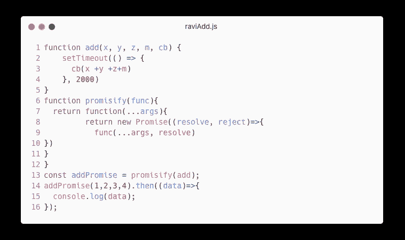**

## **🧇我的代码**

**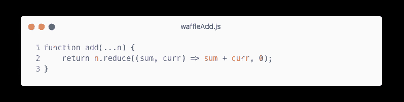**

## **🙋‍♂️问题**

**首先，这个人不知道承诺意味着什么。他们应该等待事件的发生。用`setTimeout`来解决一个加两个数的承诺是愚蠢的。除此之外，他的代码绝对是垃圾——缩进和花括号的格式非常糟糕。**

**同样，他的`add`函数不接受任何数量的参数。他在自己的“编码挑战”中失败了只需要四个自变量:`x`、`y`、`z`、`m`；和回调函数。**

**他的代码将花费 2 秒钟返回一个响应，而在其他情况下可能不到 1 毫秒。此外，他还增加了五个额外的步骤来定义承诺函数。它应该是这样的:**

**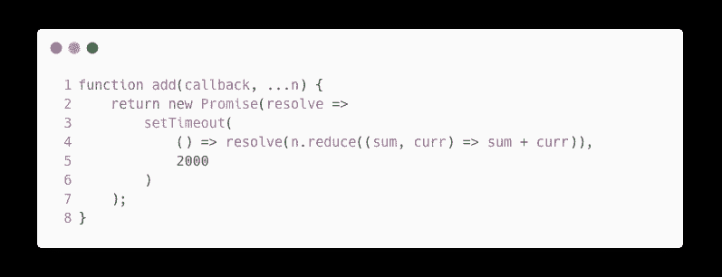**

# ****14。举一个例子，用 let 和不用 let 关键字**的循环中的闭包**

**这甚至不是一个编码的例子…停止浪费我们的时间。**

**如果你喜欢这篇文章，可以看看我的其他文章。**

**[](/terrible-javascript-advice-debunking-stupid-advice-8be0f4724005) [## 可怕的 JavaScript 建议:揭穿愚蠢的建议

### 然而，另一位程序员给出了糟糕的建议。

javascript.plainenglish.io](/terrible-javascript-advice-debunking-stupid-advice-8be0f4724005) [](/advice-from-a-seasoned-dev-keep-using-the-implicit-else-3e1b7c4695ec) [## 来自经验丰富的开发人员的建议:继续使用隐含的 Else

### 不要接受媒体上任何人的编程建议。即使是经验丰富的专业人士有时也会给出糟糕的建议…

javascript.plainenglish.io](/advice-from-a-seasoned-dev-keep-using-the-implicit-else-3e1b7c4695ec) [](https://medium.com/@thesoggywaffle/no-the-end-of-javascript-is-not-here-776a0c92c501) [## 不，JavaScript 还没有结束

### 一个媒体作家如何因为自己一无所知的东西而毁掉自己的可信度。揭露谎言。

medium.com](https://medium.com/@thesoggywaffle/no-the-end-of-javascript-is-not-here-776a0c92c501) 

*更多内容请看*[***plain English . io***](https://plainenglish.io/)*。报名参加我们的* [***免费周报***](http://newsletter.plainenglish.io/) *。关注我们关于*[***Twitter***](https://twitter.com/inPlainEngHQ)*和*[***LinkedIn***](https://www.linkedin.com/company/inplainenglish/)*。查看我们的* [***社区不和谐***](https://discord.gg/GtDtUAvyhW) *加入我们的* [***人才集体***](https://inplainenglish.pallet.com/talent/welcome) *。***