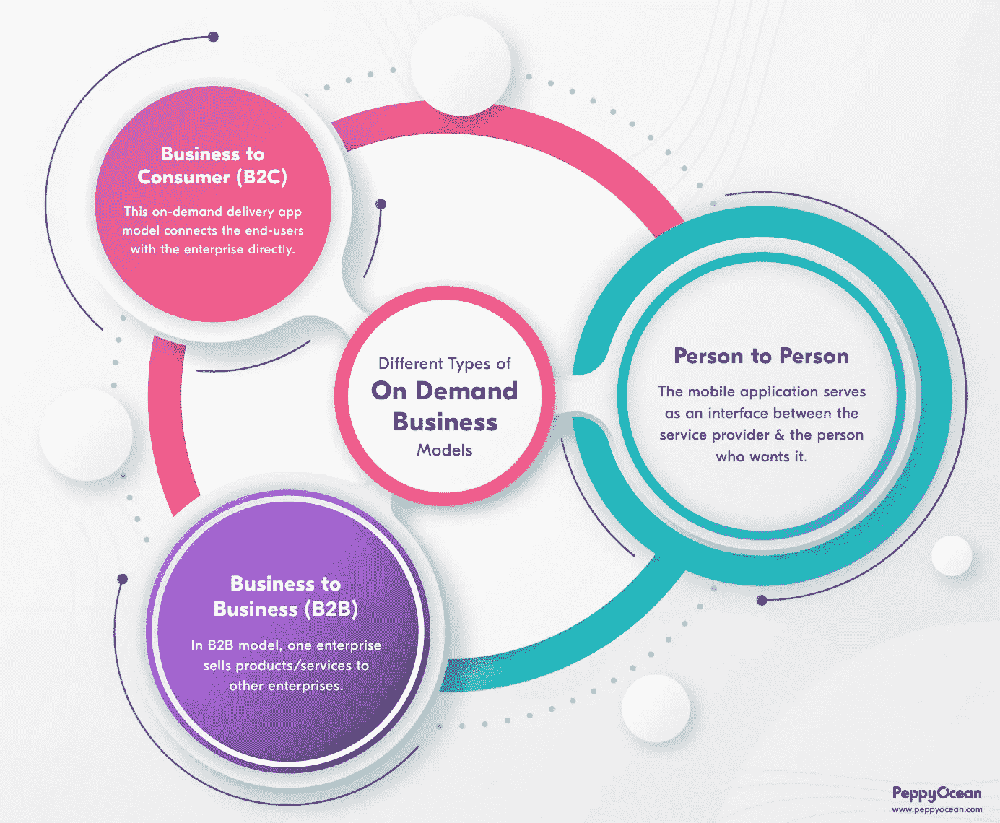

# 开发一个按需服务 App 要多少钱？

> 原文：<https://javascript.plainenglish.io/cost-to-develop-on-demand-service-app-a5cc367b37c2?source=collection_archive---------11----------------------->

## 阅读这篇深入的文章，估算构建按需服务应用程序的成本，以便在按需应用程序开发期间保持预算不变。

按需服务应用程序是定制的移动应用程序，用于满足客户提出请求时的需求。这些应用程序的设计、功能、开发和界面都是根据不同的业务和目标受众定制的。

> 简而言之，按需服务应用程序允许用户订购服务，并将其送到他们的家门口，无论是乘车、食品、杂货、房屋清洁服务，还是你会考虑的任何事情。

无论企业的规模或范围如何，要接触到特定的人群，就必须利用定制的服务应用程序。每个企业都有自己的身份和目标。因此，企业正在将按需开发的应用程序纳入他们的系统。

## 按需服务应用的类型

*   **企业对客户(B2C):** 企业向个人提供服务。
*   **企业对企业(B2B):** 组织与其他组织联系以寻求利润。
*   **客户对客户(C2C):** C2C 点播应用聚集了向其他个人提供服务的个人。

**典型的按需服务 app 有以下几个单元。**

*   **用户 app** —用户下载使用的 app。
*   **服务提供商应用** —企业用来操纵服务和客户的部分。
*   **管理面板** —管理员可以管理客户和服务提供商。

## 按需服务应用的流行类别

*   按需送餐应用
*   按需杂货交付应用
*   按需快递应用程序
*   按需打车预约 App
*   按需远程医疗应用
*   按需遛狗应用
*   按需洗衣应用
*   按需物流和运输应用
*   按需家教 App
*   按需送花应用程序
*   按需美容美发应用
*   按需搬运和包装
*   [医疗保健行业](https://www.peppyocean.com/how-on-demand-apps-are-bringing-revolution-in-healthcare-industry/)

## 开发按需服务应用的好处

企业可以通过投资开发随需应变的应用程序来获得许多好处。它们是:

**快速可靠**
借助点播应用，企业可以立即与客户建立联系。随需应变模式允许消费者迅速请求服务，并允许企业按时提供服务。

**在线品牌形象**
在一个人们几乎可以在网上参与任何事情的世界里，企业可以通过按需服务应用程序来实现在线形象。

**改善客户服务**
[**按需应用**](https://www.peppyocean.com/how-on-demand-apps-are-impacting-our-daily-lives/) 帮助用户跟踪他们的订单，以便管理员提供建议。

消费者分析可以帮助企业更好地了解客户行为。关于他们的购买、声誉和记录的信息提供了更个性化的支持，并与他们建立了更好的关系。

**更大的可扩展性**
可扩展性可以通过提高销售额和盈利能力来增强。当资金投入到正确的和有潜力的地方时，企业会看到销售额、客户忠诚度和利润的增加。由于其扩大业务规模的能力，按需应用正在获得重视和认可。

**支持广泛的业务**
任何企业都可以投资开发随需应变的应用程序，并使其可供潜在客户使用。他们可以为他们提供最方便的服务以及安全的交易。

## 按需服务应用的关键特性

企业可以与**按需应用开发公司**合作，根据需求完成定制功能。然而，在点播应用中有一些常见的基本功能。

**简单的用户界面**
为客户提供了一个简单的界面，带有一个注册窗口，供他们登录和使用应用程序。这确保了安全性和真实性。

**吸引人且信息丰富**
点播应用程序可以提供视觉上吸引人的用户界面，还可以提供必要的指南来浏览和导航应用程序。

**通知管理**
商家可以通知顾客即将到来的促销活动，提供&折扣，以及聊天支持。

**实时跟踪**
移动应用程序开发公司设计应用程序的方式是预订和订单可以被客户跟踪。

**支付网关集成**
随着按需服务应用程序提供各种产品和服务，消费者有了多种支付选择，可以在线支付或启动货到付款。

## 影响按需应用开发成本的因素

**开发按需应用**的总成本因几个方面而异，例如:

*   **应用程序的复杂性:**需要实现的功能越复杂，成本可能越高。随着新特性和功能的增加，成本也在增加。
*   **设计和用户界面:**采用现代技术的新颖独特的设计和定制会增加额外的成本。
*   **支付网关:**在应用程序中集成支付网关需要额外的费用。
*   **基于平台的开发:**为 Android 或 iOS 等单一平台开发应用的成本可能低于为每个平台开发单独的应用。
*   **跨平台框架:**像 Flutter 和 React Native 这样的框架使得开发更具成本效益。它允许相同的代码在多个平台上重复使用，远程更新应用程序，确保实时测试，并允许与其他应用程序和庞大的组件库无缝集成，从而减少开发时间和总体成本。

## 开发按需服务应用程序的预计成本

没有确切的成本可以提及，因为有各种因素影响总预算。

开发应用程序的成本主要取决于应用程序平台、应用程序大小、应用程序设计和应用程序开发。

开发具有基本功能的按需服务应用程序的预计**成本为 12，000 美元到 15，000 美元。从零开始开发复杂的特性&功能可能需要超过 40，000 美元的投资。**

## 结论

在过度互联网主导的世界里；**按需服务应用**对企业和客户来说都有很多优势。这也是它的发展成为组织间趋势的原因。重要的是采取一种平衡的方法，这样成功是多余的。你还需要记住，不管你有什么样的商业模式，一个按需应用程序将使客户参与完美无缺，同时确保客户体验是至高无上的，你的收入始终保持高水平。