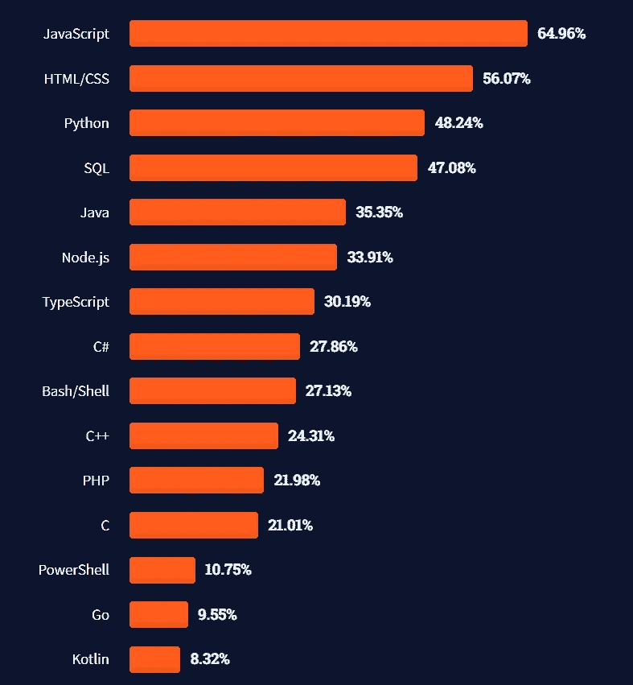

# JavaScript 是深度学习有史以来最棒的东西吗？

> 原文：<https://javascript.plainenglish.io/could-it-be-that-javascript-may-be-the-best-thing-that-ever-happened-to-deep-learning-fc43584acc97?source=collection_archive---------10----------------------->

What JavaScript would say to Deep Learning. Photo by [Adam Jang](https://unsplash.com/@adamjang?utm_source=medium&utm_medium=referral) on [Unsplash](https://unsplash.com?utm_source=medium&utm_medium=referral)

“尽管 Python 和 R 在机器学习和数据科学方面有一个更好的社区，JavaScript 社区也在建立对机器学习相关数据管道的支持。”

*D*[eep 学习和 JavaScript](https://www.amazon.com/Deep-Learning-JavaScript-networks-TensorFlow-js/dp/1617296171)

有一次爱因斯坦被问到第四维:他回答说他喜欢这个想法！我确实喜欢 JavaScript 和深度学习的想法，因为爱因斯坦似乎喜欢第四维。

# 关于 JavaScript，GitHub 教会了我们什么？

是用的最多的语言！Python 排名第三，甚至输给了被一些人认为已经死了的 JavaJava 是我在 JavaScript 之前的第一语言。我猜想 Java 排名第二，因为相当数量的应用程序仍然是 Java；立即转换到另一种语言并不容易。计算机程序员的口头禅:“如果它有效，就不要改变任何东西”。

 [## Jorge Guerra Pires 在 LinkedIn 上:GitHut -编程语言和 GitHub

### JavaScript，Java，e Python so as linguagens mais present no GitHub # JavaScript # Python # Java # GitHub…

www.linkedin.com](https://www.linkedin.com/posts/jorgeguerrapires_githut-programming-languages-and-github-activity-6935950919268245505-cKvs?utm_source=linkedin_share&utm_medium=member_desktop_web) 

Similar results from Stack Overflow 2021.

# 我的想法

很长一段时间，[我用 Java 编码，面对 C++粉丝 boy](https://jorgeguerrapires.medium.com/does-angular-really-suck-why-i-have-to-disagree-cb16677900a8) ，作为一个为 React vs. Angular 写这里的人。这很烦人。[当我分享一篇捍卫 JavaScript 和深度学习合二为一的帖子时，有人在脸书上写道:](https://jorgeguerrapires.medium.com/we-believe-deep-learning-and-javascript-belong-together-me-too-b70e40cf6092)

*深度学习的弱类型语言，看不出进展顺利*

[见我回复](https://jorgeguerrapires.medium.com/we-believe-deep-learning-and-javascript-belong-together-me-too-b70e40cf6092):没有关联！即使有，使用 JavaScript 的收益也是巨大的！

对于 Java，听到重复:Java 很慢，这不是真的。慢的是人们对新思想、新范式的接受！

 [## Jorge Guerra Pires 在 LinkedIn 上:JavaScript 可能是有史以来最好的东西吗…

### JavaScript 是深度学习有史以来最棒的东西吗？豪尔赫·格拉·皮雷斯博士。以 JavaScript 发布于…

www.linkedin.com](https://www.linkedin.com/posts/jorgeguerrapires_could-it-be-that-javascript-may-be-the-best-activity-6937297220937388032-Eomd?utm_source=linkedin_share&utm_medium=member_desktop_web) 

*更多内容请看*[***plain English . io***](https://plainenglish.io/)*。报名参加我们的* [***免费周报***](http://newsletter.plainenglish.io/) *。关注我们关于*[***Twitter***](https://twitter.com/inPlainEngHQ)*和*[***LinkedIn***](https://www.linkedin.com/company/inplainenglish/)*。查看我们的* [***社区不和谐***](https://discord.gg/GtDtUAvyhW) *加入我们的* [***人才集体***](https://inplainenglish.pallet.com/talent/welcome) *。*