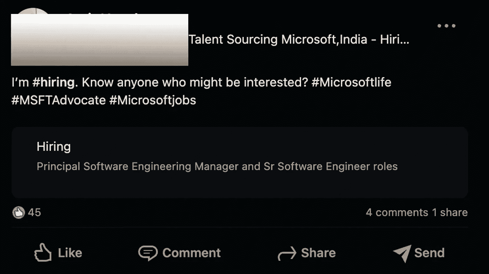
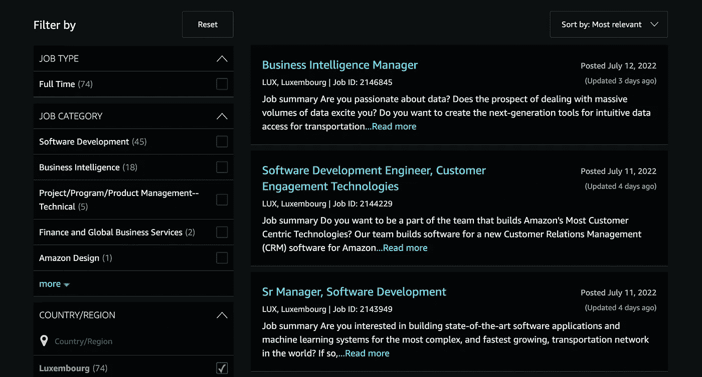
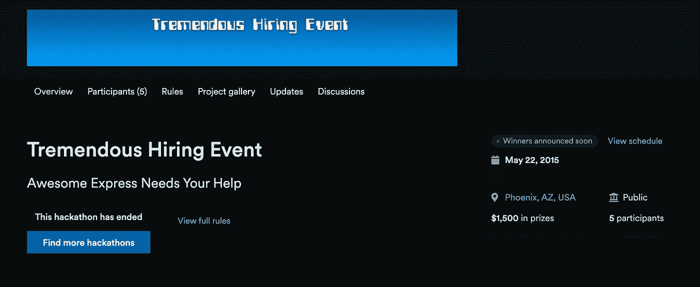

# 破解登陆技术面试的密码

> 原文：<https://javascript.plainenglish.io/crack-the-code-of-landing-the-technical-interviews-9704b4ebd87b?source=collection_archive---------13----------------------->

## 让我们揭穿关于求职的事实和神话。

当我们提升自己成长为一个个体时，一旦我们完成了一个特定的机会，我们往往会寻找另一个好机会。成功的面试会帮助我们得到我们梦想中的角色。但是要想成功面试，我们需要先去面试。即使你精通这些概念，并且在某项技能上是顶尖的，除非你没有机会展示你的技能，否则除了满足你自己之外，它没有任何用处。

Photo by [Mimi Thian](https://unsplash.com/@mimithian?utm_source=medium&utm_medium=referral) on [Unsplash](https://unsplash.com?utm_source=medium&utm_medium=referral)

像许多人一样，你也可能陷入无休止地申请面试的怪圈，但很难从招聘人员那里得到回复。这很令人沮丧，不是吗？

许多优秀的候选人没有得到认可，即使他们的技能与机会相匹配。一个原因是，他们不知道该找谁，或者去哪里获取特定的技能。

在这篇特别的文章中，我们将试图了解这个行业。此外，这篇文章主要是针对技术面试而写的，但也可以很容易地推广到其他领域。

在开始谈论如何让自己为下一次与理想公司的面试点燃激情之前，了解这个行业的基础知识同样重要。我怀疑还有其他人以这种特殊的方式讨论过这个问题。

我们将从理解基于服务的组织和基于产品的组织之间的区别开始。尽管我用的是“组织”这个词，但这种结构甚至可以在小企业中找到。

# 基于服务的组织与基于产品的组织

通常是任何试图销售服务或产品的公司/组织。这是任何大组织背后的动机，不管是谷歌、脸书、亚马逊、TCS 等等。你可以在这两大类别下找到几乎所有的组织。

任何组织都在销售成品或特定产品的一部分，如汽车、轮胎、管道制造公司、半导体制造公司等等。一个组织可以销售一个完整的产品，但是他们自己制造每个零件的机会非常少。

一个组织可以通过组装来自不同组织的产品来制造最终产品。现在，制造产品或销售最终产品的公司被归入基于产品的组织。

但其他各种组织，如 TCS、埃森哲和其他类似的基于服务的公司都在销售服务，而不是特定的产品。那么，我们所说的服务是什么意思呢？它实际上是任何其他组织生产的产品的一部分。

这些公司/组织/企业负责为他们提供服务的特定产品维护和添加新功能，类似于提供维修、保养等服务的其他组织。根据你的技能和要求，你应该选择适合你的行业。

一般来说，在服务型组织中，我们倾向于学习新技能，因为我们必须做几件不同的事情。与基于产品的组织相比，响应和推出特性的时间相对较少。

大多数情况下，在基于产品的组织中，我们可以为了更好的产品质量而与时间妥协。因为它是组织的产品，你可能有额外的时间来制造最高质量的产品。

# 直接工资单和第三方。

到目前为止，我们了解了基于服务的行业和基于产品的行业之间的区别，是时候深入到工资系统了。问题来了，理解工资系统有什么必要。

当然，在我们获得某个组织的录用通知之前，了解该组织雇用员工的方式之间的差异是非常重要的，不管该组织是基于服务还是基于产品的组织。

一般来说，组织用自己的工资雇佣新员工。这意味着工资、PF 等。的员工与他们受雇的公司有关联。

但很多时候，公司确实外包了员工，他们要求服务型公司在一定的合同期限内为他们提供具有特定技能的员工。在这种情况下，员工可能为另一个组织工作，但在他们的工资单上，这种联系来自那个基于服务的组织。

例如，让我们举一个虚构的例子，你在一家大型跨国公司工作，如谷歌埃森哲等，你可能不是这个大组织的一部分。你是服务型组织 XYZ 的一名员工，在这个项目中，你的技能得到了利用。

每当有招聘人员联系你，问你是否对那个职位感兴趣。如果招聘人员是某个特定组织的直接成员，一定要仔细检查。他们有可能是为该跨国公司提供服务的第三方组织的一部分。

除此之外，还要确认他们将雇佣你的组织。这和工资系统有点关系，理解这些概念和找新工作一样重要，因为你不想被困在一个你不喜欢的机会里。

# 寻找机会

一旦我们了解了这个行业的动态，我们就应该继续寻找适合我们的角色。找工作是我们需要掌握的一门艺术。市场上有大量的空缺职位，但只有聪明的人才能为他们找到一个完美而合适的角色。

一个非常明显的问题出现了，我们在哪里可以找到与我们的技能相匹配的角色？

以下是一些你可以获得下一份工作机会的好方法。

## 商务化人际关系网

LinkedIn 据说是一个平台，我们打算在其中创建一个良好的职业网络。与其他社交媒体不同，LinkedIn 不是一个吹嘘我们计划下一次旅行的地方。出于类似的原因，招聘人员也会发布职位空缺信息。

当我们在 LinkedIn 这样的平台上寻找任何新的机会时，我们需要积极主动。我们还应该知道，各公司都有推荐计划，员工可以向他们认识的人推荐适合他们的特定职位。

当然，不是每个人都有适合某个特定角色的亲戚或朋友。员工在他们的 LinkedIn 个人资料上发布推荐计划，作为一个机会主义者，你可以利用该平台的力量为该角色获得推荐。

下面是一个这样的帖子，其中用户/员工正在向其网络通知职位空缺。一个重要的事实是，如果帖子是招聘人员发的，那么他们可能会收到大量的电子邮件，你和这个人直接交谈的机会变得很少。但不管怎样，你至少可以试着申请这个特殊的角色。

Linked Post about an opening at Microsoft.

此外，寻找你可能认识的在同一家公司工作的其他人，你可以让他们推荐你担任那个特定的职位。接到招聘人员的电话会成倍增加。

## 职业页面

这是事实，每个人都应该意识到是'职业生涯页'。但是，技术不那么好的人可能不知道职业页面。

如果我们不查看相关组织的招聘页面，我们很有可能会错过这个机会。通常，招聘页面位于 URL[https://the](https://the)company URL/careers 下。但是也有一些例外。但只要简单地在谷歌上搜索一下 XYZ 公司的职位，你肯定会找到他们求职页面的链接。

Careers Page of an organisation.

下面是一个这样的报道机构的招聘页面。在这里，您可以根据您的位置、技能和偏好来筛选机会。通过职业页面申请，得到电话的机会比在推荐项目中少一点，但你不能完全否认你不会得到电话。

仅仅是在求职页面上申请，我就收到了招聘人员打来的多个电话。它确实很管用。

## 联系招聘人员

现在，我们已经学习了推荐计划和职业页面。朝类似方向迈出的一步是直接联系招聘人员。联系招聘人员时，你应该知道你打算申请哪家公司。

Photo by [Magnet.me](https://unsplash.com/@magnetme?utm_source=medium&utm_medium=referral) on [Unsplash](https://unsplash.com?utm_source=medium&utm_medium=referral)

现在，在 LinkedIn、Blind 等网站的个人资料中，该特定组织的许多招聘人员通常会分享他们的电子邮件 ID 或其他联系方式。他们给了人们接触他们的机会，以防他们无法接触到人才。

他们中的许多人也清楚地说明了你应该如何发送邮件以期待回复。理解招聘人员收到过多电子邮件的事实。你的电子邮件应该清晰准确。

邮件应该非常清楚地说明我们申请的是哪个职位。同样，我们的技能组合使我们有资格担当这个特殊的角色。有时我看到人们用垃圾邮件烦扰成千上万的人，而不是为特定的招聘人员创建一封定制的电子邮件。

当然，我不能代表所有人，这是一般的经验法则。每个人都是不同的，即使是招聘者和面试官。他们的思路可能和你的完全不同。所以继续尝试，直到你成功。

## 黑客马拉松

谈论一些发布在各种平台上的黑客马拉松的间接途径。一个这样的平台是 https://devpost.com/，它允许公司组织一次黑客马拉松。

这些公司在描述中明确提到，由于黑客马拉松，他们肯定会雇佣一些表现出色的人。

使用基于黑客马拉松的方法，你可能不会面对那么多面试，但我会说这是一种将人才与机会相匹配的好方法。

Hackathon organised for hiring candidates.

就像你听说的那样，技术面试系统似乎在任何组织中都被打破了，因为面试中问的问题类型与公司将要做的实际工作毫无关系。

基于黑客马拉松的方法看起来非常实用。因为大多数组织这次黑客马拉松的公司要求参与者在实时场景中工作，而不是解决一些随机的难题。

如果你热衷于参加黑客马拉松，这是你的机会。

## 顾问

顾问是帮助你获得理想工作的人。因此，基本上有各种组织负责将人才与合适的机会相匹配。

Photo by [bruce mars](https://unsplash.com/es/@brucemars?utm_source=medium&utm_medium=referral) on [Unsplash](https://unsplash.com?utm_source=medium&utm_medium=referral)

很多时候，这些顾问会主动联系候选人，因为他们已经与企业签订了合同，可以为他们找到合适的人才。

就像该组织的在职招聘人员一样，人力资源公司在其网站和其他社交媒体平台上发布不同的机会。

作为候选人，你也可以直接联系这些咨询公司。搜索顾问的联系方式可以很容易在谷歌、LinkedIn 等网站上找到。

这些顾问是变相的祝福，因为他们可以帮助你赶上不同的组织，你可能无法直接接触。如果你也在通过探索这条道路积极地找工作。

# 最后的想法

所以，如果你正在寻找另一个机会，而没有接到招聘人员的电话。你应该尝试运用上述策略去参加面试。

在面试中表现出色永远是成功面试的关键点。所以，做好准备，并通过以下方式，我在上面详细投保。

*   LinkedIn。
*   职业页面。
*   联系招聘人员。
*   黑客马拉松。
*   顾问。

通过遵循这些方法，我确信你会成功的。继续努力，像钻石一样闪耀光芒:-)。

**关于作者**

Apoorv Tomar 是一名软件开发人员，是[**mind bake**](https://mindroast.com/)的一部分。你可以在 [**Twitter**](https://twitter.com/apoorvtomar_) 、 [**Linkedin**](https://www.linkedin.com/in/apoorvtomar/) 、 [**Telegram**](https://t.me/ApoorvTomar) 、 [**Instagram**](https://www.instagram.com/apoorvsinghtomar/) 上和他联系。订阅 [**简讯**](https://www.mindroast.com/newsletter) 了解最新策划内容。不要犹豫在任何平台上说“嗨”,只要说明你是在哪里找到我的资料的。

*更多内容请看*[***plain English . io***](https://plainenglish.io/)*。报名参加我们的* [***免费周报***](http://newsletter.plainenglish.io/) *。关注我们关于*[***Twitter***](https://twitter.com/inPlainEngHQ)[***LinkedIn***](https://www.linkedin.com/company/inplainenglish/)*[***YouTube***](https://www.youtube.com/channel/UCtipWUghju290NWcn8jhyAw)*[***不和***](https://discord.gg/GtDtUAvyhW) *。对增长黑客感兴趣？检查* [***电路***](https://circuit.ooo/) *。***