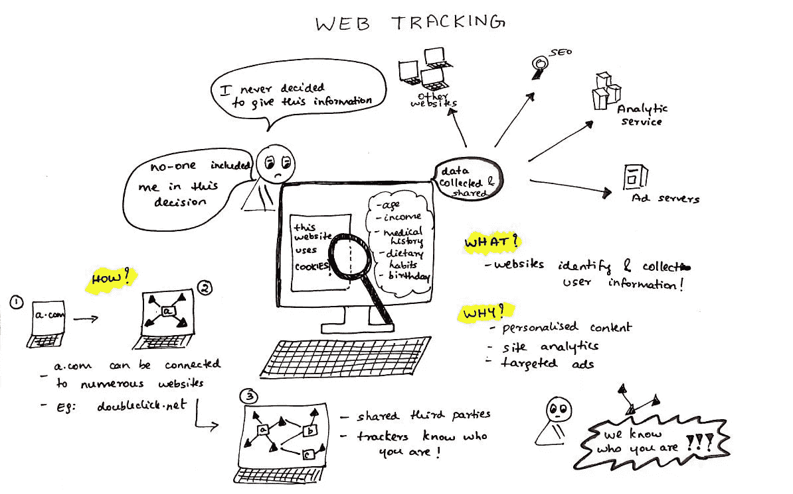
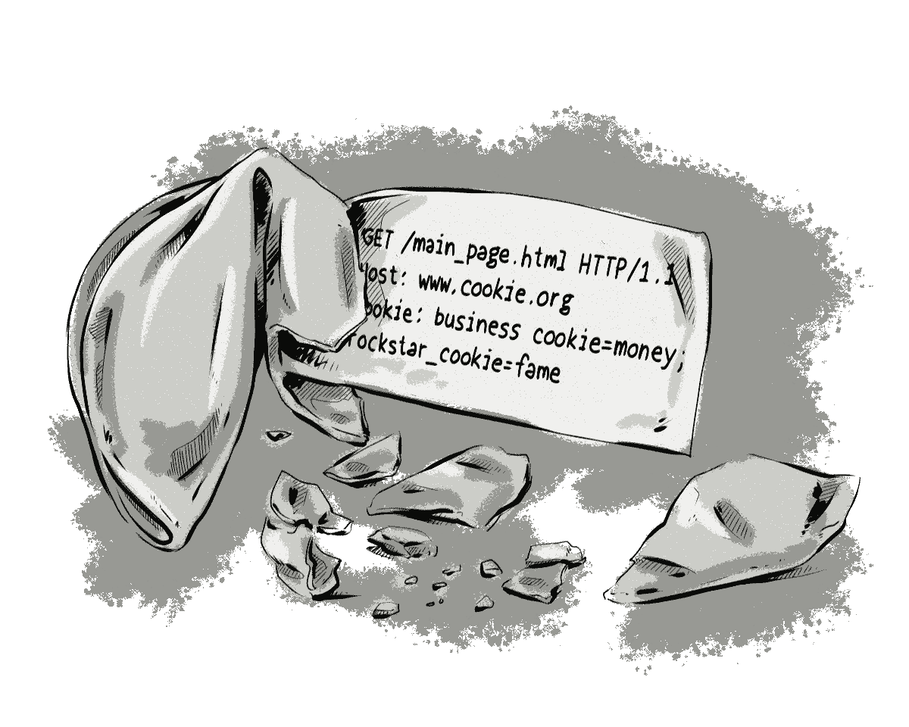

# 在线隐私速成班:网络跟踪介绍

> 原文：<https://javascript.plainenglish.io/crash-course-in-online-privacy-introduction-to-web-tracking-5ff799420892?source=collection_archive---------18----------------------->

## 解释什么是跟踪，什么是追踪器，它们是如何工作的，以及你需要知道的关于你的网上隐私的一切。

Web Tracking

# **目录**

## 网页追踪简介

*   什么是网络跟踪？
*   什么是网络追踪器？
*   为什么您应该了解网络跟踪

## 跟踪机制

*   饼干
*   超级饼干
*   指纹仪
*   嵌入式脚本

## 第一方与第三方追踪器

*   什么是第一方追踪器？
*   什么是第三方追踪器？
*   它们是如何工作的？

## 追踪追踪者

*   如何追踪追踪者
*   我们能阻止追踪者吗？

## 结论

# **网络跟踪简介**

很多人访问网站时完全不知道收集的是什么类型的数据。每当你使用互联网时，你总是会留下你访问过的网站、你点击过的广告、你收藏过的网页等等的记录。追踪你在网上留下的信息的需求催生了**网络追踪**。

在这篇文章中，我将解释什么是跟踪，什么是追踪器，它们是如何工作的，以及你需要知道的关于你的网上隐私的一切。

## 什么是网络跟踪？

**网络跟踪**涉及网站所有者为了识别和收集用户信息以便进一步处理而采取的各种过程。他们使用该信息来提供期望的功能、各种站点分析、期望的广告等。这提高了访问者的满意度，并使网站的流量增加了许多倍。

## 什么是网络追踪器？

追踪器是网站附加的许多功能中的一部分，它保存访问者的信息以供进一步处理。网站所有者分析这些信息，以获得用户在网站上的活动统计数据。使用数据的一些方面包括站点分析、访问者统计、销售统计等等。

## 为什么您应该了解网络跟踪

您的个人信息很有价值，您有权知道正在收集哪些关于您的数据。不了解网络跟踪绝对会导致您在访问网站时暴露您的所有信息，这增加了黑客的风险，他们会出于欺诈目的窃取您的信息。

了解你的数据是如何被收集的，有助于你将来减少接触追踪者。

# **跟踪机构**

网站所有者有各种机制来跟踪他们的访问者。以下是最常见的跟踪机制:

*   cookie:你经常在浏览器中看到*cookie*但是你不知道它的意思。cookie 是由网站以唯一的用户身份存储在用户浏览器上的数据。用户第一次访问网站时会存储这些数据，每次您访问网站时，cookies 都会存储在您的设备上。它们还用于向您建议对您最有用的内容，用于存储您的登录信息并帮助您记住它们，防止欺诈，等等。***cookie 是最常见的识别用户身份的方法。***
*   **超级曲奇:**超级曲奇只是曲奇的升级版。不像 *cookies* ，它们很难被发现和清除。这是因为它们不能像普通的 cookies 一样自动删除。超级 cookies 可以永久保存在你的电脑上。以下是超级 cookies 一旦注入您的设备后可以做的事情:

1.  它们允许网站访问您的个人信息、行为和偏好。
2.  他们可以跟踪你在互联网上最活跃的时间。
3.  广告商使用这些 cookies 来根据用户档案偏好创建有针对性的广告。

*   **指纹识别器:**指纹识别器就像任何其他追踪器一样。唯一不同的是，收集的数据相当全面和精确。这些包括浏览器版本、浏览器类型、屏幕分辨率、字体、插件、时区、IP 地址、语言等

一个独一无二的**指纹**被创建，数据被整理，可用于跟踪你访问的每个网站。

*   **嵌入式脚本:**这些是微小的、可见或不可见的、嵌入到网页中的对象，用来跟踪用户。他们也可以被称为**网络臭虫。它们最简单的形式包括微小清晰的图像、跟踪脚本等等。有些人一访问网站就开始工作，有些人直到你点击它们。它们可以存储你的很多信息，包括你的 IP 地址。**

# **第一方追踪器 vs 第三方追踪器**

first-party trackers vs third party trackers

什么是第一方追踪器？

**第一方追踪者是您直接访问的网站上的追踪者。**

例如，您访问了一个招聘网站，如 startup.jobs。您在该网站上做的任何事情都会被跟踪，是的 *startup.jobs* 是第一方网站，因为您选择访问该网站。

什么是第三方追踪器？

**第三方追踪器是除了直接访问的网站的追踪器之外的追踪访问该网站的用户的追踪器。**

第三方追踪者是一家在 *startup.jobs.* 上发布工作的公司。第一方网站嵌入第三方只是为了提高用户对网站的满意度，从而让第三方在你点击后追踪你。

**它们是如何工作的？**

**第一方追踪器**在你访问网站时立即工作，因为你直接访问网站。

然而，第三方追踪器使用第一方网站上的代码将 cookie 放到用户的设备上。

# **追踪追踪者**

## **如何追踪追踪器？**

光束浏览器扩展是一个用于跟踪跟踪器的工具。这个浏览器扩展是由 Mozilla 开发的，现在也可用于 Chrome 和其他浏览器。

上互联网，下载扩展并将其添加到您的浏览器中，阅读文档并开始使用它来跟踪您的追踪器。

我们能停止追踪器吗？

是的，我们可以。

Firefox 是一个允许我们停止追踪器的浏览器。默认情况下，第三方跟踪 cookies 在 firefox 上被阻止，即使你想要更强的保护，你需要做的只是将增强跟踪保护模式设置为严格的。

另一种停止跟踪器的方法是使用火狐的脸书容器。

脸书容器是一个网页浏览器插件，用来隔离脸书在其他网站上跟踪你。它通过把它放在一个“容器”里来防止你被脸书跟踪。脸书将无法跟踪你或你在其他网站上发布的任何其他信息。

# **结论**

每个用户都被建议掌握网络跟踪和追踪器。这样可以防止你不小心把自己的信息放到各种网站上。

感谢阅读。

欢迎在以下社交媒体上联系我: [Twitter、](https://twitter.com/devtoheeb) [脸书](https://www.facebook.com/akande.olalekan.1238)、 [Instagram](https://www.instagram.com/muh_toyyib_0/) 或 [WhatsApp。](https://wa.me/message/BUW6NXAJ2A3HA1)

*更多内容请看*[***plain English . io***](https://plainenglish.io/)*。报名参加我们的* [***免费周报***](http://newsletter.plainenglish.io/) *。关注我们关于*[***Twitter***](https://twitter.com/inPlainEngHQ)*和**[***LinkedIn***](https://www.linkedin.com/company/inplainenglish/)*。查看我们的* [***社区不和谐***](https://discord.gg/GtDtUAvyhW) *加入我们的* [***人才集体***](https://inplainenglish.pallet.com/talent/welcome) *。**