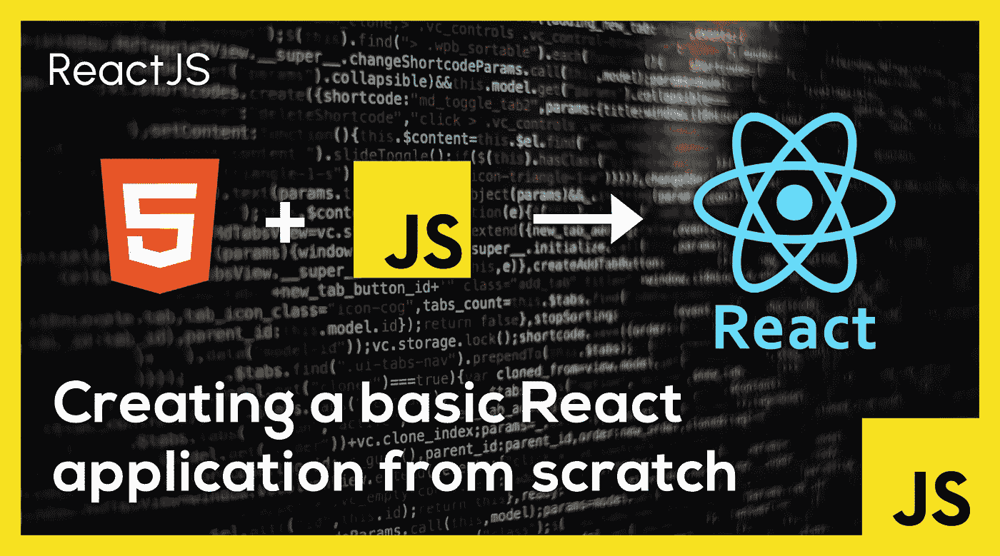
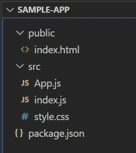
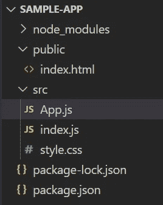
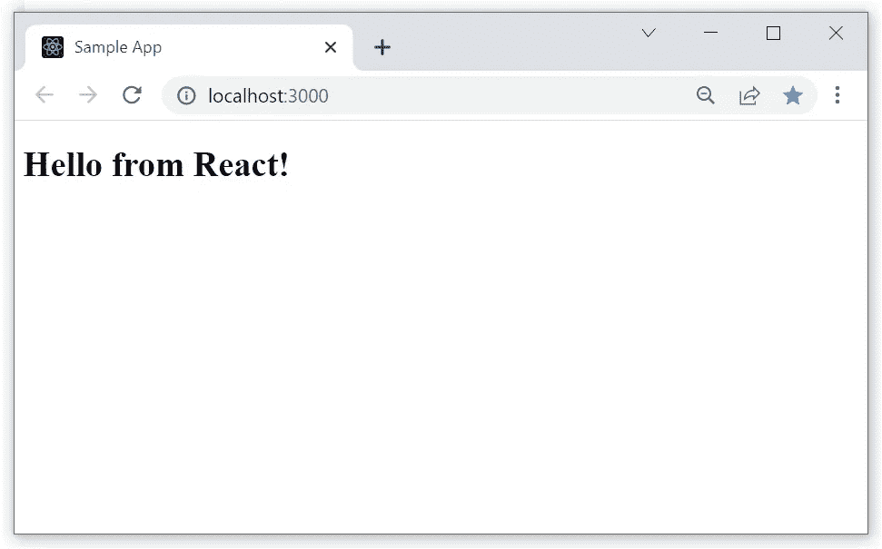

# 从头开始创建一个基本的 React 应用程序

> 原文：<https://javascript.plainenglish.io/create-a-basic-react-application-from-scratch-888bff9564aa?source=collection_archive---------12----------------------->

## 而不使用 create-react-app。



[React](https://reactjs.org/) 是目前最流行的基于组件的 UI 库/框架。React 的美妙之处在于可以用最少的代码快速开发复杂的 UI 模式。使用 [JSX](https://reactjs.org/docs/introducing-jsx.html) 使得模块化应用程序的开发和集成变得轻而易举。

我们可以通过使用`create-react-app`工具开始使用 React 应用程序。但是在本文中，我们试图通过创建每个文件并填充其内容来手动创建一个 React 应用程序。

假设读者对 [Node.js](https://nodejs.org/en/) 有一个基本的了解，并且在我们开始之前，应该已经在他们的机器上安装了 Node 和 [NPM](https://www.npmjs.com/) 。

我们将使用 [VS 代码](https://code.visualstudio.com/)工具来创建和管理文件和文件夹。让我们首先为应用程序创建一个基本文件夹，并在 VS 代码中打开它。

# 创建文件和文件夹



每个 React 应用程序在其基本文件夹中包含一个`public`文件夹、一个`src`文件夹和一个`package.json`文件。

我们首先为应用程序创建`package.json`文件。

```
{
    "name": "sample-app",
    "version": "0.0.1",
    "private": true,
    "dependencies": {
        "react": "18.1.0",
        "react-dom": "18.1.0"
    },
    "devDependencies": {
        "react-scripts": "latest"
    },
    "scripts": {
        "start": "react-scripts start",
        "build": "react-scripts build"
    },
    "browserslist": {
        "development": [
            "last 1 chrome version",
            "last 1 firefox version",
            "last 1 safari version"
        ]
    }
}
```

`dependencies`包括最新版本的`react`和`react-dom`库。

`devDependencies`包括最新版本的`react-scripts`库。我们还添加了两个脚本来**启动**和**构建**应用程序。这些被添加到`package.json`的脚本部分。

最后，我们为开发设置浏览器列表。我们包括`chrome`、`firefox`和`safari`。

下一步，我们创建`public`和`src`文件夹。

## “公共”文件夹

`public`文件夹包含`index.html`文件及其相关文件。在本例中，我们将只创建`index.html`文件，因为这是一个基本应用程序。

**index.html**

```
<!DOCTYPE html>
<html lang="en">
    <head>
        <meta charset="UTF-8">
        <meta http-equiv="X-UA-Compatible" content="IE=edge">
        <meta name="viewport" content="width=device-width, initial-   scale=1.0">
        <title>Sample App</title>
    </head>
    <body>
        <div id="root"></div>
    </body>
</html>
```

索引文件包含一个基本的 HTML 样板文件。文件主体包含一个 id 为`"root"`的标签`<div>`。整个应用程序都在这个`<div>`中呈现。

## “src”文件夹

`src`文件夹包含应用程序代码的主要部分。它包含`index.js`、`style.css`和`App.js`文件。`index.js`文件构成了 React 应用程序的入口点。`App.js`文件是在`index.js`文件中引用的基础 react 组件。`style.css`文件包含`'App'`组件的样式。该文件夹还可能包含其他 react 组件和服务。在这个例子中，我们只包括三个主要文件。

**index.js**

```
import React from "react";
import ReactDOM from "react-dom";
import App from "./App";ReactDOM.render(<App />, document.getElementById("root"));
```

`React`和`ReactDOM`库最初被导入该文件。接下来，导入作为应用程序基础组件的 App 组件。

现在我们使用`ReactDOM.render()`方法将 App 组件呈现到存在于`index.html`文件中的根 div 元素中。

**App.js**

```
import React from "react";
import "./style.css";export default function App() {
    return (
        <div>
            <h1>Hello from React!</h1>
        </div>
    );
}
```

React 库最初被导入，然后是`style.css`文件。然后，我们将 App 组件定义为一个 [**React 函数组件**](https://reactjs.org/docs/components-and-props.html#function-and-class-components) 。这是一个 JavaScript 函数，默认从`App.js`文件导出。App 函数返回一个定义组件结构的 JSX 元素。这里我们返回一个包含`<h1>`标签的 div 元素。

`style.css`文件目前为空。以后可以根据需要添加样式。

# 运行应用程序

一旦我们设置好了所有的文件，就到了`'npm install'`的时候了。在应用程序的基本文件夹中运行`'npm install'`命令，并等待它完成。它可能会以一些暂时可以忽略的警告结束。

一旦安装完成，就会生成`node_modules`文件夹和`package-lock.json`文件。现在，文件夹结构可能如下所示。



我们可以使用`'npm run start'`启动应用程序。这将在默认浏览器中启动创建的应用程序。



我们也可以使用`‘npm run build’`命令将应用程序构建到`dist`文件夹中。

> 这种方法是从头开始使用 React 应用程序并开始开发的好方法。但是，要在生产中使用此设置，可能只需要很少的附加文件。

# 结论

在本文中，我们学习了如何通过手动创建所有相关的文件和文件夹来从头开始构建 react 应用程序。我们看到了每个文件的详细内容。我们还看到了如何在开发人员设置中构建和运行应用程序。

*更多内容看* [***说白了就是***](https://plainenglish.io/) *。报名参加我们的* [***免费周报***](http://newsletter.plainenglish.io/) *。关注我们关于*[***Twitter***](https://twitter.com/inPlainEngHQ)*和*[***LinkedIn***](https://www.linkedin.com/company/inplainenglish/)*。查看我们的* [***社区不和谐***](https://discord.gg/GtDtUAvyhW) *加入我们的* [***人才集体***](https://inplainenglish.pallet.com/talent/welcome) *。*