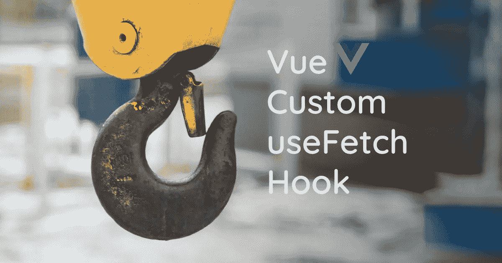
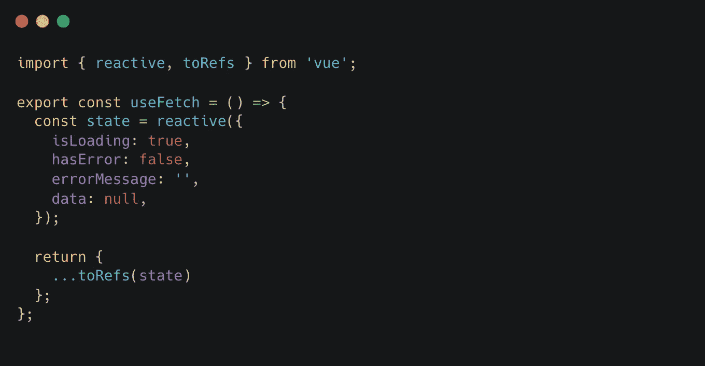
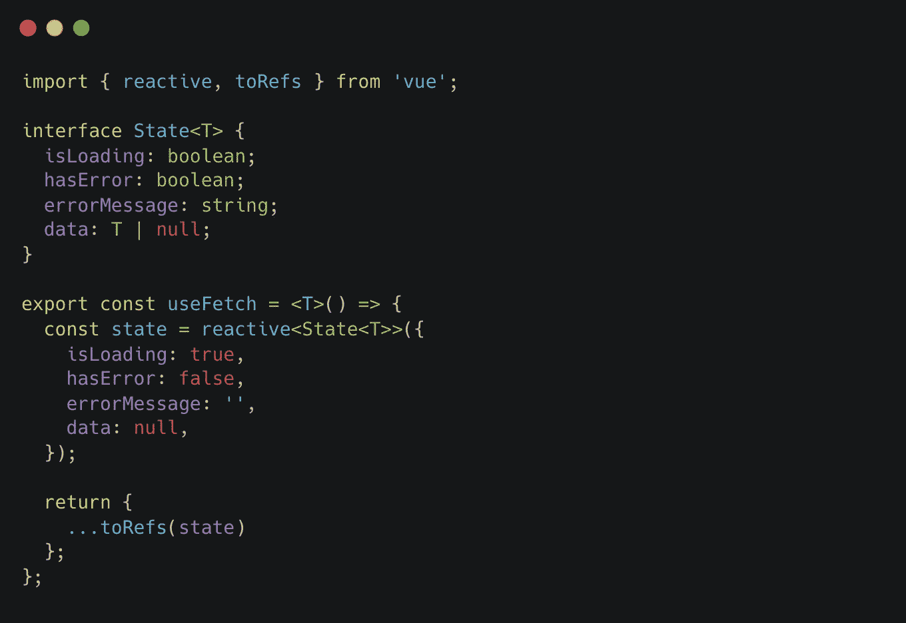
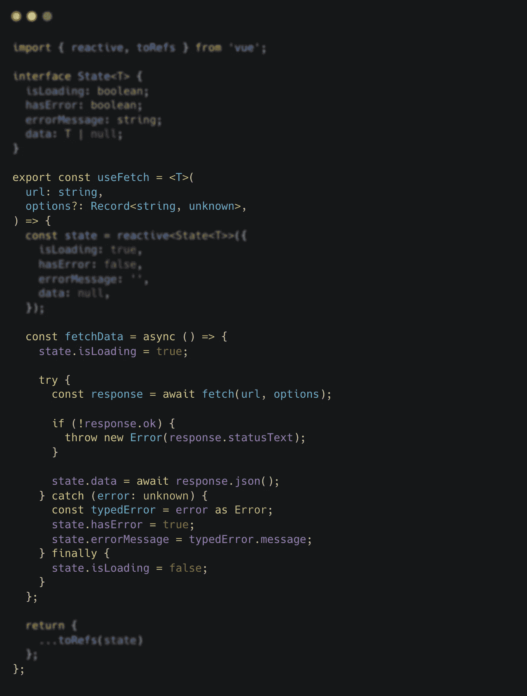
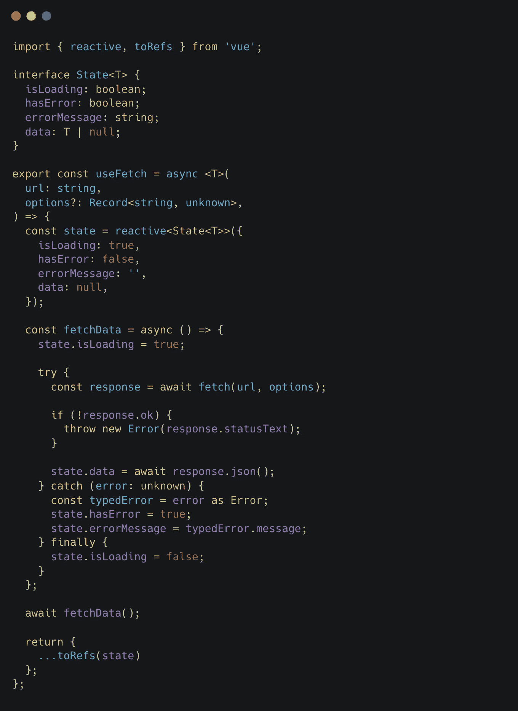
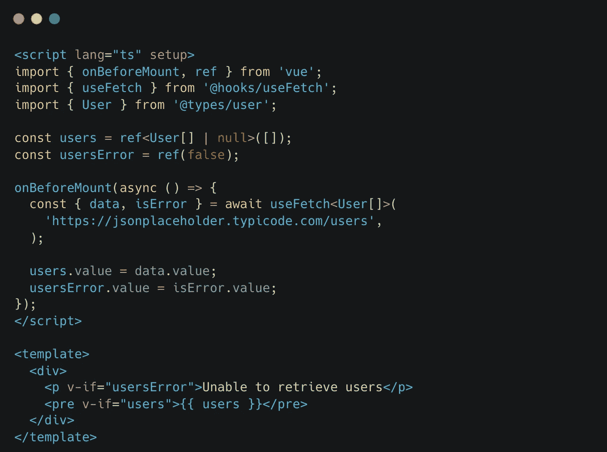

# 在 Vue.js 中创建一个基本的 useFetch 钩子

> 原文：<https://javascript.plainenglish.io/create-a-basic-usefetch-hook-in-vue-b3ff113872d7?source=collection_archive---------4----------------------->

## 胜利的 Vue 合成 API！

今天我们将看看如何在 Vue.js 中创建一个自定义挂钩。为此，我们将创建一个简单的 useFetch 挂钩，我们可以在我们的组件中重用它。Vue 3 中的 composition API 很吸引我。特别是现在脚本设置允许我们使用你定义的一切，这是有意义的。

我与 Vue.js 的这一新发展一起工作，并对其做出反应，这确实为我创造了公平的竞争环境。

我想一步一步地告诉你，我们开始吧:

Start useFetch hook. Create a function with the state we want to export.

我们首先创建我们的 *useFetch* 函数，因为它是一个钩子，我们将按照惯例以‘*use*开始我们的函数名。接下来，我们决定在调用 useFetch 挂钩时要检索的数据，并将其存储在一个状态对象中。当我们调用函数时，我们希望知道它是否正在加载，是否抛出了错误，如果是，我们希望收到错误消息。最后，我们需要调用返回的数据。

我们让我们的状态对象是反应性的，因为我们将在获取时改变这些值，并且我们希望我们的状态监听这些改变。我们也可以为我们的每个反应状态项创建单个 refs，但是因为它都很好地组合在一起，我认为一个反应对象更合适，可读性更好。

在我们的 useFetch 钩子的末尾，我们用 spread 操作符和 [*toRefs*](https://vuejs.org/api/reactivity-utilities.html#torefs) 函数返回我们的状态。函数允许我们在不失去反应性的情况下破坏我们的状态属性。在我们继续之前，让我们正确地键入我们的状态:

Add types to our useFetch state.

在继续之前，我们向状态添加类型。由于每次调用我们返回的数据不同，我们使用一个[泛型](https://www.typescriptlang.org/docs/handbook/2/generics.html)来解决这个问题。现在，当我们调用 useFetch 钩子时，我们可以传递数据的返回类型。让我们继续:

Create a function to fetch data to our useFetch hook

接下来，我们将添加一个*异步*函数来获取我们的数据。我们做的第一件事是将我们的 *isLoading* 状态设置为真，这个过程开始了。然后，在我们的 try 块中，我们设置一个名为*响应*的常量，并等待获取带有 *url* 和(可选)*选项*的数据。注意，我们添加了 *url* 和*选项*作为 *useFetch* 钩子的参数。我们检查 response.ok，因为默认情况下，只有当 fetch 无法发出请求时，才会到达 catch 处理程序。通过 response.ok 检查，我们强制将其他错误也转移到 catch 处理程序。如果没有错误，我们用 response.json()填充状态数据。如果有错误，我们将我们的 *hasError* 状态设置为 true，并将错误消息添加到我们的 *errorMessage* 状态。最后，我们将我们的 *isLoading* 状态设置回 false。让我们完成我们的钩子:

Our finished useFetch hook

我们要做的最后一件事是调用我们的 *fetchData* 函数，我们等待结果，所以我们的 *useFetch* 函数需要是 *async* 。这样，我们的 useFetch 钩子就可以使用了。🎉

你可以很容易地在一个(异步)函数中使用我们的新钩子。当您想直接在组件中获取和使用数据时，有更多的实现选项。这是因为脚本设置中的[顶层 await](https://vuejs.org/api/sfc-script-setup.html#top-level-await) 必须和悬疑结合使用，这还是一个实验性的特性。为了避免实验性的特性，我们可以使用 *onBeforeMount* 生命周期钩子，创建一个异步函数并立即调用它或者利用。然后在那里设置数据。在未来，我相信我们会有一个最优的解决方案。

现在，我想向您展示一个(精简的)选项来实现我们的 useFetch 挂钩，并立即在组件中显示数据。

a way to use our useFetch hook

我们可以在 useFetch 钩子上添加缓存或者取消请求的功能，但是我希望这篇文章已经为你提供了创建你自己的定制 Vue 钩子所需的所有信息。最后，我希望这能让你迷上钩子。

*更多内容请看*[***plain English . io***](https://plainenglish.io/)*。报名参加我们的* [***免费周报***](http://newsletter.plainenglish.io/) *。关注我们关于*[***Twitter***](https://twitter.com/inPlainEngHQ)*和*[***LinkedIn***](https://www.linkedin.com/company/inplainenglish/)*。加入我们的* [***社区不和谐***](https://discord.gg/GtDtUAvyhW) *。*