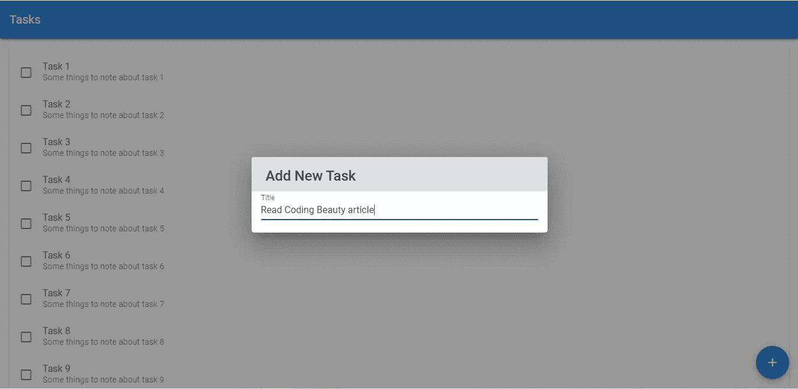
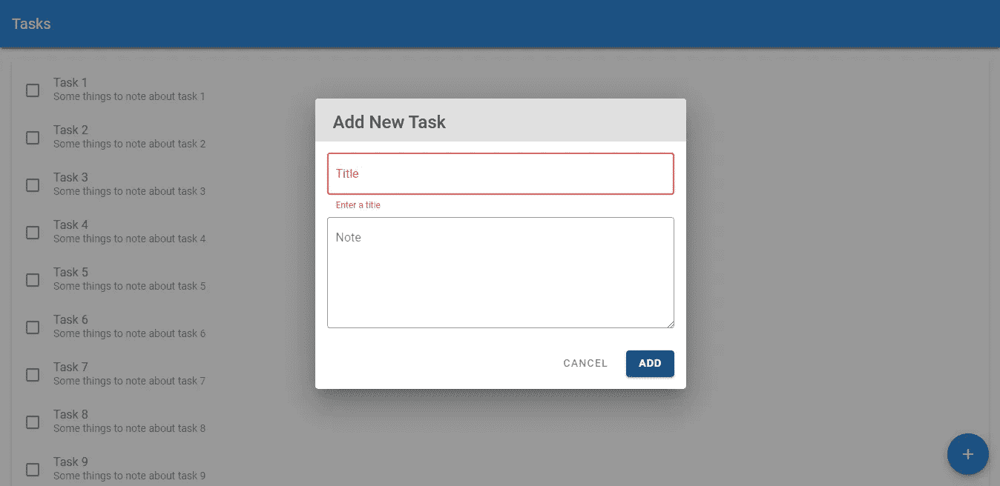

# FABs、对话框和表单|添加新任务|验证待办事项应用程序教程

> 原文：<https://javascript.plainenglish.io/create-a-beautiful-to-do-list-app-with-vuetify-adding-new-tasks-63839dc462c8?source=collection_archive---------4----------------------->

## 使用 fab、对话框和表单控件在待办事项列表应用程序中添加新任务。


大家好，欢迎回到我们正在进行的教程系列，我们将从头到尾使用 Vuetify 和 Vue JS 构建一个 todo 应用程序。在我们的[上一集](/create-a-beautiful-to-do-list-app-in-vuetify-displaying-the-list-of-tasks-lists-margins-cc0fde2ed2c1)中，我们学习了如何使用 Vuetify `v-list`组件显示样本待办事项列表数据。今天，我们将添加一些功能，使用户能够用新任务填充列表。完成这项工作后，我们将不再需要上次创建的模拟任务数据。让我们马上开始吧！

刚开始使用 Vuetify？看看这篇[文章](https://codingbeautydev.com/blog/getting-started-with-vuetify/)。

## 展示晶圆厂

我们将使用一个浮动的操作按钮来允许用户添加新任务，因为这是我们应用程序中的主要操作。我们可以通过在虚拟化`v-btn`组件上设置`fab`属性来创建一个 FAB。

```
**src/App.js**<template>
  <v-app>
    <v-card>
      <v-toolbar color="primary" elevation="3" dark rounded="0">
        <v-toolbar-title>Tasks</v-toolbar-title>
      </v-toolbar>
    </v-card>
    <v-card class="ma-4">
      <v-list>
        <v-list-item
          v-for="(task, index) in tasks"
          :key="index"
          v-bind:class="{ 'task-completed': task.isCompleted }"
          two-line
        >
          <v-checkbox
            hide-details
            v-model="task.isCompleted"
            class="mt-0 mr-2"
          ></v-checkbox>
          <v-list-item-content>
            <v-list-item-title>{{ task.title }}</v-list-item-title>
            <v-list-item-subtitle>{{ task.note }}</v-list-item-subtitle>
          </v-list-item-content>
        </v-list-item>
      </v-list>
    </v-card>
 **<v-btn fab fixed right bottom color="primary">
    </v-btn>**
  </v-app>
</template>
...
```

`fixed`、`right`和`bottom`道具应该是不言自明的——它们一起将 FAB 固定在视口的右下角:


该按钮将显示材料设计加号图标，以表明其用于添加任务:

```
**src/App.js**<template>
  <v-app>
    <v-card>
      <v-toolbar color="primary" elevation="3" dark rounded="0">
        <v-toolbar-title>Tasks</v-toolbar-title>
      </v-toolbar>
    </v-card>
    <v-card class="ma-4">
      <v-list>
        <v-list-item
          v-for="(task, index) in tasks"
          :key="index"
          v-bind:class="{ 'task-completed': task.isCompleted }"
          two-line
        >
          <v-checkbox
            hide-details
            v-model="task.isCompleted"
            class="mt-0 mr-2"
          ></v-checkbox>
          <v-list-item-content>
            <v-list-item-title>{{ task.title }}</v-list-item-title>
            <v-list-item-subtitle>{{ task.note }}</v-list-item-subtitle>
          </v-list-item-content>
        </v-list-item>
      </v-list>
    </v-card>
    <v-btn fab fixed right bottom color="primary">
      **<v-icon>mdi-plus</v-icon>**
    </v-btn>
  </v-app>
</template>
...
```


# 获取此应用程序的源代码

在此注册[获得这个伟大应用的最新源代码！](https://mailchi.mp/e784cee7e19a/todo-list-app-source-code)

## 显示添加新任务的对话框

现在让我们使用`v-dialog`组件来创建一个对话框:

```
**src/App.js**<template>
  <v-app>
    ...
    <v-btn fab fixed right bottom color="primary" **@click="showNewTaskDialog = true"**>
      <v-icon>mdi-plus</v-icon>
    </v-btn>
 **<v-dialog v-model="showNewTaskDialog" width="500">
      <v-card>
        <v-card-title class="text-h5 grey lighten-2">Add New Task</v-card-title>
      </v-card>
    </v-dialog>**
  </v-app>
</template><script>
export default {
  name: 'App',
  data: () => ({
    tasks: [...Array(10)].map((value, index) => ({
      id: `task${index + 1}`,
      title: `Task ${index + 1}`,
      note: `Some things to note about task ${index + 1}`,
      isCompleted: false,
    })),
 **showNewTaskDialog: false,**
  }),
};
</script>
...
```

使用`v-model`指令，我们在对话框的当前打开/关闭状态和我们创建的一个新的`showNewTaskDialog`变量之间建立了一个双向绑定。

我们使用`v-card`来创建对话框的主体，并使用`v-card-title`来设置它的标题，我们已经使用一些 Vuetify 类对其进行了样式化。

我们可以通过将晶圆厂放置在`v-dialog`的`activator`插槽中来自动设置，而不是像上面那样在晶圆厂的`@click`事件处理程序中手动设置`showNewTaskDialog`到`true`。这样做给了 FAB 对两个槽道具`on`和`attrs`的访问权，这两个槽道具设置了 FAB 的道具和事件(使用`v-on`和`v-bind`):

```
**src/App.js**<template>
  <v-app>
  ...   
    <v-dialog v-model="showNewTaskDialog" width="500">
 **<template v-slot:activator="{ on, attrs }">
        <v-btn fab fixed right bottom color="primary" v-on="on" v-bind="attrs">
          <v-icon>mdi-plus</v-icon>
        </v-btn>
      </template>**
      <v-card>
        <v-card-title class="text-h5 grey lighten-2">Add New Task</v-card-title>
      </v-card>
    </v-dialog>
  </v-app>
</template>
...
```

现在，当用户点击 FAB 时，会显示以下内容:


## 创建表单

我们将使用 Vuetify `v-form`组件构建表单。为了获得标题的输入，我们将设置另一个双向绑定，这次是在一个新的`v-text-field`组件和一个新对象的`title`属性之间，我们创建这个新对象是为了临时保存新的任务数据(`newTask`):

```
**src/App.js**<template>
  <v-app>
    ...
    <v-dialog v-model="showNewTaskDialog" width="500">
      <template v-slot:activator="{ on, attrs }">
        <v-btn fab fixed right bottom color="primary" v-on="on" v-bind="attrs">
          <v-icon>mdi-plus</v-icon>
        </v-btn>
      </template>
      <v-card>
        <v-card-title class="text-h5 grey lighten-2">Add New Task</v-card-title>
 **<v-form class="mx-4 mt-4">
          <v-text-field
            v-model="newTask.title"
            label="Title"
            required
          ></v-text-field>
        </v-form>**
      </v-card>
    </v-dialog>
  </v-app>
</template><script>
export default {
  name: 'App',
  data: () => ({
    ...
 **newTask: {
      title: '',
    },**
  }),
};
</script>
...
```



让我们使用`v-textarea`创建一个文本区域，用于输入任务注释，因为我们预计它的大小会相当大。

```
**src/App.js**...
      <v-card>
        <v-card-title class="text-h5 grey lighten-2">Add New Task</v-card-title>
        <v-form class="mx-4 mt-4">
          <v-text-field
            v-model="newTask.title"
            label="Title"
            required
          ></v-text-field>
          **<v-textarea label="Note" v-model="newTask.note"></v-textarea>**
        </v-form>
      </v-card>
    </v-dialog>
  </v-app>
</template><script>
export default {
  name: 'App',
  data: () => ({
    ...
    newTask: {
      title: '',
      **note: '',**
    },
  }),
};
</script>
...
```


我们可以改变 Vuetify 中文本区域和文本字段的设计。文本输入有 3 种变体:非框体(默认)、填充和轮廓化变体(非框体变体已被弃用，在官方材料设计指南中不再提及，尽管如此，Vuetify 等材料设计框架仍继续支持它)。让我们调整一下:

```
**src/App.js**

...
      <v-card>
        <v-card-title class="text-h5 grey lighten-2">Add New Task</v-card-title>
        <v-form class="mx-4 mt-4">
          <v-text-field
            v-model="newTask.title"
            label="Title"
            required
            **outlined**
          ></v-text-field>
          <v-textarea label="Note" v-model="newTask.note" **outlined**></v-textarea>
        </v-form>
      </v-card>
    </v-dialog>
  </v-app>
</template>
...
```


## 创建表单按钮

该表单需要两个按钮:一个用于取消添加新任务并关闭对话框，另一个用于提交表单输入并创建任务。`Cancel`按钮为普通型，而`Add`按钮为凸起型:

```
**src/App.js**...
      <v-card>
        <v-card-title class="text-h5 grey lighten-2">Add New Task</v-card-title>
        <v-form class="mx-4 mt-4 **pb-4**">
          <v-text-field
            v-model="newTask.title"
            label="Title"
            required
            outlined
          ></v-text-field>
          <v-textarea label="Note" v-model="newTask.note" outlined></v-textarea>
 **<div class="d-flex justify-end">
            <v-btn plain class="mr-2">Cancel</v-btn>
            <v-btn color="primary">Add</v-btn>
          </div>**
        </v-form>
      </v-card>
    </v-dialog>
  </v-app>
</template>
...
```

请注意，我们使用了一些 Vuetify flex 辅助类来将两个按钮向右对齐。我们还用`mr-2`助手类在它们之间添加了一些空间:


## 重置表单输入

除了在点击`Cancel`按钮时关闭对话框之外，我们还需要清除所有表单输入并重置任何验证错误。为此，我们可以使用`reset()`方法，可通过在表单组件上设置 ref 来访问:

```
**src/App.js**...
      <v-card>
        <v-card-title class="text-h5 grey lighten-2">Add New Task</v-card-title>
        <v-form class="mx-4 mt-4 pb-4" **ref="form"**>
          <v-text-field
            v-model="newTask.title"
            label="Title"
            required
            outlined
          ></v-text-field>
          <v-textarea label="Note" v-model="newTask.note" outlined></v-textarea>
          <div class="d-flex justify-end">
            <v-btn plain class="mr-2" **@click="cancelButtonClick"**>Cancel</v-btn>
            <v-btn color="primary">Add</v-btn>
          </div>
        </v-form>
      </v-card>
    </v-dialog>
  </v-app>
</template><script>
export default {
  name: 'App',
  data: () => ({
    ...
  }),
 **methods: {
    cancelButtonClick() {
      this.showNewTaskDialog = false;
      this.$refs.form.reset();
    }
  }**
};
</script>
...
```

## 提交时验证表单输入

现在，让我们在创建任务之前确保表单数据是有效的。我们在表单上设置了`lazy-validation`属性，这意味着在我们调用表单 ref 上的`validate()`方法之前，不会检查其输入的有效性。此外，我们监听`submit`事件，并使用 Vue 的`.prevent`事件修饰符来阻止页面在提交发生时被重新加载。

```
**src/App.js**...
        <v-form
          class="mx-4 mt-4 pb-4"
          ref="form"
          **@submit.prevent="newTaskFormSubmit"**
          **lazy-validation**
        >
          <v-text-field
            v-model="newTask.title"
            label="Title"
            required
            outlined
            **:rules="titleRules"**
          ></v-text-field>
          <v-textarea label="Note" v-model="newTask.note" outlined></v-textarea>
          <div class="d-flex justify-end">
            <v-btn plain class="mr-2" @click="cancelButtonClick">Cancel</v-btn>
            <v-btn color="primary" **type="submit"**>Add</v-btn>
          </div>
        </v-form>
      </v-card>
    </v-dialog>
  </v-app>
</template><script>
export default {
  name: 'App',
  data: () => ({
    ...
    newTask: {
      title: '',
      note: '',
    },
 **titleRules: [(value) => Boolean(value) || 'Enter a title'],**
  }),
  methods: {
    cancelButtonClick() {
      this.showNewTaskDialog = false;
      this.$refs.form.reset();
    },
 **newTaskFormSubmit() {
      if (this.$refs.form.validate()) {
        // add new task
      }
    },**
  },
};
</script>
...
```

Vuetify 中的文本输入组件使用一个`rules`道具进行验证。这个 prop 接受一个混合数组，它的元素可以是函数、字符串或布尔值。每个元素代表一个规则。我们在数组中创建的单个函数接受当前输入的值，并返回一个布尔值或字符串。如果函数的返回值是`true`(在这种情况下，这意味着已经输入了一个标题，并且输入字符串不再正确)，那么验证被判定为成功。但是如果函数的返回值是`false`或者一个字符串(包含一个错误消息)，那么验证失败，表单输入进入错误状态。

所以当用户没有输入标题并点击`Add`时:



## 成功验证时添加任务

剩下的就是向`tasks`添加一个新项目，关闭对话框，并在成功验证后重置表单输入:

```
**src/App.js**<template>
  <v-app>
    <v-card>
      <v-toolbar color="primary" elevation="3" dark rounded="0">
        <v-toolbar-title>Tasks</v-toolbar-title>
      </v-toolbar>
    </v-card>
    <v-card class="ma-4" **v-show="tasks.length > 0"**>    <!-- Hide card if there are no tasks -->
      ...
    </v-card>
    ...
  </v-app>
</template><script>
**import { v4 } from 'uuid';**    // Add the "uuid" module for random task ID generationexport default {
  name: 'App',
  data: () => ({
    **tasks: [],** // We don't need sample data anymore
    showNewTaskDialog: false,
    newTask: {
      title: '',
      note: '',
    },
    titleRules: [(value) => Boolean(value) || 'Enter a title'],
  }),
  methods: {
    cancelButtonClick() {
      this.showNewTaskDialog = false;
      this.$refs.form.reset();
    },
    newTaskFormSubmit() {
      if (this.$refs.form.validate()) {
 **this.tasks.push({
          id: v4(),
          title: this.newTask.title,
          note: this.newTask.note,
          isCompleted: false,
        });
        this.showNewTaskDialog = false;
        this.$refs.form.reset();**
      }
    },
  },
};
</script>
...
```


A new task added with the form

# 未完待续…

今天我们学习了如何使用 FABs、对话框、表单、文本输入和按钮来允许用户创建他们自己的任务。我们还遇到了一些来自 Vuetify 的有用的表单方法，用于验证和重置输入。

请继续关注我们的下一集，我们将使用这个奇妙的材料设计框架，从头到尾一起构建这个待办事项列表应用程序。

*更多内容请看*[*plain English . io*](http://plainenglish.io/)*。报名参加我们的* [*免费周报*](http://newsletter.plainenglish.io/) *。在我们的* [*社区不和谐*](https://discord.gg/GtDtUAvyhW) *获取独家写作机会和建议。*