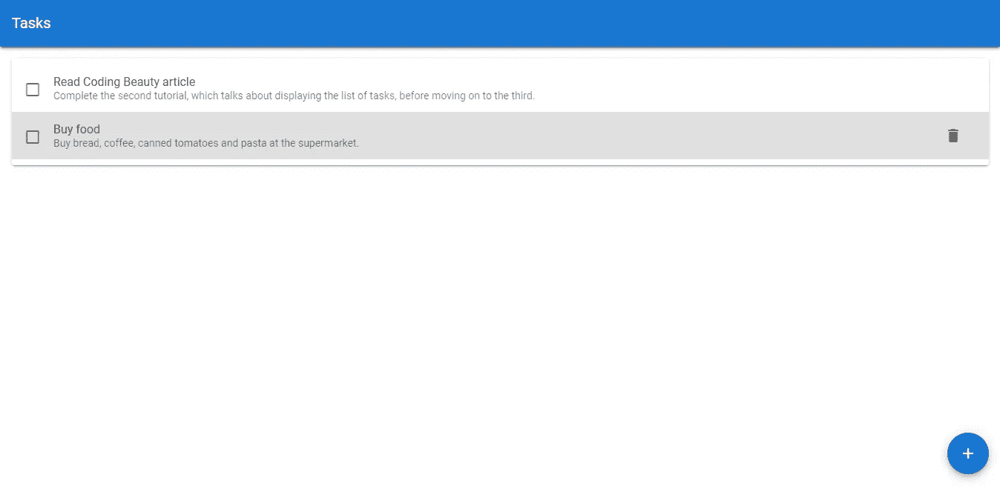

# 悬停和图标按钮|删除任务|验证待办事项应用程序教程

> 原文：<https://javascript.plainenglish.io/create-a-beautiful-to-do-list-app-with-vuetify-deleting-tasks-3b7bc2bc301f?source=collection_archive---------17----------------------->

## 使用 Vuetify 悬停组件和一个图标按钮向应用程序添加任务删除功能。


欢迎回到我们正在进行的教程系列，在这个系列中，我们将从头到尾使用 Vuetify 和 Vue JS 构建一个非常好看的待办事项列表应用程序。[上次](/create-a-beautiful-to-do-list-app-with-vuetify-adding-new-tasks-63839dc462c8)我们学习了如何使用 fab、对话框和表单控件，让用户能够在应用程序中创建新任务。今天，我们将添加任务删除功能。

刚开始使用 Vuetify？看看这篇[文章](https://codingbeautydev.com/blog/getting-started-with-vuetify/)。

## 使用 v-hover 改变悬停时的外观

在启用任务删除之前，我们需要了解当鼠标悬停在代表任务的列表项上时，如何改变它的可视状态(稍后您将看到原因)。鼠标悬停时，我们将改变列表项的颜色。Vuetify 允许我们使用`v-hover`组件做类似的事情:

```
**src/App.js**<template>
  <v-app>
    <v-card>
      <v-toolbar color="primary" elevation="3" dark rounded="0">
        <v-toolbar-title>Tasks</v-toolbar-title>
      </v-toolbar>
    </v-card>
    <v-card class="ma-4" v-show="tasks.length > 0">
      <v-list>
        **<v-hover v-slot="{ hover }">**
          <v-list-item
            v-for="(task, index) in tasks"
            :key="index"
            v-bind:class="{
              'task-completed': task.isCompleted,
              **'grey lighten-2': hover,**
            }"
            two-line
          >
            <v-checkbox
              hide-details
              v-model="task.isCompleted"
              class="mt-0 mr-2"
            ></v-checkbox>
            <v-list-item-content>
              <v-list-item-title>{{ task.title }}</v-list-item-title>
              <v-list-item-subtitle>{{ task.note }}</v-list-item-subtitle>
            </v-list-item-content>
          </v-list-item>
        </v-hover>
      </v-list>
    </v-card>
    ...
  </v-app>
</template>
...
```

`v-hover`通过它的默认槽提供一个`hover`变量，它的值根据`v-hover`的子节点当前是否被悬停而改变。这里，我们使用`grey`和`lighten-2`类来改变鼠标悬停时代表任务的列表项的背景颜色。


## 悬停时显示图标按钮

因此，对于每个任务，我们将显示图标按钮，单击该按钮将触发删除操作:

```
**src/App.js**<template>
  <v-app>
    <v-card>
      <v-toolbar color="primary" elevation="3" dark rounded="0">
        <v-toolbar-title>Tasks</v-toolbar-title>
      </v-toolbar>
    </v-card>
    <v-card class="ma-4" v-show="tasks.length > 0">
      <v-list>
        <v-hover v-slot="{ hover }" v-for="(task, index) in tasks" :key="index">
          <v-list-item
            v-bind:class="{
              'task-completed': task.isCompleted,
              'grey lighten-2': hover,
            }"
            two-line
          >
            <v-checkbox
              hide-details
              v-model="task.isCompleted"
              class="mt-0 mr-2"
            ></v-checkbox>
            <v-list-item-content>
              <v-list-item-title>{{ task.title }}</v-list-item-title>
              <v-list-item-subtitle>{{ task.note }}</v-list-item-subtitle>
            </v-list-item-content>
            **<v-btn plain v-if="hover"><v-icon>mdi-delete</v-icon></v-btn>**
          </v-list-item>
        </v-hover>
      </v-list>
    </v-card>
    ...
  </v-app>
</template>
...
```

# 获取此应用程序的源代码

在此注册[获得这个伟大应用的最新源代码！](https://mailchi.mp/e784cee7e19a/todo-list-app-source-code)



## 点击按钮时删除任务

为了删除一个任务，我们将在 `tasks`上使用 JavaScript array `filter`方法来创建一个新的数组，它排除了要删除的任务，然后将它设置为`tasks`:

```
**src/App.js**<template>
  <v-app>
    <v-card>
      <v-toolbar color="primary" elevation="3" dark rounded="0">
        <v-toolbar-title>Tasks</v-toolbar-title>
      </v-toolbar>
    </v-card>
    <v-card class="ma-4" v-show="tasks.length > 0">
      <v-list>
        <v-hover v-slot="{ hover }" v-for="(task, index) in tasks" :key="index">
          <v-list-item
            v-bind:class="{
              'task-completed': task.isCompleted,
              'grey lighten-2': hover,
            }"
            two-line
          >
            <v-checkbox
              hide-details
              v-model="task.isCompleted"
              class="mt-0 mr-2"
            ></v-checkbox>
            <v-list-item-content>
              <v-list-item-title>{{ task.title }}</v-list-item-title>
              <v-list-item-subtitle>{{ task.note }}</v-list-item-subtitle>
            </v-list-item-content>
            <v-btn plain v-if="hover" **@click="deleteTask(task.id)"**
              ><v-icon>mdi-delete</v-icon></v-btn
            >
          </v-list-item>
        </v-hover>
      </v-list>
    </v-card>
    ...
    </v-dialog>
  </v-app>
</template><script>
...export default {
  ...
  methods: {
    ...
    newTaskFormSubmit() {
      if (this.$refs.form.validate()) {
        this.tasks.push({
          id: v4(),
          title: this.newTask.title,
          note: this.newTask.note,
          isCompleted: false,
        });
        this.showNewTaskDialog = false;
        this.$refs.form.reset();
      }
    },
 **deleteTask(id) {
      this.tasks = this.tasks.filter((task) => task.id !== id);
    },**  },
};
</script>
...
```

现在，单击删除图标按钮将从列表中删除该任务，因为您可以确认您是否一直在跟进。

# 未完待续…

今天，我们在构建待办事项应用程序方面取得了更多进展。我们学习了如何使用 Vuetify 的`v-hover`组件根据当前的悬停状态改变元素的外观。我们使用了`hover` slot prop 来显示一个图标按钮，当点击时触发任务删除。

请继续关注我们的下一集，我们将使用这个奇妙的材料设计框架，从头到尾一起构建这个待办事项列表应用程序。

*更多内容看* [*说白了. io*](http://plainenglish.io/) *。报名参加我们的* [*免费每周简讯*](http://newsletter.plainenglish.io/) *。在我们的* [*社区*](https://discord.gg/GtDtUAvyhW) *获得独家写作机会和建议。*