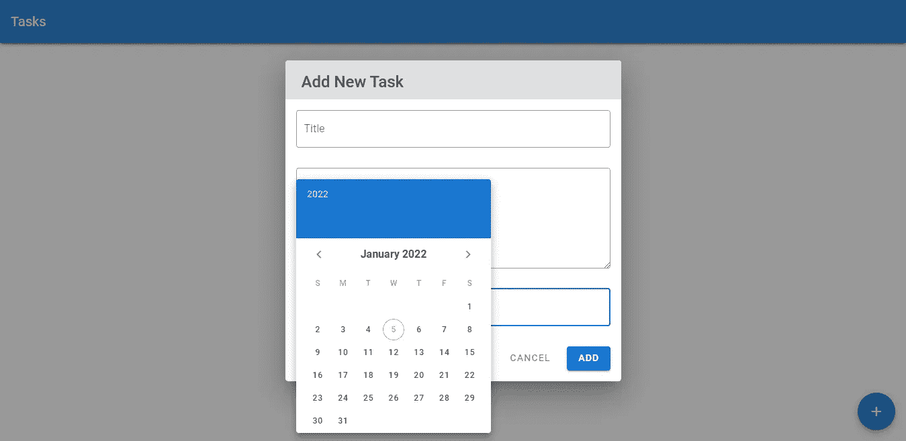
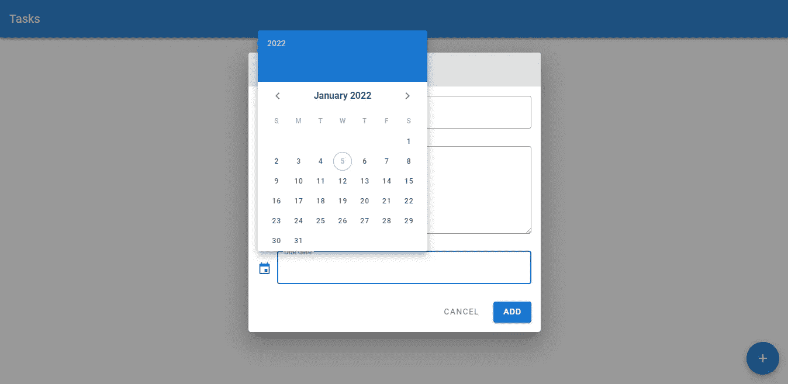
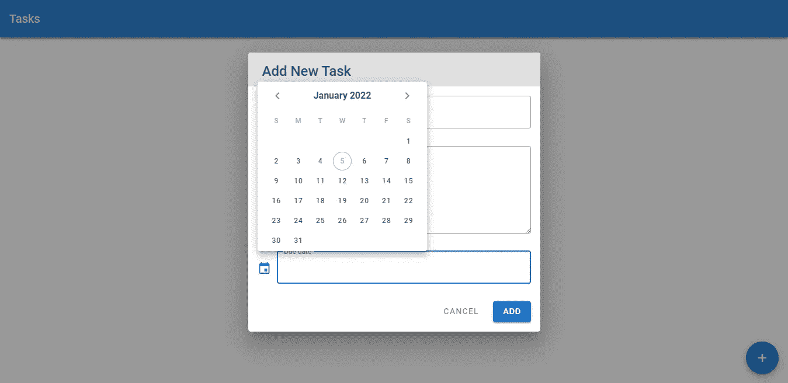
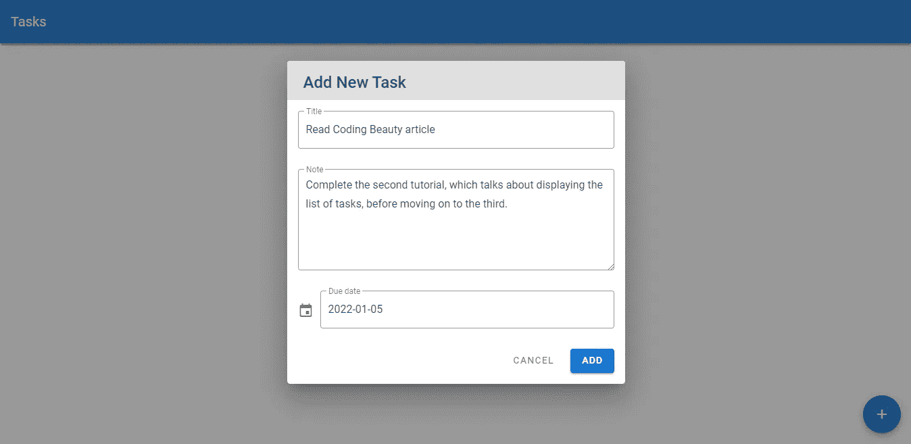
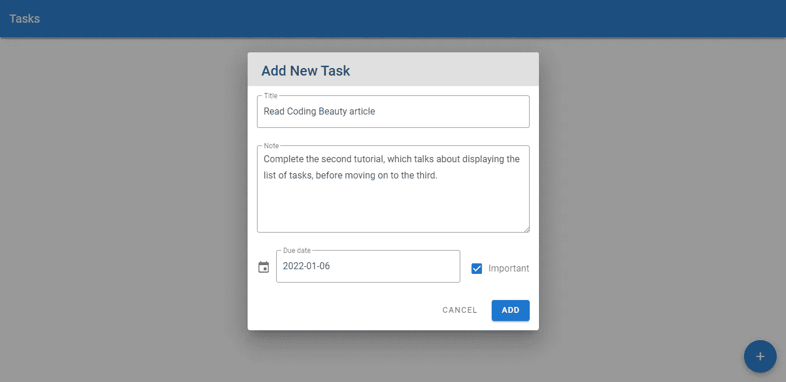
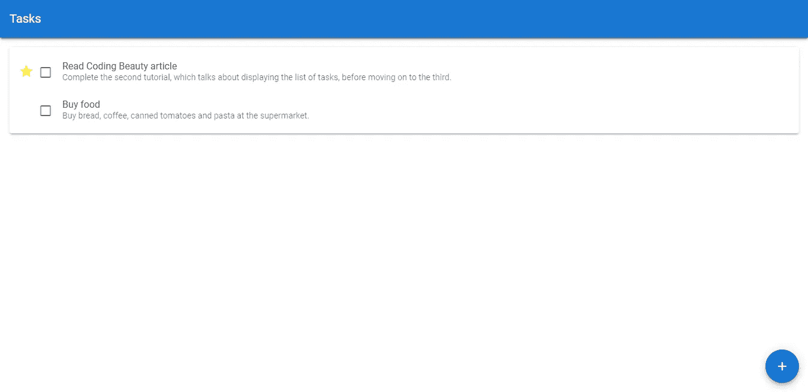

# 菜单和日期选择器|设置任务截止日期和重要性|验证待办事项应用程序教程

> 原文：<https://javascript.plainenglish.io/create-a-beautiful-to-do-list-app-with-vuetify-setting-task-due-dates-and-importance-e21e226b496c?source=collection_archive---------15----------------------->


欢迎回到本教程系列的另一集，在这一集中，我们从头到尾使用 Vuetify 和 Vue.js 构建了我们自己的非常漂亮的待办事项列表应用程序。[上次](/create-a-beautiful-to-do-list-app-with-vuetify-deleting-tasks-3b7bc2bc301f)，我们在应用程序中添加了删除任务的功能。让我们从停止的地方继续。

刚开始使用 Vuetify？看看这篇[文章](https://codingbeautydev.com/blog/getting-started-with-vuetify/)。

如果我们能够为添加的任务设定一个完成日期，那就太好了。所以今天我们将利用 Vuetify 菜单和日期选择器，允许用户设置这样的任务期限。我们开始吧！

## 在菜单中显示日期选择器

我们可以用 Vuetify `v-menu`组件创建一个弹出菜单。当我们将要添加到对话框中的新文本字段被单击时，它将显示一个日期选择器:

```
**src/App.js**<template>
  <v-app>
    ...
    <v-dialog v-model="showNewTaskDialog" width="500">
      <template v-slot:activator="{ on, attrs }">
        <v-btn fab fixed right bottom color="primary" v-on="on" v-bind="attrs">
          <v-icon>mdi-plus</v-icon>
        </v-btn>
      </template>
      <v-card>
        <v-card-title class="text-h5 grey lighten-2">Add New Task</v-card-title>
        <v-form
          class="mx-4 mt-4 pb-4"
          ref="form"
          @submit.prevent="newTaskFormSubmit"
          lazy-validation
        >
          <v-text-field
            v-model="newTask.title"
            label="Title"
            required
            outlined
            :rules="titleRules"
          ></v-text-field>
          <v-textarea label="Note" v-model="newTask.note" outlined></v-textarea>
 **<v-menu
            v-model="showDatePicker"
            :close-on-content-click="false"
            transition="scale-transition"
            min-width="290"
          >
            <template v-slot:activator="{ on, attrs }">
              <v-text-field
                v-bind="attrs"
                v-on="on"
                outlined
                prepend-icon="mdi-calendar"
                readonly
                label="Due date"
              ></v-text-field>
            </template>
            <v-date-picker></v-date-picker>
          </v-menu>**
          <div class="d-flex justify-end">
            <v-btn plain class="mr-2" [@click](http://twitter.com/click)="cancelButtonClick">Cancel</v-btn>
            <v-btn color="primary" type="submit">Add</v-btn>
          </div>
        </v-form>
      </v-card>
    </v-dialog>
  </v-app>
</template><script>
...
export default {
  name: 'App',
  data: () => ({
    tasks: [],
    showNewTaskDialog: false,
    newTask: {
      title: '',
      note: '',
    },
    titleRules: [(value) => Boolean(value) || 'Enter a title'],
 **showDatePicker: false**
  }),
  ...
};
</script>
...
```

我们不想让菜单在用户点击时自动关闭，所以我们将`close-on-content-click`属性设置为`false`。为了让菜单“扩大”可见性，我们将它的`transition`道具设置为`scale-transition`。我们还将`min-width`属性设置为日期选择器的宽度，以防止一些透明性问题(删除代码中的`min-width`属性，以了解我的意思)。像往常一样，使用`v-model`属性，我们在新创建的`showDatePicker`变量和菜单的当前打开/关闭状态之间建立了一个双向绑定。我们稍后会处理这个变量。

就像我们在[添加任务](/create-a-beautiful-to-do-list-app-with-vuetify-adding-new-tasks-63839dc462c8)时看到的`v-dialog`一样，`v-menu`组件也带有一个`activator`插槽。`v-text-field`将其道具和事件设置为`attrs`和`on`槽道具，这样当它被点击时，菜单变得可见。

Vuetify 中的`v-date-picker`组件将显示日期选择器。



## 更改日期选取器的位置

现在，当菜单弹出时，我们可以看到我们的日期选择器，但它覆盖了日期文本字段，让我们使用`v-menu`的`top`和`offset-y`道具来解决这个问题:

```
**src/App.js**<template>
          ...
          <v-menu
            v-model="showDatePicker"
            :close-on-content-click="false"
            transition="scale-transition"
            min-width="290"
            **top
            :offset-y="true"**
          >
            <template v-slot:activator="{ on, attrs }">
              <v-text-field
                v-bind="attrs"
                v-on="on"
                outlined
                prepend-icon="mdi-calendar"
                readonly
                label="Due date"
              ></v-text-field>
            </template>
            <v-date-picker></v-date-picker>
          </v-menu>
   ...
</template>
...
```

这两个道具将协同工作，将菜单对齐到其激活器(文本字段)的顶部:



# 获取此应用程序的源代码

在此注册[获得这个伟大应用的最新源代码！](https://mailchi.mp/e784cee7e19a/todo-list-app-source-code)

## 隐藏日期选择器标题

让我们隐藏日期选择器标题以节省空间:

```
**src/App.js**<template>
          ...
          <v-menu
            v-model="showDatePicker"
            :close-on-content-click="false"
            transition="scale-transition"
            min-width="290"
            top
            offset-y
          >
            <template v-slot:activator="{ on, attrs }">
              <v-text-field
                v-bind="attrs"
                v-on="on"
                outlined
                prepend-icon="mdi-calendar"
                readonly
                label="Due date"
              ></v-text-field>
            </template>
            <v-date-picker **no-title**></v-date-picker>
          </v-menu>
   ...
</template>
...
```



## 在日期选择器上单击设置日期

我们将在我们的`newTask`对象的新日期属性和日期选择器之间创建一个双向绑定。文本字段和该属性之间也存在绑定。

```
**src/App.js**<template>
          ...
          <v-menu
            v-model="showDatePicker"
            :close-on-content-click="false"
            transition="scale-transition"
            min-width="290"
            top
            offset-y
          >
            <template v-slot:activator="{ on, attrs }">
              <v-text-field
                v-bind="attrs"
                v-on="on"
                outlined
                prepend-icon="mdi-calendar"
                readonly
                label="Due date"
                **v-model="date"**
              ></v-text-field>
            </template>
            <v-date-picker
              no-title
              **v-model="newTask.date"
              @input="showDatePicker = false"**
            ></v-date-picker>
          </v-menu>
          ...
</template><script>
...
export default {
  name: 'App',
  data: () => ({
    tasks: [],
    showNewTaskDialog: false,
    newTask: {
      title: '',
      note: '',
      **date: '',**
    },
    titleRules: [(value) => Boolean(value) || 'Enter a title'],
    showDatePicker: false,
  }),
  methods: {
    ...
    newTaskFormSubmit() {
      if (this.$refs.form.validate()) {
        this.tasks.push({
          id: v4(),
          title: this.newTask.title,
          note: this.newTask.note,
          isCompleted: false,
          **date: this.newTask.date,**
        });
        this.showNewTaskDialog = false;
        this.$refs.form.reset();
      }
    },
    ...
  },
};
</script>
...
```

当用户在日期选择器上选择一个日期(比如今天)时，菜单关闭，相应的日期以 YYYY-MM-DD 格式显示在文本字段上:



## 设置任务重要性

除了设置任务的截止日期，我们还希望将关键任务标记为重要。我们将使用一个复选框来接受输入:

```
**src/App.js**<template>
  <v-app>
    ...
    <v-dialog v-model="showNewTaskDialog" width="500">
      ...
      <v-card>
        <v-card-title class="text-h5 grey lighten-2">Add New Task</v-card-title>
        <v-form
          class="mx-4 mt-4 pb-4"
          ref="form"
          @submit.prevent="newTaskFormSubmit"
          lazy-validation
        >
          <v-text-field
            v-model="newTask.title"
            label="Title"
            required
            outlined
            :rules="titleRules"
          ></v-text-field>
          <v-textarea label="Note" v-model="newTask.note" outlined></v-textarea>
          **<div class="d-flex">**
            <v-menu
              v-model="showDatePicker"
              :close-on-content-click="false"
              transition="scale-transition"
              min-width="290"
              top
              offset-y
            >
              ...
            </v-menu>
            **<v-checkbox
              v-model="newTask.isImportant"
              class="ml-4"
              label="Important"
            ></v-checkbox>**
          **</div>**
          ...
        </v-form>
      </v-card>
    </v-dialog>
  </v-app>
</template><script>
...
export default {
  name: 'App',
  data: () => ({
    ...
    newTask: {
      title: '',
      note: '',
      date: '',
      **isImportant: false,**
    },
    ...
  }),
  methods: {
    ...
    newTaskFormSubmit() {
      if (this.$refs.form.validate()) {
        this.tasks.push({
          id: v4(),
          title: this.newTask.title,
          note: this.newTask.note,
          isCompleted: false,
          date: this.newTask.date,
          **isImportant: this.newTask.isImportant,**
        });
        this.showNewTaskDialog = false;
        this.$refs.form.reset();
      }
    },
    ...
  },
};
</script>
...
```

注意，我们将`v-checkbox`和`v-menu`包装在一个`div`中，并在上面设置了`d-flex`类。我们这样做是因为我们希望文本字段和复选框并排出现:



## 指示任务重要性

让我们用一个星形图标来区分标记为重要的任务和不重要的任务:

```
**src/App.js**<template>
  <v-app>
    <v-card>
      <v-toolbar color="primary" elevation="3" dark rounded="0">
        <v-toolbar-title>Tasks</v-toolbar-title>
      </v-toolbar>
    </v-card>
    <v-card class="ma-4" v-show="tasks.length > 0">
      <v-list>
        <v-hover v-slot="{ hover }" v-for="(task, index) in tasks" :key="index">
          <v-list-item
            v-bind:class="{
              'task-completed': task.isCompleted,
              'grey lighten-2': hover,
            }"
            two-line
          >
 **<v-icon
              class="mr-2"
              :color="task.isImportant ? 'yellow' : 'transparent'"
              >mdi-star</v-icon
            >**
            <v-checkbox
              hide-details
              v-model="task.isCompleted"
              class="mt-0 mr-2"
            ></v-checkbox>
            <v-list-item-content>
              <v-list-item-title>{{ task.title }}</v-list-item-title>
              <v-list-item-subtitle>{{ task.note }}</v-list-item-subtitle>
            </v-list-item-content>
            <v-btn plain v-if="hover" @click="deleteTask(task.id)"
              ><v-icon>mdi-delete</v-icon></v-btn
            >
          </v-list-item>
        </v-hover>
      </v-list>
    </v-card>
    ...
  </v-app>
</template>
...
```

我们使用`v-icon`组件的`color`道具来控制星星的可见性。对于不重要的任务，将颜色设置为透明可以确保看不到星星。



# 未完待续…

做了一些扎实的工作！我们现在可以为需要及时完成的任务设定完成日期，并指出关键任务的重要性。在下一集，我们将学习如何使用 Vuetify 选项卡组件来对我们的任务进行分组。敬请期待！

*更多内容请看*[*plain English . io*](http://plainenglish.io/)*。报名参加我们的* [*免费周报*](http://newsletter.plainenglish.io/) *。在我们的* [*社区不和谐*](https://discord.gg/GtDtUAvyhW) *获得独家获得写作机会和建议。*