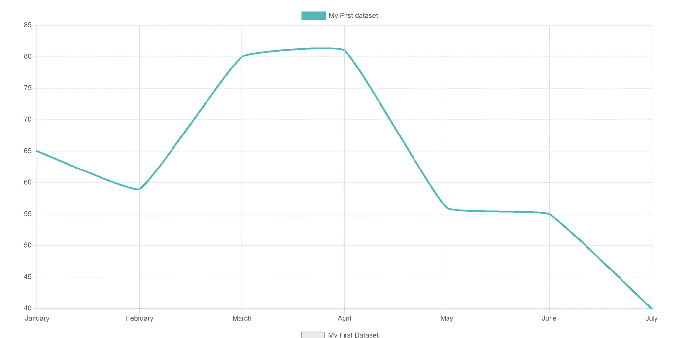
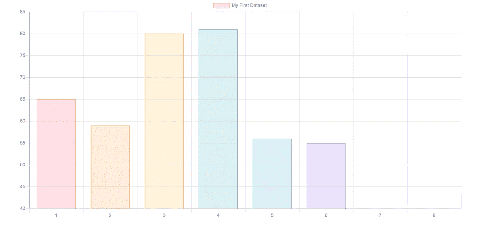

# 用 React 和 Chart.js 创建图表

> 原文：<https://javascript.plainenglish.io/create-a-chart-with-react-and-chart-js-32d3f142b43f?source=collection_archive---------10----------------------->

## 可视化您的数据


Photo by [Lukas Blazek](https://unsplash.com/@goumbik?utm_source=medium&utm_medium=referral) on [Unsplash](https://unsplash.com?utm_source=medium&utm_medium=referral)

我已经创建了一个在 React 中使用 Chart.js 的样板文件，带有一个简单的折线图。Chart.js 的库中有各种各样的图形，这个例子展示了如何将它们集成到 React 应用程序中。

[https://www.chartjs.org/docs/latest/](https://www.chartjs.org/docs/latest/)

源代码可在此处找到:

[](https://github.com/olepetterkh91/chart-js-react-boilerplate) [## GitHub—olepetterkh 91/chart-js-react-boilerplate

### 这个项目是用 Create React App 引导的。在项目目录中，您可以运行:在…中运行应用程序

github.com](https://github.com/olepetterkh91/chart-js-react-boilerplate) 

# 设置基础

## 设置 react 应用程序

要使用 React，我使用 create-react-app 并导航到新文件夹，我将其命名为 chart-demo。

```
npx create-react-app
```

## 安装所需的库

Chart.js 需要两个 npm 包，即基础 chart.js 库和 react-chartjs-2。我的版本是:

```
"react-chartjs-2": "^2.11.1"
"chart.js": "^2.9.4"
```

一旦安装了这些包，您就应该准备好创建图表了。

# 创建基本折线图

要创建折线图，您需要正确设置配置。需要从 react-chartjs 传递到 Line-component 的数据示例:

```
*const* data = {labels: labels,datasets: [{label: chartTitle || "My First dataset",fill: false,lineTension: 0.1,backgroundColor: "rgba(75,192,192,0.4)",borderColor: "rgba(75,192,192,1)",borderCapStyle: "butt",borderDash: [],borderDashOffset: 0.0,borderJoinStyle: "miter",pointBorderColor: "rgba(75,192,192,1)",pointBackgroundColor: "#fff",pointBorderWidth: 1,pointHoverRadius: 5,pointHoverBackgroundColor: "rgba(75,192,192,1)",pointHoverBorderColor: "rgba(220,220,220,1)",pointHoverBorderWidth: 2,pointRadius: 1,pointHitRadius: 10,data: dataset,},],};
```

最重要的值是**数据**和**标签**属性。图表是基于数据值创建的，标签显示每个图表数据属性的信息。

我根据从 1 月到 7 月的月份创建了一个虚拟数据集，并为每个月添加了一些随机值。

```
*const* [labels, setLabels] = useState([]);*const* [dataset, setDataset] = useState([]);
```

我在图表中使用这些值，如下所示:

```
setLabels(["January","February","March","April","May","June","July",]);setDataset([65, 59, 80, 81, 56, 55, 40]);
```



# 创建条形图

条形图是一种非常常用的数据显示方式，它与折线图数据非常相似

```
*import* { Bar } *from* "react-chartjs-2";*function* BarChart() {*const* labels = [1, 2, 3, 4, 5, 6, 7, 8];*const* data = {labels: labels,datasets: [{label: "My First Dataset",data: [65, 59, 80, 81, 56, 55, 40],backgroundColor: ["rgba(255, 99, 132, 0.2)","rgba(255, 159, 64, 0.2)","rgba(255, 205, 86, 0.2)","rgba(75, 192, 192, 0.2)","rgba(54, 162, 235, 0.2)","rgba(153, 102, 255, 0.2)","rgba(201, 203, 207, 0.2)",],borderColor: ["rgb(255, 99, 132)","rgb(255, 159, 64)","rgb(255, 205, 86)","rgb(75, 192, 192)","rgb(54, 162, 235)","rgb(153, 102, 255)","rgb(201, 203, 207)",],borderWidth: 1,},],};*return* <Bar data={data} />;}*export* *default* BarChart;
```

显示的图表如下所示:



Chart.js 库中还有更多的图表类型可以使用，比如饼图、雷达图和圆环图，稍后会将它们添加到这个存储库中。

*更多内容看* [***说白了就是 io***](http://plainenglish.io/) *。报名参加我们的* [***免费周报***](http://newsletter.plainenglish.io/) *。在我们的* [***社区获得独家访问写作机会和建议***](https://discord.gg/GtDtUAvyhW) *。*