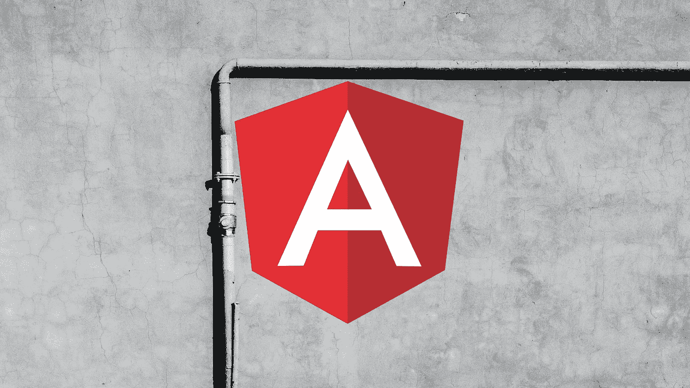
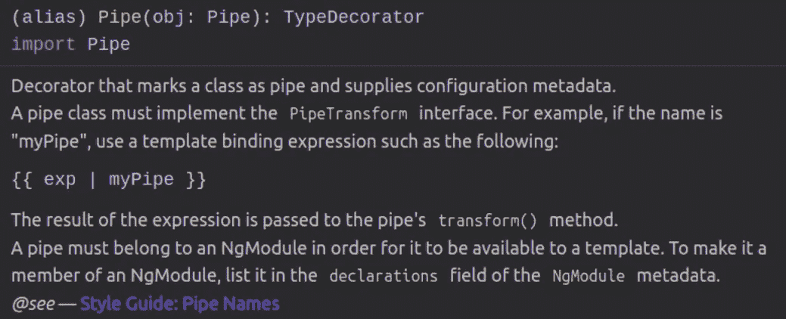

# 创建自定义角管道

> 原文：<https://javascript.plainenglish.io/create-a-custom-angular-pipe-62ac8c4c7865?source=collection_archive---------11----------------------->

## [棱角分明](https://medium.com/@lorenzozar/list/angular-5496c492a185)

## 创建带有参数的简单自定义弯管。找到 StackBlitz 上的代码。

Angular 提供了内置的管道来处理数据，如字符串、货币金额、日期等。在模板表达式中。



Angular Pipe built on a photo by [Roma Kaiuk](https://unsplash.com/@roma_kaiuk?utm_source=unsplash&utm_medium=referral&utm_content=creditCopyText) on [Unsplash](https://unsplash.com/s/photos/pipe?utm_source=unsplash&utm_medium=referral&utm_content=creditCopyText)

# 内置管道

您可以将管道视为接收输入值并在模板表达式中返回转换值的基本函数，如下例所示。

```
<p>
  {{ pContent | titlecase }}
</p>
```

管道很有用，因为你可以在整个程序中使用它们，而不必单独声明每个管道。

你可以在 [angular.io](https://angular.io/api/common#pipes) 找到内置管道以及如何使用它们的列表。

## 参数化管道:货币

值得一提的是，一些管道接受可选参数。

例如， [CurrencyPipe](https://angular.io/api/common/CurrencyPipe#currencypipe) 通过在前面加上货币符号将数字转换成货币。

```
<p>
  {{amountText}} {{amount | currency}}
</p>
```

默认情况下，货币是美元。但是，文档中提到了四个不同的可选参数:

*   **货币代码**，如`USD`代表美元，`EUR`代表欧元。
*   **显示，**例如货币指示器的格式
*   **数字信息**
*   **区域设置，**为要使用的区域设置格式规则

我们可以使用货币代码将美元转换成欧元

```
<p>
  {{amountText}} {{amount | currency:'EUR'}}
</p>
```

## 参数化管道:日期

另一个有趣的用例与日期有关。

不同的国家使用不同的日期格式。如果您要求用户在表单中填写生日之类的内容，您最好确保提供了您想要的格式。

或者，更方便用户的是，您可以接受他们的输入，因为这对于他们来说更常见，并在以后将其转换成您想要的格式。

使用 JavaScript [Date](https://developer.mozilla.org/en-US/docs/Web/JavaScript/Reference/Global_Objects/Date) 对象，我们可以在我们的类中获得一个日期

```
date: Date = new Date();// format: Sun Feb 01 1998 00:00:00 GMT+0000 (GMT)
```

通过简单地使用我们得到的日期管道

```
<p>
  date: {{ date | date }}
</p>// format Feb 01, 1998
```

我们可以使用 fullDate [预定义的格式选项](https://angular.io/api/common/DatePipe#pre-defined-format-options)来获取

```
<p>
  date: {{ date | date: 'fullDate' }}
</p>// format Sunday, February 01, 1998
```

有时，内置管道是不够的，我们需要创建自定义管道。

## 异步管道

大概是用的最多的角管之一吧！

Angular 异步管道优化了更改检测，消除了手动订阅和取消订阅的需要。

```
<div *ngIf="numbers$ | async as numbers">  
  <p *ngFor="let n of numbers">{{ n }}</p>
</div>
```

如果你不熟悉上面的例子，你可以在 Angular 中阅读更多关于 [RxJS 声明模式的内容。](https://betterprogramming.pub/rxjs-declarative-pattern-in-angular-cafba3983d21)

# 自定义管道

自定义管道可用于封装内置管道不支持的更改。

然后，与内置管道一样，使用模板表达式中的管道将输入值更改为输出值以供显示。

高兴的是，小菜一碟！


Piece of cake, indeed! Photo by [Razvan Mirel](https://unsplash.com/@razvan_mirel?utm_source=medium&utm_medium=referral) on [Unsplash](https://unsplash.com?utm_source=medium&utm_medium=referral)

在下面的例子中，我将创建一个定制的 shortener 管道。

换句话说，在模板中显示字符串之前，可以使用自定义的 ShortenerPipe 来缩短字符串。

您可以在 Angular CLI 中使用`ng generate pipe`命令创建自定义管道。然而，如果这是你的第一次，花几分钟手动创建它是值得的。

通过手动创建一个定制管道，您可以看到涉及到什么以及需要在哪里导入内容。知道什么时候需要调试很好。

# 创建自定义管道

下面是创建管道的步骤。

## 1.创建新文件

首先我在 app 文件夹里创建了一个名为 shortener.pipe.ts 的文件。. pipe.ts 扩展名是一种约定，遵循它是很好的。

我想创建一个缩短字符串的管道。

## 2.创建一个类

我将首先创建一个名为 ShortenerPipe 的类。"*管道类名*"， [angular.io](https://angular.io/guide/pipes#marking-a-class-as-a-pipe) 使用大写字母(类名的通用约定)。

```
export class ShortenerPipe {

}
```

现在，ShortenerPipe 类需要一个特殊的方法来作为管道使用。虽然不是绝对必要的，但这是另一种好的做法。

如果使用 Angular CLI 创建管道，此方法将自动添加。

实现 PipeTransfor 接口将需要您实现相关的`transform`方法。

```
import { PipeTransform } from '@angular/core';export class ShortenerPipe implements PipeTransform {

}
```

## 3.添加装饰者

我们需要添加一个特殊的装饰器，管道装饰器。

管道装饰器“将类标记为管道并提供配置元数据”。



Printout from StackBlitz

一个有趣的元数据是管道的名称！

我们可以在 name 属性中定义管道的名称，如下所示

```
@Pipe({
  name: 'shortener',
})
```

这是我们将在模板中使用的管道的名称。

"*使用[…]came case 对应* `*name*` *字符串。不要在* `*name*`、 [angular.io](https://angular.io/guide/pipes#marking-a-class-as-a-pipe) 中使用连字符。

## 4.定义逻辑

在这个文件中要做的最后一件事是定义管道的逻辑。

在我的例子中，我将使用 transform 方法返回管道左侧字符串的前七个字符。

```
import { Pipe, PipeTransform } from '@angular/core'; @Pipe({
  name: 'shortener',
})
export class ShortenerPipe implements PipeTransform {

  transform(value: string) {
    return value.slice(0, 7);
  }}
```

## 5.在声明中导入短管道

最后，我们需要在 app.module.ts 声明和导入中导入 ShortenerPipe。

```
...
import { ShortenerPipe } from './shortener.pipe';@NgModule({
  imports: [BrowserModule, FormsModule],
  declarations: [AppComponent, HelloComponent, ShortenerPipe],
  bootstrap: [AppComponent],
})export class AppModule {}
```

在此之后，我们可以最终使用自定义管道如下

```
<hello name="{{ name | shortener }}"></hello>
```

# 自定义管道的参数化

我们对切片进行了硬编码，使用`slice(0, 7)`获取姓名输入的前七个字符。

如果能够定义片段的开始和结束就更好了，这样我们就可以决定要保留多少个字符。

为此，我们可以在 ShortenerPipe 中更改转换方法，增加两个参数，即 number 类型的`start`和`end`。

```
transform(value: string, start: number, end: number) {
  return value.slice(start, end);
}
```

在模板中，我们需要传递如下两个参数:

```
<hello name="{{ name | shortener: 0:1 }}"></hello>
```

更改这些参数将按照您的意愿缩小`name`属性。

你可以在[的 StackBlitz](https://stackblitz.com/edit/angular-ivy-momxfn?file=src/app/app.component.html) 上找到所有例子的代码。

# 结束语

这里给出的所有管道都是纯管道，除了异步管道。

在某些情况下，您可能希望创建不纯的管道。但是，您应该意识到潜在的性能和缩小问题。

这些话题超出了本文的范围，但是如果你愿意，你可以阅读更多关于[为什么以及如何创建不纯管道](https://betterprogramming.pub/why-and-how-to-create-an-impure-filter-pipe-in-angular-a3916de5841f)的内容。

*更多内容看* [***说白了。报名参加我们的***](https://plainenglish.io/) **[***免费周报***](http://newsletter.plainenglish.io/) *。关注我们关于*[***Twitter***](https://twitter.com/inPlainEngHQ)*和*[***LinkedIn***](https://www.linkedin.com/company/inplainenglish/)*。查看我们的* [***社区不和谐***](https://discord.gg/GtDtUAvyhW) *加入我们的* [***人才集体***](https://inplainenglish.pallet.com/talent/welcome) *。***