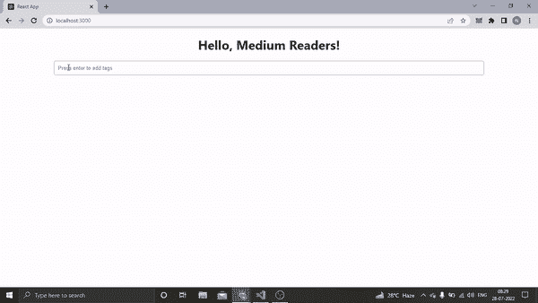
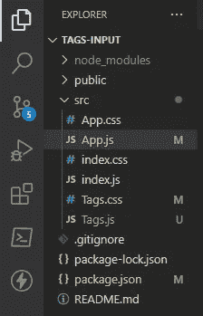
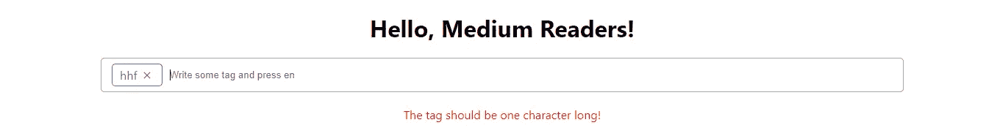

# 使用 React 创建自定义标签输入

> 原文：<https://javascript.plainenglish.io/create-a-custom-tags-input-using-react-76519c35a842?source=collection_archive---------2----------------------->

## 具有添加/删除功能等等。



在这篇文章中，我将解释如何在 React 中创建自定义标签输入。是的，除了 react 和 react-icons 之外，不会有其他的包。

因此，单独使用 React 将允许您快速掌握构建定制标签输入背后的思想。

请允许我讨论一下我们将要添加的功能。

*   当我们按下回车键时，应用程序将生成一个新的标签。毫无疑问，必须有一些字符或字母。
*   错误消息“标签长度应为一个字符！”当我们在键入单个字符之前按 enter 键时出现。
*   当我们使用退格键或关闭(x)图标时，它会删除特定的标签。
*   有一个`maxTagCount`道具。因此，当标签数量达到 10 个(当然，我们可以改变这个值)时，它会显示一条错误消息，比如“您不能添加额外的标签”。
*   还有很多。

不要认为这很难理解。我将尝试以最简单的方式创建它。

我们开始吧。

# **创建 React 应用**

在你喜欢的文件夹中打开一个命令提示符，让我们用你喜欢的名字，tags-input 来创建一个 react 应用程序。

```
npx create-react-app **tags-input**
```

现在导航到我们创建的 tags-input 文件夹。

```
cd tags-input
```

然后用任何编码编辑器打开它。我打算使用 Visual Studio 代码。

```
code .
```

# 让我们建造

这里，只需在 index.js 文件中呈现 App 组件。

```
import React from 'react';
import ReactDOM from 'react-dom/client';
import './index.css';
import App from './App';const root = ReactDOM.createRoot(document.getElementById('root'));
root.render( **<App />** );
```

仅此而已；在此之后，我们将不会修改 index.js。

现在，我们将在 App.js 中呈现 Hello World。

```
import './App.css';
import Tags from './Tags';const App = () => {
return ( 
<div className="App"> Hello World </div>
);};export default App;
```

尝试使用以下命令运行它，即

```
npm start
```

如果输出显示 Hello World，那就太好了。我们现在准备出发了。

# 添加标签组件

在 src 文件夹中，尝试创建两个文件，即 Tags.js 和 Tags.css



以下代码将在 Tags.js 中编写。

我来解释一下。

```
import React from "react";
import { MdClose } from "react-icons/md"
import "./Tags.css"
```

我们导入了 react、MD close(react-icons 中的一个图标)和 Tags.css，一个 css 文件。

毫无疑问，您必须安装 react-icons 包。

```
npm install react-icons --save
```

之后，我们在标签功能组件中创建了两个钩子。

```
const [tags, setTags] = React.useState([]);    
const [error, setError] = React.useState("");
```

第一个钩子被创建为一个空数组来保存一些标签，而第二个钩子被创建为一个空字符串来保存一个错误。

然后是地图功能。

```
{tags.map((tag, index) => (
<div className="single-tag" key={index}>
  <span>{tag}</span> 
  <i> <MdClose /> </i>
</div>
))}
```

在其中，我们将显示所有的标签以及一个关闭图标来删除单个标签。

在这种情况下，我们使用 key={index}来删除特定的标签。

然后我们有一个输入标签，用户可以在这里输入标签。和一个 div，如果出现错误，我们将在其中显示错误。

现在是添加功能的时候了。

# 标签添加和移除功能

要添加和删除标签，我们只需使用`onKeyDown`事件。

当用户按下一个键时，onKeyDown 事件发生，一个函数即`handleTags`被调用。

```
//Tags.jsx....
<input
type="text"
onKeyDown={event => handleTags(event)}
placeholder="Write some tag and press enter"
/>
...
```

如果您愿意，您甚至可以利用两个不同的事件处理程序。我想把事情简单化。

我们现在必须描述基于按键的功能。

我们想要的是，当用户按下 enter 键时，一个新的标签被创建，如果该键是 Backspace，则该标签被删除。

这是代码。

这是它的代码。您也可以为此使用一个`checkValid`方法，但是让事情简单一些。

我们构建了一个`handleTag`函数，它接受一个事件，并根据条件在指定的钩子中添加一个标签或设置一个错误。

举个例子，

```
if (event.key === "Enter" && event.target.value !== "") 
{            
setTags([...tags, event.target.value]);                     event.target.value = "";        
}
```

如果用户按下回车键，并且输入值不为空，它会将输入标签中包含的文本(用户已经输入到输入标签中)添加到`setTags`数组中。

类似地，我们已经建立了一个条件，如果用户触摸退格键。

```
else if **(event.key === "Backspace" && tags.length && event.target.value == 0)**{const tagsCopy = [...tags];            
tagsCopy.pop();            
event.preventDefault();            
setTags(tagsCopy); }
```

这里的标准很简单:击键必须是退格键，标签必须是最小长度，输入字段必须是空的。

如果是真的，我们创建一个新的数组，包含与 tags 数组相同的元素。然后我们删除最后(最后)项，用`setTags`作为新数组。

最后，我们定义了某些错误条件。试着去理解它们；它们也很容易掌握。

# **当用户点击关闭标志时移除标签**

您可能还记得，我们安装了 react-icons npm 包，并使用了其中的一个图标。

因此，我们将更改那里的代码，以包含当有人单击图标时的删除功能。

```
{tags.map((tag, index) => (<div className="single-tag" key={index}>
<span>{tag}</span>
<i **onClick={() => removeTags(index)}** >
<MdClose />
</i>
</div>))}
```

正如我们所看到的，当用户点击图标时，我们运行`removeTags`方法并传递索引。

此外，删除功能非常简单。

```
//Remove tags by clicking the cross signconst removeTags = index => {
setTags([...tags.filter(tag => tags.indexOf(tag) !== index)]);
};
```

它本质上过滤标签并删除用户点击的标签。

# 附加功能

当你尝试运行应用程序时，它无疑会运行。然而，它需要一些调整，因为我们还没有给出参数`maxTagCount`，这将限制用户在特定阈值后发送标签的能力。

让我们进行重大调整。



当用户出错时，错误 div 出现，然后保持原样，这是我们不希望的。

因此，最简单的选择是每当输入字段改变时更新`setError`变量。

我们可以这样做。

```
<input
type="text"
onKeyDown={event => handleTags(event)}
**onChange={handleError}**
placeholder="Write some tag and press enter"
/>
```

现在只需编写一个 handleError 函数。

```
//To update the error after user changes somethingconst handleError = () => {
setError("");
}
```

就这么简单。

最后，我们希望提供一个`maxTagCount`道具，它只是在 App.js 组件中传递。

```
import './App.css';
import Tags from './Tags';const App = () => {
return (
<div className="App">
  **<Tags maxTagCount="10"/>**
</div>
);};export default App;
```

你想要多少标签由你决定；我想最多 10 个标签，然后一个错误说“你不能添加更多的标签。”

然后，在 Tag.js 组件中，接受 prop 并更改条件，即，

```
if (event.key === "Enter" && event.target.value !== "" && **tags.length < props.maxTagCount**) {
setTags([...tags, event.target.value]);
event.target.value = "";
}
```

就是这样。

# 完整的 Tag.js 代码和 Tag.css 文件

如果你有任何问题，这里是完整的代码。

这是 CSS 文件。

它是完全响应的，所以你也可以在你的移动设备上使用它。

希望你喜欢。

就这样——谢谢。

如果你愿意，你可以免费获得我的 side hustle [电子书](https://nitinfab.gumroad.com/l/programming-side-hustle-book)。

[*如果你喜欢看这样的故事，并想帮助我成为一名作家，可以考虑成为一名中等会员*](https://nitinfab.medium.com/membership) *。它每月花费 5 美元，给你* [*无限制访问媒体内容*](https://nitinfab.medium.com/membership) *。如果你通过我的链接注册，我会得到一点佣金。*

*更多内容看* [***说白了就是***](https://plainenglish.io/) *。报名参加我们的* [***免费周报***](http://newsletter.plainenglish.io/) *。关注我们* [***推特***](https://twitter.com/inPlainEngHQ) *和*[***LinkedIn***](https://www.linkedin.com/company/inplainenglish/)*。查看我们的* [***社区不和谐***](https://discord.gg/GtDtUAvyhW) *加入我们的* [***人才集体***](https://inplainenglish.pallet.com/talent/welcome) *。*