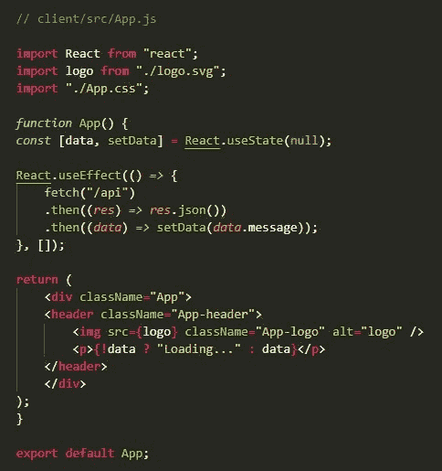

# 使用 React 和 Node.js 创建全栈 Web 应用程序

> 原文：<https://javascript.plainenglish.io/create-a-full-stack-web-app-using-react-and-node-js-b5149efd3629?source=collection_archive---------1----------------------->

## **React 和 Node.js:通过 5 个步骤构建从开发到部署的全栈 Web 应用**


一直想知道网飞是如何用最吸引人的 UI 设计把它的内容带给数百万用户并吸引他们的注意力的？这一切都与技术和功能有关，使其适合网络和移动应用。

如果它鼓励你构建一个像网飞一样的应用程序，但不知道如何创建一个应用程序，那么在这篇博客中，我们将向你解释 React 和 Node.js 将如何帮助你创建一个全栈应用程序。

了解了全栈 web 应用开发的市场需求，我们在这里创建了一篇文章，向您展示如何将这些技术的基础知识结合起来，创建一个可随时部署的全栈 web 应用。

但在深入探讨 app 开发流程之前，我们先来了解一下，为什么 React 和 Node.js 的使用会突然兴起？有没有可能使用 React 和 Node.js 来开发像网飞这样的全栈 web 应用？使用 React 和 Node.js 如何帮助你的企业获得更好的利润？这种组合实际上是如何工作的，并使您能够开发一个全栈 web 应用程序？

然而，重要的事情总是先来，所以让我们从这些框架的介绍开始。

## **简介:为什么用 React 和 Node.js 开发全栈 Web App？**

不可否认的事实是，有几种 JavaScript 语言已经成功地成为开发 web 应用程序的替代语言，但 React 和 Node.js 仍然是开发人员构建高性能全栈 web 应用程序的趋势。由于其灵活性和多功能性，这两种框架仍然是开发人员开发全栈 web 应用程序时最喜欢的编程语言。

*让我们来看看让他们要求更高的特性……*

React 作为广泛用于开发交互式用户界面的前端 JavaScript 库，在全球范围内广受欢迎。但是使用 React 的应用程序需要一个强大的后端来提高性能，并且易于维护。有各种各样的选项，如 python、PHP、Ruby 或 Java，可以添加到您的项目技术堆栈中。但是有一个选项可以通过使用 Node.js 和 Express.js 来实现全栈 JavaScript。

*但问题是，对于你的 React 应用来说，使用 Node.js 是否是一个好的选择？*

***理解反应***

React 是一个开源的前端 JavaScript 库，有助于用简单的编程和更快的速度构建交互式 UI 组件和用户界面。React 是一个基于组件的库，使您能够开发复杂的 ui，这些 ui 在各种设备上都非常容易阅读。

***了解 Node.js***

Node.js 是一个 JavaScript 运行时环境，构建于 Google Chrome 的 VMs 之上，专门用于开发速度更快、可伸缩的网络应用。Node.js 使您能够在前端和后端使用 JavaScript 创建 web 应用程序。这为希望使用单一语言构建服务器端和客户端代码的企业带来了诸多好处。

## **使用 React with Node.js 进行 Web 应用开发的优势**

如果你怀疑这种组合在现实生活中的效果，那么你一定会惊讶地发现，沃尔玛是第一家将其零售平台从 Java 到 React 和 Node.js 技术转变为市场的最大公司。

沃尔玛软件总监亚历克斯·格里戈良表示，在不到一年的时间里，将每秒处理 1 万个请求的 24 个应用程序迁移到完全不同的技术平台是一个巨大的挑战。

那么是什么让这个组合动作对于 app 开发来说很神奇呢？

> **原因如下:**

**低维护:**当您使用 React 和 Node.js 构建全栈 web 开发项目时，您可以利用维护单一编程语言的便利，因为两者都基于 JavaScript。移动应用开发公司将只需要跟上 React 前端和 Node.js 后端。

**实时数据提供高性能:**无论您是在创建大规模的 web 应用程序还是实时数据应用程序，React 和 Node.js 对于您即将到来的项目来说都可能是一个致命的组合。Node.js 具有事件驱动的架构，这使得它成为创建实时应用程序的理想选择，而使用 React 可以更容易、更有效地处理大型应用程序上的繁重流量。

**加快开发过程:**在使用 React 和 Node.js 进行应用程序开发时，您可以获得很高的投资回报(ROI)，因为它节省了您编写 web 应用程序代码的时间和金钱。基于单一的编程语言，这两种技术完美地结合在一起，因此，它允许应用程序开发人员创建快速运行的网站，从长远来看更容易维护。他们可以使用 React 来构建前端代码，而 Node.js 用于服务器端开发，无需在不同的编程语言和框架之间周旋，最终节省了应用开发的时间、金钱和资源。

**单页面应用:**要创建一个强大的单页面应用，React 和 Node.js 为你提供了一个完美的平台。与传统的 web 开发不同，单页面应用程序效率更高，只需加载一次，然后随着用户的交互而动态更新。

**JavaScript 的广泛使用:**在使用 React 和 Node.js 开发全栈 web 应用程序时，它允许应用程序开发人员使用 JavaScript 的全部功能来开发前端和后端。此外，由于您在整个项目中使用相同的语言，因此它为定制 web 应用程序结构提供了很大的灵活性和自由度。

***简而言之*** ，如果你认同 React 和 Node.js 是开发全栈 web 应用的完美组合这一事实，那么你所需要的就是 [**雇佣一个具备很强 JavaScript 知识的 web 应用开发者**](https://www.xicom.biz/offerings/hire-web-developers/) 。通过聘请专家，你将能够更有效地使用这些技术，最终帮助你为你的企业推出一个优秀的网络应用程序。

你们中的许多人都很想知道这些技术到底是如何协同工作的，以及如何使用 React 和 Node.js 创建一个全栈 web 应用程序？

为了让你理解，这里我们用简单的语言解释了这个教程，记住新手和专家都会考虑用这个教程来开发一个全栈的 web 应用。

# **使用 React 和 Node.js 开发全栈 Web 应用**

连接到 Node.js 后端的 React 前端将帮助您高效快速地创建一个全栈项目。首先，让我们看看从头开始使用 React 和 Node 建立整个项目并将其部署到 web 需要什么工具。

**安装应用程序所需的重要工具**

*   要开始一个项目，您需要在您的计算机上安装 NPM 和节点。为了方便起见，你可以在 nodejs.org 下载这两种软件。注意 NPM 已经包含在您的节点安装中。
*   接下来，您将需要一个代码编辑器。您可以选择任何代码编辑器，但这里我推荐使用 VSCode。要下载 VSCode，可以[点击这里](https://code.visualstudio.com/)。
*   在开始应用程序开发项目之前，请确保您的计算机上安装了 Git。这是使用 Heroku 部署您的应用程序所必需的。你可以[点击这里](https://git-scm.com/)安装。
*   一旦你安装了 Git，在[Heroku.com](https://heroku.com/)创建一个账户，将你的应用完全免费发布到网络上。

希望您已经准备好开发工具，可以开始使用了…下面是使用 React 和 Node.js 创建全栈 web 应用程序时需要考虑的 5 个简单的应用程序开发步骤。

## **步骤 1:使用 Node.js (Express Framework)创建后端**

首先，用你选择的名字为你的项目创建一个文件夹，让我们以 **Node-React-App** 为例。

接下来，将该文件夹拖到代码编辑器中。要创建节点项目，您需要使用下面的代码在终端中运行以下命令:

```
npm init -y
```

一旦您在终端中运行这个命令，这将创建一个 package.json 文件，它将允许应用程序开发人员跟踪您的所有应用程序脚本，并管理您的节点应用程序所需的依赖关系。

除此之外，服务器代码将保留在同名的文件夹中:server。在这里，我们将放置一个文件，从中我们将运行服务器， **index.js** 。

为了进一步创建一个运行在端口 3001 上的简单 web 服务器，我们推荐使用 **Express** 。如果没有给环境变量 **PORT** 赋值，那么 Heroku 将在您部署应用程序时设置这个值。

为了更容易理解，下面是您需要在终端中运行的命令。


然后在您的终端中，您需要安装 Express 作为依赖项来使用它:

```
npm i express
```

之后，您需要在 package.json 中创建一个脚本，当您使用`npm start`运行它时，它将启动您的 web 服务器:


现在，您可以通过在终端中运行`npm start`来使用这个脚本运行您的应用程序，并确保它运行在端口 3001:

```
npm start
> node server/index.js
Server listening on 3001
```

## **步骤 2:创建 API 端点**

现在，建议您使用 Node 和 Express 服务器作为 API，向 React 应用程序提供数据，并使您能够更改数据或执行其他一些只有服务器才能完成的操作。

在本教程中，我们将练习在一个 **JSON** 对象中从服务器发送一个简单的消息，上面写着**“Hello World】**。

*这是您需要在终端中运行的命令……*


由于我们已经对节点代码进行了一些更改，因此移动应用程序开发人员需要重新启动服务器。开发者可以通过按下一个**命令/Ctrl+C** 来轻松开始使用这个脚本。然后通过再次运行 npm start 来重新启动它。

## **第三步:用 React 创建一个 App 前端**

一旦你准备好创建一个后端开发，下一步使用 React 进行前端开发。

要使用 **REACT** 创建一个前端，首先需要使用 **create-react-app** 打开另一个终端选项卡，创建一个名为 client 的新 REACT 项目。

```
npx create-react-app client
```

之后，您将拥有一个安装了所有依赖项的 React 应用程序。你可以 [**雇佣移动应用开发者**](https://www.xicom.biz/offerings/hire-mobile-developers/) 来创建一个前端，因为你需要对应用代码做一些修改。这里您需要向您的 **package.json 文件**添加一个名为 proxy 的属性。

将此属性添加到您的应用程序代码将使开发人员能够向**节点服务器**发出请求，而无需在发出网络请求时提供来源。

```
// client/package.json…
“proxy”: “http://localhost:3001",
…
```

接下来，您可以通过运行 React 应用程序的启动脚本来启动它，该脚本与节点脚本相同。

首先确保 cd 进入一个新创建的客户端文件夹，然后您可以要求开发人员在 **localhost:3000** 上启动。

为了便于理解，这里我们提到了可以直接运行到终端中的命令。

```
cd client
npm start
Compiled successfully!
You can now view client in the browser.
Local: [http://localhost:3000](http://localhost:3000)
```

## **步骤 4:使 HTTP 请求从 React 节点**

到目前为止，您很可能已经使用 React 和 Node.js 准备好了后端和前端，现在是时候添加功能并使您的应用程序与 API 交互了。

由于您有一个工作的 React 应用程序，开发人员需要前往 **src 文件夹**中的 **App.js** 组件，并了解如何从之前创建的 **/api** 端点获取数据。

在访问了 **src** 文件夹后，他们需要使用 **useEffect** 发出一个 **HTTP** 请求。这里您需要使用**获取 API** 向您的后端发出一个简单的**获取**请求，然后让您的数据作为 **JSON** 返回。

一旦开发者将数据返回给 **JSON** ，那么你将获得 message 属性，然后将它放入一个名为 **data** 的状态变量中。

使用此命令将允许开发人员在应用程序页面上显示该消息。这里我们建议在 **JSX** 中使用一个条件来说明如果我们的数据还没有，显示文本“**正在加载**”…

这是您需要遵循的命令…



## **第五步:将你的应用程序部署到网络上——Heroku**

使用 Node.js 做出反应后，就该使用 **Heroku** 将你的应用程序部署到 web 服务器上了。

首先，允许开发者访问客户端文件夹，移除由`create-react-app`自动初始化的 **Git repo** 。

这对于部署应用程序至关重要，因为我们将在项目 **(react-node-app)的根文件夹中设置一个 Git repo。**这里你需要注意，不要在**客户端文件夹**中创建项目。

```
cd client
rm -rf .git
```

当开发人员部署这个命令时，请确保 Node.js Backed 和 React Frontend 都将在同一个域中得到服务，或者在 mycoolapp.herokuapp.com 上的**上。现在你需要雇佣一个 [**应用程序开发公司**](https://www.xicom.biz/services/mobile-app-development/) 来查看请求是如何被节点 API 处理的。所以接下来你需要写一些代码，当用户请求时显示你的 React 应用。**

专家可以通过在应用程序开发过程中添加以下代码，在 **server/index.js** 中完成这项工作。


这段代码将允许 Node 使用静态文件的 express.static 函数来访问您的 React-build 项目。

如果一个 GET 请求出现在/api 路由没有处理的文件夹中，那么您的服务器将使用 React 应用程序进行响应。

这段代码允许 React 和 Node 应用程序一起部署在同一个域中。接下来就是理解如何让你的应用程序更高效。

下面是一个命令，它使您可以更容易地将一个构建脚本添加到您的 server package.json 文件中，该文件用于为生产构建 React 应用程序。

```
// server/package.json
…
“scripts”: {
“start”: “node server/index.js”,
“build”: “cd client && npm install && npm run build”
},
…
```

在此之后，您就可以使用 Heroku 进行部署了。但在部署应用程序之前，请确保您已经在**Heroku.com 创建了一个帐户。**

将应用部署到 Heroku 既简单又快捷。登录并查看您的仪表板后，您将选择**新建>创建新应用**并提供一个唯一的应用名称。

之后，您需要在您的计算机上安装 Heroku CLI，这样您就可以在使用 Git 进行任何更改时部署您的应用程序。我们可以通过运行 CLI 来安装它。

```
sudo npm i -g heroku
```

安装后，您需要使用 Heroku login 命令通过 CLI 登录 Heroku。以下是描述:

```
heroku login
Press any key to login to Heroku
```

登录后，您需要按照**“deploy”**选项卡中所创建应用的部署说明进行操作。

```
git init
heroku git:remote -a insert-your-app-name-here
git add .
git commit -am “Deploy app to Heroku”
```

现在终于到了发布应用程序的时候了，通过使用以下命令，按下 Heroku Git 遥控器:

```
git push Heroku master
```

最后，您的 React 和 Node.js 应用程序已经上线！

希望您喜欢阅读本教程，并了解这些技术如何出色地协同工作。

现在，您脑海中留下的一个问题是，使用 React 和 Node.js 技术创建一个全栈 web 应用程序需要多少成本…

## **用 React 和 Node.js 构建一个全栈 Web App 要多少钱？**

在估算使用 React 和 Node.js 开发应用的成本时，重要的是要了解你的应用结构有多复杂，以及你打算给应用添加什么特性和功能。根据应用程序的复杂性，你需要雇佣一个应用程序开发者，开发一个应用程序的成本主要取决于开发一个应用程序需要多长时间。

要使用 React 和 Node.js 构建一个成熟的应用程序，基本上，你需要一个由业务分析师、应用程序开发人员、UI/UX 设计师、质量保证等组成的团队。 [**雇佣一名应用开发者**](https://www.xicom.biz/solutions/hire-developers/) 的平均成本在每小时 20 到 50 美元之间。如果使用 React 和 Node.js 开发一个 web 应用程序，每个平台开发一个完整应用程序的平均成本在 20，000 美元到 25，000 美元之间。

在你得出任何结论之前，你需要明白这只是一个粗略的估计。因此，在你开始这个项目之前，向专家咨询并向专家预订一个免费的咨询时段是值得的。

除此之外，企业家在投资 React 和 Node.js 项目之前，应该提出几个重要的问题。

## **你能用 React 和 Node.js 开发什么类型的应用？**

而 React 和 Node.js 是创建令人印象深刻的应用程序的理想选择，这些应用程序具有交互式 UI 和强大的后端进程来管理繁重的流量。有无数的项目可以用 React 和 Node.js 来管理，但这里我们列出了 2021 年使用这些技术构建并取得巨大成功的 7 种最佳应用类型。

在您直接深入到可以使用 React 和 Node 开发的应用程序类型列表之前，您需要了解为什么收集了这些应用程序…

下面提到的应用程序类型有一些概念，如身份验证、使用 API 和数据库、使用 React 路由器向应用程序添加页面、强大的 Node.js 后端以及播放音频或视频等媒体。此外，许多应用程序相互集成。例如，开发一个社交应用或电子商务应用可以包括音乐、音频、视频剪辑、实时聊天等等。

> 以下是您可以考虑使用 React 和 Node.js 开发的应用程序列表:

*   实时聊天应用，如 Discord、Slack、Messenger 等。
*   Instagram、Twitter、脸书等社交媒体应用。
*   Spotify、Pandora 等音乐流媒体应用。
*   电子商务应用程序，如 Esty、Shopify、亚马逊等。
*   YouTube、抖音、Snapchat 等视频分享应用。
*   博客应用程序，如 Medium、Dev.to 等。
*   像 Reddit、StackOverflow 等论坛应用。

你可以考虑使用 React 和 Node.js 开发无限的选项，你需要做的只是清楚地了解你的业务需求和你身边合适的应用开发团队。

## **结论:使用 React 和 Node.js 开始使用全栈 Web 应用**

希望通过这篇博客，您已经了解了 React 和 Node.js 是如何为您提供强大的组合来开发全栈 web 应用程序并确保最快的应用程序性能的。Node.js 是一个允许快速数据处理的服务器端平台，而 React 是一个完美的前端框架，可以更容易地创建交互式用户界面。

因此，如果你准备推出一个全栈 web 应用程序，你可以雇佣一个 [**应用程序开发公司**](https://www.xicom.biz/services/mobile-app-development/) ，它可以将所有东西放在一起，使用强大的工具组合来创建一个健壮的 web 应用程序，而不依赖于多个 API、库或框架。因此，如果你有任何想法，你想转化为最终的应用，那么值得咨询专家，以获得无与伦比的质量解决方案。

*更多内容看* [***说白了就是 io***](http://plainenglish.io/) *。报名参加我们的* [***免费周报***](http://newsletter.plainenglish.io/) *。在我们的* [***社区获得独家访问写作机会和建议***](https://discord.gg/GtDtUAvyhW) *。*