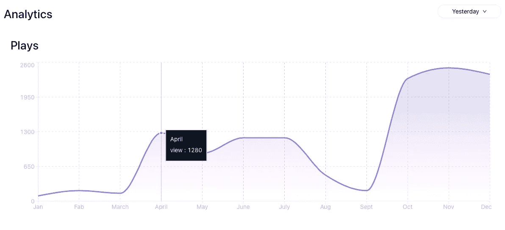
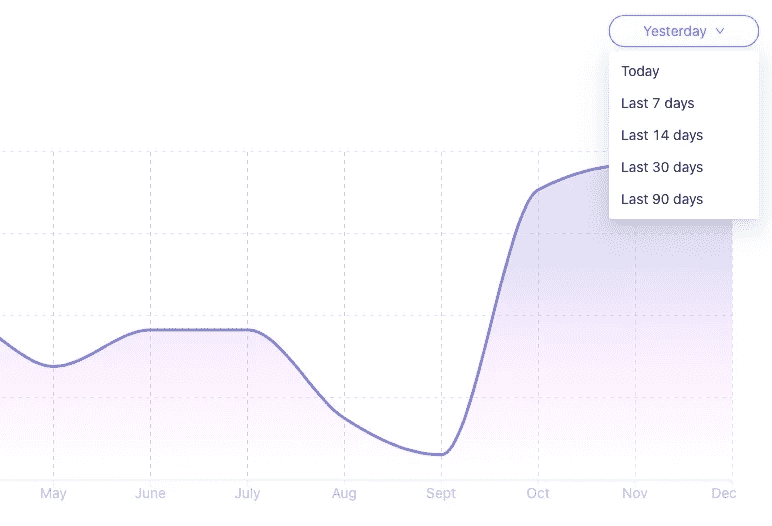
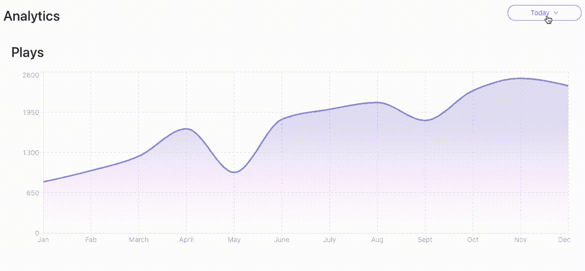

# 用 React 中的时间框架选择器创建一个渐变图

> 原文：<https://javascript.plainenglish.io/create-a-gradient-analytics-chart-with-timeframe-picker-in-react-c59c2885fc74?source=collection_archive---------2----------------------->

如果你想创建一个**分析统计图表，带有渐变颜色和一个时间框架选择器(下拉菜单)**，让你在不同的时间框架之间切换并显示自定义统计数据，这就是我们在本文中要做的。



React Analytics Application Overview



在本文中，我们将构建一个可重用的 React 图表组件，利用 [recharts](https://recharts.org) 来显示分析统计数据和一个下拉菜单，让您在不同的时间框架之间切换。

> 您可以在下面的链接中找到该组件的完整代码

# 初始化新的 React 项目

1.  让我们初始化一个新的 React 项目

```
npx create-react-app my-appcd my-app
```

2.安装所有依赖项

```
npm i recharts react-jss antd
```

3.开始项目

```
npm start
```

# 创建图表组件(第一个组件)

1.  我们将创建一个名为 **MyGraph** 的新组件，因此在 src/component 目录下创建一个名为 **graph.jsx 的新文件，并在顶部导入以下内容。**

> src/component/graph.jsx

```
import React from "react";
import { createUseStyles } from "react-jss";import {
AreaChart,
Area,
Tooltip,
ResponsiveContainer,
CartesianGrid,
XAxis,
YAxis
} from "recharts";
```

2.使用 react-jss 为图表组件创建一个样式表

```
=== STYLESHEET USING REACT-JSS ===const useStyles = createUseStyles(() => ({container: {
  color: "#fff",
  backgroundColor: "rgb(255, 255, 255)",
  padding: "1rem",
  transition: "0.3s ease-in-out",
  width: "100%",
  height: "400px",
  }
}
}));
```

3.现在我们将为图表组件定义渐变颜色，创建一个名为**<Gradient colors/>**的新组件

```
const GradientColors = () => {
  return (
   <linearGradient **id="colorView"** x1="0" y1="0" x2="0" y2="1">
     <stop offset="30%" stopColor="#8884d8" stopOpacity={0.4} />
     <stop offset="75%" stopColor="#ff9bff81" stopOpacity={0.3} /> === ADD MORE COLOURS HERE === <stop offset="95%" stopColor="#FFFFFF" stopOpacity={0.2} />
   </linearGradient>
  );
};
```

4.接下来，我们将为图表创建父组件；确保仔细检查代码中突出显示的部分。

```
const MyGraph = ({ **data** }) => {     **<--- data will be passed a props** const classes = useStyles();return (
  <div className={classes.container}>
   <h1> Plays </h1>
   <ResponsiveContainer width="100%" height="100%">
   <AreaChart data={data}>
     <defs>
       **<GradientColors /> **            **<--- GradientColors component**
     </defs>
   <Tooltip
     itemStyle={{ color: "#fff", backgroundColor: "#0A1322" }}
     contentStyle={{ backgroundColor: "#0A1322" }}
    />
   <CartesianGrid 
     strokeDasharray="4 4" 
     stroke="#8884d8" 
     opacity={0.4}
     />
   <XAxis 
     **dataKey="name"  **                 **<--- data key from demo data**
     tick={{ fill: "#B6BAC3" }} 
     stroke="#EEEEEE" />
   <YAxis 
     tick={{ fill: "#B6BAC3" }} 
     stroke="#EEEEEE" />
   <Area
     **dataKey="view"  **                 **<--- data key from demo data**
     type="monotone"
     stroke="#8884d8"
     strokeWidth={3}
     strokeOpacity={1}
    ** fill="url(#colorView)"**   **<--- Id from GradientColors component**
    />
    </AreaChart>
    </ResponsiveContainer>
  </div>
  );
};export default MyGraph;
```

该组件使用渐变来呈现主图表，**注意，我们添加的 dataKey**XAxis 和 Area 是特定于数据的(来自我们的演示数据)，如果您的数据有不同的键值对，您应该使用它们。

> 第一个组件 src/component/graph.jsx 的完整代码

# 创建时间范围选择器组件(第二个组件)

1.  我们将创建一个名为 **DropdownSelector** 的新组件，因此在 src/component 目录中创建一个名为 **menu.jsx** **的新文件，并在顶部导入以下内容。**

> src/组件/菜单. jsx

```
import React, { useState } from "react";
import { Dropdown, Button } from "antd";
import { DownOutlined } from "@ant-design/icons";
import { createUseStyles } from "react-jss";**import { menu } from "./items";       <-- We will create this later** const dropdownCategories = [
 {
   key: 0,
   content: "Today",
   value: "Today",
 },
 {
   key: 1,
   content: "Yesterday",
   value: "Yesterday",
 },
 {
   key: 2,
   content: "Last 7 days",
   value: "Last_7_days",
 },
 {
   key: 3,
   content: "Last 14 days",
   value: "Last_14_days",
 },
 {
   key: 4,
   content: "Last 30 days",
   value: "Last_30_days",
 },
 {
  key: 5,
  content: "Last 90 days",
  value: "Last_90_days",
 }
];
```

2.使用 react-jss 为 DropdownSelector 组件创建一个样式表

```
=== STYLESHEET USING REACT-JSS ===const useStyles = createUseStyles(() => ({
  container: {
   position: "absolute",
   right: 10,
   "& button": {
     color: "black",
     border: "1.5px solid #EDEEF1",
     width: 150,
     borderRadius: "15px",
  }
 }
}));
```

3.现在，我们将为时间框架选择器创建一个父组件

```
const DropdownSelector = ({ **fetchCustomData** }) => {
  const classes = useStyles();

  const [activeTimeFrame, setActiveTimeFrame] = useState(0); const handleDataFetching = (key, value) => {
    setActiveTimeFrame(key);
    **fetchCustomData(value);    <-- It will fetch data for selected      
                                   time frame from dropdown** }; return (
    <div className={classes.container}>
    <Dropdown
      overlay={
 **menu(                  <-- We will create this function later
        handleDataFetching,
        dropdownCategories,
        dropdownCategories[activeTimeFrame]
        )**
      }
     >
     <Button>
      {dropdownCategories[activeTimeFrame].content} <DownOutlined />
     </Button>
    </Dropdown>
   </div>
   );
 };export default DropdownSelector
```

4.现在我们将创建一个我们之前留下的菜单功能，所以在您的 src/component 目录**中创建一个名为 **items.jsx 的文件。****

> src/component/items.jsx

```
import { Menu } from "antd";export const menu = (
 handleDataFetching,
 dropdownCategories,
 selectedItem
) => {
 return (
   <Menu>
     {dropdownCategories.map((item) => {
      return ( **selectedItem.key != item.key &&** (
         <Menu.Item
          onClick={(e) => handleDataFetching(e.key,item.value)}
          key={item.key}
         >
          {item.content}
         </Menu.Item>
        )
      );
    })}
   </Menu>
  );
};
```

这个组件列出了所有的下拉项目，**请注意**我们添加了一个条件，这样我们就不会列出已经选择的项目。

> 第二个组件 src/menu.jsx 和 src/items.jsx 的完整代码

# **渲染图表组件**

1.  为了呈现本文中的图表，我们将使用演示数据，但是您很容易集成 API，所以在您的 src 目录中创建一个名为 **data.js 的文件和这个演示数据**

> src/component/data.js

2.接下来，在您的 src 目录(src/Analytics.jsx) 中创建一个名为 **Analytics.jsx 的文件，并导入所有子组件+演示数据。**

> src/Analytics.jsx

```
import { useState } from "react";
import {createUseStyles} from "react-jss"
import "antd/dist/antd.css";=== Sub Components ===import  MyGraph  from "./component/graph";
import DropdownSelector from "./component/menu";
import dataSet  from "./component/data";
```

3.使用 react-jss 为**分析**组件创建样式表

```
const useStyles = createUseStyles(() => ({
  container: {
   color: '#fff',
   padding: '1rem',
   transition: '0.3s ease-in-out',
   width: '1200px',
   height: '400px',
   display:'flex',
   flexDirection:'column',
   position:'relative'
 }
}));
```

4.现在创建名为**分析**的父组件

```
function Analytics() { const classes = useStyles()
  **const [data, setData] = useState(dataSet.Today);** const fetchCustomData = (**key**) => {
    **setData(dataSet[key]);**
  };

  return (
   <div className={classes.container}>
    <h1>Analytics</h1>
  **  <DropdownSelector fetchCustomData={fetchCustomData} />**
   ** <MyGraph data={data} />**
   </div>
  );
}export default Analytics;
```

现在我们有了一个带有时间框架选择器的可重用分析组件，你可以将这个组件 **< Analytics/ >** 嵌入到任何你想渲染它的地方。

# 让我们在我们的应用程序中渲染它(可选)

1.  将`<Analytics>` 导入到你的 App.js 文件中，并添加到功能组件里面。

```
**import Analytics from "./Analytics"**function App() {
 return (
 ** <Analytics/>**
 );
}export default App;
```

2.确保你的文件结构如下所示，以防出现错误。

```
src/component/graph.jsx
src/component/menu.jsx
src/component/items.jsx
src/component/data.jsx**src/Analytics.jsx
src/App.jsx**
```



# 就是这样！

现在，你应该有好看的分析组件，带有渐变颜色和时间框架选择器。

*更多内容请看* [***说白了。报名参加我们的***](http://plainenglish.io/) **[***免费周报***](http://newsletter.plainenglish.io/) *。在我们的* [***社区不和谐***](https://discord.gg/GtDtUAvyhW) *获得独家获取写作机会和建议。***