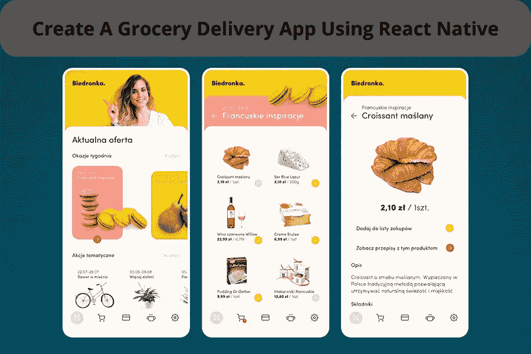
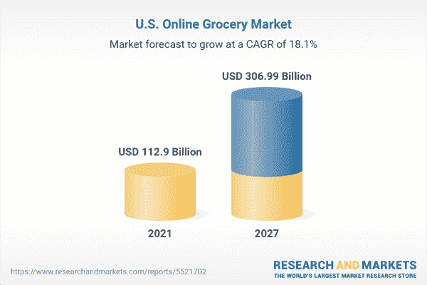
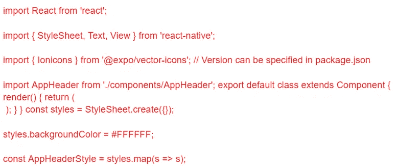

# 使用 React Native 创建一个杂货交付应用程序

> 原文：<https://javascript.plainenglish.io/create-a-grocery-delivery-app-using-react-native-templates-a0c99d308f02?source=collection_archive---------4----------------------->

## **如何使用 React 原生模板创建杂货配送应用**

你打算让你的杂货生意更上一层楼吗？开发按需杂货交付应用程序将是一个完美的决定。

随着亚马逊 Fresh 和 Instacart 等杂货交付应用程序的日益流行，越来越多的人选择将杂货直接送到家门口。

无需离开舒适的沙发就能订购食品的便利性非常吸引人。此外，在新冠肺炎·疫情袭击后，杂货快递业已经成为探索商机的巨大平台。

虽然市场上有数百种杂货交付应用程序，但日益增长的上门杂货交付需求也为新来者创造了空间。

*据* [*大观研究*](https://www.grandviewresearch.com/press-release/global-online-grocery-market) *预计到 2030 年，杂货配送市场规模将达到 2158.53 美元。预计从 2022 年到 2030 年，市场将以 25.3%的 CAGR 增长。*

[Image source](https://www.researchandmarkets.com/reports/5521702/united-states-online-grocery-market-size#:~:text=What%20is%20the%20growth%20rate,of%20%24307.0%20Billion%20by%202027.)

当然，这些统计数据非常影响和吸引初创公司推出杂货交付应用程序。但是同一个空间里这么多玩家，你怎么脱颖而出？

# **你将如何让你的杂货应用在行业中脱颖而出？**

让你的应用在拥挤的市场中脱颖而出是初创公司面临的主要挑战之一。然而，最简单的方法是雇佣一个移动应用程序开发者，他可以帮助你整合各种元素来创建一个成功的应用程序。在你直接进入应用程序开发过程之前，这里有一些开发成功应用程序的关键因素。

*   **设计应用程序:**一个简单的方法就是设计一个无与伦比的应用程序，在行业中建立强大的影响力。一些最大的公司正在投资自己的专有设计，因为他们看到了创造客户忠诚度的差异化机会:在开发自己的设计语言方面，谷歌投资了超过 10 亿美元，而亚马逊自 2005 年推出以来已经推出了超过 5 亿个 Prime 品牌的产品。一个可靠的设计将有助于你的企业脱颖而出——但是你如何做出一些令人难忘的东西来反映你的品牌呢？
*   **集成独特功能:**专业的应用程序开发人员将帮助您将最新的特性和功能集成到应用程序中。市场上可能有数百个应用程序，但每个应用程序都提供不同的功能集。
*   **选择正确的技术:**开发一款成功应用的简单秘诀就是选择一项稳定且面向未来的技术。如果你的目标是大量受众，那么选择 React 原生模板进行杂货交付应用程序开发将是一个完美的选择。你可以雇佣一个 React 原生开发者来最小化应用开发过程的复杂性。但是，如果您以前从未使用过 React 本机模板，您可能会不知道从哪里开始。

本教程将带您完成使用 React 原生模板创建杂货交付应用程序的过程。以下是创建杂货递送应用程序的分步指南…

# **如何使用 React 原生模板创建一个杂货递送应用？**

使用 React Native 创建自己的应用并不像乍看上去那么可怕。通过使用该软件附带的 React 原生 UI 模板，您可以立即启动并运行应用程序，该模板专门设计用于让您以前所未有的速度启动并运行应用程序。

你所需要的就是 [**雇佣移动应用开发者**](https://www.appsdevpro.com/hire-developers/hire-mobile-app-developers.html) 来实现它。在本指南中，您将学习如何使用 React 原生模板来创建一个杂货交付应用程序，这样您就可以不费吹灰之力就开始赚更多的钱。

让我们从使用 React 原生模板创建杂货交付应用程序的一步一步的过程开始。

## **步骤 1:安装依赖关系**

第一步是安装依赖项。为此，您需要打开终端并运行以下命令:

**NPM install-g react-native-CLI。**

这将安装 React 本机命令行界面。完成后，您可以 cd 进入您的项目目录并运行命令来创建一个基本的 React 本地项目模板:

**react-本机初始化。**

您需要将当前项目中的所有文件移动到新创建的文件夹中。一旦所有内容都成功转移，您也可以返回到原始文件夹并删除它。

## **第二步:创建导航栏**

在你开始编写你的杂货递送应用程序之前，你需要创建一个导航栏。这将是用户打开你的应用时看到的第一个东西，所以让它引人注目并易于使用很重要。此外，您可以考虑雇佣一个由专业设计师组成的专门开发团队，他们能够创建有吸引力的应用程序界面。下面是如何使用 React 原生模板创建导航栏:

***在 src 中创建一个名为 NavBar 的文件夹，有四个文件:App.js，Header.js，TabBar.js，toolbar item base . js；在 App.js 中导入“Header”、“TabBar”、“toolbar item base”；在 header.js 中从“React”导入 React；***

TabBar.js 中的**T5 从‘react-native’导入{ Link }；**

*在****toolbar item base . js****中导出默认类扩展组件{ }；*

*将该类导入****tabbar . js****。*

你现在有了一个正常工作的标签栏，你可以通过更改顶部文件的名称或其任何内容来修改它，然后运行***react-native run-IOs***或***react-native run-Android***来查看你在移动设备上的更改。

## **步骤 3:获取用户配置文件数据**

首先，您需要从正确选择的 API 中获取用户配置文件数据。以下是如何做到这一点:

*   为 API 端点设置常量(下面是一个例子:API endpoint)
*   使用 **import { Fetch }** 从“react-native”导入 react-native-fetch 库；
*   使用 **var url = 'apiEndpoint'** 为请求设置变量；
*   **调用 componentidmount()**中的 fetch()，在组件加载到屏幕后发送请求
*   使用 **map()将所有数据作为 JSON** 返回
*   使用 **jsonp** 这样我们就不需要担心跨站点脚本问题
*   为了获取更多信息，比如购物车中的一些商品，我们稍后还必须再打一个电话。

让我们继续，现在也放入这一行，但是注释掉获取第一组数据的那一行。这样，我们将能够看到我们的第二个请求是什么样子的。一旦你做到了，试一试吧！

当您的页面加载时，您应该会看到一些基本信息。

## **第四步:创建表头组件**

header 组件是杂货交付应用程序中最重要的部分。它需要易于使用和导航。因此，请确保你雇佣了一个应用程序开发人员，他可以很容易地创建一个与 React 本地代码兼容的 header 组件。您需要做的就是添加标题图像，设置宽度和高度。您还可以添加标题和副标题。

## **第五步:添加实时列表更新**

如果你想创建一个杂货递送应用，一种方法是使用 React 本地模板。通过允许您重用已经编写的代码，这可以节省您的时间和金钱。为了避免任何麻烦，你可以考虑雇佣一个 web 应用程序开发人员，让他帮你找到合适的模板。

此外，很容易找到专门为杂货交付应用程序设计的模板。选择模板时，一定要检查它是否支持实时列表更新。

这很重要，因为这意味着你的应用程序将始终拥有最新的产品信息。

要将实时列表更新编码到你的应用中，你需要使用 **PubNub SDK** 。

“PubNub”只需几行代码，就能轻松为你的应用添加实时功能。一旦你集成了 PubNub SDK，你的杂货应用程序将自动连接到范围内的其他设备，并实时显示他们所做的任何更改。下面是它如何工作的一个例子:

*从‘pub nub’导入{ pub nub _ auto subscribe }；*

*const myPubnub = new pubnub _ auto subscribe({ PUBLISH KEY:'我的发布密钥'，*

*subscribeKey:'我的 SUBSCRIBE KEY ' })；*

*this . setstate({ publishedList:this . state . published list })//创建名为 published list 的本地状态变量。*

无论 publishedList 在那个时间点的当前值是多少，它都会帮助您设置它；然后，每次在同一 publish nub 通道内的另一个设备上对 publishedList 进行更改时，该更改将自动应用到我们当前的列表副本，使用:

*放置添加的事件处理程序*

*函数 handleAddProductToGrocery()*

*{ this . setstate({ published list:updated published list })*

*//*

## **第七步:在搜索结果页面添加/删除项目**

现在我们有了模板和设计，我们需要让它发挥作用。在本节中，我们将添加在搜索结果页面中添加和删除项目的功能。

首先，让我们创建一个将商品添加到购物车的函数。我们将这个函数称为 ***addToCart*** 。这个函数将接受两个参数:*商品的名称和价格*。

然后，它会将这些项目添加到状态中。

让我们创建一个类似的从购物车中删除商品的函数。我们将调用这个函数 ***removeFromCart。*** 同样，这个函数将接受两个参数:*商品的名称和价格。*

然后，它将从状态中移除这些项目。现在我们已经创建了这些函数，让我们在应用程序中使用它们。

打开***src/components/杂货清单项目/杂货清单项目. jsx*** 对产品清单进行更改。

太好了！我们的“添加到购物车”按钮现在可以使用了，但是如果您尝试添加多个产品，它们可能会互相添加！但好消息是修复它并不太困难。你可以 [**雇佣一个 React 本地开发者**](https://www.appsdevpro.com/hire-developers/hire-react-native-developers.html) 来让它工作。它们将帮助您更改应用程序代码，而不是将一个对象传递给两个函数，现在传递了两个对象。

## **第八步:点击搜索结果中的商品后显示商品详情**

单击搜索结果中的项目后，将出现一个包含项目详细信息的新页面。该模板包含几个部分:照片、标题、价格、描述和一个添加到购物车按钮。在照片部分，您可以滚动浏览产品图片。

标题和价格显示在描述的上方。描述提供了关于产品的更多信息，例如它是在哪里制造的或者有哪些尺寸选项。

点击“添加到购物车”将带您到一个页面，在那里您可以查看您的订单和结帐。如果在提交订单之前需要更改任何内容，则有机会更改每个项目的数量。如果一切看起来都很好，那么提交！

成功完成后，您将返回到主项目列表。

## **第九步:在 App Store 上推出一款杂货应用**

在几分钟内创建您自己的“React Native 杂货应用程序”。

一旦你的应用程序准备好了，要求你的应用程序开发者将应用程序上传到谷歌 Play 商店和苹果应用程序商店。确保应用程序是按照说明和 app store 的指南构建的。

学完本教程后，您一定想知道为什么要使用 React 原生模板来创建杂货交付应用程序。

以下是原因…

# **为什么您应该使用 React 原生模板来创建您的杂货交付应用程序？**

React Native 在短时间内成为领先的跨平台框架之一。React Native 受到各行业巨头的信任，值得给 React Native 一个机会。除此之外，以下是在创建杂货交付应用程序时选择 React 原生模板的几个原因。

*   节省编写代码的时间和精力，因为 React 本机模板是预先构建的，可以加快开发过程。
*   它确保了跨平台的兼容性。使用单一代码库，React 原生框架可以帮助您的应用在不同设备和操作系统上保持一致。
*   React Native 提供了一组独特的 UI 组件和完整的小部件，可以帮助您为应用程序创建无与伦比的用户界面。使用现成的组件，应用程序开发人员可以轻松定制应用程序。
*   许多 React 原生专业设计师以可承受的价格提供高质量的模板，这使您的预算更加灵活。
*   它的现成模板允许您快速尝试新想法，而不必从头开始编写代码。
*   React 原生模板可以很好地与 TensorFlow 和 Firebase 等第三方库配合使用，这样您就不必自己构建它们了。
*   React Native 拥有强大的社区支持，将回答开发过程中出现的任何问题。
*   使用现有模板将为您节省大量时间，因为无需从头开始创建要素。

## **使用 React 原生模板构建一个杂货配送应用需要多少成本？**

说到成本，你要考虑两件事:模板本身的成本和开发的成本。

*   React 原生模板的价格通常在 99 美元到 199 美元之间。
*   开发成本将取决于您希望在应用程序中包含的功能以及开发这些功能所需的时间。

这两个因素都与您的应用程序开发需求密切相关。一般来说，开发服务的报酬在每小时 20 到 25 美元之间。

但是在你开始雇佣一个应用开发者之前，确保你了解你的应用需求。成本和时间主要受应用程序要求的复杂性影响。

因此，如果你想要一个有一些功能的基本杂货交付应用程序，你可以预计支付 10，000 美元左右。

如果你想要一个有更多功能的更复杂的应用程序，你可以预计支付大约 12，000 美元以上。为了了解你应该为你的应用支付多少钱，这里有一些粗略的估计:

如果你除了从网上商店的目录中挑选商品并送货上门之外，不需要任何功能，那么你应该考虑花费 2500 至 5000 美元。添加地图或路线、客户账户或奖励计划、多种支付选项等功能可能需要 8000 美元。

底线是，当使用 React 原生模板构建一个杂货交付应用程序时，没有一个尺寸适合所有价格点，因为成本将根据项目中包含的功能数量而变化。

# **总结**

如果你正在寻找创建一个杂货交付应用程序，React 原生模板是一个很好的选择。有这么多可用的模板，你可以找到一个完全符合你的需要。

此外，您可以选择 [**聘请一名移动应用程序开发人员**](https://www.appsdevpro.com/hire-developers/hire-mobile-app-developers.html) 来定制应用程序，以反映您的品牌形象，并为客户提供独特的体验。此外，你可以考虑集成最新的功能，使你的应用程序创意与众不同。

因此，如果您已经有了一个应用程序的想法，并且正在寻找可以帮助您构建高性能应用程序的最佳资源，那么您可以联系我们或在下面提出疑问！

*更多内容请看*[***plain English . io***](https://plainenglish.io/)*。报名参加我们的* [***免费周报***](http://newsletter.plainenglish.io/) *。关注我们关于*[***Twitter***](https://twitter.com/inPlainEngHQ)[***LinkedIn***](https://www.linkedin.com/company/inplainenglish/)*[***YouTube***](https://www.youtube.com/channel/UCtipWUghju290NWcn8jhyAw)*[***不和***](https://discord.gg/GtDtUAvyhW) *。***