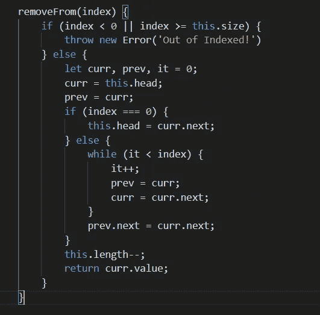

# 如何用 JavaScript 创建一个链表

> 原文：<https://javascript.plainenglish.io/create-a-linkedlist-in-javascript-f0999657cdb2?source=collection_archive---------1----------------------->

## 用 JavaScript 创建链表的初学者指南。

Photo by [Paico Oficial](https://unsplash.com/@paicooficial?utm_source=medium&utm_medium=referral) on [Unsplash](https://unsplash.com?utm_source=medium&utm_medium=referral)

# 什么是链表？

链表是一种特殊类型的数据结构，它被存储并在其上执行迭代。这就像一场游行，每个人都牵着前面某个人的手，只有一个人没有。这有许多类型，如单个、两个和循环。你可以从 GeekofGeek 的这里阅读链表[。我将特别写一个单独的列表](https://www.geeksforgeeks.org/data-structures/linked-list/)

每个链表都有一个指向一个节点的头值和指向下一个节点的下一个值。让我们在实践中看看这个

## 创建链表和节点

每个链表都有一组节点，所以让我们首先创建一个节点类

Node class

每当一个节点被创建时，它将指向 null 作为单链表的下一个。现在让我们为链表创建一个类，它将保存链表的头部和节点

Linked list class

这里我们有一个链表类，它的构造函数不带参数，先初始化两个变量，一个是头，另一个是链表的长度。除了构造函数，我们将有更多的方法来帮助我们使用链表的基本操作和 getters。

## 链表的方法

1.  **添加**

其中一个基本操作是向链表中添加一个新项。它将添加一个新节点并增加链表的长度。

add method

这里，我们在列表末尾的最后一项旁边添加了一个新元素。

**2。索引 Of**

类似于 Array 的方法`indexOf`,我们在这里也创建了一个类似的方法。一旦找到，将获取项目值，否则为-1。

indexOf method

**3。地图**

类似于 Array 的 map 方法，我们将向每个迭代节点传递一个回调

map method

**4。清除**

有时你可能想清除整个链表，并把它当作一个新的链表来使用。为了清除链表，我们需要将 head 再次设置为 null，长度为 0

clear method

**5。FromArray**

数组是在通用程序中使用的通用数据集，所以让我们创建一个方法，将数组转换成一个链表。

fromArray method

**6。移除自**

要从链表中移除一个特定的元素，我们需要一个方法，该方法将一个索引作为参数并移除相应的项，同时将 previous 的下一个值设置为 future。

removeFrom method

你可以访问上面的代码，做一个比这个更好的算法。

**7。吸气器阵列**

创建一个名为 array 的 getter，将它作为常规值来执行类似的操作。

getter for array

## 结论

为了测试这个类，我们可以运行一组包含方法`add, clear, removeFrom`等的操作。

example

这些是链表及其操作的例子。

我将结束这个话题，希望你能理解链表的概念和它的操作。稍后我们还将讨论其他类型的链表。

你可以在这里找到所有操作[的源代码。](https://github.com/Piyush-Use-Personal/LinkedList-in-JavaScript/blob/main/node.js)

日安！

*更多内容看* [***说白了。报名参加我们的***](http://plainenglish.io/) **[***免费周报***](http://newsletter.plainenglish.io/) *。在我们的* [***社区获得独家访问写作机会和建议***](https://discord.gg/GtDtUAvyhW) *。***