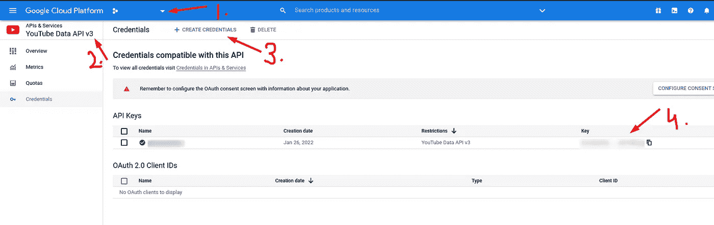

# 创建一个实时 Twitter 个人资料横幅，以显示关注者计数器

> 原文：<https://javascript.plainenglish.io/create-a-live-twitter-profile-banner-to-show-followers-counter-86984a45e560?source=collection_archive---------21----------------------->

## 用开发人员追随者和 YouTube 订户自动更新您的 Twitter 横幅


Twitter Header

在本系列的[前一部分](/automatically-tweet-popular-articles-from-dev-46da29c7a20c)中，我们学习了如何自动发布你的热门文章。

[](/automatically-tweet-popular-articles-from-dev-46da29c7a20c) [## 从 DEV 自动发布热门文章

### 开源工具，自动发布你的热门文章

javascript.plainenglish.io](/automatically-tweet-popular-articles-from-dev-46da29c7a20c) 

现在作为大多数开发者，我并没有就此止步，lol。我更进一步，创建了一个服务，用我在 [DEV](https://dev.to/anshuman_bhardwaj) 、 [Medium](https://anshuman-bhardwaj.medium.com) 和 [YouTube](https://www.youtube.com/channel/UC9-rIQbbBVxJyTIWPdhK4YA) 的粉丝数自动更新我的 Twitter 横幅。

相信我，这比我们想象的要简单得多，是吗？

让我们找出答案。

# 故障

1.  用占位符创建一个时髦的 Twitter 横幅图像
2.  阅读来自 DEV、Medium 和 YouTube 的关注者
3.  使用 Twitter API 更新横幅
4.  每隔一段时间做一次

# 创建图像模板

开始的第一步也是最重要的一步是创建一个模板，稍后我们可以用实时数据填充它。

我总是使用 Canva 为 Twitter 和 YouTube 创建图片。所以，我去了那里，用他们的 Twitter 横幅模板为自己创建了一个。

我添加了所有三个帐户的用户名，并留下一些空间来填充实时计数器值。

我从一些推特账号上获得了灵感🎉！


# 获取开发者关注者

这个是最简单的，你要做的就是

*   从您的开发帐户获取 API
*   使用他们的追随者 API 获得所有追随者
*   他们每页最多只发送 1000 个追随者，所以我们必须运行一个循环，只要追随者被返回

## 代码片段

```
// fetch all followers
export async function getFollowersFromDev(): Promise<any[]> {
  // start with page 1
  let page = 1,
    limit = 1000;
  const followers = [];
  // repeat until page number exists
  while (page) {
    const res = await fetch(
      `${process.env.DEV_API_URL}/followers/users?per_page=${limit}&page=${page}`,
      {
        headers: {
          "api-key": process.env.DEV_API_KEY as string,
        },
      }
    );
    const answer = await res.json();
    if (answer && Array.isArray(answer) && answer.length) {
      followers.push(...answer);
      // increment page number if this page is full, otherwise set to 0
      page = answer.length === limit ? page + 1 : 0;
    } else {
      // no more followers, so set page to 0
      page = 0;
    }
  }
  return followers;
}
```

# 获取 YouTube 订户

我们有一个可用于这个的 REST API，

*   在你的谷歌云平台项目中创建一个 API 密钥，并允许访问 YouTube 的 API



Create API Key

*   访问 [YouTube Studio](https://studio.youtube.com/) 获取您的频道 ID，如下图所示


Copy Channel ID

*   接下来您要做的就是调用 API 并读取数据

## 代码片段

```
 export async function getYoutubeSubscribers() {
  const res = await fetch(
    `[https://youtube.googleapis.com/youtube/v3/channels?part=statistics&id=${YT_CHANNEL_ID}&key=${YT_API_KEY}`](https://youtube.googleapis.com/youtube/v3/channels?part=statistics&id=${YT_CHANNEL_ID}&key=${YT_API_KEY}`)
  );
  const data = await res.json();
  return data?.items[0]?.statistics?.subscriberCount || 330;
} 
```

# 获取中等关注者

嗯，这是最困难的，Medium 似乎没有提供一个 API 来让追随者计数。但是在谷歌上搜索，我发现了 GitHub 用户 newhouse 的这个要点，非常感谢他们。

事实证明，如果你在你的中等个人资料 URL 的末尾添加一个`?format=json`，你将得到一个 JSON 响应，其中有一堆数据，包括“SocialStats”。

但是，“等等…等等…等等，不要这么快”，中队说。

他们在实际的 JSON 前面添加了一些文本，以限制作为 API 的使用。

此外，当我做一个获取请求时它没有解决，但当使用失眠症时它工作了，所以当我发出网络请求时，我使用失眠症作为用户代理。

## 代码片段

```
export async function getMediumFollowers() {
  const res = await fetch("[https://medium.com/@anshuman-bhardwaj?format=json](https://medium.com/@anshuman-bhardwaj?format=json)", {
    headers: {
      "user-agent": "insomnia/2021.7.2", // didn't work without this for me
    },
  });
  // Medium adds this to the JSON text
  const hijackString = "";
  const jsonText = await res.text();
  // remove the hijackString from JSON before parsing
  const data = JSON.parse(jsonText.replace(hijackString, ""));
  return (
    data?.payload?.references?.SocialStats?.[MEDIUM_USER_ID]
      ?.usersFollowedByCount || 20
  );
}
```

# 更新我的 Twitter 个人资料横幅

现在我们已经有了所有需要的信息，我们只需要创建一个 API 处理函数，它将

1.  从以上三种方法中获取数据
2.  用从上述方法中获取的值更新我们创建的占位符图像
3.  使用 v1 API 的 [update_profile_banner](https://developer.twitter.com/en/docs/twitter-api/v1/accounts-and-users/manage-account-settings/api-reference/post-account-update_profile_banner) 端点将更新后的图片上传到我的 Twitter 账户。

# 更新图像

我们将使用`jimp` [npm 包](https://www.npmjs.com/package/jimp)在我们的图像上添加文本。为此，我们必须找到占位符的确切坐标。(点击和试验对我来说很好)

我们使用来自 jimp 的`print`方法将文本放在图像之上。

我已经在之前的文章中解释了如何获得 Twitter API 证书。所以，请参考那篇文章，我现在跳过它。

# 限制

*   Twitter API 接受图像的`base64`编码，但我在使用`fetch`调用时达到了最大有效负载大小，但使用 [Twitter API 客户端](https://github.com/FeedHive/twitter-api-client) npm 包为我修复了这个问题。
*   我的 Next.js API 处理函数在运行时无法解析来自`jimp`模块的字体，所以我把它们复制到公共文件夹来解决这个问题。
*   当我使用 Next.js 函数时，我无法将映像写到磁盘上。
*   是的，我知道`getBase64Async`存在于`jimp`中，但是它给出了一个巨大的返回值，大约是原始大小的 6 倍。因此，我用一个`toString`调用链接了`getBufferAsync`实用程序，这对我来说很好。

# 代码片段

```
import { NextApiRequest, NextApiResponse } from "next";
import {
  formatLog,
  getFollowersFromDev,
  getMediumFollowers,
  getYoutubeSubscribers,
  twitterClient,
} from "../../../utils";
import path from "path";
import jimp from "jimp";export default async function views(
  request: NextApiRequest,
  response: NextApiResponse
) {
  console.info(formatLog("Running Update Twitter Header Function"));
  try {
    const devFollowers = await getFollowersFromDev();
    const ytSubs = await getYoutubeSubscribers();
    const mediumFollowers = await getMediumFollowers();const filePath = path.resolve("./public/yellow_twitter_header.png");
    const jimpFont = path.resolve(
      "./public/open-sans-32-black/open-sans-32-black.fnt"
    );
    path.resolve("./public/open-sans-32-black/open-sans-32-black.png");const image = await jimp.read(filePath);
    const font = await jimp.loadFont(jimpFont);
    image.print(font, 150, 98, ytSubs);
    image.print(font, 620, 98, devFollowers.length);
    image.print(font, 1130, 98, mediumFollowers);
    const fromImage = await image.getBufferAsync(image.getMIME());
    const updatedHeader =
      await twitterClient.accountsAndUsers.accountUpdateProfileBanner({
        banner: fromImage.toString("base64"),
        width: 1500,
        height: 500,
      });
    response.status(200).send({
      type: "success",
      updatedHeader,
      devFollowers: devFollowers.length,
      ytSubs,
      mediumFollowers,
    });
  } catch (e: any) {
    console.log(e);
    response.status(500).send({
      type: "error",
      message: e.message,
    });
  }
}
```

# 计划更新

既然我们已经完成了所有的繁重工作，我们只需要调用上面创建的 API 处理程序。

为了安排时间，我使用 GitHub actions 创建了一个 Cron 作业，每 5 分钟运行一次来更新我的个人资料图片。Cron 作业调用上面创建的 API 处理程序，就这样。

到目前为止，它运行得相当好。

注意:Twitter 的更新横幅 API 是有速率限制的，找不到确切的数字，但它在 15 分钟内大约有 30 个呼叫。如果你知道，请写在评论里。

# 资源

*   [YouTube API](https://developers.google.com/youtube/v3/guides/implementation/channels)
*   [开发 API](https://developers.forem.com/api)
*   [推特 API 客户端](https://github.com/FeedHive/twitter-api-client)
*   [GitHub 回购](https://github.com/Anshuman71/tweet-my-articles)
*   [新房子的要旨](https://gist.github.com/newhouse/843c444ddefe084ea7f01603627dbcfd)

好了，就这些，朋友们。您可以查看完整的指南，并通过分叉此 [GitHub Repo](https://github.com/Anshuman71/tweet-my-articles) 来使用它。

希望这篇文章对你有帮助！如果您有任何反馈或问题，请随时在下面的评论中提出，我很乐意听到并解决它们。

更多此类内容，请关注我

*直到下一次*


*原载于 2022 年 1 月 31 日*[*https://theanshuman . dev*](https://theanshuman.dev/articles/create-a-live-twitter-profile-banner-to-show-followers-count-3k2h)*。*

*更多内容看* [***说白了就是***](http://plainenglish.io/) *。报名参加我们的**[***免费每周简讯***](http://newsletter.plainenglish.io/) *。在我们的* [***社区不和谐***](https://discord.gg/GtDtUAvyhW) *获取独家写作机会和建议。**