# 使用 JavaScript Web 组件创建嵌套的评论/回复框

> 原文：<https://javascript.plainenglish.io/create-a-nested-comment-reply-box-using-javascript-web-components-d997c1198cc4?source=collection_archive---------3----------------------->

## 如何创建定制的 **Web 组件**并与 **JavaScript ES 模块**一起使用。

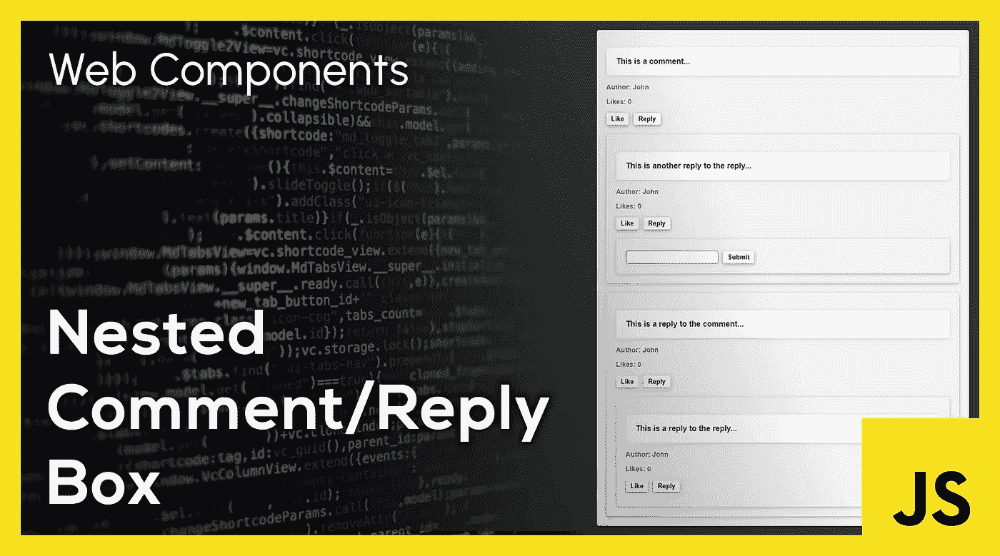

Web 组件允许我们创建可重用的定制元素，将它们的功能封装在代码的其余部分之外。这里我们创建一个定制的`comment-box` web 组件，并使用它来构建一个**嵌套的评论/回复系统**。

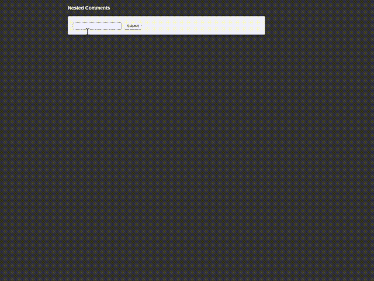

Nested Comment Reply box Demo

这篇文章可以帮助你理解 **Web 组件**如何工作，以及它们如何与 JavaScript **ES 模块**一起使用。

该项目的完整代码可在 [**GitHub**](https://github.com/savinuvijay/nested-comments) 上获得。

在 [**StackBlitz**](https://stackblitz.com/edit/web-platform-nac3d2) 上进行现场演示。

# 它是如何工作的

**注释框**被定义为一个 JavaScript web 组件。它在单独的 JavaScript 文件`commentBox.js`中定义。该组件的样式在`commentBoxStyle.css`文件中定义。

## **commentBox.js**

我们首先创建一个新的 HTML 模板元素，并在其`innerHTML`中定义 Web 组件的结构。组件的样式也在`innerHTML`中链接。

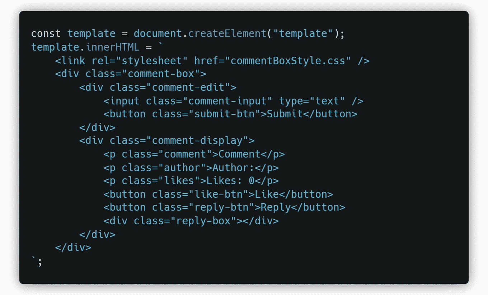

注释框由两部分组成。首先是`comment-edit-box`，它由评论输入字段和提交按钮组成。第二个是`comment-display-box`，它显示提交的评论、作者详细信息、该评论的赞数(最初为 0)以及类似的&回复按钮。它还包含一个不可见的`reply-box` div。当点击 reply 按钮时，用于回复的嵌套注释框附加到这个 div。

用户可以在评论中添加任意数量的回复。但是嵌套回复的级别被限制为 3。`nestingLimit`用于处理这种情况，可根据需要进行更改。

```
const nestingLimit = 3;
```

现在我们通过创建一个名为`CommentBox`的 JavaScript 类来定义 Web 组件，该类扩展了`HTMLElement`。它也作为 ES 模块导出。我们在这个类中定义了 Web 组件的构造函数和两个生命周期方法。

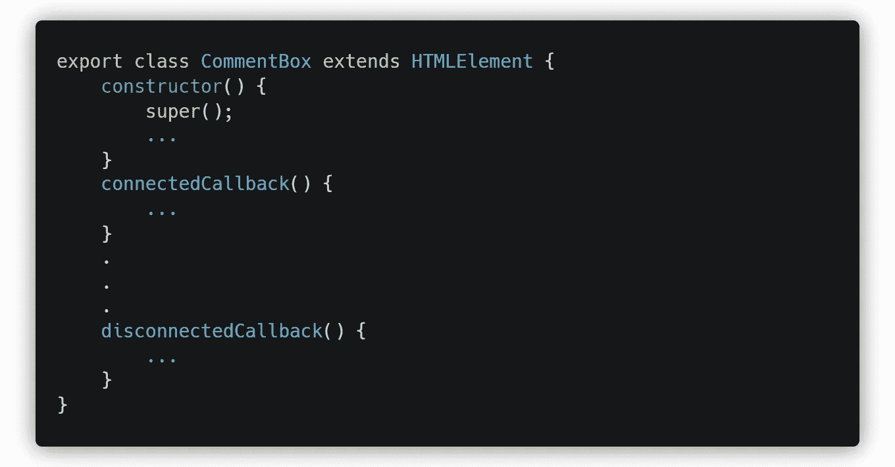

一旦组件被连接(加载)到 [DOM](https://developer.mozilla.org/en-US/docs/Web/API/Document_Object_Model/Introduction) 上，生命周期方法就会运行，而一旦组件从 DOM 上断开(移除)，生命周期方法就会运行。这个类还包含几个**事件处理函数**，这将在本文后面详细解释。

## **构造函数()**

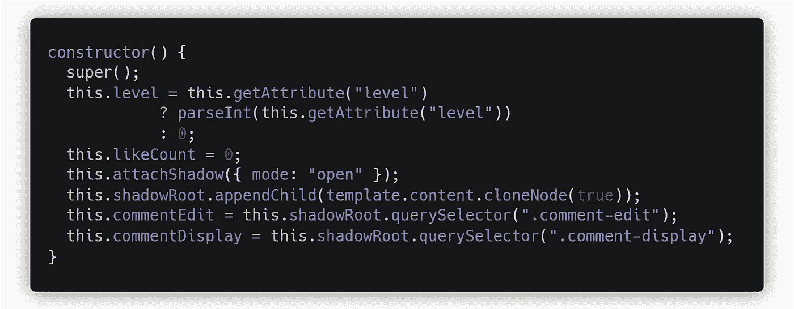

`comment-box` web 组件可以接受一个`level`属性。

```
<comment-box **level="0"**></comment-box>
```

该属性指定特定注释框的嵌套级别。它被捕获并存储在`CommentBox`类的`this.level`变量中。

当 HTML 文件中不存在`level`属性时，级别的值默认为**零**。我们还在构造函数中将初始的`likeCount`设置为**零**。接下来，我们将一个[阴影 DOM](https://developer.mozilla.org/en-US/docs/Web/Web_Components/Using_shadow_DOM) 附加到元素上，并将上面定义的模板作为它的子元素。

最后，我们使用`shadowRoot`上的`querySelector()`设置`commentEdit`和`commentDisplay`变量指向各自的 HTML 元素。

## **ConnectedCallback()**

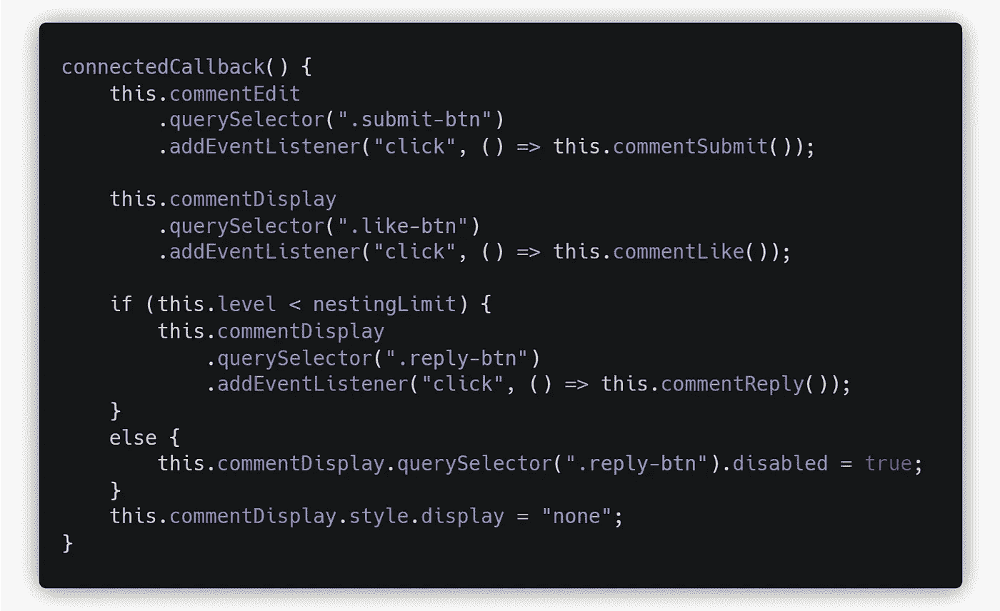

一旦 Web 组件被附加到 DOM，就会执行`connectedCallback()`方法。在这个方法中，我们为组件上的所有按钮附加了事件侦听器。

`commentSubmit()`事件处理程序连接到`submit-btn`按钮，而`commentLike()`事件处理程序连接到`like-btn`。只有当当前级别**小于**的`nestingLimit`时，`commentReply()`事件处理程序才会被附加到`reply-btn`上。否则`reply-btn`为**禁用**。

最后，我们将`commentDisplay`元素的显示样式设置为 **none** ，因为它最初是隐藏的，只有在提交评论时才会显示。

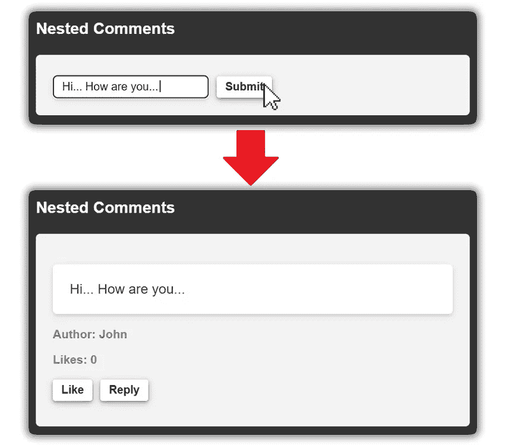

## **DisconnectedCallback()**

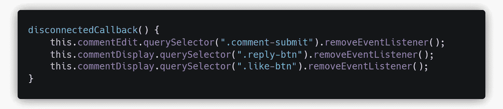

当组件与 DOM 断开连接时，执行`disconnectedCallback()`。这里，我们删除了创建组件时附加的所有事件侦听器。

# **事件监听器功能**

## **CommentSubmit()**

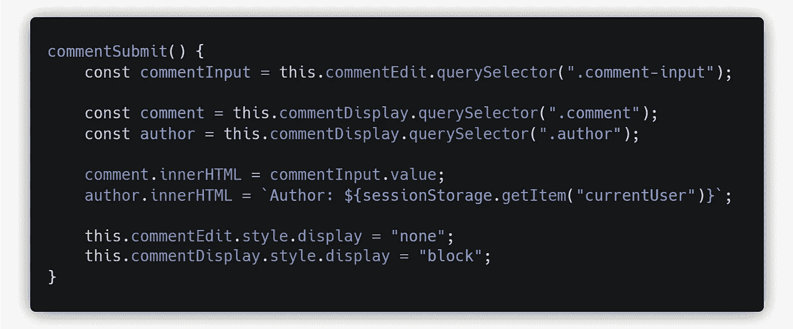

当用户在输入框中输入注释并点击**提交按钮**时，调用`commentSubmit()`方法。

我们首先让`commentInput`变量指向`commentEdit` div 中的**输入框** HTML 元素。我们还设置了`comment`变量指向显示评论的 div，设置了`author`变量指向 **author** `<p>`标签。

现在，我们将用户提交的评论设置为显示的内容。这通过将**注释** div 的`innerHTML`设置为`commentInput`的值来实现。我们还用来自`sessionStorage`的值设置了**作者**的名字。

最后，我们需要隐藏`commentEdit` div 并显示`commentDisplay` div。这是通过将`commentEdit` div 的**显示**样式设置为`'none'`来隐藏它，并将`commentDisplay` div 设置为`'block'`来显示它。

## **评论喜欢()**

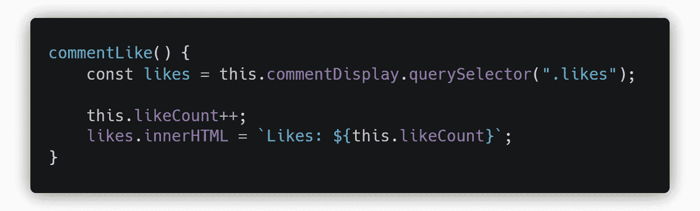

当用户点击任何评论旁边的 **Like 按钮**时，调用`commentLike()`方法。使用`querySelector`将`likes`变量设置为指向**like**tag。然后`likeCount`递增，并且用新的**喜欢计数**更新`<p>`标签的`innerHTML`。

## **评论回复()**

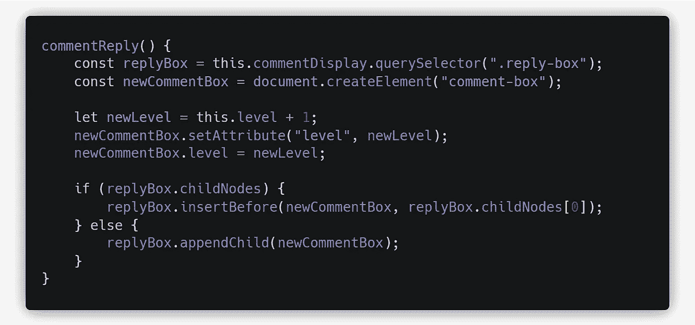

当用户点击任何评论旁边的**回复按钮**时，就会调用`commentReply()`方法。我们首先让`replyBox`变量指向`reply-box` div。这是 div，所有的**评论回复**将作为子元素添加到其中。

然后，一个新的`comment-box`组件被创建为 HTML 元素，它的值被设置为`newCommentBox`变量。**级别**变量递增，其新值被设置为`newCommentBox`的属性。如果回复框已经有任何子节点，那么在`reply-box`中的**第一个子节点**之前插入`newCommentBox`，否则直接追加`newCommentBox`作为第一个子节点。这是为了确保较新的回复总是出现在顶部。

## **Script.js**

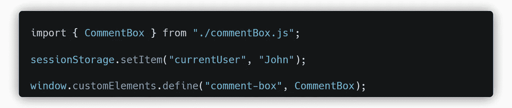

`CommentBox`类作为 **ES 模块**从`commentBox.js`导入。我们首先将当前用户数据设置到**会话存储器**中。然后我们将`CommentBox`类定义为定制元素或 Web 组件。我们还将这个元素的定制 HTML 标签设置为`'comment-box'`。

**注意:** `script.js`文件中应指定`index.html`与`type='module'`来启用 ES 模块。

```
<script defer **type="module"** src="script.js"></script>
```

## **Index.html**

`index.html`文件的主体非常简单。它由嵌套在其中的一个`container`和一个`comments` div 组成。这些用于在视口内以特定宽度居中对齐注释部分。在这个 div 中，我们添加了`comment-box`元素，这是我们到目前为止一直在创建的 Web 组件。还添加了一个等级属性，值为 **0** ，标记为评论框的**初始等级**。这允许从零开始嵌套四级注释。如果初始级别设置为 **1** ，则可以嵌套三个级别的注释。如果最初没有指定**级别**属性，则其值默认为**零**，使得三个级别的嵌套回复成为可能。

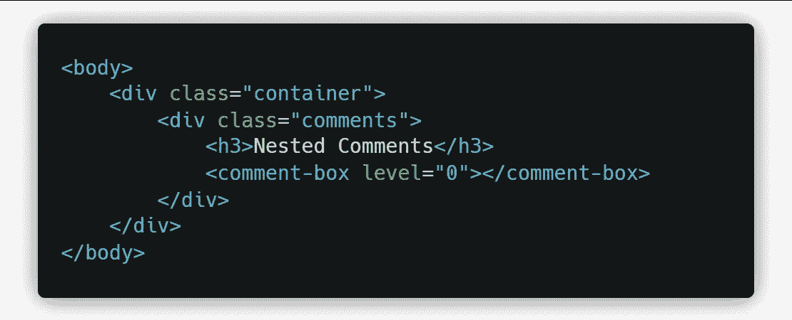

## **结论:**

总结一下，我们看了如何创建定制的 **Web 组件**并与 **JavaScript ES 模块**一起使用。这是通过创建一个定制的`comment-box` web 组件并使用它来创建一个嵌套的评论/回复系统来实现的。我们还看到了 web 组件的代码、它的生命周期方法以及它的相关事件句柄的细节。

这个项目的完整代码可以在 [**GitHub**](https://github.com/savinuvijay/nested-comments) 上获得。

看看 [**StackBlitz**](https://stackblitz.com/edit/web-platform-nac3d2) 上的现场演示。

*更多内容看* [***说白了就是***](http://plainenglish.io/) *。报名参加我们的* [***免费每周简讯***](http://newsletter.plainenglish.io/) *。在我们的* [***社区不和谐***](https://discord.gg/GtDtUAvyhW) *获得独家获取写作机会和建议。*