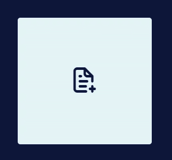
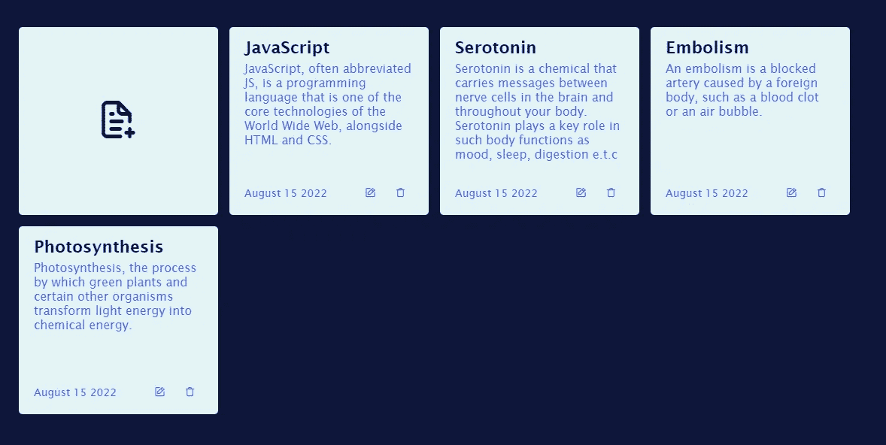
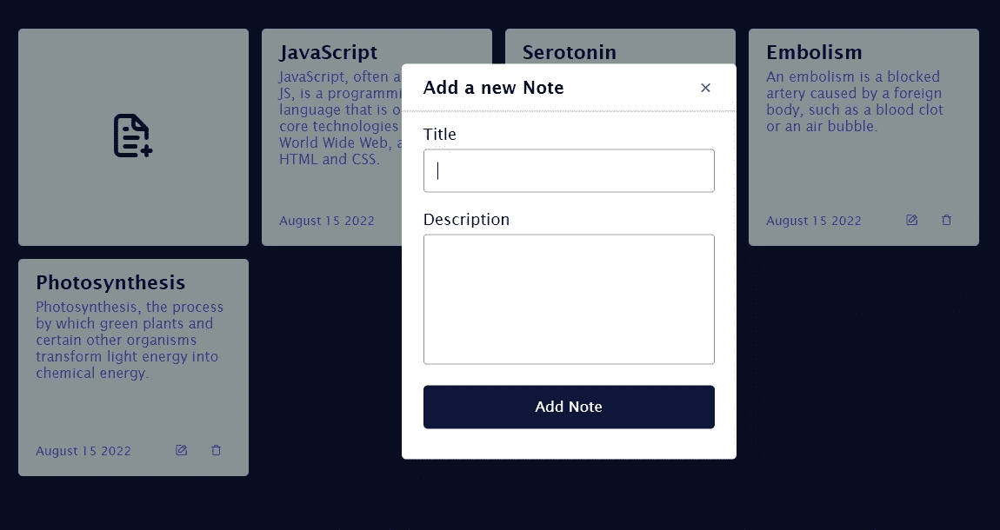
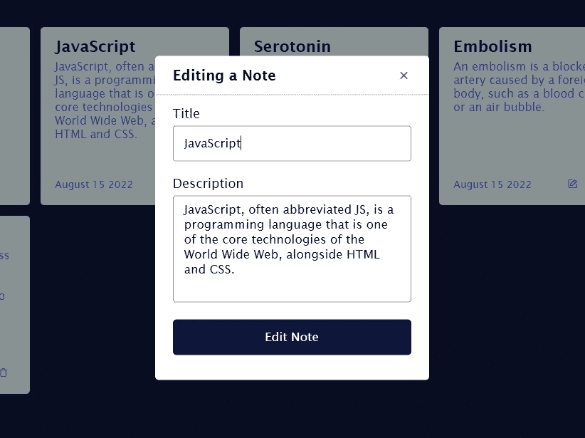

# 使用 JavaScript 创建一个笔记应用程序

> 原文：<https://javascript.plainenglish.io/create-a-note-taking-app-using-javascript-26fafa33abe7?source=collection_archive---------4----------------------->

## 关于如何构建笔记应用的教程(包含 HTML、CSS 和 JavaScript 代码)。

Photo by [Daria Nepriakhina 🇺🇦](https://unsplash.com/@epicantus?utm_source=unsplash&utm_medium=referral&utm_content=creditCopyText) on [Unsplash](https://unsplash.com/s/photos/note-taking?utm_source=unsplash&utm_medium=referral&utm_content=creditCopyText)

笔记是把信息记录下来的实践。做笔记的一些好处是:笔记可以作为学习的辅助工具，笔记可以提高注意力和对细节的关注，促进主动学习，提高记忆力。记笔记并不一定意味着把它写在纸上或书上，记笔记可以在我们的手机上通过打字来完成。本文将提供如何使用 HTML5、CSS3 和 JavaScript 构建笔记应用程序的信息。本文面向熟悉 HTML5、CSS3 和 JavaScript 基础知识的人。本文不包括对 HTML5、CSS3 和 JavaScript 的详细阐述，但会提供源代码。

## 让我们开始吧

首先，我们需要使用 Html5 和 Css3 创建 UI。

从[图标侦察](https://iconscout.com/unicons/explore/line)中获取所有图标。

**HTML 的示例代码**

**CSS 的示例代码**

**这是实现 Html 和 CSS 后的样子**

Implementation of the HTML and CSS code above

**现在是 JavaScript 的示例代码**

**最后，**这是添加 JavaScript 后的样子

Complete implementation of HTML, CSS AND JAVASCRIPT

**注释**:您可以点击添加注释图标添加新注释，点击编辑图标编辑注释，点击回收站图标删除注释。

Adding a new note

Editing a note

*所有注释都将存储在 web 浏览器的本地存储器中，因此在您刷新页面后，注释仍会显示。*

**恭喜你，**你做到了。你开发了一个笔记应用。

*更多内容请看*[***plain English . io***](https://plainenglish.io/)*。报名参加我们的* [***免费周报***](http://newsletter.plainenglish.io/) *。关注我们关于*[***Twitter***](https://twitter.com/inPlainEngHQ)[***LinkedIn***](https://www.linkedin.com/company/inplainenglish/)*[***YouTube***](https://www.youtube.com/channel/UCtipWUghju290NWcn8jhyAw)*[***不和***](https://discord.gg/GtDtUAvyhW) *。***