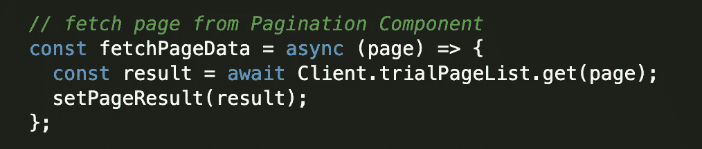

# 以反应方式创建分页

> 原文：<https://javascript.plainenglish.io/create-a-pagination-in-a-react-way-df5c6fe1e0c7?source=collection_archive---------0----------------------->

一个漂亮的分页怎么样？🧚‍♂️


You will cross the bridge when you get to it — — 船到桥头自然直

分页一直是一个非常有趣的任务，在我一直在做的项目中，我创建了一个分页，它有三种与页面相关的不同显示。📑

我简单总结一下。✂️

首先，每个页面需要显示 15 张不同的卡片，API 总共返回 104 页。

用户可以点击网站底部的分页按钮，或者点击 ***上一页*** / ***下一页*** 按钮来切换页面。

👉站点初始加载时，分页需要显示**第一个**和**最后一个**三个按钮，中间的**按钮被替换为**省略号**。**


Pagination with first 3 and last 3 page buttons and a **next** button

👉当用户切换到第 4 页时，分页的前面会出现一个上一页按钮，它只会显示第一个和最后一个按钮，以及**当前**页按钮和两个**前的**/**/***后的**按钮，其他按钮都用**省略号**代替。***

**

*Pagination with first and last buttons and **previous** / **next** button, plus **current** / **before** / **after** buttons*

*👉用户可以跳转到最后一页，下一个按钮**应该消失，分页只显示前三个按钮和前一个**按钮**，中间的**按钮**被替换为**省略号*****

**

*Pagination with first 3 and last 3 page buttons and a **previous** button*

*🦜:同样重要的是，按钮**样式**应该根据当前页面进行更新。*

*我将在下面分享我的步骤，我相信有更好的方法，但也许你会发现这也很有趣和有用。✏️*

***首先**，对于初始站点渲染，在 React **useEffect** 钩子内，从第 1 页获取数据，用 API 响应更新它们。*

***第二个**，将需要的数据传递给我们稍后将创建的分页子组件。*

**

*Ignore the **fetchPageData** function for now, it will be used later 🍭*

*现在，创建**分页**组件。*

*首先，我将从**上一个**按钮开始，它应该只有在当前页面达到 **4** 时才可见:👇*

**

*render Previous Button, ignore style and onClick function for now, we will get there later*

*之后，我们可以创建**第一个**三个条件渲染按钮，如果当前页面≤ 3 或≥最后一页- 2，它们应该是可见的，并且第一个按钮应该总是出现👇*

**

*render First three buttons*

*当然，我们还得定义两个**省略号**，它们是**禁用**👐*

**

*first ellipsis after first three buttons*

**

*second ellipsis before last three buttons*

*现在，我们可以创建**最后**三个条件渲染按钮，如果当前页面< 4 或≥最后页面-2，它们应该是可见的👇*

**

*render last buttons*

**

*the last button always appear*

*下一步，在分页结束时创建 **Next** 按钮，如果当前页面不是最后一页，该按钮应该总是可见的:*

**

*render **Next** button*

*在所有这些之后，我们最终可以创建三个**中间的**按钮，它们应该在当前页面≥ 4 或≤最后三页时出现，我们为**当前**页面、前一页**和**后一页**过滤这三个按钮，然后映射它们👇***

**

*render 3 **middle** buttons*

*这些是分页组件的渲染按钮，我们现在需要的是最后三个步骤:🧚‍♂️*

***首先**，我们必须使每个按钮可点击，每次用户点击它们，它应该获取页面数据并呈现不同的卡片，所以我们只需要一个 **fetchPageData** 函数，我们在开始时忽略了这个函数，* *卡片内容存储在另一个组件中，超出了本文的范围*:*

**

*The fetch function has method ‘GET’ which is defined in an external file something like this below*

**

*external api file*

***第二个**，在每个分页按钮上调用这个函数，不同的页面类似如下👇*

> *fetchPageData(当前页面)*

***最后一步**，定义**活动按钮**样式类似下图:*

**

*active button regarding to the page*

*如果你注意到了，在上面的代码中，我们为每个页码为的**按钮准备了如下内容，你可以使用 [**classnames**](https://www.npmjs.com/package/classnames) 来定义条件样式，这是我最喜欢的写 SCSS 的方式。✨***

```
*className={classNames(styles.circle, { [styles.**activeButton**]: btn.label === String(currentPage) })}*
```

*就是这样！这是我简单的反应分页，希望你喜欢它。*

*感谢您的阅读！🙌*

**更多内容请看*[***plain English . io***](http://plainenglish.io/)*。报名参加我们的* [***免费每周简讯***](http://newsletter.plainenglish.io/) *。在我们的* [***社区***](https://discord.gg/GtDtUAvyhW) *获得独家获得写作机会和建议。**