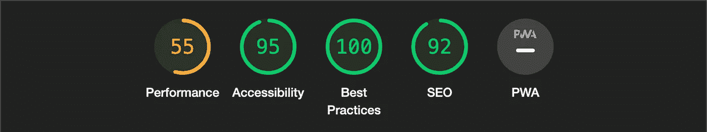
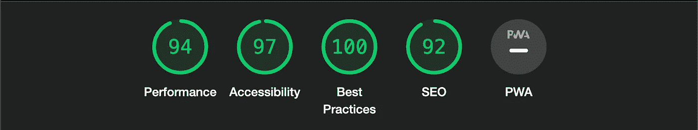
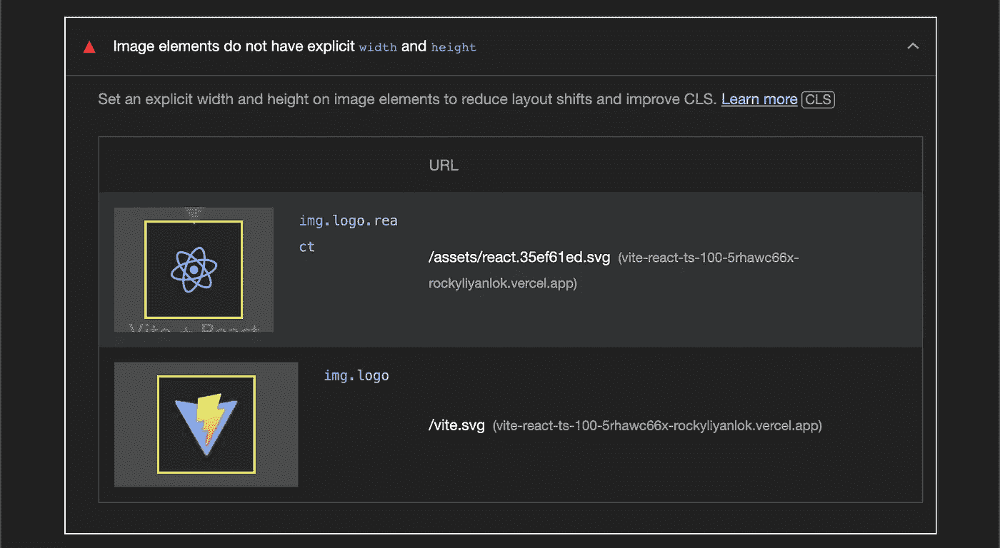
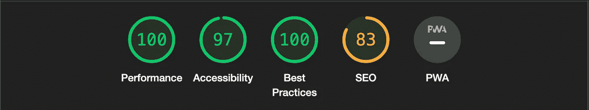
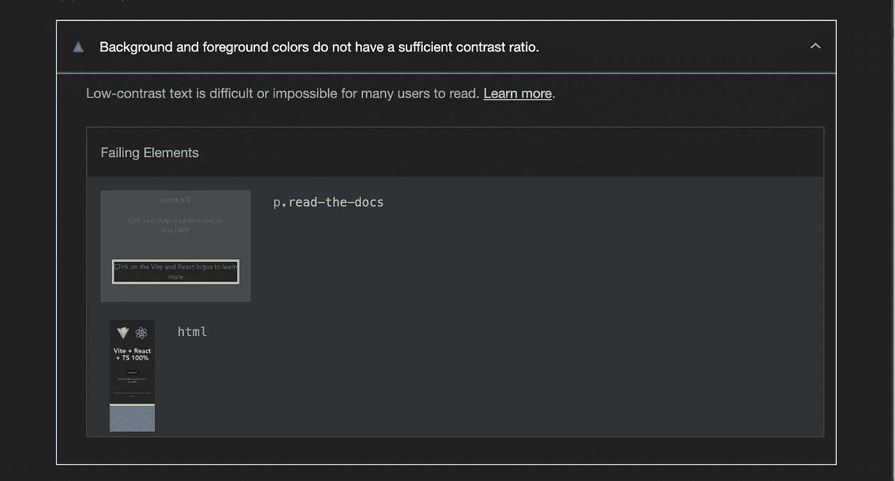
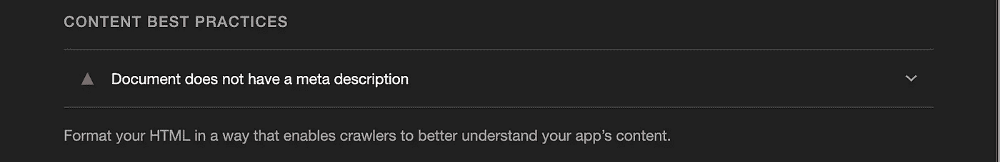
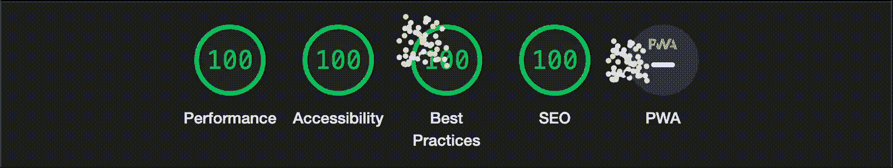
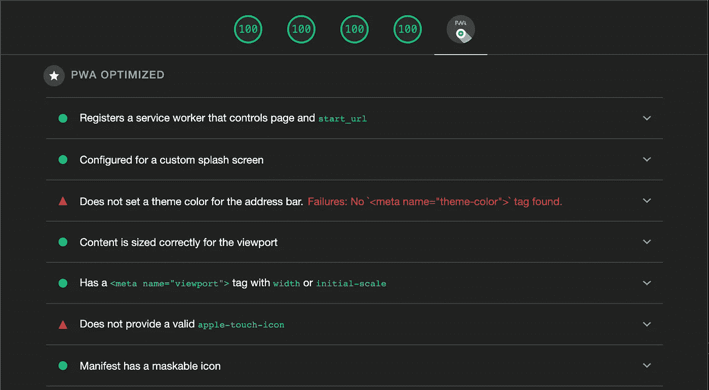

# 用 Vite 创建一个完美的 React 项目

> 原文：<https://javascript.plainenglish.io/create-a-perfect-react-project-with-vite-30298b005333?source=collection_archive---------2----------------------->

## 如何使用 Vite 建立一个 React 项目以获得 100%的 Lighthouse 分数


# 介绍

作为 Next.js 的忠实粉丝，我创建了一个存储库，用 Next.js 框架作为我其他项目的样板，实现了 100%的 lighthouse 评分。整个旅程被记录在一个中型故事中。如果你感兴趣的话，可以随意看看这个帖子。

[](/how-to-set-up-next-js-with-typescript-to-get-a-100-score-in-google-lighthouse-and-vercel-analytics-6f97501a91c7) [## 如何用 TypeScript 设置 Next.js 在 Google Lighthouse 和 Vercel Analytics 中获得 100 分

### 建立一个 PWA 来获得 Google Lighthouse、Vercel Analytics 和 Webpagetest.org 安全公司的许可

javascript.plainenglish.io](/how-to-set-up-next-js-with-typescript-to-get-a-100-score-in-google-lighthouse-and-vercel-analytics-6f97501a91c7) 

在玩了几次 Vite 之后，我发现如果我用 Vite 和 react-ts 模板创建一个项目来获得 100%的 lighthouse 分数，那也会很有趣。

在这个故事中，我们将逐步配置一个 Vite react-ts 项目，以便在 Google Lighthouse 审计中获得满分。

# 初始基准

让我们看看它在 Google Lighthouse 中的表现，如果我们只是使用 Vite 搭建项目，而不做任何更改。

## 搭建一个 Vite 应用

我们首先用命令行创建一个新的 Vite 项目。

```
# yarn create vite vite-react-ts-100 –template react-ts
```

Vite 在大约 1.5 秒内搭建一个新项目。包括用 yarn install 命令进行包安装，我们在本地机器上运行一个新项目大约需要 4 秒。

## 运行灯塔审计

一旦项目搭建完成，我们就可以用

```
# yarn dev
```



**Figure 1** Lighthouse report for the fresh project in development mode

您会注意到性能分数相当低，这提醒了我总是在产品构建上运行 lighthouse 审计。

```
# yarn build && yarn preview
```



**Figure 2** Lighthouse report for the fresh project in a production build

报告中整体分数都是绿色的。然而，我们的目标是在所有类别中都达到 100 分。

# 提高绩效得分

现在让我们从性能类别得分开始。根据诊断，消息`Image elements do not have explicit width and height`表明我们可以通过添加宽度和高度属性来解决这个问题。



**Figure 3** `Image elements do not have explicit width and height`

./src/App.tsx



**Figure 4** Lighthouse report after improving the performance score

很高兴看到绩效圈上的 100 分和所有绩效指标都是绿色的。

# 提高可访问性得分

可访问性类别分数表明所有用户能否有效地访问内容和浏览您的网站。请注意，只有可访问性问题的一个子集可以被自动检测，所以也鼓励手动测试。



**Figure 5** Background and foreground colors do not have a sufficient contrast ratio

前景和背景之间的颜色对比是可访问性的度量之一。

./src/App.css


**Figure 6** Lighthouse report after improving the accessibility score

# 提高 SEO 分数

SEO 指标显示了网站或应用程序被搜索引擎抓取并显示在搜索结果中的效果。



**Figure 7** Document does not have a meta description

接下来，我们需要为我们的 SEO 分数向文档`<head>`添加元描述。

./index.html



**Figure 8** Lighthouse report after improving the SEO score

正如你所看到的，经过上述曲调，该项目可以获得所有 100 点和绿色的灯塔报告。

# 设置 PWA

启用所有渐进式 Web 应用程序标准后，用户将能够将应用程序添加到他们的主屏幕上，并且可以离线或在低质量网络上访问。

`vite-plugin-pwa`包是 Vite 项目的零配置 PWA 插件。

[](https://github.com/antfu/vite-plugin-pwa) [## GitHub-ant fu/Vite-plugin-pwa:Vite 的零配置 PWA

### Vite 的零配置 PWA。在 GitHub 上创建一个帐户，为 antfu/vite-plugin-pwa 开发做贡献。

github.com](https://github.com/antfu/vite-plugin-pwa) 

安装插件，在`vite.config.ts`中添加插件。

```
# yarn add -D vite-plugin-pwa
```

./vite.config.ts

这不是为 Vite 项目设置 PWA 的唯一步骤。我们需要[为应用程序生成图标](https://favicon.io/favicon-converter/)，并将它们添加到`public`文件夹中。

```
node_modules/
public/
 ├── **android-chrome-192x192.png**
 ├── **android-chrome-512x512.png**
 ├── **apple-touch-icon.png**
 ├── **favicon-16x16.png**
 ├── **favicon-32x32.png**
 ├── **favicon.ico**
 └── vite.svg
src/
...
```

然而，我们不能仅仅将清单文件`site.webmanifest`复制到公共文件夹。这个`vite-plugin-pwa`包将生成一个`manifest.webmanifest`并在应用程序根中服务。更改清单文件的方法是通过`vite.config.ts`中的`vite-plugin-pwa`包自定义清单。

./vite.config.ts



**Figure 9** No `<meta name=”theme-color”>` tag found & valid `apple-touch-icon`

我们快到了。是时候在 head 标签中为 PWA 添加一些 meta 标签了。
因为`apple-touch-icon`已经在上一步生成。让我们为图标添加 meta 标签。

./index.html


**Figure 10** Lighthouse report 100% PWA

恭喜你！干得好！

这就是我们如何改进 Vite React TS 项目模板，使其成为您的高性能样板。

# 结论

Vite 是下一代前端开发工具，旨在为开发者提供更好的开发体验。不仅可以生成 React 应用，Vite 还可以支持 Vue 应用和普通 JS 应用。你会在 [Vite 网站](https://vitejs.dev/)上发现更多优秀的功能。

上面的源代码被提交到 GitHub 存储库中，并部署到 Vercel[vite-react-ts-100](https://vite-react-ts-100.vercel.app/)。

请随意在下面的链接中派生或导入存储库。

[](https://github.com/rockyliyanlok/vite-react-ts-100) [## GitHub-rockyliyanlok/vite-react-ts-100:构建一个 PWA，在 Google Lighthouse 中实现 100%用…

### 此时您不能执行该操作。您已使用另一个标签页或窗口登录。您已在另一个选项卡中注销，或者…

github.com](https://github.com/rockyliyanlok/vite-react-ts-100) 

编码快乐！💻

*更多内容请看*[***plain English . io***](https://plainenglish.io/)*。报名参加我们的* [***免费周报***](http://newsletter.plainenglish.io/) *。关注我们关于*[***Twitter***](https://twitter.com/inPlainEngHQ)[***LinkedIn***](https://www.linkedin.com/company/inplainenglish/)*[***YouTube***](https://www.youtube.com/channel/UCtipWUghju290NWcn8jhyAw)*[***不和***](https://discord.gg/GtDtUAvyhW) *。***