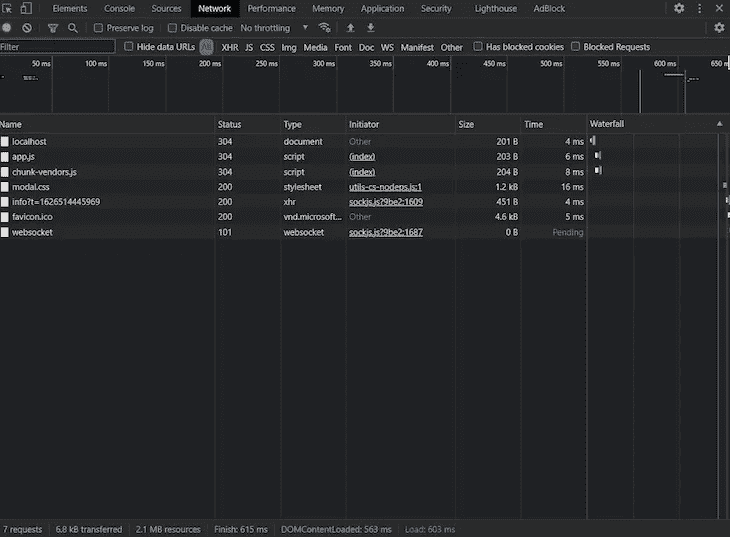

# 在 Vue.js 中创建一个高性能的虚拟滚动列表

> 原文：<https://javascript.plainenglish.io/create-a-performant-virtual-scrolling-list-in-vue-js-36c6a5f55eeb?source=collection_archive---------4----------------------->

## 使用虚拟滚动列表提高滚动效率，提高页面加载速度，防止 web 应用程序不流畅。


Source: Digital Ocean

在 DOM 上单独呈现项目会给用户带来很大的性能延迟，尤其是当他们滚动浏览大型列表时。为了使滚动更有效，我们应该使用虚拟滚动列表，这可以提高页面加载速度，防止 web 应用程序不连贯。

虚拟滚动列表类似于标准滚动列表，但是，在任何时候都只呈现用户当前视图中的数据。当用户向下滚动页面时，新项目随着旧项目的移除而呈现。

在本文中，我们将探索`[vue-virtual-scroll-list](https://github.com/tangbc/vue-virtual-scroll-list)`，这是一个在 Vue.js 中创建虚拟滚动列表的神奇库。让我们开始吧！

# `vue-virtual-scroll-list`中的渲染内容

`vue-virtual-scroll-list`库有两种主要的方法将网页内容呈现到列表中，`item`模式和`v-for`模式。

`item`模式非常适合呈现静态内容。一旦内容被附加到 DOM 上，`item`模式就会释放正在使用的内存。如果您更改数据，您将需要调用`forceRender()`并再次开始这个过程。

要渲染动态内容，更好的选择是`v-for`模式。在`v-for`模式下，提供给列表的数据在存储器内被引用。因此，当数据改变时，列表项被重新呈现，并且上下文被保持。

让我们通过比较使用和不使用虚拟滚动列表时`item`模式的性能来更仔细地了解一下`vue-virtual-scroll-list`库。

首先，我们将建立一个新的 Vue.js 项目并安装`vue-virtual-scroll-list`。然后，我们将使用随机生成的数据创建一个列表。最后，我们将在有和没有虚拟滚动的情况下呈现我们的列表，比较每种情况的性能。

# 设置 Vue.js 项目

首先，确保你的机器上安装了 Vue.js。使用以下命令创建一个新的 Vue.js 项目:

```
vue create virtual-scroll-demo
```

一旦项目建立，安装`vue-virtual-scroll-list`库:

```
npm install vue-virtual-scroll-list --save
```

现在，我们的项目有以下结构:


# 生成列表

现在我们已经为我们的项目建立了基础，让我们开始创建我们两个列表的基础。

导航到您的`/src`文件夹并创建一个名为`data.js`的文件。让我们给`data.js`添加下面这个生成随机数据的简单函数:

```
let idCounter = 0;export function getData(count) {
  const data = [];
  for (let index = 0; index < count; index++) {
    data.push({
      id: String(idCounter++),
      text: Math.random()
        .toString(16)
        .substr(10),
    });
  }
  return data;
}
```

接下来，我们将创建一个名为`Item.vue`的新文件，这是我们将渲染的`item`组件。在`Item.vue`中，我们将包括下面的代码块，它为我们的列表创建了一个模板和样式，以及检索和显示上面生成的数据的道具:

```
<template>
  <div class="item">
    <div class="id">{{ source.id }} - {{ source.text }}</div>
  </div>
</template><script>
export default {
  name: 'item',
  props: {
    source: {
      type: Object,
      default() {
        return {}
      }
    }
  }
}
</script><style scoped>
.item {
  display: flex;
  flex-direction: column;
  border-bottom: 1px solid lightgrey;
  padding: 1em;
}
</style>
```

# 呈现没有虚拟滚动的列表

现在我们已经创建了一个列表，让我们不使用`vue-virtual-scroll-list`在 DOM 上呈现列表项。在`App.vue`增加如下代码:

```
<template>
  <div id="app">
    <div class="wrapper">
    <div class="list">
      <p  v-for="item in items" :key="item">
    {{item}}
  </p>
      </div> </div>
  </div>
</template><script>
import Item from './Item'
import { getData } from './data'export default {
  name: 'App',
  data() {
    return {
      item: Item,
      items: getData(100000)
    }
  }
}
</script><style>
#app {
  text-align: center;
  color: #2c3e50;
  margin-top: 1em;
  padding: 1em;
}
.list {
  border: 2px solid red;
  border-radius: 3px;
}
</style>
```

在上面的代码块中，我们向 DOM 中呈现了 100，000 个项目。让我们看看我们的列表在有这么多数据和没有虚拟滚动的情况下会有什么表现。使用以下 npm 命令启动项目:

```
npm run serve
```

我们将获得以下输出:


当我们检查浏览器中的`inspect`元素时，我们会看到所有的 HTML 元素都已经被添加到了[浏览器 DOM](https://blog.logrocket.com/how-the-virtual-dom-works-in-vue-js/) 中，如下图所示:


在浏览器 DOM 中添加元素会增加 DOM 的大小。因此，浏览器将需要更多的时间来将每个项目附加到 DOM 中，这可能会导致显著的性能滞后。让我们仔细看看浏览器将我们的列表附加到 DOM 所花的时间:


事件`DOMContentLoaded`在 22 秒后触发，这意味着在显示最终渲染列表之前，浏览器选项卡需要 22 秒来加载。同样，如下图所示，渲染我们的列表消耗了 128 MB 内存:


# 使用虚拟滚动呈现列表

现在，让我们尝试使用虚拟滚动来呈现我们的列表。导入`main.js`中的`vue-virtual-scroll-list`包:

```
import Vue from "vue";
import App from "./App.vue";Vue.config.productionTip = false;import VirtualList from "vue-virtual-scroll-list";Vue.component("virtual-list", VirtualList);
new Vue({
  render: (h) => h(App),
}).$mount("#app");
```

接下来，我们将渲染`virtual-list`组件中项目的数据。让我们将`App.js`文件更改为如下代码块:

```
<template>
  <div id="app">
    <div class="wrapper">
 <virtual-list
        class="list"
        style="height: 360px; overflow-y: auto;"
        :data-key="'id'"
        :data-sources="items"
        :data-component="item"
        :estimate-size="50"
      />
    </div>
  </div>
</template><script>
import Item from './Item'
import { getData } from './data'export default {
  name: 'App',
  data() {
    return {
      item: Item,
      items: getData(100000)
    }
  }
}
</script><style>
#app {
  text-align: center;
  color: #2c3e50;
  margin-top: 1em;
  padding: 1em;
}
.list {
  border: 2px solid red;
  border-radius: 3px;
}
</style>
```

请注意，虚拟列表需要数据道具来渲染项目。运行上面的代码块将给出以下输出:


我们可以在下图中看到，一次只渲染了几个项目。当用户向下滚动时，会呈现较新的项目:


现在，我们的 DOM 树比以前小多了！当我们渲染我们的虚拟滚动列表时，`DOMContentLoaded`会比以前发射得更快！



如上图所示，该事件仅在 563 毫秒内触发。同样，我们的操作只消耗了 79 MB 的内存，这比我们不使用虚拟卷轴时少得多。


# 结论

现在你知道如何使用`vue-virtual-scroll-list`库在 Vue.js 中创建虚拟滚动列表了！

在本教程中，我们创建了一个使用随机生成数据的静态列表，然后在我们的 Vue.js 应用程序中实现了它，比较了使用和不使用虚拟滚动时的性能。

虚拟滚动列表具有很高的性能，尤其是当你的网页上有一个很大的项目列表时。使用虚拟滚动列表可以提高页面加载速度，改善整体用户体验。

*更多内容尽在* [***说白了. io***](https://plainenglish.io/) *。报名参加我们的* [***免费周报***](http://newsletter.plainenglish.io/) *。关注我们关于* [***推特***](https://twitter.com/inPlainEngHQ) ，[***LinkedIn***](https://www.linkedin.com/company/inplainenglish/)*，*[***YouTube***](https://www.youtube.com/channel/UCtipWUghju290NWcn8jhyAw)*，* [***不和***](https://discord.gg/GtDtUAvyhW) *。对增长黑客感兴趣？检查* [***电路***](https://circuit.ooo/) *。*