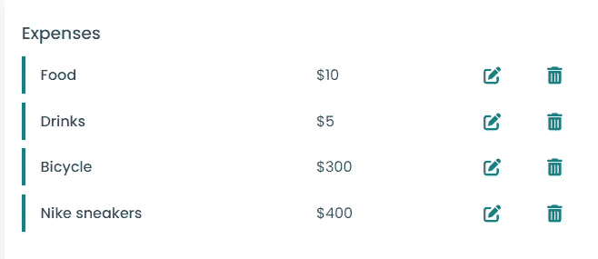
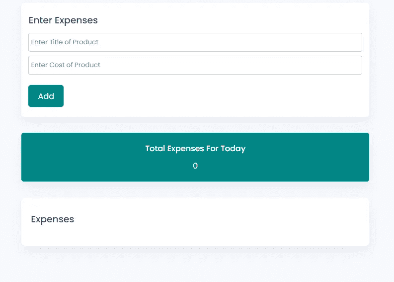
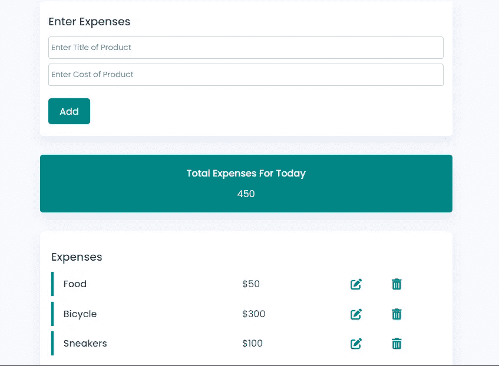

# 使用 JavaScript 创建个人费用跟踪器

> 原文：<https://javascript.plainenglish.io/create-a-personal-expense-tracker-using-javascript-2bf8d99cbdbd?source=collection_archive---------3----------------------->

Image display

一个费用跟踪应用程序可以让你跟踪和分类你的支出。通过跟踪收据、账单和其他支出记录你的日常开销，你的财务健康会得到改善。

本文将提供如何使用 HTML5、CSS3 和 JavaScript 构建笔记应用程序的信息。本文面向熟悉 HTML5、CSS3 和 JavaScript 基础知识的人。本文不包括对 HTML5、CSS3 和 JavaScript 的详细阐述，但会提供源代码。

# 让我们开始吧

首先，我们需要使用 Html5 和 Css3 创建 UI。

**HTML 的示例代码**

**CSS 的示例代码**

**这是实现 HTML 和 CSS 后的样子**

Display of Implementation of the html and Css code above

**现在是 JavaScript 的示例代码**

**最后，**这是添加 JavaScript 后的样子。

*点击编辑按钮将允许您编辑费用，点击删除按钮将删除该特定费用。*

Display of Implementation of the html, Css and JavaScript code above

**恭喜你，**你做到了。你建了一个个人支出追踪器。

*更多内容看* [***说白了就是***](https://plainenglish.io/) *。报名参加我们的* [***免费周报***](http://newsletter.plainenglish.io/) *。关注我们* [***推特***](https://twitter.com/inPlainEngHQ) ，[***LinkedIn***](https://www.linkedin.com/company/inplainenglish/)*，*[***YouTube***](https://www.youtube.com/channel/UCtipWUghju290NWcn8jhyAw)*，*[*不和*](https://discord.gg/GtDtUAvyhW) *。*