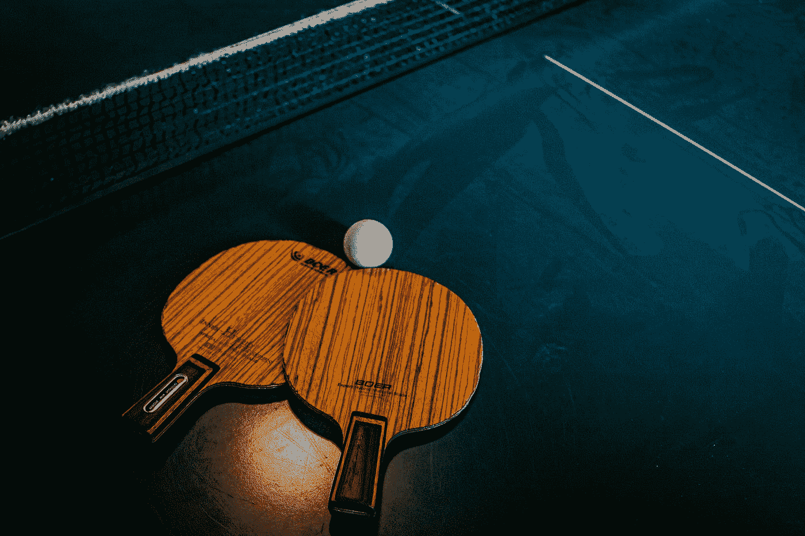

# 使用 JavaScript 创建一个乒乓球游戏

> 原文：<https://javascript.plainenglish.io/create-a-ping-pong-game-using-javascript-2688f83785d5?source=collection_archive---------1----------------------->

## 学习如何用 JavaScript 和 HTML 制作乒乓球游戏

Photo by [Steven Skerritt](https://unsplash.com/@keepsakes_and_daydreams?utm_source=medium&utm_medium=referral) on [Unsplash](https://unsplash.com?utm_source=medium&utm_medium=referral)

Pong 是一款双人乒乓球主题游戏。它包括一个移动的球和两个桨。球员上下移动球拍，以确保球击中它，并将其送回另一名球员的方向。如果一个人没接到球，另一个人就得一分。第一个达到获胜所需分数的人将赢得比赛。

我们使用 HTML5 canvas 和 JavaScript 来实现这个游戏。我们来看看游戏逻辑是如何运作的。

1.  我们将部署一个初速度和方向都在中心的球。
2.  我们用键盘上的键上下移动桨。 **W** & **S** 供左边玩家分别上下移动。**向上**&向下方向键为右边的玩家分别上下移动。
3.  当球接触到球拍时，球的方向会改变，速度会增加一点。
4.  当球击中时，画布的上下边界将反映球。
5.  一旦一名球员错过了球，另一名球员的得分增加一。检查玩家是否达到获胜所需的分数，如果达到，则玩家获胜，游戏结束。
6.  游戏继续进行，直到玩家获胜。

# 使用的技术

*   超文本标记语言
*   半铸钢ˌ钢性铸铁(Cast Semi-Steel)
*   Java Script 语言

# 源代码解释

让我们仔细阅读代码，更好地理解逻辑，看看如何构建乒乓。

1.  首先，我们需要创建一个带有画布的 HTML 页面来运行游戏。

这里我们有一个画布来呈现游戏，两个段落标签来显示分数。小型设备类的障碍是禁用游戏并在小屏幕上显示消息，因为没有键盘控制。

CSS 文件 ***style.css*** 和 JavaScript 文件 ***script.js*** 链接到这个 HTML 文件。

2.现在我们必须给我们的页面添加一些样式，使它看起来更漂亮。页面的外观和感觉也是一个重要的部分。

风格很简单，我们把画布放在中间，分数显示在黑板的两边。现在，我们也有一个霓虹灯效果，我们的游戏使用了框阴影。

3.现在是使用 JavaScript 构建游戏逻辑的时候了。我们必须初始化画布、球和两个玩家。

我们已经创建了画布，并将获胜者存储在会话存储中，到目前为止，获胜者被设置为 none。

球、左边的球员*(左拍)*和右边的球员*(右拍)*被初始化为必要的属性，如高度、宽度、x & y 位置、颜色、球员姓名、速度等。球会有 x 和 y 的速度。

4.现在我们必须创建一个游戏状态，并处理按键和按键状态。

我们将在游戏对象中跟踪每个玩家的分数。它还包含获胜所需的分数、触发球速度增加的命中数等。

我们有一个按键状态来记录一次按下了哪些按键。事件监听器设置为更新 ***键上的按键状态，按下*** 和 ***键上的*** 。

5.现在我们必须编写函数来将球和球员绘制到画布上*。*

球员和球是根据对象的属性绘制的。定义了一个函数来清除画布并将所有对象绘制到屏幕上。

6.我们必须处理调整窗口大小和更新大小的值。当我们调整屏幕大小时，画布需要调整大小，画布中的对象必须重新定位以匹配新的画布大小。

每次我们调整屏幕大小时，以及在程序开始时，都会调用 resize 处理函数来组织画布和对象的位置。当屏幕尺寸低于 ***560px*** 时，它还会禁用带有覆盖的游戏。

7.现在，当按下相应的键时，我们必须更新拨片的位置。

这里我们根据按键和画布的边界来更新玩家的位置。

8.一些实用函数在每个玩家得分后重置球的位置，一个函数设置玩家的得分并在页面上显示，一个函数在游戏结束后重置游戏。

重置球时，我会改变球的方向，因为得到一分的人会得到下一击。设置分数的函数检查是否满足所有条件来更新分数。它将球重置到中心，并更新页面上显示的分数。重置游戏功能会重置所有的分数，并将物体的所有状态更新到默认位置，本质上是重置游戏。

9.是时候写一个函数来检查是否有人赢了

游戏结束功能检查是否有人获胜，并将获胜者保存在会话存储器中。页面被重定向到***winner.html***，后者从会话存储器中取出获胜者并显示出来。

10.现在我们要实现球的碰撞，方向的改变，速度的增加等等。

当球接触到画布的顶部和底部时，更新状态的函数会将球的 Y 速度改变到相反的方向。如果它接触到拨片，X 速度会改变，名为***collision time lag()***的函数被调用。碰撞时间使对象的碰撞停止 1 秒钟，以防止任何类型的碰撞错误(如碰撞时多次更新状态)。在停用期间，不会检测到碰撞(在此期间也没有碰撞的机会)

调用设置分数和检查游戏是否结束的功能，以确保游戏正确更新。当我们超过我们在对象中指定的命中次数以增加速度时，速度会增加。

最重要的是，球的位置通过增加速度来改变。

11.现在让我们实现运行游戏的主游戏循环。

这个游戏循环将更新按键，更新状态，并根据我们的计算机资源以每秒大约 60 次的速度持续绘制所有内容。***request animation frame***是用 JavaScript 制作动画的一种高效方式。随着我们的游戏循环运行和状态更新，我们的游戏将运行顺利。

***瞧！我们制作了一款乒乓球游戏*** 🥳

你可以在我的 [**Github 资源库**](https://github.com/ajmalmohad/ping-pong) **找到游戏的全部代码。**您可以随意使用它，享受乐趣，调整事物并添加新功能。

## 想要连接吗？

在 Twitter 上关注我。

*更多内容看* [***说白了。报名参加我们的***](https://plainenglish.io/) **[***免费每周简讯***](http://newsletter.plainenglish.io/) *。关注我们关于* [***推特***](https://twitter.com/inPlainEngHQ) ，[***LinkedIn***](https://www.linkedin.com/company/inplainenglish/)*，*[***YouTube***](https://www.youtube.com/channel/UCtipWUghju290NWcn8jhyAw)*，* [***不和***](https://discord.gg/GtDtUAvyhW) *。***