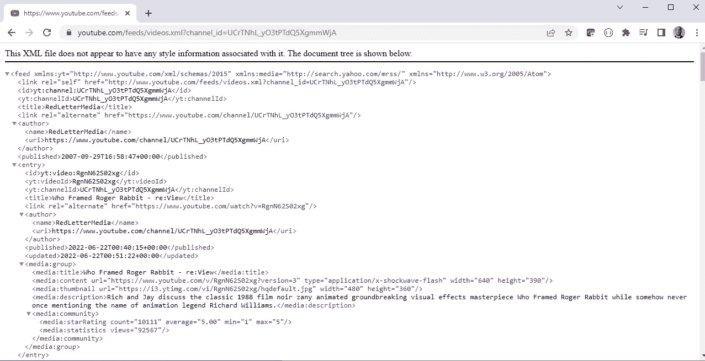
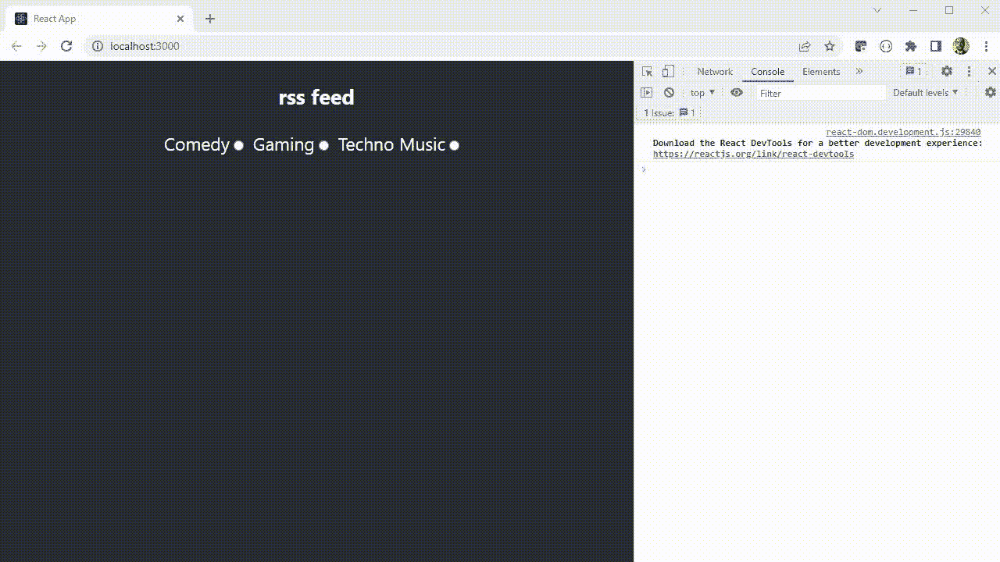

# 为 YouTube 源创建一个 React RSS 源应用程序

> 原文：<https://javascript.plainenglish.io/create-a-react-rss-feed-app-for-youtube-feeds-69c8cd2dbd46?source=collection_archive---------3----------------------->

## 使用 create-react-app 创建您自己的个人 YouTube 源。


Photo by [Rux Centea](https://unsplash.com/@visualize?utm_source=medium&utm_medium=referral) on [Unsplash](https://unsplash.com?utm_source=medium&utm_medium=referral)

## 问题是

拥有数百个 YouTube 频道订阅，很难在你的每日提要中找到新的更长的 see，从而很难找到特定类别的新视频。

## 解决方案

本文将介绍如何创建一个应用程序，该应用程序将有多组 YouTube 频道提要，这些提要按类别分开，这样您就可以利用 YouTube RSS(真正简单的聚合)提要来查看每个类别中的最新视频。

## 先决条件

在本文的最后，会有一个到 GitHub 存储库的链接，其中包含完整的应用程序。如果你想自己创建应用程序，你需要在你的机器上安装一些应用程序。

在你的机器上安装【git Git Bash 很好。使用 Git Bash，您可以为您的终端获得一个 Linux shell。这篇文章是用以下版本的`git`写的。

```
$ git --version ## 2.34.1.windows.1
```

我在撰写本文时使用的目标机器运行在 Windows 上，但是您应该能够在任何操作系统上安装这些应用程序。你可以在这里下载安装`git`、[。](https://git-scm.com/downloads)

对于 JavaScript 开发，您需要安装了`npm`和`npx`的 Node.js。对于`npm`和`npx`，您将需要一个高于 6.0.0 主版本。可以安装最新版本的 Node.js，它也会安装`npm`和`npx`，这里的[是](https://nodejs.org/en/download/)。本文有以下版本:

```
$ node --version ## v16.13.1
$ npm --version  ## v8.1.2
$ npx --version  ## v8.1.2
```

一旦安装了`npm`，您将希望使用全局安装命令安装`create-react-app`:

```
$ npm install -g create-react-app  ## allows you to use CRA cli
$ create-react-app --version       ## v5.0.1
```

如果你想探索更多的`create-react-app`功能，这个应用有很棒的文档，[这里](https://create-react-app.dev/)。

您应该使用的另一个工具是 IDE。可视化代码很有用，并且有大量的插件，你可以为 JavaScript 和 React 开发安装这些插件。如果你对使用可视化代码感兴趣，你可以从[这里](https://code.visualstudio.com/download)下载安装。

# 入门指南

创建我们的应用程序有五个步骤:首先，生成样板应用程序。其次，创建我们将用来显示数据的 react 组件。第三，我们将定位我们的数据源。第四，我们安装并设置我们的应用程序来解释数据。最后，我们在应用程序中设置调用来提取数据并在应用程序中显示。

# 生成应用程序

创建应用程序的第一步是生成锅炉板。进入您保存项目存储库的目录，在您的终端中，生成您的新 CRA。

```
$ create-react-app rss-feed-medium-app
$ cd rss-feed-medium-app
$ npm start
```

这将创建并安装所有默认依赖项，可能需要几分钟时间。因为所有的东西都是用这个命令安装的，所以你可以在这个命令运行完之后马上运行这个应用程序，并且看到 CRA 程序的默认内容。


Boiler plate CRA app

## 样板文件清理

锅炉板是一个好的开始，但是我们不需要代码中的大部分内容。所以我们可以通过`App.css`、`App.js`和`App.test.js`，清除一堆代码。由于这种编码几乎完全是删除代码，而不是编写代码片段，`git` diff 显示了所需的更新。

在 diff 图像的左边，读取的代码是删除的代码，右边绿色部分是任何添加的代码(还不多)。首先，最大的变化是在`App.css`文件中。


App.css cleanup diff.

然后，删除`App.js`文件中`App`组件的代码。


App.js cleanup diff.

最后，更新`App.test.js`以便在运行时测试通过。


App.test.js cleanup diff.

您也可以删除`src/logo.svg`，因为它已从应用程序中删除。

# 创建视图组件

现在我们可以为 RSS 提要创建显示组件了。这些组件将在我们已经知道提要的数据形状的情况下被创建(关于数据的更多细节将会出现)。

## 安装组件目录

我们将创建三个视图组件:一个用于提要的每个条目的`Entry`组件，一个用于显示 RSS 提要列表的`EntryList`组件，以及一个用于选择我们希望在 RSS 提要中显示的频道类型的`CategorySelector`组件。

首先在现有的`src`目录下创建一个`components`目录。然后在`components`下为每个组件添加一个目录:`CategorySelector`、`Entry`、`EntryList`。现在在每个目录中，创建两个与目录名匹配的文件:扩展名`.js`和`.test.js`。对于`Entry`和`EntryList`组件，还要添加一个`.css`文件。一旦完成，`src`目录将如下所示:


New files for components

## 类别选择器组件

我们将创建的第一个组件(经过一些测试)是`CategorySelector`。下面是 GitHub 组件及其测试的要点。

CategorySelector

为了检查组件逻辑，它接收一个列表`categories`，稍后我们将根据我们希望在提要中看到的频道类型创建这个列表。对于每个类别，它都会创建一个单选按钮。当按钮被选中时，它将该选择发送给一个`onSelect`函数，让父组件知道应该在提要中显示一组新的类别。

CSS 文件非常紧凑，只有几个属性:

```
/** CategorySelector.css */
.CategorySelector-root input {
    margin-bottom: 12px;
    margin-right: 12px;
}
```

## RSS 条目组件

现在我们想要为单独的提要条目创建`Entry`组件。该组件将有一些基本的数据点，有一个缩略图(由 URL 提供)、一个 JSON 日期字符串和一个在新的浏览器选项卡中打开视频的链接。

Entry 组件的样式表拥有应用程序中的大多数样式，因为它排列了数据点和图像。这是风格的要点。

最终，每个 RSS 条目都会像这样出现(减去 lorem ipsum 文本，来自[hipsum.co](https://hipsum.co/))。


RSS Entry display.

## EntryList 组件

最后一个组件是显示所有 RSS 条目的`EntryList`组件。它的全部目的是接受一个 RSS 条目列表，并迭代显示它们。

因为`EntryList`的目的是迭代 RSS 数据，所以它没有 CSS 文件。

## 向应用程序添加组件

在开始提取和设置数据之前，我们做的最后一步是将组件添加到`App`组件中。

您可以在要点中看到，我们添加了`useState`来维护一个 RSS 条目对象列表和另一个类别字符串列表。

现在有一个带有空依赖数组的`useEffect`设置。它将用于生成基于静态数据的类别列表，该列表将与 RSS 提要 URL 列表一起添加。类别列表将被传递到`CategorySelector`组件`categories`道具中。

传递给`CategorySelector`、`onSelect`道具的处理函数被设置为最终为`entries`道具加载数据，该道具为`EntryList`提供数据。

# 设置数据源

接下来的几个步骤将是建立我们的数据源，设置一些静态数据，并探索如何处理数据。

## YouTube RSS 源 URL

最近，YouTube 使得寻找频道 RSS 源变得有些混乱。为了找到频道源 URL，您需要转到该频道的主页。然后，在 Chrome 浏览器中，右键单击并选择“查看页面源代码”(在 Windows 上，您也可以单击 Ctrl + U)。

现在，一旦页面源代码打开，您就可以进行“查找”，并在页面中搜索 RSS 提要 URL。为此，打开浏览器的控件(右上角的三个点)并单击“查找”，或者在 windows 上按 Ctrl + F。搜索`title="RSS"`，按回车键。您将被带到一个带有该频道 RSS 源元数据的`link`标签。


Gathering YouTube RSS feed.

抓取`href`属性值并复制。如果您将它粘贴到一个新的浏览器选项卡中，您可以看到将返回的 XML 有效负载。



XML RSS Feed from YouTube

查看浏览器中的有效负载，可以看到有很多元数据可以使用。总共有 15 个入口部分。这是将返回的最大数量，是来自该渠道的 15 个最新版本。

## 将提要加载到应用程序中

现在我们可以在`src`目录中创建一个`lib.js`文件。在这个库中，将会有一个`fetchFeed`函数，目前它没有参数，并且硬编码了频道 RSS 提要 URL。

我们将使用`fetch`函数进行 API 调用，因为这个请求是一个简单的 GET。除了提要 URL，我们还需要使用 CORS 代理。这是因为 YouTube 不允许来自`localhost`的请求。

获取数据后，调用`response`上的`text()`来获取 XML 的字符串。目前，所有的回调都只是将内容记录到控制台，以检查浏览器中发生了什么。

```
const corsProxy = "https://cors.eu.org/";
const fetchFeed = () => {
  const url = "https://www.rss-feed-url.com";
  fetch(corsProxy + url)
    .then((res) => res.text()
      .then((data) => console.info("data", data))
      .catch((err) => console.warn("data err", err))
      .finally(() => console.info("data complete")))
    .catch((err) => console.warn("res err", err))
    .finally(() => console.info("res complete"));
};export { fetchFeed };
```

为了测试这个函数，我们可以将它添加到`App`组件的`useEffect`中，而不在依赖数组中添加任何内容。这里是调用应用中的`fetchFeed()`功能后的浏览器控制台。


Console of printed XML payload

# 升级应用程序

为了处理来自提要的 XML，我们需要配置项目来使用一些新的包。

## 安装新的依赖项

首先，我们将安装所需的依赖项，列表如下:

```
$ npm i xml2js             ## for processing the XML to JSON
$ npm i buffer             ## xml2js dependency
$ npm i process            ## xml2js dependency
$ npm i stream-browserify  ## xml2js dependency
$ npm i timers-browserify  ## xml2js dependency
$ npm i react-app-rewired  ## for webpack configuration overriding
```

`xml2js`包用于将 XML 转换成 JSON，为了让`xml2js`运行，需要下面四个包。最后一个依赖项`react-app-rewired`用于配置`webpack`，这个工具将我们的 JavaScript 编译成一个文件，放在`create-react-app`中，而不弹出配置。

## 重新连接应用程序

现在我们可以设置覆盖文件了。

```
// config-overrides.js
const { ProvidePlugin } = require("webpack");module.exports = function override(config) {
  config.plugins.push(new ProvidePlugin({
    Buffer: ["buffer", "Buffer"]
  }));
  config.plugins.push(new ProvidePlugin({
    process: "process/browser"
  }));
  config.resolve.fallback = {
    buffer: require.resolve("buffer/"),
    stream: require.resolve("stream-browserify"),
    timers: require.resolve("timers-browserify"),
  };
  return config;
};
```

setup react-app-rewired with config-overrides . js
我们还必须更新`package.json`中的`scripts`部分，以进行重新布线。这是变化的样子，原来的`scripts`在左边是红色，新的`scripts`在右边是绿色。


Rewired package diff.

# 提取数据

既然应用程序已经设置为将 XML 作为 JSON 使用，我们就可以更新`fetchFeed`函数了。

## 解析 XML

首先将`xml2js`包中的`parseString`函数导入到`lib.js`文件中。

设置 XML 到 JSON 的处理。该函数接受两个参数:一个 XML 字符串和一个回调函数。回调签名是`function callback(error, result);`。

该错误仅在解析字符串时发生错误时定义，结果是 XML 的 JSON 转换。我们可以看到:

```
import { parseString } from "xml2js"// original fetch() call
  fetch(corsProxy + url)
    .then((res) => res.text()
      .then((data) => console.info("data", data))
      .catch((err) => ...// updated fetch() call
  fetch(corsProxy + url)
    .then((res) => res.text()
      .then((data) => parseString(data, (err, res) => {
        console.warn("err", err);
        console.info("res", res);
      }))
      .catch((err) => ...
```

更新功能运行 App 后，我们可以在浏览器的控制台中看到`result`物体是如何塑造的。探索一下，可以看到所有的 RSS 条目数据都存储在一个数组中，在键`result.feed.entry`下。


RSS converted JSON feed.

我们只需要这个有效负载的一部分，所以我们可以在这里处理数据，并塑造我们希望应用程序如何使用它。该应用程序需要的唯一值是:作者、视频名称、视频链接、发布日期、缩略图链接和唯一 Id。

探索浏览器控制台中的形状以在条目中找到所有这些属性，将向我们展示如何从有效负载中提取数据。我们可以为`parseString`编写一个回调函数来提取所有这些数据。

现在，我们不只是将清理后的数据记录到控制台，而是将这些数据放入应用程序中。我们可以用回调函数来实现。

## 将数据加载到应用程序

首先，我们将创建一个静态的`feeds`对象，用于创建一个`categoryList`，并存储频道提要的 URL。为此，我们将在`src`下创建一个新文件和目录，名为`assets/feeds.js`。这个文件将包含一个对象，一个类别列表作为 URL 字符串数组的键，如下所示:

```
// src/assets/feeds.js
const feeds = {
  "comedy": [
    // channel name here
    "https://www.comedy-channel.com/rss/feed",
  ],
  "gaming": [
    // channel name here
    "https://www.gaming-channel.com/rss/feed",
  ],
  "techno": [
    // channel name here
    "https://www.techno-music-channel.com/rss/feed",
  ],
};export default feeds;
```

然后，将`feeds`对象导入到`lib.js`文件中，并设置一个接受类别名和回调的新函数:`fetchCategroyFeeds`。更新`fetchFeed`函数以接受两个参数；`category`和一个`callback`。

`parseStringCallback`现在也接受一个`callback`参数。此`callback`用于将处理后的进给数据返回给组件。`lib.js`文件将看起来像这个新版本。

在`App.js`文件中，将`feeds`添加到组件中，并使用函数`Object.keys(feeds)`使用 if 创建一个`categoryList`。将类别状态设置为第一个`useEffect`中的`categoryList`。

然后可以更新`handleSelect`函数来使用`fetchCategoryFeeds`，并传入`selectedCategory`实参作为第一个参数，然后传入`setEntries`状态调用作为回调。这将加载检索到的提要作为状态。

此时，您应该根据您在顶部选择的单选按钮拉入数据并显示条目。



## 合并摘要数据

最后一步是在每个类别中设置多个提要。一旦您找到多个提要并提取它们的 RSS 提要，您的`feeds.js`文件将如下所示:

```
// src/assets/feeds.js
const feeds = {
  "comedy": [
    // channel one name here
    "https://www.comedy-one-channel.com/rss/feed",
    // channel two name here
    "https://www.comedy-two-channel.com/rss/feed",
  ],
  "gaming": [
    // channel one name here
    "https://www.gaming-one-channel.com/rss/feed",
    // channel two name here
    "https://www.gaming-two-channel.com/rss/feed",
    // channel three name here
    "https://www.gaming-three-channel.com/rss/feed",
  ],
  "techno": [
    // channel one name here
    "https://www.techno-one-music-channel.com/rss/feed",
    // channel two name here
    "https://www.techno-two-music-channel.com/rss/feed",
  ],
};export default feeds;
```

您可以在`App.js`组件中创建一个合并函数，以便调用多个提要，然后按照发布日期对每个提要中的条目进行排序。您还将使用新的`handleEntriesMerge`方法代替`setEntries`来替换`callback`参数。

```
const handleSelect = (selectedCategory) => {
  setEntries([]);
  fetchCategoryFeeds(selectedCategory, handleEntriesMerge);
}const handleEntriesMerge = (data) => {
  setEntries((prev) => {
    return prev.concat(data).sort((a, b) => {
      const dateA = new Date(a.publishDate);
      const dateB = new Date(b.publishDate);
      return dateA > dateB ? -1 : 1;
    });
  });
}
```

然后在`lib.js`文件中，更新`fetchCategoryFeeds`来遍历所有的提要 URL。

```
const fetchCategoryFeeds = (category, callback) => {
  const { length } = feeds[category];
  for (let idx = 0; idx < length; idx++) {
    fetchFeed(feeds[category][idx], callback);
  }
};
```

## 最终产品

这是每个类别中有多个提要的成品的样子。


Finished Product

这里是 GitHub 上的最终源代码，包含创建应用程序的所有更改。您可以在这里用命令检查确切的版本:

```
$ git clone [https://github.com/cameronDz/rss-feed-medium-app.git](https://github.com/cameronDz/homepage-ui.git)
$ cd rss-feed-medium-app
$ git checkout tags/v1.0.0
$ npm install
$ npm run start
```

## 结论

希望你学到了一些新的东西，这个应用程序作为一个实际的日常工具对你有用。祝你好运，并快乐编码！

*更多内容看* [***说白了。报名参加我们的***](https://plainenglish.io/) **[***免费周报***](http://newsletter.plainenglish.io/) *。关注我们关于*[***Twitter***](https://twitter.com/inPlainEngHQ)*和*[***LinkedIn***](https://www.linkedin.com/company/inplainenglish/)*。查看我们的* [***社区不和谐***](https://discord.gg/GtDtUAvyhW) *加入我们的* [***人才集体***](https://inplainenglish.pallet.com/talent/welcome) *。***