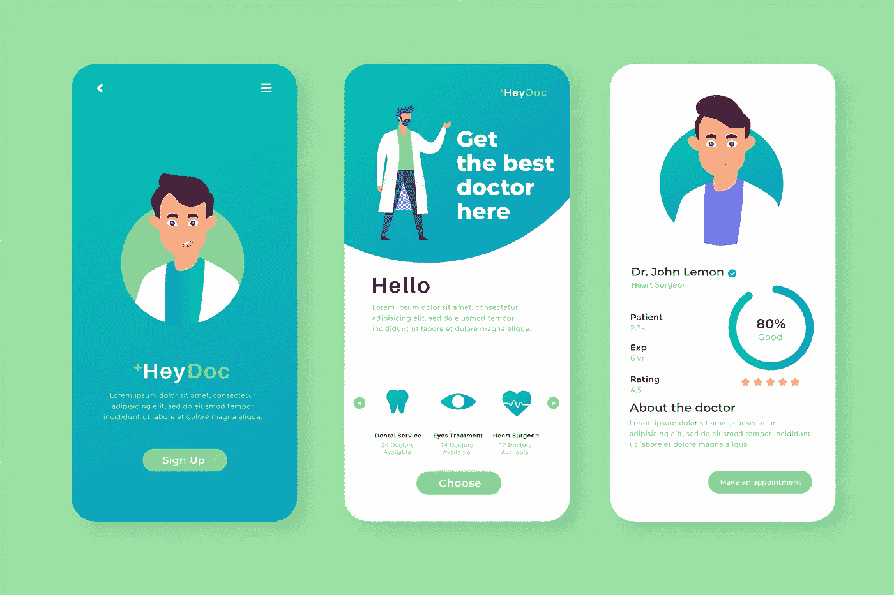
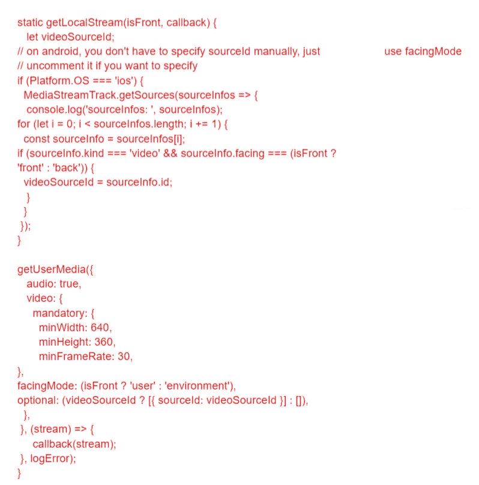
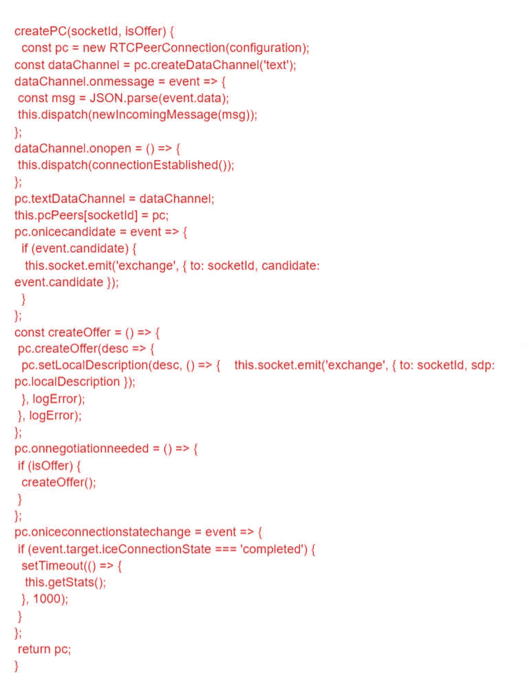
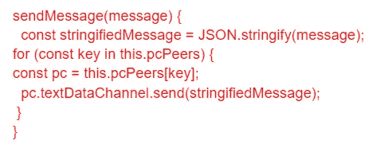
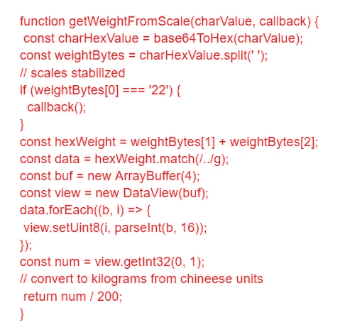

# 使用 React Native 创建实时医疗应用程序

> 原文：<https://javascript.plainenglish.io/create-a-real-time-medical-app-with-react-native-621397fb7909?source=collection_archive---------1----------------------->

## 10 天打造 React 原生医生预约 App

***快速总结:*** *如果你正在寻找用 React Native 构建一个应用，这个初学者教程是一个完美的起点！通过遵循这个循序渐进的教程，你将学会如何用 React Native 在 10 天内构建一个交互式医生预约应用程序。*

随着医疗保健领域数字化的不断发展，医院和诊所正在迅速革新处理患者及其数据的传统方法。对现代医疗保健解决方案的需求逐年增加。

因此，如果你是一名企业家，并且正在寻找给医疗保健行业带来如此巨大改善的方法，那么开发一个医疗保健在线医生预约应用程序将是一个好主意。

但是，当你决定创建一个按需预约应用程序时，你必须考虑以下问题:

*   *为什么投资开发按需医疗和医生预约应用变得如此重要？*
*   *为什么 React 是构建医疗保健应用程序的最佳框架选择？*
*   *使用 React Native 创建医疗保健应用的简单步骤*
*   *医疗保健应用中包含哪些重要特性和功能？*
*   *用 React Native 创建一个医疗保健 App 需要多少钱？*
*   *结论:开发 React 原生医疗保健应用程序，在市场上取得成功*

*让我们深入了解每一点，以便更好地理解:*

# **为什么投资开发按需医疗和医生预约应用变得如此重要？**

新兴技术正在为医疗保健行业铺平道路，越来越多的诊所和患者正在转向在线医疗保健和医生预约应用。医疗保健应用程序的用户友好界面简化了工作流程，并为患者提供即时的医生服务。

## **以下是这款医疗保健应用如此受欢迎的几个亮点:**

*   加强数据收集过程。
*   为病人提供及时的护理。
*   将医疗失误的风险降至最低。
*   将运营成本降至最低。
*   加强医生和病人之间的交流，
*   改善客户关系，提高忠诚度。
*   提供高级功能，为患者提供更好的护理。

在了解了医疗保健应用的好处之后，你是否还在考虑是否应该雇佣一个移动应用开发者并投资应用开发？然后看看代表患者心理变化的市场统计数据，以及他们为什么转向在线医疗平台。

## **以下是医疗保健市场的主要亮点:**

*   根据调查报告，60%的患者在与医生安排网上支付之前会进行谷歌搜索。
*   94%的患者在查看医生的在线评论后寻求医疗服务。
*   2.4%的医疗保健预约已提前安排，以避免在诊所等待。
*   81%的顾客对医生的服务不满意，因此，他们可能会查看在线评论。
*   19%的智能手机用户在手机上访问至少一个医疗保健应用程序，无论是锻炼、饮食还是医生咨询。

**简而言之:**根据移动医疗统计和事实，使用虚拟诊所的人数正在上升。正在寻找一种方法来简化临床操作的诊所或忙碌的患者可以利用这些应用程序根据他们的可用性预约医生。

但现在的核心问题是如何创建一个成功的按需医疗应用。

当谈到如何创建一个领先的应用程序来为您的业务增加竞争优势并在市场上持续更长时间的问题时，了解最佳的技术选择变得很重要。

*“现在，你将如何选择最佳技术来构建一个成功的应用程序？它直接关系到你想在哪个平台上发布一个应用。根据趋势，Android 和 iOS 是领先的操作平台，占据了近 89%的市场份额。因此，寻找领先的跨平台框架是有意义的，它使您能够在两个平台上启动应用程序，而不必为不同的平台编写代码。”*

React Native 是领先的跨平台框架之一，您可以考虑用于构建医疗保健应用程序。

# **为什么 React 是构建医疗保健应用的最佳选择？**

在过去的几年里，移动行业发生了巨大的变化，我们开发应用程序的方式也随之改变。Native 等技术允许开发人员构建可以与我们的设备交互的原生应用程序，但随着开发人员开始创建更复杂的应用程序，手动操作变得越来越困难。这就是 React Native 的用武之地，因为它允许您比以前更容易地构建更好的移动应用程序。

*“React Native 是一个基于 JavaScript 编程语言的跨平台框架，由脸书于 2014 年推出。但凭借其广泛的功能，它在应用开发领域迅速获得了发展势头。”*

以下是 React Native 将成为移动应用开发的未来的一些原因。

*   **跨平台兼容性使其成为赢家！**

React Native 最大的优点是它使用了单一的代码库。这项新功能将使软件工程师能够为 Android 和 iOS 应用程序使用相同的源代码，并显示出与跨平台应用程序相同的性能水平。您可以在几秒钟内为您的公司创建一个应用程序！你所需要的就是 [**雇佣一个 React 原生开发者**](https://www.appsdevpro.com/hire-developers/hire-react-native-developers.html) ，他将 React JS 与原生 UI 库、原生 API 和跨平台或混合移动应用开发结合起来，构建一个可以在两个平台上运行的应用:Android 和 iOS。

*   **它确保了本地喜欢的外观和感觉的应用程序！**

React Native 为开发人员提供了 iOS 和 Android 用户界面组件的大型存储库，以简化用户界面的创建。React Native 的另一个巨大优势是它可以轻松地与本机操作系统的代码集成。这就是原因，除了用于跨平台开发项目，它还经常用于为现有的原生 iOS 或 Android 应用程序创建扩展。

*   **App 开发项目简单易学，容易上手！**

React Native 已经成为最受欢迎的应用程序开发框架之一，并且由于其 JS 兼容性，也是最容易使用和最不令人生畏的框架之一。最重要的是，它有一个易于管理的学习曲线。

首先，它是一个 JavaScript 框架，JavaScript 作为一种 web 开发语言是全球流行的。事实上，大多数 web 开发人员都是从 HTML、CSS 和 JavaScript 开始的。

相反，React Native 是模块化的、基于组件的，并由一个庞大的全球开发人员社区提供支持，这使得开发人员更容易利用这个库。你可以雇佣一家 React 原生应用开发公司，而不是手动处理单调乏味的代码，该公司可以访问一体化的构建模块，如即用型模块和构建模块。

当你在特定的地方挣扎时，你可以向热情支持的社区寻求帮助。

*   **React Native 拥有模块化架构**

React-Native 提供了一个模块化的架构，因此开发人员可以分离和集成代码块来开发不同的功能。这些模块用于确保灵活高效的开发过程。

React 本地开发人员也可以从这方面受益，因为他们可以深入到彼此的项目中并重用代码。由于框架的模块化架构，更新应用程序也变得更加容易。

*   **它提供了一种未来的、灵活的方法来创建应用程序！**

React Native 具有防止错误的能力，以及与 Android 和 iOS 接口的框架。由于其简单的框架，它在这里停留。大多数技术公司利用这一点来提高可靠性和响应能力。React Native development 提供了一个平台，在这个平台上，你可以关注内存使用情况，并使应用程序更加高效。

用相同的代码创建一个 Android 和 iOS 应用程序，使得拥有相似的功能成为可能。参与者提前离开项目，使得项目没有完成，这种情况经常发生。但由于这一点，我们不必担心。React Native 中的语言很容易学习，任何开发人员都可以掌握。因此，他们能够完成原本难以完成的项目。花更少的时间和金钱就能创建你的应用。

希望这些好处足以让你相信 React Native 是构建高性能应用程序最流行、最可靠的框架。所以现在的核心问题是如何用 React Native 创建一个医疗保健应用。

# **使用 React Native 创建医疗保健应用的简单步骤**

嗯，开发一个成熟的医疗保健应用程序是一项复杂的任务。因此，在这篇博客中，我们将帮助您了解“如何创建一个基于 healthcare React Native 的移动应用程序，提供视频和音频功能的实时聊天。”在下一部分，我们将讨论您需要在医疗保健应用中包含的其他重要特性和功能。

## **让我们开始使用 React Native 开发的医疗保健移动应用**

这是我们经历过的另一个 React 本地开发案例。我们协助创建了一个医疗保健协调移动应用程序，该应用程序可以实现医务人员、医生和患者之间的聊天、音频消息和视频通话。

因此，由于构建一个强大的交流平台是任何应用程序最重要的组成部分，因此本文将指导您通过简单的步骤使用 React Native 构建一个医疗保健应用程序。

除此之外，客户还要求使用 React Native 和 WebRTC 开发蓝牙与体重秤的集成。同样的事情也计划在其他追踪病人健康数据的设备上进行，比如血压测量设备和其他设备。

## **第一步:WebRTC 和 React 原生实时聊天应用开发**

为了将实时视频和音频通信功能集成到聊天中，我们实现了 WebRTC 技术。在 [**雇佣一个移动应用开发者**](https://www.appsdevpro.com/hire-developers/hire-mobile-app-developers.html) 之前，你们中的大多数人一定想知道为什么我们选择这项技术来集成实时聊天。以下是它的优点:

*   一个应用程序可以由点对点音频/视频连接实时驱动。
*   WebRTC 技术是一个开源的解决方案，它使得实现和促进这项技术变得更加容易。
*   无需为您的浏览器安装任何插件或附加工具，即可启动和运行实时音频-视频聊天、消息传递、文件共享、屏幕共享、网络摄像头访问和麦克风访问。

因此，由于您正在开发一个医疗保健应用程序，我们确保这里提到的所有开源解决方案都可以安全使用。但是要创建一个医疗 app，你需要实现 AAA 级的安全措施来避免任何风险。

此外，由于我们使用的是 WebRTC 技术，所以没有什么可担心的！

然而，WebRTC 使用一种叫做[数据报传输层安全](https://en.wikipedia.org/wiki/Datagram_Transport_Layer_Security) (DTLS)的自动加密方法，基于[传输层安全(TLS)](https://en.wikipedia.org/wiki/Transport_Layer_Security) 方法来避免任何类型的数据泄露。WebRTC 的一个好处是，它能够利用对等体之间交换的信息，例如，第三方服务器无法解码的信息。

在我们的其他 React 原生应用程序开发案例中，这个实时通信项目被证明是特殊的。通过代码，我们将尝试解释“为什么”

我们要处理的第一件事是如何找到一个直播流。我们还可以将视频和音频传输到另一台设备。

***使用 webRTC 技术，我们创建了以下方法来实现这一点:***

## **步骤 2:保护点对点聊天的安全**

由于通信功能，如应用内消息(视频/音频)，是医疗保健应用程序最基本的要求之一，因此值得 [**雇佣应用程序开发人员**](https://www.appsdevpro.com/hire-developers.html) 。但是为了使其易于理解，下面是如何通过简单的编码实现安全和私有的对等连接:

## **步骤 3:通过 WebRTC 协议发送消息**

发送带有任何数据泄漏的短信现在是应用程序开发团队最关键的任务。下面是通过文本通道发送消息的简单方法，它由 WebRTC 协议保护:

## **步骤 4:通过蓝牙集成体重秤**

React Native healthcare 移动应用开发的另一个重要方面是将蓝牙兼容体重秤与应用集成。我们创造了整合。然而，需要将不同的重量转换成克。在这种情况下我们该怎么办？

下面的算法说明了如何将重量信息(物品)(中国单位转换为千克)从重量秤中获取:

## **最终结果**

用户将获得一个开始屏幕，可以选择打开蓝牙来查找设备或对等查找器。之后，用户将查看其他对等方的列表，以了解谁在线。一旦用户选择要配对的设备，就会弹出一个聊天窗口，用户可以在这里开始聊天并保持通话。

在本教程中，我们将涵盖构建 React 原生预约应用程序的整个过程，该应用程序允许医生与患者建立联系。但是，你还需要在你的医疗保健应用中集成什么才能让它发挥作用呢？

## **医疗保健应用中包含哪些重要特性和功能？**

创建一个应用程序，每个医生都可以创建一个帐户，添加和编辑他/她的预约，接受在线支付，等等！你需要寻找使它更实用的特性和功能。为了让它完美地工作，请确保您创建了一个患者面板和一个医生面板。

## **创建患者和医生小组医疗保健应用的功能:**

*   **应用程序登录**:确保你的应用程序具有医生和患者注册功能，允许他们在应用程序中注册。为了让它完美地工作，你可以让他们使用电子邮件 id、联系方式或社交媒体资料进行注册。
*   **提供医生列表:**为了预约医生，请确保您有一份可预约时间的医生列表。
*   **预约时段:**允许患者在自己喜欢的时间提前预约医生，避免等待，并在就诊前检查医生是否有空。
*   **GSP-Locator:** 通过应用内支持 GPS 的定位服务，你可以帮助患者找到他们附近的医生或诊所。
*   **应用内通话/聊天:**用于患者和医生之间交流的应用内消息是该应用的主要功能。你可以雇佣一名应用程序开发人员来为该应用程序设计一个用户友好的界面，并允许患者和医生毫无争议地进行联系。
*   **生成处方:**在您的应用程序中添加生成电子处方的功能，以便患者在方便时填写，并使其全天候可用。
*   **推送通知:**向用户发送约会提醒和其他更新的通知。在药物处方到期时或在治疗完成后患者应跟随其医生时进行提醒。你的应用程序中的这一功能将使你的用户与应用程序保持互动。
*   **评论和评级:**添加一个反馈表，让患者留下关于诊所工作人员如何对待他们以及他们是否会向其他需要医疗护理的人推荐该设施的反馈。
*   **医疗记录:**在发生变化时自动更新医疗记录，以便将所有数据存储在一个地方，便于护理过程中的所有相关方访问

## **用 React Native 创建一个医疗保健应用要多少钱？**

创建一个医疗保健应用程序没有标准成本。在不了解需求的情况下估算 app 开发成本，就像问了一个无效的问题。不同的企业有不同的要求，因此不同的应用程序解决方案是为不同的企业量身定制的。

创建按需医疗保健应用的平均成本会因应用结构、特性和功能的复杂性、UI 和 UX 设计、应用测试、应用开发团队的选择以及应用发布平台的不同而有很大差异。大多数应用程序开发公司一般估计每个平台在 2 万美元到 2.5 万美元之间。但是应用程序开发的成本很容易超出这个范围。

当您使用 React Native 开发应用程序时，您可以轻松地将开发应用程序的成本降低 40%，因为它使用单一的基于代码的编程语言。此外，它可以节省 60–70%的应用启动时间。所以，如果你正在寻找一个真实的估价，那么你可以和专家预约一个免费的咨询时段。

## **结论:开发 React 原生医疗保健应用程序，在市场上取得成功**

如果你已经准备好用你的应用程序想法来创建一个医疗保健应用程序，那么希望这篇博客指南能帮助你用 React Native 创建一个应用程序。为了将正确的特性和功能集成到医疗保健应用程序中，您可以 [**雇佣一名 React 本地开发人员**](https://www.appsdevpro.com/hire-developers/hire-react-native-developers.html) 。专业的应用程序开发团队可以帮助您创建一个具有用户友好界面的应用程序，使用户能够保持联系并轻松预约。

因此，如果您已经有了一个想法，并且正在寻找将它转化为可靠解决方案的最佳资源，那么您可以在下面提出疑问，或者直接联系我们。

========================================

*更多内容请看*[***plain English . io***](https://plainenglish.io/)*。报名参加我们的* [***免费周报***](http://newsletter.plainenglish.io/) *。关注我们关于* [***推特***](https://twitter.com/inPlainEngHQ)[***领英***](https://www.linkedin.com/company/inplainenglish/)*与**[***不和***](https://discord.gg/GtDtUAvyhW) *。**