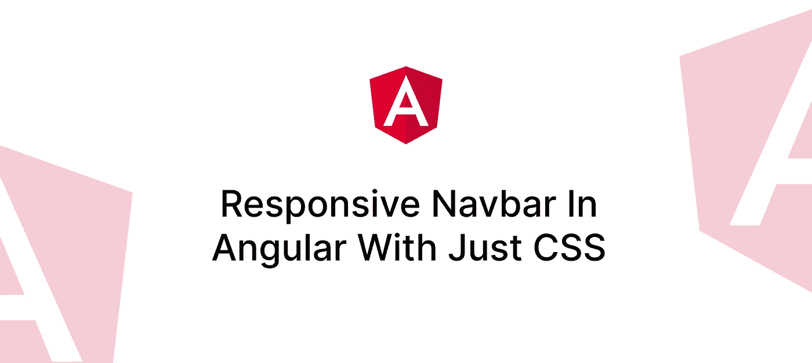

# 只用 CSS 在 Angular 中创建一个响应式导航条

> 原文：<https://javascript.plainenglish.io/create-a-responsive-navbar-in-angular-with-just-css-287bf6f76426?source=collection_archive---------1----------------------->

## 在大屏幕上显示链接，在小屏幕上显示汉堡菜单。



你希望你的 angular 应用程序中有一个最小化的导航条，随着显示尺寸的减小，导航条变成汉堡包菜单吗？你很幸运！你知道你只用 CSS 就能做到吗？你甚至不需要棱角魔法来做到这一点。

Navbar in action

在本教程中，我们将使用 TailwindCSS 和 [boxicons](https://boxicons.com) 图标库。但是您可以选择编写普通的 CSS 并使用另一个 SVG 图标库。那么，我们开始吧。

## 导航条组件

以一个有顺风支持的角度项目为例。创建一个 navbar 组件并将焦点放在模板上。我们想写一个移动优先的设计。

```
<header>
    <div>
        <a> LOGO </a>
        <button> Menu Icon </button>
    </div>

    <div id="navigation"> Links </div>
</header>
```

基本的想法是将徽标放在大屏幕的左边，链接放在右边。但是，当我们将它缩小到一个小屏幕时，徽标和菜单图标将可见，链接将堆叠在导航栏下，导航栏将展开或折叠。

```
<header class="block w-full bg-red-500 px-4 py-4 
        sm:flex sm:items-center sm:justify-between">
    <!-- Logo & menu icon. Flex in mobile, block in desktop -->
    <div class="flex justify-between sm:block">
        <a [routerLink]="['/']" class="block text-2xl font-bold text-white">
            MY APP
        </a>

        <!-- Menu icon hidden in desktop -->
        <button class="block bg-transparent sm:hidden">
            <input class="invisible appearance-none" type="checkbox" id="toggle" />

            <label for="toggle">
                <i id="menu-icon" class="bx bx-menu cursor-pointer text-2xl text-white"></i>
                <i id="close-icon" class="bx bx-x hidden cursor-pointer text-2xl text-white"></i>
            </label>
        </button>
    </div>

    <!-- Navlinks. Horizontal in desktop, vertical in mobile -->
    <div id="navigation"></div>
</header>
```

## 在小屏幕上处理菜单图标

使用 CSS 的新的`:has()`伪选择器，我们可以根据复选框输入的状态改变元素的样式。Tailwind 的默认`sm`断点从 640 像素开始。所以我们通过媒体查询把屏幕对准了下面的`640px`。

```
// navbar.component.scss

:host {
    display: block;
}

@media screen and (max-width: 639px) {
    header:has(#toggle:checked) #menu-icon {
        display: none;
    }

    header:has(#toggle:checked) #close-icon {
        display: inline-block;
    }
}
```

## 导航链接

现在，让我们来关注导航链接。在小屏幕上的初始状态，div 的高度为 0px。此外，链接将被堆叠使用`flex-direction: column`小，但`row`大。

```
<div
    id="navigation"
    class="flex h-0 flex-col items-center 
        gap-4 overflow-hidden text-white transition-all 
        duration-500 ease-in-out 
        sm:h-auto sm:flex-row sm:overflow-auto"
>
    <a [routerLink]="['/pricing']">Pricing</a>
    <a [routerLink]="['/features']">Features</a>
    <a [routerLink]="['/profile']">Profile</a>
</div>
```

为了很好地显示 CSS 过渡，我们需要一个初始高度值。

```
@media screen and (max-width: 639px) {
    header:has(#toggle:checked) #navigation {
        height: 8rem;
    }
}
```

如果你已经做到这一步，并在浏览器中运行，你会看到在小屏幕上，导航链接只是显示在一个`8rem` div 中，其余的链接被剪切掉。为了克服这一点，按照这个小技巧使用 CSS 变量设置高度:

```
 <div
      id="navigation"
      #linksDiv
      style="--menu-height: {{ linksDiv.children.length * 2.5 }}rem"
      class="..."
  >
      <!--Links -->
  </div>
```

其思想是查询链接(子)的数量，并乘以一个合理的单位来构成 div 高度。由于我在链接之间使用了`1rem`间隔，在我的测试中，每个链接 2.5 雷姆给了我一个好的结果。

在 CSS 中，将高度值更改为 CSS 变量。回退值将确保当变量未设置时，div 的高度不会未定义。

```
@media screen and (max-width: 639px) {
    header:has(#toggle:checked) #navigation {
        height: var(--menu-height, 8rem);
    }
}
```

*免责声明:使用这个技巧将会抛出臭名昭著的* `*ExpressionChangedAfterChecked*` *错误，因为您是在组件呈现时直接从开始访问* `*linksDiv*` *ViewChildren，但是在第一次变化检测之前不久就发生了变化。但是这个错误只在角度开发模式下出现，在生产中不会出现。另外，你不能在这个组件中使用* `*ChangeDetectionStrategy.OnPush*` *，因为这样 CSS 变量将不会因为这个错误而更新。记住这一点。*

## 完整代码

Stackblitz 演示:

[](https://stackblitz.com/edit/angular-ivy-qbmvbm?file=src/app/navbar/navbar.component.ts) [## 角度响应导航条堆栈

### 基于@angular/animations、@angular/compiler、@angular/core、@angular/common 的 angular-cli 项目…

stackblitz.com](https://stackblitz.com/edit/angular-ivy-qbmvbm?file=src/app/navbar/navbar.component.ts) 

导航栏模板:

```
<header class="block w-full bg-red-500 px-4 py-4 sm:flex sm:items-center sm:justify-between">
    <div class="flex justify-between sm:block">
        <a [routerLink]="['/']" class="block text-2xl font-bold text-white">
            MY APP
        </a>

        <button class="block bg-transparent sm:hidden">
            <input class="invisible appearance-none" type="checkbox" id="toggle" />

            <label for="toggle">
                <i id="menu-icon" class="bx bx-menu cursor-pointer text-2xl text-white"></i>
                <i id="close-icon" class="bx bx-x hidden cursor-pointer text-2xl text-white"></i>
            </label>
        </button>
    </div>

    <div
        #linksDiv
        id="navigation"
        style="--menu-height: {{ linksDiv.children.length * 2.5 }}rem"
        class="flex h-0 flex-col items-center gap-4 overflow-hidden text-white transition-all duration-500 ease-in-out sm:h-auto sm:flex-row sm:overflow-auto"
    >
            <a [routerLink]="['/pricing']">Pricing</a>
            <a [routerLink]="['/features']">Features</a>
            <a [routerLink]="['/profile']">Profile</a>
            <a [routerLink]="['/library']">Library</a>
            <!-- for extra links -->
            <ng-content></ng-content>
    </div>
</header>
```

导航栏 CSS:

```
:host {
    display: block;
}

@media screen and (max-width: 639px) {
    header:has(#toggle:checked) #navigation {
        height: var(--menu-height, 10rem);
    }

    header:has(#toggle:checked) #menu-icon {
        display: none;
    }

    header:has(#toggle:checked) #close-icon {
        display: inline-block;
    }
}
```

## 结论

这个基本的导航条会在很多时候派上用场——比如当你在做原型或者构建概念验证的时候。玩它，让我知道你是否能想到任何改进！感谢阅读。

## 更多内容请访问 [PlainEnglish.io](https://plainenglish.io/) 。

*报名参加我们的* [***免费每周简讯***](http://newsletter.plainenglish.io/) *。关注我们关于*[***Twitter***](https://twitter.com/inPlainEngHQ)，[***LinkedIn***](https://www.linkedin.com/company/inplainenglish/)***，***[***YouTube***](https://www.youtube.com/channel/UCtipWUghju290NWcn8jhyAw)***，以及****[***不和***](https://discord.gg/GtDtUAvyhW)*

## *想扩大你的软件创业规模吗？检查[电路](https://circuit.ooo/?utm=publication-post-cta)。*