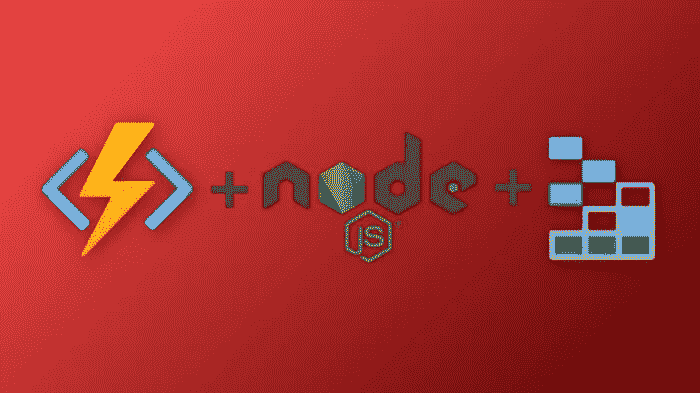
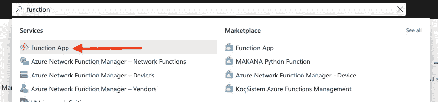
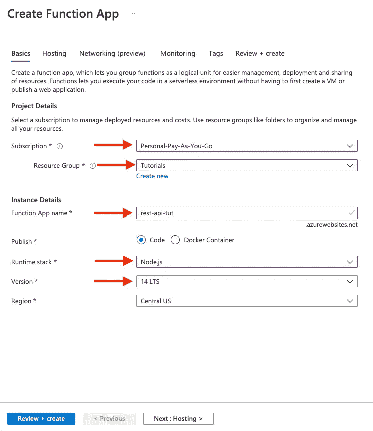
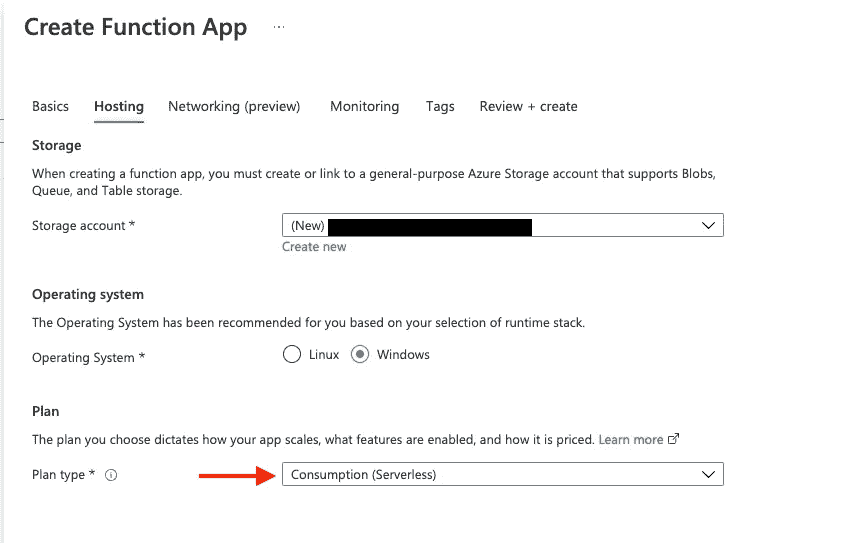
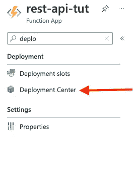
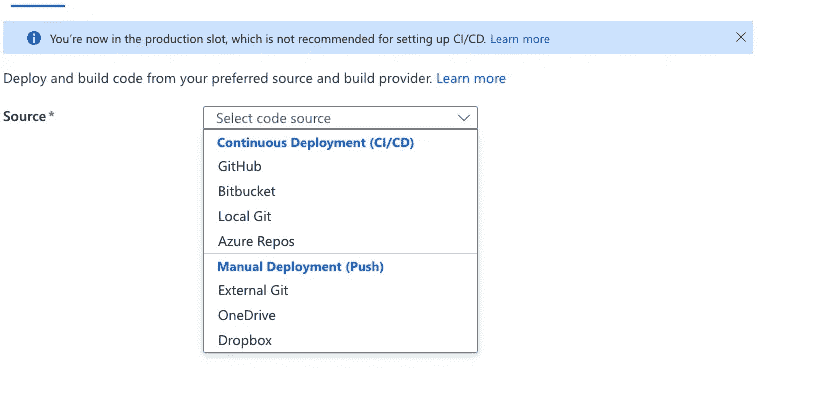
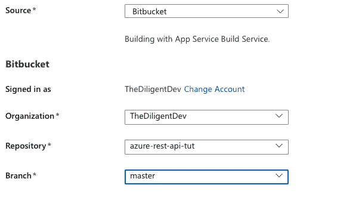
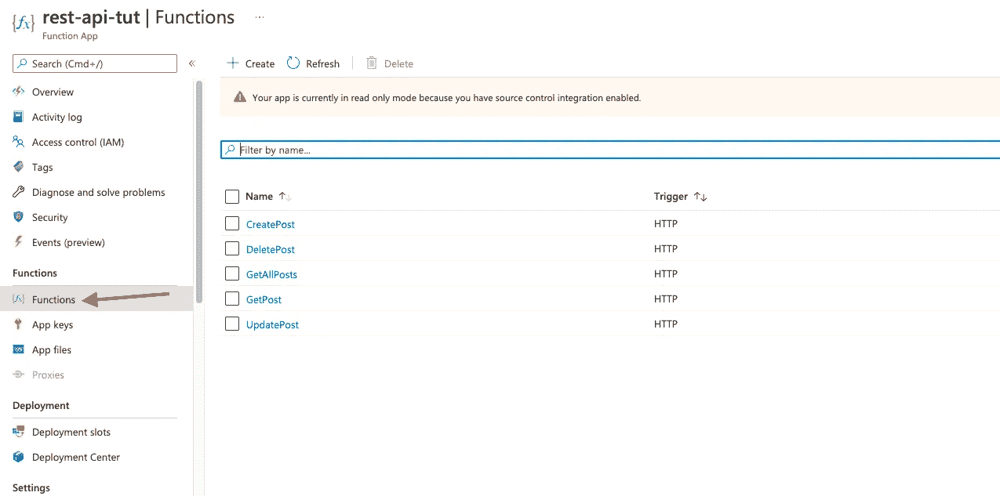
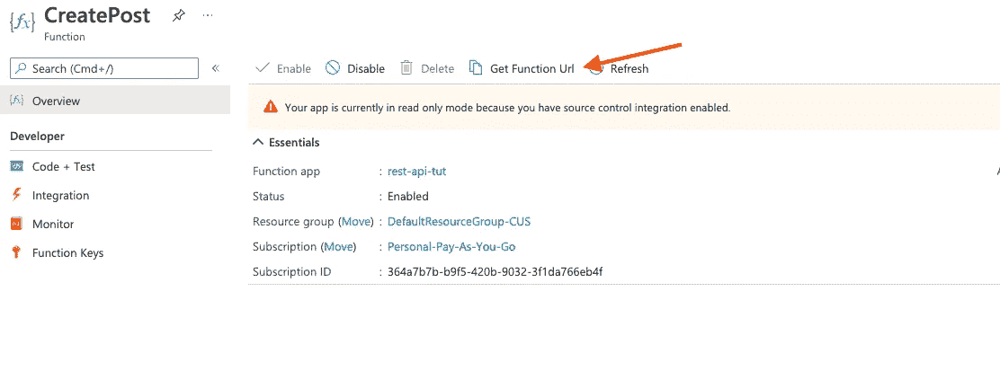

# 用 Azure 无服务器函数和 Node.js 创建 REST API

> 原文：<https://javascript.plainenglish.io/create-a-rest-api-with-azure-serverless-functions-and-node-js-6bd39739492e?source=collection_archive---------9----------------------->

## 第 3 部分—重构、增强和部署



Azure Functions with Node.js and Azure Table Storage

当开发任何应用程序时，我的哲学一直是让它工作，然后优化/增强/重构代码。正如他们所说，“过早优化是万恶之源”。但是，既然我们已经完成了所有的 CRUD 功能，是时候回去重构我们的代码，使它更干净，更可重用。

# 端点

在我之前的文章中，当提到端点的命名时，我们使用默认的 Azure 函数约定。在典型的 REST API 中，大多数端点看起来非常相似，甚至完全相同。区别在于传递的 HTTP 动词(GET、POST、PUT、DELETE 等。).

为了遵循这一约定，我们将把 function.json 文件中的路由重命名为:

```
//CreatePost/function.json
"route": "blog-posts"// GetPosts/function.json
"route": "blog-posts/{blog}"// GetPost/function.json
"route": "blog-posts/{blog}/{id}"// UpdatePost/function.json
"route": "blog-posts/{blog}/{id}"// DeletePost/function.json
"route": "blog-posts/{blog}/{id}"
```

# 中间件

REST API 中的许多代码将在不同的方法间共享。在请求的开始或结束时尤其如此。这就是中间件概念发挥作用的地方。Express 是一个广泛使用中间件的框架。他们将其定义为:

> ***中间件*** 函数是访问请求对象(`req`)、响应对象(`res`)以及应用程序的请求-响应周期中的下一个中间件函数的函数。下一个中间件功能通常用一个名为`next`的变量来表示。

不幸的是，Azure Functions 没有内置中间件，它们会主动让你使用它们的 [API 管理](https://azure.microsoft.com/en-us/services/api-management/)服务。幸运的是，有一个名为[azure-middleware](https://www.npmjs.com/package/azure-middleware)*的包，我们可以通过运行以下命令将它添加到项目中:*

```
*npm install azure-middleware joi*
```

## *数据有效性*

*现在我们已经安装了这个包，我们可以使用一些中间件来验证 CreatePost 端点的主体。为此，我们将在 CreatePost 文件夹中创建一个名为 handler.js 的新文件，并将所有业务逻辑移到其中。我们可以去掉我们自己的验证，因为我们将制作我们自己的中间件。*

```
*const{ *insertEntity* }= *require*("../services/tableService");exports*.createPostHandler* = *async* (context) => {
 const{ *blog*, *title*, *content* }= *context.req.body*;

 const *entity* ={
  *PartitionKey*:{ *_*:blog},
  *RowKey*:{ *_*:new *Date*()*.getTime*()*.toString*()},
  *title*:{ *_*:title},
  *content*:{ *_*:content},
 }; const *result* = *await insertEntity*("Posts",entity); *context.*res = {
  body: result,
 }; *context.done*();
};*
```

*接下来，我们需要创建我们的中间件方法。为此，在项目的根目录下创建一个名为*middleware 的新文件夹。*在该文件夹中创建一个名为 *validators.js 的文件。*在该文件中，我们将创建一个方法来确保一个主体被传递并且 Joi 模式是有效的:*

```
*exports*.validateBody* = *async* (ctx, body, schema) => {
 *try* {
  if (!body) {
   *ctx.*res = {
    status: 400,
    body: "A request body must be passed!",
   }; *ctx.done*();
  *return*;
  }

  *await* *schema.validateAsync*(body);
 } *catch* (err) {
   *ctx.*res = {
    status: 400,
    body: *err.*message,
  }; *ctx.done*();
 }
};*
```

*回到我们的 index.js，我们需要导入所需的包。创建我们的 Joi 模式，将我们的功能更改为中间件处理器，然后*

```
*const *Joi* = *require*("joi");
const *MiddlewareHandler* = *require*("azure-middleware");
const{ *createPostHandler* }= *require*("./handler");
const{ *validateBody* }= *require*("../middlewares/validator");const *schema* = *Joi.object*({
 *blog*: *Joi.string*()*.min*(1)*.required*(),
 *title*: *Joi.string*()*.min*(1)*.required*(),
 *content*: *Joi.string*()*.min*(1)*.required*(),
});const *createPost* =new *MiddlewareHandler*()
*.use*((ctx) => {
*//where you can run your middleware
validateBody*(ctx, *ctx.req.*body, schema);
 *ctx.next*();
})
*.use*(createPostHandler) //our handler.js method
*.catch*((err, ctx) => {
 *ctx.*res = {
 status: 500, 
 body: *err.*message,
 };*ctx.done*();
})
*.listen*();module*.*exports = createPost;*
```

# *部署*

## *设置*

*为了部署我们的功能，我们需要前往 Azure 门户。登录后，搜索功能应用并点击它:*

**

*Azure Portal — Function App*

*接下来，选择你的订阅，资源组，命名你的函数 app，选择 Node.js 作为运行时栈，最新的稳定版本，区域。*

**

*Create Function App*

*我做的下一件事是点击下一步:托管，并确保我在消费计划下:*

**

*Hosting Settings*

*最后，单击底部的“查看和创建”。然后，单击创建。*

## *基于 Git 的自动部署*

*一旦你的功能应用已经部署好了，就去吧。接下来在左上角搜索“部署”,然后单击部署中心:*

**

*Deployment Center*

*然后在 source 下拉列表中，选择您的 git 存储库提供者。选择它后，系统会提示您授权 Azure 进行访问。*

**

*Code Source*

*一旦获得授权，您只需要选择组织、存储库和分支，然后单击右上角的 Save。*

**

*Org, Repo, and Branch*

*部署运行后，您可以单击功能菜单图标来查看您的所有功能:*

**

*Functions*

*要获取函数的 Azure 端点，请单击列表中的函数。在下一页上，单击“获取函数 URL”按钮并复制它:*

**

*Get Function URL*

*视频教程*

*Video Tutorial*

# *结论*

*就是这样！我们现在已经创建了一个完整的 CRUD API，并利用 Node.js 的 Azure 函数部署了它。请在下面的评论区告诉我你的想法。下次再见，祝编码愉快。*

**更多内容请看*[***plain English . io***](http://plainenglish.io/)*。报名参加我们的* [***免费周报***](http://newsletter.plainenglish.io/) *。在我们的* [***社区***](https://discord.gg/GtDtUAvyhW) *获得独家获得写作机会和建议。**