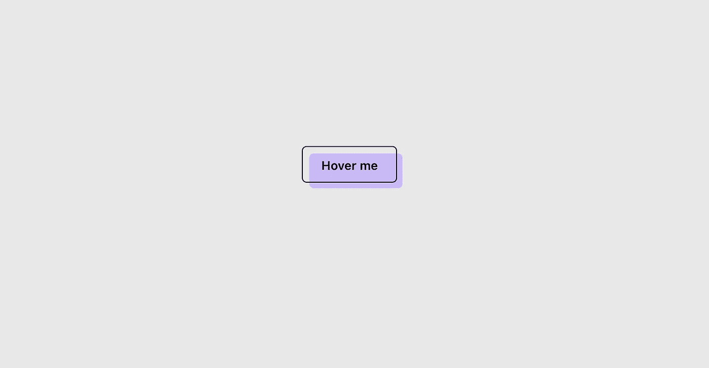
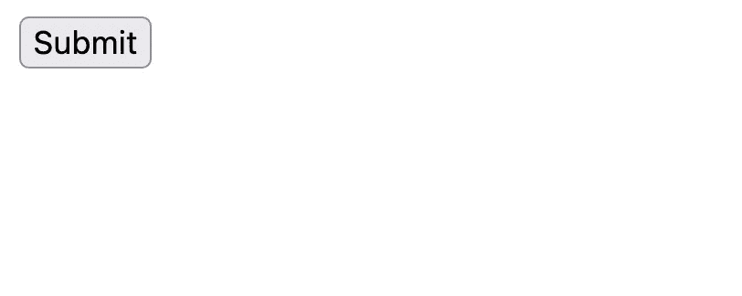
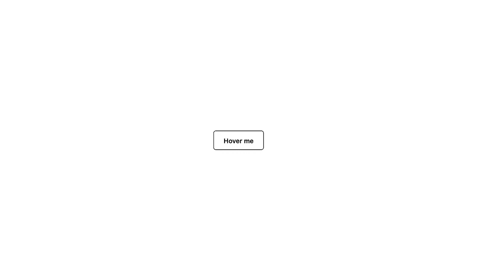
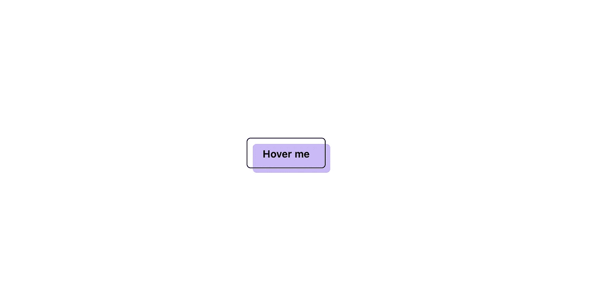

# 使用 HTML 和 CSS 创建一个复古按钮

> 原文：<https://javascript.plainenglish.io/create-a-retro-button-using-html-and-css-fe0c3bfaf059?source=collection_archive---------2----------------------->



我们将从基本的 HTML 开始

```
<button>Submit</button>
```

看起来是这样的:



现在将添加一些基本的风格:

```
button {
  font-weight: 600;
  height: 40px;
  padding: 12px 20px;
  outline: none;
  border: 1px solid black;
  background-color: transparent;
  border-radius: 5px;
}
```



我们将使用`:after`伪类添加一点样式和位置属性来移动伪紫色按钮的位置。

```
button:after {
  content: "";
  position: absolute;
  width: 100%;
  top: 7px;
  left: 7px;
  height: 100%;
  background-color: rgb(201, 184, 246);
  z-index: -1;
  transition: all 0.35s;
  border-radius: inherit;
}
```

**注意**:要在子元素中使用 position:absolute，请确保将 position 属性传递给父元素。



现在悬停，删除按钮上应用的间距，并用紫色按钮填充原来的按钮。

```
button:hover:after {
  top: 0px;
  left: 0px;
}
```

**最终结果🤩**

**社交**🌐：

**GitHub**:[https://github.com/hritik5102](https://github.com/hritik5102)
**Linkedin**:[https://www.linkedin.com/in/hritik-jaiswal-22a136166/](https://www.linkedin.com/in/hritik-jaiswal-22a136166/)
**Twitter**:[https://twitter.com/imhritik_dj](https://twitter.com/imhritik_dj)
Linktree:[https://linktr.ee/hritikdj](https://linktr.ee/hritikdj)

**支持我**


[https://www.buymeacoffee.com/hritikdj](https://www.buymeacoffee.com/hritikdj)

*更多内容请看*[***plain English . io***](https://plainenglish.io/)*。报名参加我们的* [***免费每周简讯***](http://newsletter.plainenglish.io/) *。关注我们*[***Twitter***](https://twitter.com/inPlainEngHQ)*和*[***LinkedIn***](https://www.linkedin.com/company/inplainenglish/)*。查看我们的* [***社区不和谐***](https://discord.gg/GtDtUAvyhW) *加入我们的* [***人才集体***](https://inplainenglish.pallet.com/talent/welcome) *。*