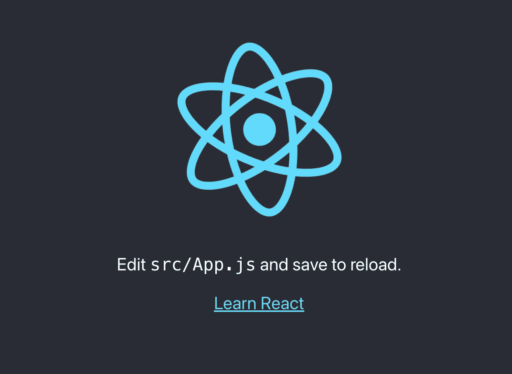
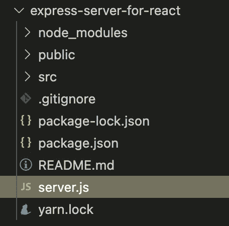
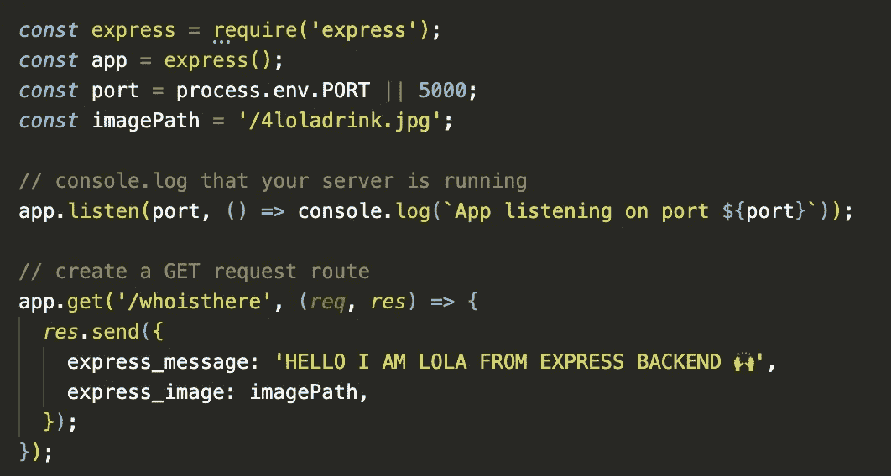
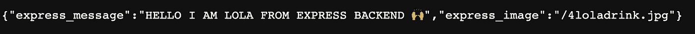
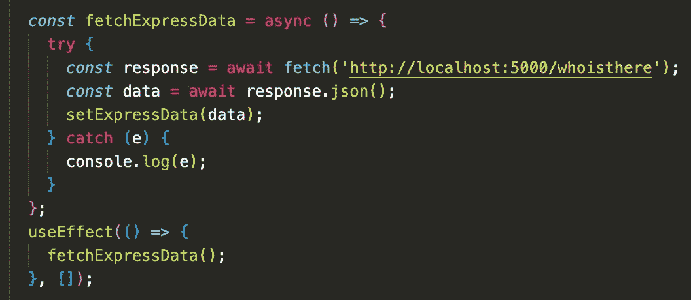
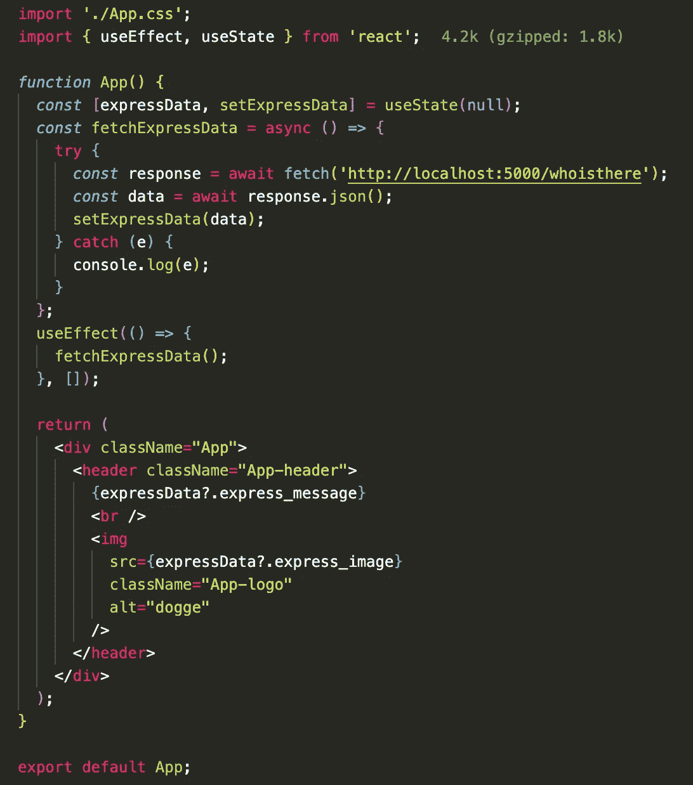
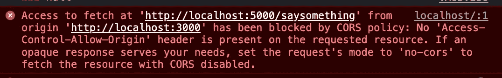

# 为 React 应用程序创建一个简单的 Express 服务器(Node.js)

> 原文：<https://javascript.plainenglish.io/create-a-simple-express-server-node-js-for-react-application-e2b2bd0c7e93?source=collection_archive---------6----------------------->

## 关于如何创建一个简单的 Express 服务器(Node.js)，将它连接到 React 应用程序，并解决可能遇到的错误的教程。


千里之行始于脚下 — A thousand miles begins with a single step

我一直想写一篇关于这个话题的文章，终于，我有时间写了。这不是 Node.js 和 Express 是什么的问题。我假设您已经安装了 Node.js 和 npm。

Node.js 是一个开源的、跨平台的运行时环境，允许开发者用 JavaScript 创建各种服务器端工具和应用。

Express 是最流行的节点 web 框架，也是许多其他流行的节点 web 框架的底层库。

话不多说，开始吧！

**创建 React 应用程序**

首先，创建一个保存 React 应用程序的目录。从终端导航到此目录并运行:

```
**npx creat-react-app express-server-for-react**
```

*我将这个应用命名为*express-server-for-react*

🍁如果你之前已经通过`npm install -g create-react-app`全局安装了 create-react-app，我建议你使用`**npm uninstall -g create-react-app**`或`**yarn global remove create-react-app**`卸载这个包，以确保 **npx** 总是使用最新版本。

(*如果你觉得用包管理器**纱**更好，就先装吧。)

之后，使用`**npm start**`或`**yarn start**`，我们的初始 React 应用程序应该在 *http://localhost:3000/上开始。*



[http://localhost:3000/](http://localhost:3000/)

那很简单！⚡️

**现在让我们设置 Node.js Express 服务器。**

1.  在应用程序目录中创建一个 **server.js** 文件。这是我们将创建 Express 服务器的地方。



App structure

2.安装 **Express** 用:`**npm install express — save**` 或者`**yarn add express**`，可以在 **package.json** 里面看到，作为依赖。

3.用下面的代码更新 **server.js** 文件:



Create Express server within server.js

*   上面的代码首先需要 express 并允许我们使用它，然后我们设置我们的服务器将要运行的端口(port: **5000** )，*如果服务器运行良好，我们应该在终端中看到“ **console.log** ”消息。
*   “ **app.get(…)** ”行设置了一个 **GET** 请求路由，该路由将从我们的 React 应用程序前端(“ */whoisthere* ”)获取，如果一切正常，我们应该稍后在 React 应用程序中接收那些发送的数据:👉字符串消息(“*你好，我是来自快递后端的 LOLA】”)和我的狗狗图片路径(定义为“**图片路径**”)🌼。*

好吧，让我们启动服务器，看看会发生什么！

在终端运行中:

```
**node server.js**
```

*如果一切正常，恭喜你！你可以忽略下面的步骤，但是这里我收到了我的第一个错误:*

*错误:监听 EADDRINUSE:地址已被使用:::5000*

我认为这是我们可能经常遇到的一个普遍问题，这是因为当我们试图重启 Node.js 应用程序时，前一个没有正常关闭，我们需要手动**终止该进程**。

➡️首先，找出哪个进程正在使用端口 5000，在终端中运行以下命令:

```
***sudo lsof -i :5000***
```

*   这将列出在此端口上侦听的所有 **PID** ，一旦您有了 **PID，**您可以使用以下命令终止它:

```
***kill -9 {PID}****Use -9 option to make sure the process dies immediately
```

➡️:但是在我的情况下，由于某种原因，macOS 进程保持自动生成，运行这个命令应该可以修复它:

```
***pkill ControlCenter; nc -l 5000***
```

*   这将终止 ControlCenter 进程，然后启动一个空的 Netcat TCP 服务器，侦听 ControlCenter 正在使用的确切端口，因为 ControlCenter 在退出时会自动重新启动，所以当它启动时，它会检测到其端口正在使用中。

🎀服务器工作后，我们应该在终端控制台看到这条消息:“ **App 监听端口 5000** ，这是在我们的 **server.js** 中定义的。

现在转到**http://localhost:5000/who is there**，我们应该会看到这个:



server is running on port 5000

到这一点，我们已经做了差不多 70%！🍬

**从 React 应用程序获取服务器数据**

首先，导航到文件 **App.js** ，并在其中创建一个获取请求，如下所示:



fetch express server data

🪡修改的 App.js 文件:



fetch data from server and render them in frontend

代码看起来不错，我期待看到下面的最终结果:


final result

但是没有🔴，不显示任何内容！我的第二个问题来了，看看控制台，错误如下所示:



CORS

为什么？因为出于安全考虑，fetch API 遵循同源策略。这意味着使用 fetch API 的 web 应用程序只能从加载该应用程序的同一来源请求资源，除非来自其他来源的响应包括正确的 **CORS** 头。

在我们的例子中，localhost: **3000** 和 localhost: **5000** 是两个独立的域，所以我们还不能跨它们发出请求。

最简单的解决方案:安装 [CORS 库](https://www.npmjs.com/package/cors)并告诉服务器期待来自 localhost:3000 的请求，这样我们就可以用:

```
**yarn add cors**
```

*这种方法非常简单，也可以向 package.json 添加一个简单的代理，比如:" proxy": "http://localhost:5000 "

现在，最后一步，更新 **server.js** ，添加如下:

```
*const* cors = require(“cors”);app.use(cors({origin: ‘http://localhost:3000',}),);
```

就是这样！我们创建的简单 React 应用程序连接到我们的 Node.js Express 服务器，并用一个漂亮的 doggy 图像将获取的数据呈现到前端🎈。

这只是一个简单的例子 app，我们可以用 Node.js 做很多，让我们每天坚持学习吧！如果你也对我的其他文章感兴趣，这里有一些链接，谢谢你的时间！

[](https://medium.com/geekculture/update-parent-state-from-child-component-with-react-context-api-a56cf3742428) [## 用 React 上下文将状态从子节点更新到父节点

### — React Context 提供了一种通过组件树传递数据的方法，而不必在…

medium.com](https://medium.com/geekculture/update-parent-state-from-child-component-with-react-context-api-a56cf3742428) [](/use-session-storage-to-persist-state-within-a-react-component-206867ef2269) [## 使用会话存储来保持 React 组件中的状态

### 当页面会话结束时，sessionStorage 中的数据将被清除。

javascript.plainenglish.io](/use-session-storage-to-persist-state-within-a-react-component-206867ef2269) [](/learn-by-doing-use-gatsby-to-create-your-first-site-af7bfb7a8a6f) [## 边做边学——使用 Gatsby 创建您的第一个网站

### 一步一步来，是的。

javascript.plainenglish.io](/learn-by-doing-use-gatsby-to-create-your-first-site-af7bfb7a8a6f) [](/sourcing-json-data-with-gatsby-source-filesystem-and-graphql-6fc7cef2a49e) [## 用 gatsby-source-filesystem 和 GraphQL 获取 JSON 数据

### 学习盖茨比第二步

javascript.plainenglish.io](/sourcing-json-data-with-gatsby-source-filesystem-and-graphql-6fc7cef2a49e) [](/5-react-hook-libraries-you-could-use-d7f13066ebba) [## 您可以使用的 5 个 React 钩子库

### 大三学生的建议——试一试。

javascript.plainenglish.io](/5-react-hook-libraries-you-could-use-d7f13066ebba) 

*更多内容看* [***说白了就是***](https://plainenglish.io/) *。报名参加我们的* [***免费周报***](http://newsletter.plainenglish.io/) *。关注我们关于* [***推特***](https://twitter.com/inPlainEngHQ) ， [***领英***](https://www.linkedin.com/company/inplainenglish/) *，*[***YouTube***](https://www.youtube.com/channel/UCtipWUghju290NWcn8jhyAw)*，以及* [***不和***](https://discord.gg/GtDtUAvyhW) *。*