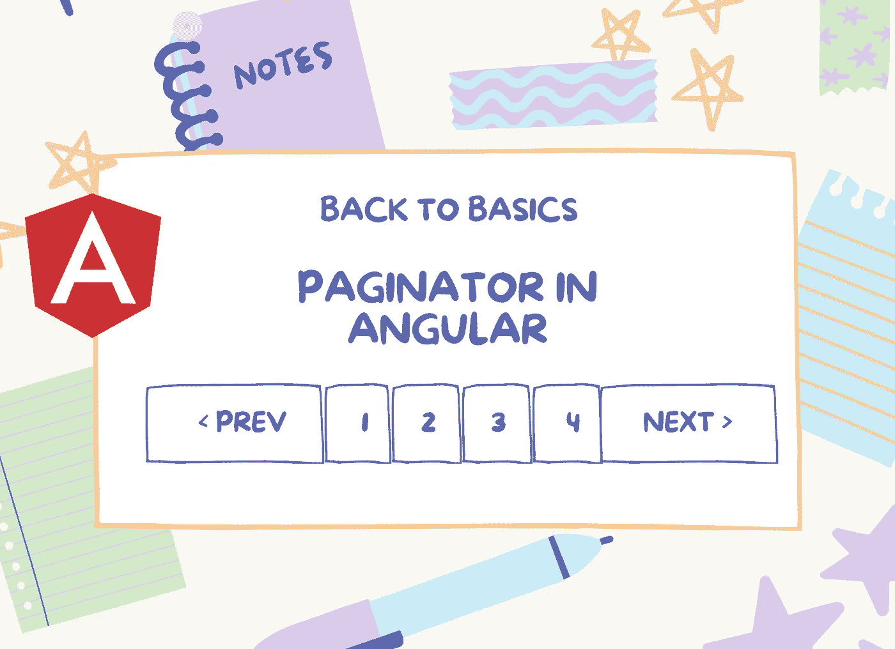
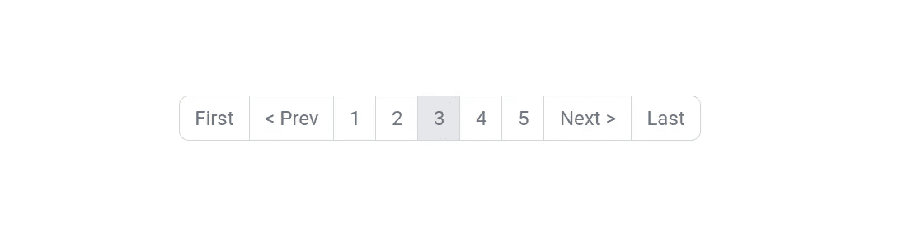
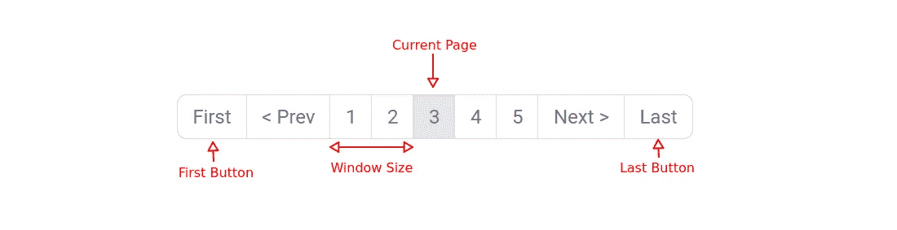

# 在 Angular 中创建一个简单的分页组件

> 原文：<https://javascript.plainenglish.io/create-a-simple-pagination-component-in-angular-17b909ea03e1?source=collection_archive---------3----------------------->

## 如何在 Angular 中创建分页器的循序渐进的初学者指南。



随着二十一世纪的无限加载 UX，分页对于现代 web 应用程序来说已经成为过去。然而，将结果列表分成页面仍然是确保低内存占用和一致 UI 的有效方法。特别是在许多后台应用程序中，分页优于无限加载。今天，让我们回到基础，学习如何在 Angular 中创建这样的分页器:



Fig: Paginator that we will be creating

# 第一步:设计

使用 Angular CLI 或您喜欢的方法创建一个`pagination`组件。在处理控制器之前，让我们来设计分页栏的样式:

# 第二步:输入

现在是研究控制器逻辑的时候了。用以下输入修饰控制器:

*   `currentPage` —表示当前页面。
*   `totalPages`——有多少页？
*   `size` —页面尺寸。
*   `windowSize` —活动链接的每一边应该有多少个链接可见？
*   `showFirstLastButton` —显示“第一个”和“最后一个”导航链接。如果`false`，分页栏将只包含“上一页”和“下一页”链接，没有“第一页”和“最后一页”。
*   `routerLinkBase` —分页栏将被激活的页面的路由器链接。

以下是输入的直观解释:



此时的控制器:

# 第三步:计算左右页码

我们只知道当前页面。要在分页栏中显示相邻的页面，让我们计算最近的页码:

# 步骤 4:路由器链接和查询参数

我们打算应用分页的列表肯定会有路径，比如说——`/movies.`在角度语言学中，叫做*路由器链接*。那是我们的 **routerLinkBase** 。点击页码时，角度路由器将使用`routerLinkBase`和`page` & `size`查询参数进行导航。因此，每次点击后，URL 将如下所示:

```
[1-clicked] /movies?page=1&size=24
[2-clicked] /movies?page=2&size=24
[3-clicked] /movies?page=3&size=24
...
```

为了实现这一点，在链接上添加`routerLink`指令和`queryParams`输入。

```
<ul class="navlinks">
    <li ***ngIf="showFirstLastButton"**>
        <a
            **[queryParams]="{ size: size, page: 1 }"
            [routerLink]="routerLinkBase"
            queryParamsHandling="merge"**
            class="navlink"
        >
            First
        </a>
    </li>
    <li>
        <a
            **[queryParams]="{ size: size, page: currentPage - 1 }"
            [routerLink]="routerLinkBase"
            queryParamsHandling="merge"**
            class="navlink"
        >
            < Prev
        </a>
    </li>
    <li ***ngFor="let page of getNavigablePages()"**>
        <a
            **[queryParams]="{ size: size, page: page }"
            [routerLink]="routerLinkBase"
            queryParamsHandling="merge"
            [class.active]="page === currentPage"**
            class="navlink"
        >
            {{ page }}
        </a>
    </li>
    <li>
        <a
            **[queryParams]="{ size: size, page: currentPage + 1 }"
            [routerLink]="routerLinkBase"
            queryParamsHandling="merge"**
            class="navlink"
        >
            Next >
        </a>
    </li>
    <li ***ngIf="showFirstLastButton"**>
        <a
            **[queryParams]="{ size: size, page: totalPages }"
            [routerLink]="routerLinkBase"
            queryParamsHandling="merge"**
            class="navlink"
        >
            Last
        </a>
    </li>
</ul>
```

通过`queryParamsHandling="merge"`,我们告诉 angular 路由器合并并覆盖现有的查询参数，这样任何其他与分页无关的查询参数都保持不变。

# 第五步:用法

是时候使用刚出炉的组件了。当然，您的实现会因项目的底层 REST API 而有所不同。这里我只是展示了一个使用虚构 API 的示例:

在这里，分页组件接收从活动 URL 获得的页面和大小输入。如果这些值最初不在查询参数中，那么**页面$** 大小**大小$** 流保存一些相同的默认值。接下来，每当在分页栏上单击一个新的页码时，活动 URL 的大小和页面查询参数都会改变，从而产生一个更新的`movies$`流。我们可以在页面上看到新的结果。

# **结论**

Fig: Paginator in action

你可以看到分页器工作正常。虽然它有一个小故障——当页码靠近终端页面(第一页和最后一页)时，因为链接较少，所以条形会缩小。但是那是你要解决的问题！😉

在评论里告诉我，你是怎么解决的。感谢阅读！

## 完整代码

*更多内容看* [***说白了。报名参加我们的***](https://plainenglish.io/) **[***免费周报***](http://newsletter.plainenglish.io/) *。关注我们关于* [***推特***](https://twitter.com/inPlainEngHQ) ，[***LinkedIn***](https://www.linkedin.com/company/inplainenglish/)*，*[***YouTube***](https://www.youtube.com/channel/UCtipWUghju290NWcn8jhyAw)*，* [***不和***](https://discord.gg/GtDtUAvyhW) *。***