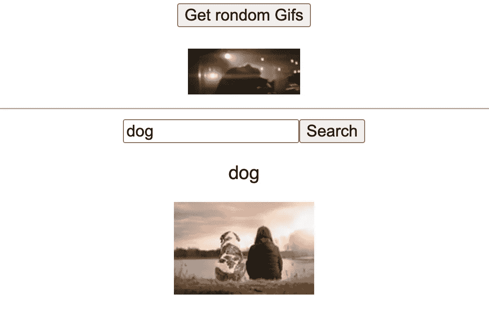
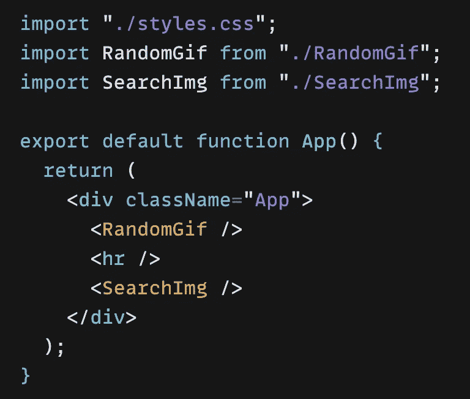

# 创建一个简单的 React 自定义挂钩

> 原文：<https://javascript.plainenglish.io/create-a-simple-react-custom-hook-fc733d7b977a?source=collection_archive---------13----------------------->

## 关于如何创建一个简单的 React 自定义钩子的教程


学而时习之，不亦说乎 — learn from time to time

在编写 React 功能组件时，如果想重用组件的部分逻辑，可以考虑编写 ***自定义钩子*** 。

首先，我们来看看 React 钩子。钩子只是 JavaScript 函数，但是在 React 中使用它们时，您需要遵循[规则](https://reactjs.org/docs/hooks-rules.html):

*   只调用顶层的钩子
*   仅从 React 函数调用挂钩

👉第一点和 React Hook 的实现原理有关。第一次执行函数组件时，react 分配一个对象，逐个调用钩子时，将得到的结果依次放入一个有序表中，然后存储在对象中。

对于后续的执行，这些钩子的执行顺序必须是相同的，以便比较依赖关系，并与先前渲染的状态进行比较。

如果钩子出现在循环、条件或嵌套函数中…不能保证钩子的执行顺序保持不变。

👉第二点意味着你应该总是从 **React 函数组件**而不是**类组件**或者**常规 JavaScript 函数**中调用钩子，但是如果是**自定义钩子**，*从其中调用钩子也是合法的*。

*自定义钩子是一个 JavaScript 函数，具有唯一的命名约定，要求函数名以* `*use*` *开头，并且能够调用其他钩子。*

这听起来很麻烦，我会用一个简单的 React 例子来解释清楚。在下面的代码示例中，我们将在组件中获取并显示 image/gif。🎈

首先，让我们看看这个简单的应用程序的最终结果，我们有两个组件，顶部的组件名为 **RandomGif** 和，底部的组件名为 **SearchImg。*** *既然本文的目的是介绍自定义钩子，就不做太多造型了。*



end result

这两个组件都在 App.js 中:



RandomGif and SearchImg components

组件名称说明了一切， **RandomGif** 显示随机 Gif， **SearchImg** 让用户可以使用输入字段值搜索图像。我们将使用两个 API 端点([**gi phy**](https://giphy.com/)**和**[**pix abay**](https://pixabay.com/de/))，访问密钥将在我们注册时自动生成。****

****现在，从 **RandomGif** 组件开始，**下面的 API_KEY 存储在。环境文件。*****

```
**import { useState, useEffect } from "react";

const RandomGif = () => {
   const [gif, setGif] = useState(null);👉 const **fetchGif** = () =>
    fetch(
      `https://api.giphy.com/v1/gifs/random?  api_key=${RANDOM_API_KEY}&tag=&rating=g`
    )
      .then((res) => res.json())
      .then((data) => setGif(data))
      .catch((e) => console.error(e));

  useEffect(() => {
      fetchGif();
    }, []);

  const **getRandomGif** = () => fetchGif();

return (
    <>
      <button onClick={**getRandomGif**}>Get random Gifs</button>
      {gif ? (
        
      ) : (
        "Oops, no GIF found"
      )}
    </>
  );
};
export default RandomGif;**
```

******搜索**组件:****

```
**import { useState, useEffect } from "react";const SearchImg = () => {
    const [searchText, setSearchText] = useState("dog");
    const [img, setImg] = useState(null);

  👉 const **fetchImg** = () =>
       fetch(
`https://pixabay.com/api/key=${SEARCH_API_KEY}&q=${searchText}&image_type=photo`
    )
      .then((res) => res.json())
      .then((data) => setImg(data))
      .catch((e) => console.error(e));

useEffect(() => {
    fetchImg();
  }, []);

const **getQueryImage**= () => **fetchImg**();

 const hit = gif?.hits[Math.floor(Math.random() * gif?.hits?.length)];

  return (
    <>
      <input
        type="text"
        value={searchText}
        onChange={(e) => setSearchText(e.target.value)}
      />
      <button onClick={**getQueryImage**}>Search</button>
      <p>{search text}</p>
      {match?.previewURL ? (
        
      ) : (
        "Oops, no image found"
      )}
    </>
  );
};
export default SearchImg;**
```

****正如我们所见， **RandomGif** 和 **SearchImg** 之间的逻辑基本相同，唯一的区别是我们使用了两个不同的端点，并且在 **SearchImg** 组件中有一个**输入**字段和一个 **onChange** 事件处理程序，该事件处理程序针对输入值并为用户提供了通过值查询来搜索图像的能力，更容易解释的是，内有不同的**参数******

****创建这样的组件很简单，但是如果我们有更多的组件，其中我们使用不同的参数进行相同的 API 调用，我们不希望复制相同的代码并将其粘贴到每个组件中，对吗？****

****一个好的解决方案是*定制*一个钩子来封装和共享组件之间相同的逻辑，如 [React 钩子介绍](https://reactjs.org/docs/hooks-custom.html)所示:****

*******自定义钩子是一个 JavaScript 函数，名字以“use”开头，可能会调用其他钩子。*** *(例如:* `*useFetch*` *)*****

****让我们为上面的例子创建一个自定义钩子，我将它命名为 **useFetch👐******

```
**// **useFetch** custom Hook
import { useState } from "react";

const useFetch = (url) => {
  const [img, setImg] = useState(null);
  const **fetchImg** = () =>
    fetch (url)
      .then((res) => res.json())
      .then((data) => setImg(data))
      .catch((e) => console.error(e));
  return **[{ img }, fetchImg]**;
};
export default useFetch;**
```

****在上面的代码中，我们创建了一个名为`useFetch.js`的新文件，其中包含一个函数`useFetch`，该函数包含了获取数据所需的所有逻辑。逻辑是从组件( **fetchGif / fetchImg** )中复制的，我们只是移除了硬编码的 URL，并用一个可以传递给自定义钩子的`url`变量来替换它们。****

****自定义钩子不需要有特定的签名，我们可以决定它接受什么作为**参数**，如果有的话，它应该**返回什么**，在本例中: **(url)** 和`**return** **[{ img }, fetchImg]**`****

*   ****返回值{ **img** }是初始化为 null 的 img 状态，将被导入并在组件内部使用****
*   ****函数 **fetchImg** 将被导入并在组件内部使用****

****同样如钩子介绍中所示，*从自定义钩子中调用预定义的 React 库钩子是合法的，*所以我们在这里使用了 **useState** 钩子，这两个组件中的钩子是完全相同的。****

****现在我们可以更新这两个组件，并使用这个自定义挂钩:****

```
**// **RandomGif** 
import { useEffect } from "react";
**import useFetch from "../useFetch";** => ***import custom hook***

const RandomGif = () => {

  👉 const **[{ img }, fetchImg]** = **useFetch**(
       "https://api.giphy.com/v1/gifs/random
api_key=${RANDOM_API_KEY}&tag=&rating=g"
       );

    useEffect(() => {
      fetchImg();
    }, []);

  const getRandomGif = () => **fetchImg**();

  return (
    <>
      <button onClick={getRandomGif}>Get random gifs</button>
          {img? (
        
           ) : (
             "Oops, no GIF found"
           )}
    </>
  );
};
export default RandomGif;// **SearchImg** 
import { useState, useEffect } from "react";
**import useFetch from "../useFetch";** 
const SearchImg = () => {
  const [searchText, setSearchText] = useState("dog");
  const **[{ img }, fetchImg]** = **useFetch**(
    `https://pixabay.com/api/?key=${SEARCH_API_KEY}&q=${searchText}&image_type=photo`
  );

  useEffect(() => {
    fetchImg();
  }, []);

  const SearchImg = () => **fetchImg**();
  const hit = **img**?.hits[Math.floor(Math.random() * gif?.hits?.length)];

  return (
    <>
      <input
        type="text"
        value={searchText}
        onChange={(e) => setSearchText(e.target.value)}
      />
      <button onClick={SearchImg}>Search</button>
      <p>{search text}</p>
      {hit?.previewURL ? (
        
      ) : (
        "Oops, no image found"
      )}
    </>
  );
};
export default SearchImg;**
```

****上面的代码解释道:****

*   ****我们进口我们的定制挂钩****

```
****import useFetch from "../useFetch";****
```

*   ****使用从我们的自定义钩子返回的状态和获取函数****

```
****const [{ img }, fetchImg]** = **useFetch**(...)**
```

****注意这里的 **fetchImg** 函数不是用来更新“Img”状态的，它是来自 useFetch 自定义钩子的 fetch 函数，可以在另一个函数内部调用，在本例中为"*const search img =()=>***fetchImg***()"*" const getRandomGif =()=>**fetchImg***()"【*****

****到目前为止，应用程序中没有任何变化，但是现在我们可以在任何组件中重用这个自定义钩子来从任何 URL 获取数据，只要它们使用相同的逻辑。通过定制钩子，我们可以将组件逻辑提取到可重用的功能中。****

****就是这样！感谢您的宝贵时间！⏰****

****如果你也对我的其他文章感兴趣，这里有一些链接:****

****[](/create-a-simple-express-server-node-js-for-react-application-e2b2bd0c7e93) [## 为 React 应用程序创建一个简单的 Express 服务器(Node.js)

### 关于如何创建一个简单的 Express 服务器(Node.js)、将其连接到 React 应用程序以及解决错误的教程…

javascript.plainenglish.io](/create-a-simple-express-server-node-js-for-react-application-e2b2bd0c7e93) [](/use-session-storage-to-persist-state-within-a-react-component-206867ef2269) [## 使用会话存储来保持 React 组件中的状态

### 当页面会话结束时，sessionStorage 中的数据将被清除。

javascript.plainenglish.io](/use-session-storage-to-persist-state-within-a-react-component-206867ef2269) [](/use-session-storage-to-persist-state-within-a-react-component-206867ef2269) [## 使用会话存储来保持 React 组件中的状态

### 当页面会话结束时，sessionStorage 中的数据将被清除。

javascript.plainenglish.io](/use-session-storage-to-persist-state-within-a-react-component-206867ef2269) [](https://medium.com/geekculture/hide-and-replace-sticky-element-on-scrolling-in-a-react-way-8bc3f04e2a81) [## 以反应方式隐藏和替换滚动时的粘性元素

### —棘手但有趣🍡

medium.com](https://medium.com/geekculture/hide-and-replace-sticky-element-on-scrolling-in-a-react-way-8bc3f04e2a81) [](https://enlear.academy/create-responsive-iframe-embed-in-a-react-way-f52075bf3b04) [## 创建以反应方式嵌入的响应 iframe

### —令人惊讶的是，YouTube 没有相应的嵌入代码🦄，我们来玩 css 吧…

enlear .学院](https://enlear.academy/create-responsive-iframe-embed-in-a-react-way-f52075bf3b04) 

*更多内容请看*[***plain English . io***](https://plainenglish.io/)*。报名参加我们的* [***免费周报***](http://newsletter.plainenglish.io/) *。关注我们关于*[***Twitter***](https://twitter.com/inPlainEngHQ)[***LinkedIn***](https://www.linkedin.com/company/inplainenglish/)*[***YouTube***](https://www.youtube.com/channel/UCtipWUghju290NWcn8jhyAw)*[***不和***](https://discord.gg/GtDtUAvyhW) *。*******