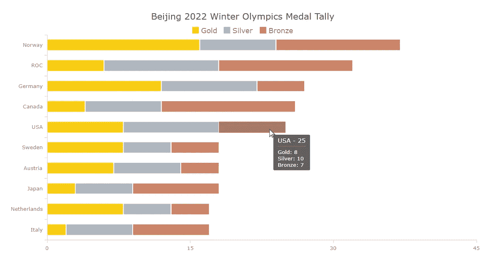
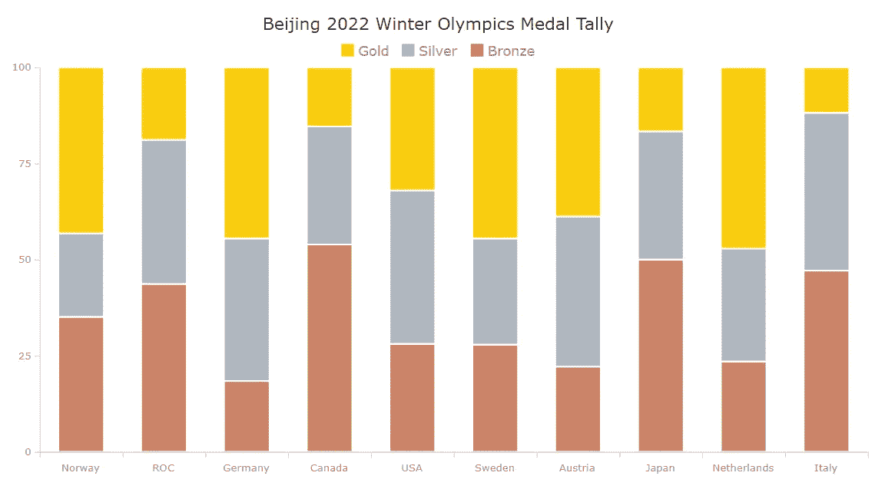

# 用 JavaScript 创建堆积图

> 原文：<https://javascript.plainenglish.io/create-a-stacked-chart-with-javascript-ba5a5f26db97?source=collection_archive---------23----------------------->

## 了解什么是堆积图，以及如何使用 JS 轻松创建各种类型的堆积图，并可视化显示北京 2022 奖牌数。


[数据可视化](https://www.anychart.com/blog/2018/11/20/data-visualization-definition-history-examples/)对于当今时代的分析师和开发人员来说是一项至关重要的技能。堆积图是使用最广泛的图表类型之一，现在我想告诉您它们是什么，以及如何使用 JavaScript 轻松构建这样的图形。在主要教程部分，我将创建不同版本的堆积图，提供全面的分步说明，让您快速学习。我的可视化将提供北京 2022 年冬季奥运会最终排行榜上前 10 名国家的奖牌数，这样你也可以在跟随过程中获得乐趣。

# 什么是堆叠图？

堆积图是[条形图](https://www.anychart.com/chartopedia/chart-type/bar-chart/)、[柱形图](https://www.anychart.com/chartopedia/chart-type/column-chart/)或[面积图](https://www.anychart.com/chartopedia/chart-type/area-chart/)的变体，提供总值构成的视图，以丰富可视化数据分析中的比较(或长期跟踪)。

当您需要以图形方式汇总(不断变化的)整体的各个部分时，堆积图非常有效。

# 堆叠图表类型

堆积图有两种主要类型:基于值的和基于百分比的。

数值堆积图(或简称堆积图)按类别表示总数，同时按系列提供构成的鸟瞰图，所有都是绝对值。这样的图形有助于比较几个类别的总数，同时有助于理解每个系列在快速直观分析中所揭示的差异中的作用。

百分比堆积图(有时也称为 100%堆积图)显示百分比而不是绝对值。它按类别将总数表示为 100%，并将序列中的单个数据点表示为相对于整体的比例。当不考虑绝对总数时，这种图对于观察某个序列的贡献如何从一个类别变化到另一个类别是理想的。

根据系列可视化的初始基本形式，这样的图形可以被称为[堆积条形图](https://www.anychart.com/chartopedia/chart-type/stacked-bar-chart/)、[堆积柱形图](https://www.anychart.com/chartopedia/chart-type/stacked-column-chart/)或[堆积面积图](https://www.anychart.com/chartopedia/chart-type/stacked-area-chart/)——或者分别被称为[百分比堆积条形图](https://www.anychart.com/chartopedia/chart-type/percent-stacked-bar-chart/)、[百分比堆积柱形图](https://www.anychart.com/chartopedia/chart-type/percent-stacked-column-chart/)或[百分比堆积面积图](https://www.anychart.com/chartopedia/chart-type/percent-stacked-area-chart/)。

例如，不要错过阅读 Smashing Magazine 上一篇关于堆积条形图的精彩文章，深入了解这种堆积图表类型如何工作以及应该如何正确使用。

# 将要构建的堆积图表示例

现在，是教程本身的时候了！我将解释如何使用 JavaScript 创建一个很酷的交互式堆叠图表。

本教程中要构建的第一个堆积图是交互式堆积柱形图。之后，我将向您展示如何用几行代码定制它。最后，您将学习如何将堆积柱形图转换为百分比堆积柱形图和堆积条形图，这也非常简单。

仍然对上个月的北京 2022 年冬季奥运会印象深刻，我决定看看获得奥运奖牌最多的 10 个国家，想象一下他们的运动员总共获得了多少奖牌——以及金牌、银牌和铜牌。

看一看我将在本教程结束时得到的最终的基于 JavaScript 的堆积图！



# 构建 JavaScript 堆叠图表

一个令人印象深刻的 JS 堆积图只需 4 个简单的步骤就可以完成。

*   创建一个基本的 HTML 页面。
*   包括必要的 JS 文件。
*   添加数据。
*   编写所需的 JavaScript 代码。

## 1.创建基本的 HTML 页面

重要的事情先来。我创建了一个基本的 HTML 页面。为了定义一个放置我将要制作的堆叠图表的位置，我包含了一个 block 元素(`<div>`)并给了它一个 ID(“container”)，以便在代码的后面容易地引用这个`<div>`。

```
<html>
  <head>
    <title>JavaScript Stacked Chart</title>
    <style type="text/css">      
      html, body, #container { 
        width: 100%; height: 100%; margin: 0; padding: 0; 
      } 
    </style>
  </head>
  <body>
    <div id="container"></div>
  </body>
</html>
```

然后，我将容器元素的宽度和高度设置为 100%,以在整个 web 页面上呈现堆叠图表。不用说，你可以根据自己的喜好调整这些参数。

## 2.包括必要的 JavaScript 文件

接下来，我需要引用将用于创建堆叠图的所有脚本。我将在我刚刚创建的 HTML 页面的`<head>`部分做这件事。

在本教程中，我使用的是 [AnyChart](https://www.anychart.com) 。这是一个轻量级的 JS (HTML5)图表库，有许多选项用于[图表类型](https://docs.anychart.com/Quick_Start/Supported_Charts_Types)，包括堆叠图表，以及你想从它们的外观和感觉中得到什么。而且它非常适合 web 数据可视化开发的初学者，因为它有全面的[文档](https://docs.anychart.com)和许多现成的[图表示例](https://www.anychart.com/products/anychart/gallery/)。

AnyChart 有一个[模块化](https://docs.anychart.com/Quick_Start/Modules)系统，通过只连接那些您实际使用的图表类型和特性，而不是整个库，允许您最小化在您的网页上执行的 JavaScript 代码量。要构建任何笛卡尔类型的堆叠图，基本模块[就足够了。让我从](https://docs.anychart.com/Quick_Start/Modules#base) [CDN](https://cdn.anychart.com) 中获取它(当然，如果您愿意，也可以下载)。

```
<html>
  <head>
    <title>JavaScript Stacked Chart</title>
    <script src="https://cdn.anychart.com/releases/8.11.0/js/anychart-base.min.js"></script>
    <style type="text/css">      
      html, body, #container { 
        width: 100%; height: 100%; margin: 0; padding: 0; 
      } 
    </style>
  </head>
  <body>  
    <div id="container"></div>
    <script>
 ***// All the code for the JS stacked chart will come here.***    </script>
  </body>
</html>
```

## 3.添加数据

让我们从北京 2022 年冬奥会官方网站上的[奥运奖牌榜](https://olympics.com/beijing-2022/olympic-games/en/results/all-sports/medal-standings.htm)中获取各国奖牌统计数据。由于这些数据并不复杂而且有限，我将直接把它以数组的[数组的形式添加到代码中。(当然，加载数据的多种其他](https://docs.anychart.com/Working_with_Data/Data_Sets#array_of_arrays)[方式](https://docs.anychart.com/Working_with_Data/Supported_Data_Formats)也为您服务。)国名后面的数字代表获得的奖牌数——分别是金牌、银牌和铜牌。

```
let data = anychart.data.set([
  ['Norway',16,8,13],
  ['ROC',6,12,14],
  ['Germany',12,10,5],
  ['Canada',4,8,14],
  ['USA',8,10,7],
  ['Sweden',8,5,5],
  ['Austria',7,7,4],
  ['Japan',3,6,9],
  ['Netherlands',8,5,4],
  ['Italy',2,7,8]
]);
```

基于 JS 的堆积图的舞台已经准备好了，现在我们已经有了网页、脚本和数据。现在，是主事件的时间了，所以准备好为可视化添加一些 JavaScript 代码吧！

## 4.编写所需的 JavaScript 代码

在做任何其他事情之前，我添加了一个封闭函数，确保其中的 JS 代码只在页面准备就绪时运行。

```
anychart.onDocumentReady(function () {
 ***// Everything else goes here.*** });
```

基于 JavaScript 的堆叠柱形图非常容易创建，相信我，它只是几行易于理解的代码！

因为我展示了三种不同类型的奖牌，所以我需要三个系列，每个系列代表金牌、银牌和铜牌。首先，我绘制了每个系列的数据。

```
***// map the data for the first series*** let firstSeriesData = dataSet.mapAs({ x: 0, value: 1 });***// map the data for the second series*** let secondSeriesData = dataSet.mapAs({ x: 0, value: 2 });***// map the data for the second series*** let thirdSeriesData = dataSet.mapAs({ x: 0, value: 3 });
```

然后，我创建一个柱形图实例，并指定我想要在 Y 刻度上堆叠值。

```
***// create a column chart instance*** let chart = anychart.column();***// stack values on y scale.*** chart.yScale().stackMode('value');
```

接下来，我用映射的数据创建所有三个系列。

```
***// store series*** let series;***// create the first series with the mapped data*** series = chart.column(firstSeriesData);***// create the second series with the mapped data*** series = chart.column(secondSeriesData);***// create the third series with the mapped data*** series = chart.column(thirdSeriesData);
```

最后，我给图表一个标题，设置容器 ID(记住第一步中的内容——这是需要的地方),并绘制最终的堆叠图表。

```
***// set the chart title*** chart.title("Winter Olympics 2022 Medal Tally");***// set the container id for the chart*** chart.container('container');***// initiate chart drawing*** chart.draw();
```

结束了——一个全功能的 JS 堆积柱形图就做好了！


这是一个易于遵循的过程，可以在瞬间创建一个漂亮的 JavaScript 堆叠图表，不是吗？现在，你可以一目了然地看到欧洲国家是如何主导奥运会奖牌竞争的，并可以深入研究其他细节进行分析。

这个基本版本的堆叠图表包含完整的 JS/CSS/HTML 代码，可以在 AnyChart Playground 上找到。

事实上，最终的视觉效果对我来说已经很好了。但是，让我向您展示如何定制这个堆叠图表，以备不时之需。

# 自定义堆叠图表

一旦创建了一个基本的 JavaScript 堆叠图，定制它就更容易了。这里有一些你可能想做的调整。

## 1.系列名称

堆积图包含三个系列，显示各个奖牌类型。但是为什么有人要猜哪个在哪里？

为了避免任何混淆，我想根据它所代表的奖牌类型来命名每个系列。然后，当鼠标光标悬停在相应系列上时，这些名称将在显示的工具提示中指定，而不是无意义的“系列 0”、“系列 1”和“系列 2”

因此，我创建了一个函数，它将系列和名称作为参数，并根据获得的值设置系列的名称。然后我简单地传递系列和每个系列的名称。

```
***// a function to set the series names*** let setupSeries = function (series, name) {
  series.name(name);
};***// create the first series with the mapped data*** series = chart.column(firstSeriesData);
setupSeries(series, "Gold");

***// create the second series with the mapped data*** series = chart.column(secondSeriesData);
setupSeries(series, "Silver");***// create the third series with the mapped data*** series = chart.column(thirdSeriesData);
setupSeries(series, "Bronze");
```

## 2.调色板

让图表看起来更加令人印象深刻和个性化，以及突出数据中的某些内容的一个真正有效的方法是使用相关的颜色。在我的 JS 堆叠图中，我可以简单地根据奖牌类型选择每个系列的颜色。

为此，我将 color 参数添加到上一步创建的函数中，并为每个系列传递相应的颜色，使其看起来分别像金色、银色或青铜色。当悬停时，我让它变成相同颜色的较暗阴影。

```
***// a function to configure label, padding, and color settings for all series*** let setupSeries = function (series, name, color, hoveredColor) {
  series.name(name).stroke("2 #fff 1").fill(color);
  series.hovered().stroke("1 #fff 1").fill(hoveredColor);
};…***// create the first series with the mapped data*** series = chart.column(firstSeriesData);
setupSeries(series, "Gold", "#f9cd0e", "#dfb80c");***// create the second series with the mapped data*** series = chart.column(secondSeriesData);
setupSeries(series, "Silver", "#afb7c0", "#9aa0a6");***// create the third series with the mapped data*** series = chart.column(thirdSeriesData);
setupSeries(series, "Bronze", "#cc8469", "#ae7058");
```

现在，它更直观了。你可以很快了解到哪个国家获得了每种类型的多少枚奖牌。例如，我可以立即看到挪威运动员不仅获得了最多的奖牌总数，还获得了最多的金牌。

## 3.神话；传奇

对于我当前的堆叠图，颜色非常明显。尽管如此，我将向您展示如何添加一个图例来准确地表示每种颜色所代表的含义。

实际上，这很简单，你只需启用图例，它就会自动出现。我还想指定图例的字体大小，并添加一些顶部填充。但是它仍然可以只是一行简单的代码。

```
chart.legend().enabled(true).fontSize(16).padding([10, 0, 0, 0]);
```

## 3.标题增强

为了让它更明显，我给堆栈图标题添加了一些格式。我增加字体大小，给它一个更深的颜色，并设置更大的填充。

```
chart.title().fontSize(20).fontColor("#2b2b2b").padding([5, 0, 0, 0]);
```

看看这个增强版的基于 JS 的堆积柱形图看起来有多可爱！[这里的](https://playground.anychart.com/GanVhCMH/)是最近所有修改的完整代码。


## 4.工具提示改进

我觉得工具提示是与读者分享更多信息的好方法。在这个 JavaScript 堆叠图表的例子中，我将把每个国家获得的奖牌总数以及奖牌类型添加到工具提示中。

在此之前，我想确保当鼠标光标移动到一列的任何部分时，会显示一个工具提示—一个用于所有系列的工具提示。这可以通过“联合”工具提示显示模式来实现。

```
chart.tooltip().displayMode("union");
```

现在，我设置了堆积图标题的格式，以便它显示奖牌总数以及相应的国家名称。为此，我创建了一个函数，并为每种类型添加奖章计数值。

```
chart.tooltip().titleFormat(function(e){
  return this.x + ' - ' + this.points[0].getStat('categoryYSum');
});
```

现在工具提示更加直观，信息量更大！


你可以在这里找到这个 JavaScript 堆积图[的完整代码。](https://playground.anychart.com/sCrJ3Hrc/)

所以，这是一个用 JS 构建的很酷的交互式堆积柱形图。但是其他类型的堆叠图表呢？作为奖励，我还将向您展示如何轻松地制作另外两种变体:百分比堆积柱形图和堆积条形图。

## 5.百分比堆积柱形图

当您需要关注构成而不是总数时，百分比堆积图会大放异彩。使用这种数据可视化技术，所有人都在关注百分比。

要将基于值的堆积柱形图转换为基于百分比的堆积柱形图，只需在指定堆积模式时将“值”替换为“百分比”即可。如此简单！

```
chart.yScale().stackMode("percent");
```

点击查看 JavaScript 百分比堆积柱形图[的代码。](https://playground.anychart.com/H91yg0GQ/)



## 6.堆积条形图

如果您更喜欢水平条形图而不是垂直条形图，或者，例如，如果序列名称太长而不适合，您可能希望创建堆积条形图而不是堆积柱形图。嗯，这也远非火箭科学，可以用完全相同的方式完成。

现在，我只是到处把`column`改成`bar`。

```
let chart = anychart.bar();
…
series = chart.bar(firstSeriesData);
…
series = chart.bar(secondSeriesData);
…
series = chart.bar(thirdSeriesData);
```

生成的交互式 JavaScript 堆叠条形图是我的 JS 堆叠图表教程的最终可视化！非常欢迎您在 [AnyChart Playground](https://playground.anychart.com/bf0yXgIb/) 上玩这个版本的代码，并将您自己的代码添加到您的网站或应用程序中。


# 结论

如您所见，快速创建和定制 JS 堆积图非常简单。事实上，该过程不需要太多的技术知识或经验。如果你有任何问题，请与我联系。

现在，您想看看如何轻松构建其他[图表类型](https://docs.anychart.com/Quick_Start/Supported_Charts_Types)吗？查看一系列的 [JavaScript 图表教程](https://www.anychart.com/blog/category/javascript-chart-tutorials/)，其中许多也是由我创建的！

奥运会总是鼓舞人心的。事实上，创建伟大的交互式数据可视化比赢得这样的顶级奖牌更容易。所以，开始行动吧，用一些漂亮而有见地的图表和仪表盘赢得胜利！

我们感谢 Shachee Swadia，一位自由职业的数据可视化开发人员，为我们写了这篇关于堆叠图表的精彩文章。

***对客座博文有想法？我们将很乐意*** [***听到***](https://www.anychart.com/support/) ***来自你的讲述！***

***不要错过看我们的其他***[***JavaScript 制图教程***](https://www.anychart.com/blog/category/javascript-chart-tutorials/)

*原载于 2022 年 4 月 12 日 https://www.anychart.com*[](https://www.anychart.com/blog/2022/04/12/stacked-chart/)**。**

**更多内容请看*[***plain English . io***](https://plainenglish.io/)*。报名参加我们的* [***免费每周简讯***](http://newsletter.plainenglish.io/) *。关注我们关于*[***Twitter***](https://twitter.com/inPlainEngHQ)*和*[***LinkedIn***](https://www.linkedin.com/company/inplainenglish/)*。加入我们的* [***社区不和谐***](https://discord.gg/GtDtUAvyhW) *。**