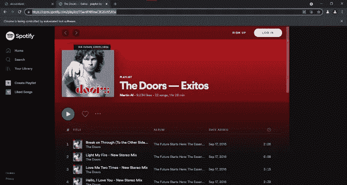

# 使用 JavaScript 从 Spotify 播放列表自动生成 YouTube 播放列表

> 原文：<https://javascript.plainenglish.io/create-a-youtube-playlist-from-a-spotify-playlist-using-javascript-bb84b1532638?source=collection_archive---------9----------------------->

## 用 JavaScript(Chrome+puppeter+node . js)构建一个 web scraper


Photo by [Norbert Buduczki](https://unsplash.com/@buduczki?utm_source=medium&utm_medium=referral) on [Unsplash](https://unsplash.com/?utm_source=medium&utm_medium=referral)

如果你非常喜欢看音乐视频，你一定会喜欢在 YouTube 上自动创建播放列表。好吧，让我们试试有趣的东西。

我是一个音乐爱好者，我一直在听我喜欢的歌曲，但我不仅喜欢听他们还喜欢看他们的视频。然而，我有许多包含许多曲目的播放列表，逐一搜索每个视频会花费我太多的时间。

如果我们可以从 Spotify 等音乐流媒体网站导出一个播放列表，并自动生成相同的播放列表，但带有视频，那就太好了。你不觉得吗？

所以，这一次，我们将开发一个 web scraper 来帮助完成这项任务。


Final result

# 开始前

开始之前，我们需要在我们的计算机上安装 Node 8+。这里 可以看到如何安装 [**。确保选择“当前”版本，因为它是 8+。**](https://nodejs.org/en/)

# 项目设置

首先创建项目目录

```
$ mkdir you-spoti
$ cd you-spoti
```

启动 NPM。并加入必要的细节。

```
$ npm init
```

安装**木偶师**。这里 可以看到入门 [**。如果你想使用最新的功能，你可以直接从它的 GitHub 库安装。**](https://pptr.dev/)

```
$ npm i --save puppeteer
```

木偶师包括它自己的 chrome/chrome，保证可以无头工作。所以，每次你安装或更新木偶师，它会下载其特定的 chrome 版本。

安装 **urlencode。**这个包将帮助我们编码我们的 Scraper 需要访问的 URL。

```
$ npm i urlencode
```

最后，在您喜欢的代码编辑器中打开文件夹，创建一个`index.js`文件。

# 编码

## 第一步

我们将从识别我们的网页抓取器将要访问的 URL 开始。

*   [https://open.spotify.com/](https://open.spotify.com/)—Spotify 网络播放器网址
*   [https://www.youtube.com/](https://www.youtube.com/)——YouTube 的主要网址

如果我们浏览 Spotify 网站，我们会看到这个网站有友好的 URL，这使我们的工作更容易。

通常，我们必须插入要搜索的文本，然后点击网站的搜索按钮，将我们带到下一页的搜索结果，但是我们可以省去这些步骤，只使用下面的 URIs。

*   [https://open.spotify.com/](https://open.spotify.com/)搜索/{ {要搜索的文本}}
*   [https://open.spotify.com/playlist/](https://open.spotify.com/playlist/76wniFNIRnxCXGXIvV5JUw){ {播放列表名称}}

## 用木偶师打开浏览器，在 Spotify 上进行第一次搜索。

正如我们在下面的代码中看到的，在我的例子中，我想搜索艺术家“The Doors”的播放列表，所以我将输入该文本。我们可以看到，我已经用 urlencode 连接了编码文本，以避免 Spotify URLs 出现问题。

默认情况下，木偶师是无头运行的，这意味着我们看不到浏览器。我们确实想看到它，所以我们将这个属性设置为 false。

如果我们执行 scraper，到目前为止，我们将停留在这个屏幕上。

```
$ node index.js
```


Part 1

## 找到播放列表并选择第一个。

在这一部分，我们查找播放列表部分，然后单击第一个播放列表。

为此，我们使用了`page.evaluate`函数。这个函数用于输入给定页面的 DOM，并像在浏览器控制台中一样访问它。

`page.evaluate`内的代码在 chrome 浏览器内运行，所以在脚本中声明在它之外的变量不能被浏览器访问，除非我们把它们作为参数传递。

现在我们在这个屏幕上，在选定的播放列表中。



Part 2

## 恢复播放列表的曲目

现在我们想检索播放列表中包含的所有曲目。为此，我们恢复父选择器的所有子元素，对于每个子元素，我们提取文本并清理它以避免奇怪的字符。

这样，我们将拥有一个包含播放列表中所有曲目的对象。


Part 3

## 在 YouTube 上创建播放列表

最后，我们去 YouTube，一首一首地搜索每首曲目。在的**for**loop**中，我们输入要搜索的曲目名称。在我的例子中，我添加了文本“live”来搜索直播视频，然后单击搜索图标。**

要将曲目添加到播放列表中，我们必须将光标放在视频所在的行上，以便 add 按钮出现在 DOM 中，我们可以单击它。

如果我们看这一部分，我们添加超时，这是因为很多时候木偶师比我们访问的网站更快，我们没有时间在 DOM 中出现我们需要的所有元素。

就是这样！

如果我们运行脚本，我们可以看到神奇！我们可以看到每个曲目是如何添加到列表中的。一旦完成运行，我们将在 YouTube 上拥有我们的 Spotify 播放列表。


Result

**项目回购:**

[](https://github.com/ljaviertovar/you-spoti) [## GitHub-ljaviertovar/you-spoti:Scraper 获取 Spotify 的歌曲并在 youtube 上创建播放列表

### 此时您不能执行该操作。您已使用另一个标签页或窗口登录。您已在另一个选项卡中注销，或者…

github.com](https://github.com/ljaviertovar/you-spoti) 

如果你仍然不清楚网络抓取是如何工作的，你可以看看我以前的文章。

[](https://medium.com/codex/web-scraping-what-is-it-and-what-is-it-used-for-e5c04ac8191) [## 网页抓取:它是什么，它是用来做什么的？

### 了解网络搜集如何帮助您完成日常任务

medium.com](https://medium.com/codex/web-scraping-what-is-it-and-what-is-it-used-for-e5c04ac8191) [](https://medium.com/geekculture/what-you-need-to-know-to-develop-your-first-web-scraper-with-javascript-b3296b758258) [## 用 JavaScript 开发第一个 Web Scraper 需要知道什么

### 网页抓取快速入门指南

medium.com](https://medium.com/geekculture/what-you-need-to-know-to-develop-your-first-web-scraper-with-javascript-b3296b758258) 

**请记住，在抓取之前，您必须考虑网站的服务条款和隐私政策。所以你要为此负责。**

```
**Want to Connect?**Love connecting with friends all around the world on [Twitter](https://twitter.com/ljaviertovar)
```

*更多内容请看*[***plain English . io***](https://plainenglish.io/)*。报名参加我们的* [***免费周报***](http://newsletter.plainenglish.io/) *。关注我们关于*[***Twitter***](https://twitter.com/inPlainEngHQ)[***LinkedIn***](https://www.linkedin.com/company/inplainenglish/)*[***YouTube***](https://www.youtube.com/channel/UCtipWUghju290NWcn8jhyAw)*[***不和***](https://discord.gg/GtDtUAvyhW) *。对增长黑客感兴趣？检查* [***电路***](https://circuit.ooo/) *。***