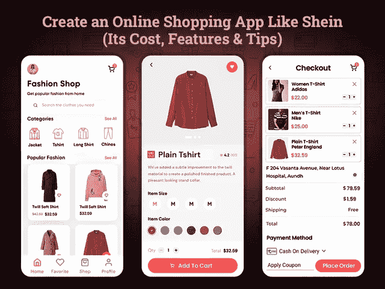

# 创建一个类似 Shein 的应用程序:它的成本、特性和技巧

> 原文：<https://javascript.plainenglish.io/create-an-app-like-shein-its-cost-features-and-tips-dfcca8439613?source=collection_archive---------6----------------------->

## 创建一个像 Shein 这样的电子商务应用程序需要多少成本？

随着电子商务零售额预计将从 42，480 亿美元跃升至 2025 年的[73，910 亿美元，毫无疑问，电子商务行业正逐年变大。](https://www.statista.com/statistics/379046/worldwide-retail-e-commerce-sales/)

零售商正在寻找尽可能好的方式成为这个蓬勃发展的行业的一部分，并效仿领先电子商务应用的应用克隆。考虑到市场份额和调查报告，Shein 就是这样一个在线时尚服装应用程序，它让这个行业火了起来。

毫无疑问，这些年来，时尚品牌见证了其商业模式的快速转变。那时，这些时尚品牌会让你兴奋地直接去商店购物。但现在他们已经开始接触各种电子商务平台来管理他们的销售。因此，创建一个像 Shein 这样的在线购物应用程序已经成为阿联酋零售商关注的焦点。

投资者已经认识到这种应用理念的好处。所以，无论你是零售商还是商业爱好者，如果你登陆了这个博客，可能你心里有一些疑问:

*   *如何创建一个类似于击败亚马逊的 Shein 的电子商务应用？*
*   *创建像 Shein* 这样的在线购物应用的基本特性和功能
*   *创建一个像 Shein Fashion 这样的 App 需要多少成本？*
*   【Shein Like 时尚 App 是如何让客户保持购物消费的？
*   结论:Shein 是快时尚的未来吗？

经过详细的市场调查和统计，我们准备了这份完整的指南来帮助你得到问题的答案。在四处查看之前，让我们直接深入这些点的细节…

## **如何创建一个像 Shein 这样帮助你打败亚马逊的电商手机 App？**

中国电子商务巨头“Shein fashion”应用程序在电子商务行业引起了轰动。通过快速扭亏为盈获得 150 亿美元的收入，它激励了零售商，迫使他们考虑创建一个类似的应用程序。然而，全球各地的许多零售商都想知道从哪里开始，如何创建一个像 Shein Fashion 这样的应用程序？如果你认为你只需要在阿联酋雇佣一家 [**移动应用程序开发公司**](https://www.xicom.ae/services/mobile-app-development/) 来启动你的应用程序，那么请记住它需要的远不止这些。创建和定制一个应用程序从来都不是一件容易的事情。由于 Shein 已经在买家和零售商之间建立了一个值得信赖的平台，因此你需要考虑几个步骤。

> ***创建像 Shein 这样的在线购物应用程序的分步指南，帮助你打败亚马逊***

## **第一步:进行深入的市场调查并收集数据**

如果你正在寻找在竞争激烈的市场中取得成功的方法，那就向你的竞争对手学习。而在开发 Shein 这样的电商 app 时，你需要了解它的 USP 和缺点。它可以为您的应用解决方案增加价值。Shein 主要关注这四个要素:

*   无缝注册流程
*   提供各种搜索过滤器
*   多种付款方式
*   结账和运输细节

## **第二步:app 的 UI/UX 设计**

当谈到创建电子商务应用程序时，公司之间有一个常见的神话，即为应用程序创建一个花哨的界面。相反，使用设计应用程序的标准方法，值得考虑用户的需求。设计应用程序时，请记住您计划在应用程序中实现什么功能。接下来，考虑创建一个屏幕，提供该功能的正确视图以及您希望如何销售它。

你在规划 app 原型上的努力，会让你赢得一半的战斗。毕竟用户体验是每个线上平台的支柱。你可以考虑 [**在阿联酋雇佣一名已经致力于开发顶级电子商务应用的移动应用开发者**](https://www.xicom.ae/services/mobile-app-developers/) 来帮助你设定公司的交易。来到 Shein，它包含了一个简单，易于导航，快速理解的应用程序界面。

## **第三步:为应用添加特性和功能**

Shein 是一个成熟的电子商务应用程序，包括精心设计的特性和功能，这实际上使其成为赢家。因此，如果你打算创建一个像 Shein 这样的在线购物应用程序，请记住，这将需要庞大的预算和时间。但是，作为一个创业公司，最好是用 MVP 或者一个网购 app 的基础版铺开。

## **第四步:与 App 开发团队联系**

要创建一个像 Shein 这样的应用程序，你需要寻找一个由应用程序开发人员、业务分析师、项目经理、UI/UX 设计师、应用程序测试人员等组成的团队。你可以选择在阿联酋外包一家移动应用开发公司，在一个屋檐下为你提供完整的团队。事实上，在这种情况下，与团队的沟通和协调变得容易得多。然而，要确保他们拥有创建电子商务应用的正确技能和知识。

*这些是你需要遵循的基本应用程序开发步骤。但核心问题是如何让它在竞争激烈的市场中脱颖而出。让我们深入了解让你的应用在 2022 年取得成功的特性和功能。*

# **创建像 Shein 这样的在线购物应用程序的基本特性和功能**

尽管你模仿了一个领先的购物应用，但除非你给你的应用添加一些独特的东西，否则你不会成功。推出另一个类似的应用程序没有意义。因此，对应用程序中需要实现的特性和功能列表进行优先排序是有意义的。

一个有用功能有限的应用程序可以帮助你抓住用户的注意力。不要加载一个功能过多的应用程序，要确保你实现的是一个能给你的应用程序增加价值的应用程序。

*在这里，我们创建了一个在开发像 Shein:* 这样的在线购物应用时必须考虑的基本功能列表

*   **用户登录:**像 Shein 这种易于访问且简单的用户登录功能可以帮助你抓住用户的注意力。与其询问太多细节，不如简单快速地注册一个应用。如果你计划 [**为市场创建一个类似 Shein**](https://www.xicom.ae/services/mobile-app-development/) 的在线购物应用程序，请记住该应用程序的简单易用性将确保最终用户的无缝体验。确保用户可以通过输入他们的姓名和电子邮件 id 或电话号码来访问。更简单地说，你可以考虑社交媒体整合。
*   **搜索框:**用户一登陆主页，就立刻进入搜索选项。这个特性对于整合到你的按需市场和 Shein 这样的电子商务应用非常重要。允许用户使用多个搜索过滤器找到他们喜欢的产品。你可以在阿联酋雇佣一个了解当地市场可能使用的搜索词的应用程序开发人员。否则，允许用户根据类别、价格、风格、品牌、尺寸等过滤产品。由于用户没有那么多时间去探索所有类别的产品，因此，让他们过滤他们的搜索。
*   **添加到购物车:**在您的应用中实现该功能将允许用户在不离开当前购物页面的情况下快速将产品添加到购物车中。稍后，在购物车中，他们可以查看价格分解和其他细节，包括交付时间。
*   **支付网关集成:**由于人们使用多种支付方式，因此，实现多种支付功能是值得的。该功能允许用户使用信用卡、借记卡、PayPal、Google Pay、UPI 灵活性、货到付款等进行支付。
*   **推送通知:**这是一个完美的营销工具，可以帮助你保持用户对你的品牌的关注。通过推送通知，您可以让目标受众了解最新的每项优惠、折扣、促销代码、交易等信息。该功能会提醒用户折扣，并最终提高应用的打开率。
*   **我的订单:**该功能实际上允许用户查看订单的完整细节。他们可以检查产品交付日期和产品到达用户地址的时间。
*   **应用内聊天和支持:**这是 Shein-like 著名时尚购物应用的高级功能之一。该功能为客户提供 24/7 的客户支持，并允许他们获得对其查询的即时回复。
*   **评论和评级:**根据购物体验，允许用户分享他们的反馈，并向服务提供商提供评级。用户评分和评论有助于其他用户在应用内购买更多产品。

如果你计划用 15，000 美元以上的预算启动你的电子商务购物应用，这些是你可以考虑实现的最基本但最常见的功能。有了这些功能，你可以在短短 3 到 4 个月内发布你的应用。但如果你要与 Shein 电子商务应用竞争，那么我们在这里推荐一些独有的特性和功能，你可以考虑在应用中实现。

## **创建时尚购物应用的现代功能，如 Shein**

*   首次订购免费优惠券:首次购买提供统一折扣将是一项非常有利可图的功能。这将有助于你提高销售额，并迅速扩大用户群。
*   **1000+新鲜到货:**不断刷新存量，鼓励用户更频繁地打开你的 app。
*   **选择类别:**确保在你的应用上获得轻松愉快的购物体验。允许用户选择类别以快速找到符合其需求的产品。
*   **列出时尚博主:**这将是你 app 的一大亮点。有时，人们会寻找专业的时尚建议，将它们都放在你的应用程序中，将确保用户获得满意的购物体验。
*   **最快发货:**毫无疑问，Shein 最低的价格是对用户最大的吸引力。但是，通过这个 app 购买总是虚张声势。你可以 [**雇佣一个手机应用开发者**](https://www.xicom.ae/services/mobile-app-developers/) 来提供最快的交付保证。确保他们以一种用户可以很快注意到的方式定制它，并且能够没有任何麻烦地下订单。
*   **新产品类别:**在主页上添加此功能，并允许用户直接点击新品。
*   **与朋友分享风格:**通过整合社交媒体平台，您可以让用户直接在社交媒体上与朋友分享时尚风格和言论。
*   **安排送货:**添加根据您的空闲时间安排送货应用程序的功能。允许用户在应用程序中提及首选的交付时间和日期。
*   **实时订单跟踪:**在你的电子商务应用中，这是一个非常重要的功能，因为它可以让客户持续跟踪他们的订单。这将为他们提供关于产品交付时间的想法。
*   **优惠和折扣:**它可以通过每天在你的应用程序上推出新的优惠和交易来帮助你增加业务销售额。这也将增加客户检查你的应用程序中的新内容的兴奋度。
*   **试穿功能:**通过利用 AR 技术，你可以让你的应用在竞争中脱颖而出。这将允许用户虚拟体验产品的外观，并迅速做出购物决定。

通过将所有这些功能集成到你的时尚应用中，我们打赌你会创造出一个有前途的解决方案。但你们中的许多人都很想知道创建一个像 Shein 这样的电子商务购物应用程序需要多少成本？

## **创建一个 Shein Fashion 这样的 App 需要多少成本？**

在估算创建 Shein 这样的电子商务应用程序的成本时，您可能需要 15，000 美元以上的预算。想知道为什么这么便宜？这是因为 Shein 有一个超级简单的界面，并与有限但非常有用的功能。但是你不能忽视它是在 2004 年开发的。随着其他电子商务应用程序(如亚马逊、易贝)的新兴技术和创新，你不能只使用基本的应用程序结构。

对于创业公司、企业家和其他大小零售商来说，开发 Shein 的复制品很容易负担得起。然而，使用高级特性和功能，应用程序开发成本估计可高达 25，000 美元以上。为了获得应用程序开发成本的真实估计，我们总是建议在阿联酋雇佣一家移动 [**应用程序开发公司**](https://www.xicom.ae/services/mobile-app-development/) ，该公司会用应用程序开发方法评估你的商业想法。考虑到应用程序的复杂性、特性和功能、技术、应用程序测试、UI/UX 设计、操作系统的选择等等，他们会得出应用程序开发成本的结论。

要做出明智的决定，你可以先了解 Shein 如何让他们的顾客参与购物。相应地，得到一个想法，并优先考虑这些功能。让我们朝着开发一个像 Shein 这样成功的电子商务应用程序的提示前进。

## **创建像 Shein 一样成功的网上购物应用的技巧**

当你最终决定建立一个像 Shein 这样的电子商务 app 时，你一定在想“***Shein Like 时尚 App 是如何让他们的客户保持购物消费的？”*** *。嗯，Shein 通过使用这样的战略技巧撼动了电子商务领域。所以我们在这里讨论 Shein 用来吸引顾客和鼓励他们购物的一些策略。*

*   **所有偷偷摸摸的款式价格便宜**

在 Shein 的应用程序上，顾客可以以低至 3 美元的价格购买时尚服装，7 美元的价格购买鞋子，甚至 1 美元的价格购买一些配饰。Shein 提供与流行品牌相似的自有品牌服装的策略使其在市场上一枝独秀。

*   **对供应链的全面控制**

你们中的许多人想知道 Shein 是如何管理低成本服装的。原因是，它可以快速利用趋势，而不必担心库存。此外，它不会承诺任何交付日期。该产品最早可在 15 天内交付，晚则一个月。因为最低的产品价格，顾客高兴地等待发货。

*   **更新新样式**

像 Zara 这样的全球时尚品牌过去常常通过每隔几周更新数百种新款式而成为头条新闻。这就是 Shein 一天内增加 2000 多种新款式的动力所在。这就是吸引普通购物者和内容创建者批量购物的原因。

*   **Shein 一直很受内容创作者的欢迎**

这款应用持续受欢迎的最大原因是，内容创作者经常推广 Shein。这使得 Shein 能够发展和保持其客户群。

*   **与名人的有偿合作**

由于许多名人信任这个应用程序，它有助于 Shein 在人们中间建立一个值得信赖的品牌。

*   **贵宾庇护系统**

这正是影响顾客继续从 Shein 购物的原因。Shein 通过其奖励系统成功吸引了顾客的注意力。VIP Shein 系统分为三层——S1、S2、S3，并移动到最高层。

*   通过下一个订单或 1 美分的订单，您将处于 S1 级别。
*   通过下两个订单或 90 美元的订单，客户将处于 S2 级别。
*   要达到 S3 的水平，你需要下 5 个订单或花费 300 美元。

顶层将确保快速退款和独家促销的好处。不仅如此，Shein 还会奖励每笔购物的购物积分。

总而言之，Shein 设计了一个持续的购物周期，使其获得了数十亿美元的收入。

## 结论:她是快时尚的未来吗？

凭借定制产品系列和独家购物交易，Shein 已经在电子商务领域树立了标杆。打造 Shein 这样的网购 app，会让你离竞争更近一步。但要赢得这场游戏，你可以考虑在阿联酋雇佣一家 [**移动应用开发公司**](https://www.xicom.ae/services/mobile-app-development/) 。他们将收集市场数据，并实现满足客户新需求的现代功能的最佳选择。他们从用户的角度评估业务需求，并开发一个确保购物界面流畅的应用程序。此外，专业人士将帮助您整合最新的技术，使它们在未来也能存在。

所以无论你是打算开始一个电子商务应用程序，还是在寻找一个团队来扩展你现有的购物平台，那么你可以 [**联系我们**](https://www.xicom.ae/contact/) 或者在下面提出疑问！

======================================

*更多内容请看*[*plain English . io*](https://plainenglish.io/)*。报名参加我们的* [*免费每周简讯*](http://newsletter.plainenglish.io/) *。关注我们*[*Twitter*](https://twitter.com/inPlainEngHQ)*和*[*LinkedIn*](https://www.linkedin.com/company/inplainenglish/)*。加入我们的* [*社区不和谐*](https://discord.gg/GtDtUAvyhW) *。*