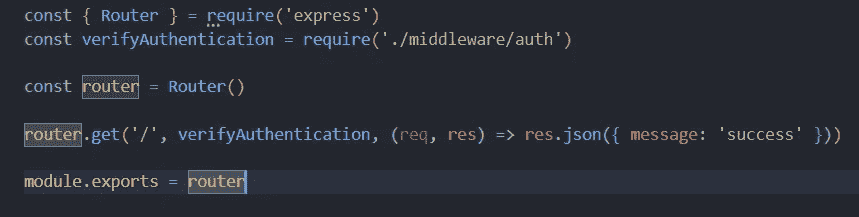

# 创建一个认证服务器，并在后端应用中使用它

> 原文：<https://javascript.plainenglish.io/create-an-authentication-server-and-use-it-across-backend-apps-307af4ef69f9?source=collection_archive---------3----------------------->

Photo by [Markus Spiske](https://unsplash.com/@markusspiske?utm_source=medium&utm_medium=referral) on [Unsplash](https://unsplash.com?utm_source=medium&utm_medium=referral)

# 介绍

今天，我们将讨论如何创建一个隔离的环境来管理您的身份验证请求，以及如何有效地将其添加为保护 API 的中间件

我们要遵循的总体思路是，首先，我们将创建一个常规服务器，它将有一个简单的请求，我们需要保护它，因此我们将创建一个中间件，它将接收标头并确保我们有正确的访问权限。我们还将使用 API_KEY 身份验证来防止内部使用。现在你有了基本的想法，让我们开始吧

## 为什么我们需要认证服务器？

你可能想知道为什么我们需要一个认证服务器，我们不能只在一个服务器上处理吗？显然，你可以，但当你的应用开始增长时，你可能需要将你的单片应用转移到微服务级别，这种策略将帮助你

# 设计认证服务器

我们会让事情变得简单。在我们的身份验证中，我们不会查看来源或网关，而只查看身份验证令牌和 API 密钥。首先，我已经创建了一个样例 Express 应用程序，其中我们只是导入了路由，并使用了默认的错误处理和一个解析器

express app

甚至认证服务器也需要保护，所以我们也将定义一个中间件规则来保护它。对于这个例子，我使用的是 [API_KEY](https://en.wikipedia.org/wiki/API_key) ，但是你也可以创建 [oAuth](https://en.wikipedia.org/wiki/OAuth) 或者 [Basic Auth](https://en.wikipedia.org/wiki/Basic_access_authentication) 。为了使用它，我创建了一个文件，其中包含一个中间件，该中间件将检查 API_KEY，如果有任何不正确的地方，就会使用一个伪数据源抛出一个错误

API-key middleware

这里，我们使用我们的虚拟数据源检查 API 键是否存在和有效，如果案例失败则抛出错误，否则从路由调用下一个控制器

现在，我们有了一个中间件设置，我们实际上可以从 API 开发开始了。我们将只创建 2 条路线，但您可以根据需要创建多条路线

*   注册
*   确认

我已经创建了一个实用程序文件，它将创建或验证令牌，以便我们可以直接使用控制器内部的方法。我使用`jsonwebtoken`包来生成或验证，但你可以使用你喜欢的

Jwt utility functions

这里，我们仅使用`sign`和`verify`方法，但理想情况下，您也应该使用`decode`方法让您的应用程序为过期令牌及其后的流程做好准备

既然现在我们已经设置好了一切，让我们创建路线

routes

在这里，我们导入了所有的依赖项，并为登录和验证创建了一个路由。在登录 API 中，您可以执行任何与数据库相关的操作，然后有条件地生成令牌，但是在本例中，我跳过了这一部分，直接从`req.body.payload`发送令牌。另一方面，对于验证，我们获取授权头，然后使用`verifyToken`方法来验证令牌是否有效

如果一切正常，那么在运行服务器和 API 之后，我们将收到以下输出:

这是它，我们的认证服务器准备好响应。下一步将是在任何其他微服务应用程序中使用该服务

# 使用认证服务

要使用我们刚刚创建的认证服务，我们需要使用 HTTP 请求提供者。我会选择 Axios，但是您可以选择任何您选择的提供商

我写了一篇文章，将帮助我们创建外部 API 调用，并使之更加敏捷。下面是这篇文章的链接，我会推荐你也去看看。

 [## 如何处理 Axios 和 NodeJs 中的不同端点

### 为 Axios 创建基于类的实例，并有效地使用它们。

javascript.plainenglish.io](/how-to-handle-different-endpoints-in-axios-and-nodejs-8b288d92e940) 

## 服务生成器

我们将从创建一个生成器类开始，它将为所有请求处理`api_key`逻辑:

Auth service generator

这里，我们创建了一个将 API_KEY 作为构造函数参数的类。这个类将创建一个 axios 实例，头中有`baseURL`和`api_key`，还将`10000ms`设置为任何 API 的超时。除了这些属性，我们还将公开`login`和`verify`方法，这些方法将调用我们为 auth service 创建的 API

除了生成器之外，我们还将创建一个`index.js`文件，该文件将创建该类的一个实例，并向我们公开该方法:

instance creation

这将是它，我们有一个类，将与认证服务互动，并负责管理变化单例。

## 创建验证中间件

现在，我们的服务到位了。下一步是创建一个为我们处理验证的中间件:

auth service middleware

这里，我们创建了一个中间件，它将从 req 对象中提取消息头，并将其传递给我们之前创建的`verify`方法

## 创建路线

这个过程的最后一步是创建一个路由并使用中间件。首先，我们需要导入我们创建的中间件，然后在任何路线上使用它进行测试。通过的情况是所有未授权的请求将被阻止，只有授权的请求才能访问 API。

creating route

为了测试这个 API，我们需要传递我们在`login` API 上获得的授权令牌，并将其传递到这里。我们不需要通过`api_key`，因为它对服务级别有限制。

fail case scenario

如果我们没有传递令牌或者传递了一个格式错误的令牌，那么它将导致一个未授权的请求。

pass case scenario

我们微服务架构的通过案例场景

# 结论

我们为微服务创建了 2 个服务架构，但您可以增加服务以使用授权服务，它将在复制处理程序时完美地工作。您可以在下面找到源代码:

 [## GitHub-Piyush-Use-Personal/create-auth-service

### 此时您不能执行该操作。您已使用另一个标签页或窗口登录。您已在另一个选项卡中注销，或者…

github.com](https://github.com/Piyush-Use-Personal/create-auth-service) 

谢谢，祝编码愉快！

*更多内容看* [***说白了。报名参加我们的***](https://plainenglish.io/) **[***免费周报***](http://newsletter.plainenglish.io/) *。关注我们关于* [***推特***](https://twitter.com/inPlainEngHQ)[***LinkedIn***](https://www.linkedin.com/company/inplainenglish/)*[***YouTube***](https://www.youtube.com/channel/UCtipWUghju290NWcn8jhyAw)*[***不和***](https://discord.gg/GtDtUAvyhW) *。*****