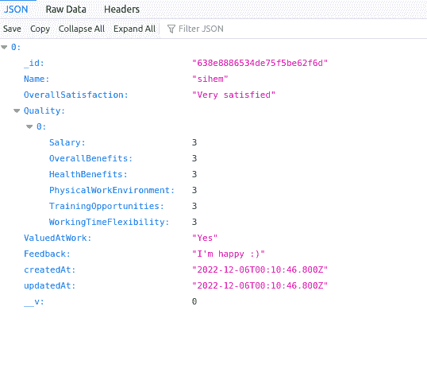

# 使用 Angular 创建员工满意度调查，并将结果存储在 MongoDB 集合中

> 原文：<https://javascript.plainenglish.io/create-an-employee-satisfaction-survey-using-angular-and-store-results-in-a-mongodb-collection-388245c76f55?source=collection_archive---------3----------------------->

## 使用 Angular 和 SurveyJS(一个免费的开源调查库)构建员工满意度调查的分步指南。

***原文由***[***SIHEM BOUHENNICHE***](https://medium.com/u/a535af0e2f00?source=post_page-----388245c76f55--------------------------------)***写成。***


# 目录

*   介绍
*   为什么要调查？
*   构建调查
*   设置角度项目
*   安装和配置 SurveyJS
*   创建员工满意度调查
*   设置 MongoDB 数据库
*   将结果存储在 MongoDB 集合中
*   结论

# 介绍

员工满意度调查可以为员工和雇主带来许多好处。

对于员工来说，满意度调查可以帮助他们感受到雇主的倾听和重视，从而提高士气和工作满意度。

对于雇主来说，满意度调查可以提供有价值的见解，让他们了解组织内哪些方面做得好，哪些方面需要改进。这可以帮助雇主就如何支持员工和改善整体工作环境做出明智的决定。

满意的员工工作效率更高，更投入，这可以增加业务价值。相反，如果你的组织里有不开心的人，你会损失利润。抓住这个脉搏总是有益的，像这样的内部调查会有所帮助。

在本文中，我们将构建这样一个调查，但在我们继续之前，让我们先来看看我们将使用的技术:

*   [**Angular**](https://angular.io/)**:**用于创建单页面应用的应用设计框架和开发平台。
*   [**survey js**](https://surveyjs.io/form-library?utm_source=medium&utm_medium=referral&utm_campaign=JS_in_Plain_English_8)**:**一个免费的开源 JavaScript 表单生成器( [Github 链接](https://github.com/surveyjs/survey-library))，它使得创建自托管表单变得更加简单和容易。
*   [**MongoDB**](https://www.mongodb.com/)**:**一个面向文档的数据库。归类为无 SQL 数据库。MongoDB 使用带有可选模式的类似 JSON 的文档。

有人可能会说 Angular 虽然是首选的企业框架，但它并没有为开发人员提供很好的体验来构建可以很好地处理多个问题的调查。但是在本文中，您将发现一种使用 Angular 设计企业调查的优雅方式——对于您希望有条件显示的每个问题，不需要 ngIf 和 ng 模板对，也不需要一堆绑定。

这就是调查的用武之地。使用这个开源库，我们可以以动态的方式促进表单的创建和操作。我们将在后面更详细地探讨这一点。现在，让我们看看要在调查中加入哪些问题。

**本次调查中的问题详见下表:**

我们的员工满意度调查将涵盖各种问题，以确定员工是否对自己的工作满意，如果不满意，原因是什么。

在下一节中，我们将了解为什么我们要使用 SurveyJS 作为构建该调查的首选工具。

# 为什么要调查？

以下原因说明了为什么我们应该将 SurveyJS 与 Angular 结合使用，而不是用 Angular 原语手工设计表单/调查。

*   **创建自主调查。**通过这种方式，我们可以保护我们的数据，并将其存储在我们选择的数据库中，而不是使用其他在线服务，如将结果存储在 Google Sheets 文件中的 Google Forms。
*   **轻松创建复杂的调查**，其中包括条件逻辑和分支，使我们的表单更加明确，更适合许多情况，而不必嵌入额外的 JavaScript。
*   **创建易于更新的动态表单**。SurveyJS 表单基于数据优先的模型，所以我们要做的只是更新 JSON 表单模型。
*   **包括各种带验证的输入组件**，如多行输入、复选框、下拉框、矩阵问卷、文件上传等，让我们在设计表单和调查时更加灵活。
*   **创建多语言调查**。这样，我们可以只创建一个调查，而不是为每种语言创建许多调查。

除了所有这些好处之外，SurveyJS 还让我们有可能使用它们漂亮的表单组件，或者我们可以用 CSS 定制一切，使这些组件更加个性化，并符合我们的品牌主题。

现在，是时候开始建设了。让我们开始吧。

# 构建调查

## 步骤 1:设置角度项目

首先，我们应该确保我们已经安装了最新版本的 Angular CLI。

```
npm install -g @angular/cli
```

我们可以在这里 **了解更多关于 Angular CLI 的信息，找到更多关于安装 [**的细节。**](https://angular.io/guide/quickstart)**

安装 Angular CLI 后，我们可以使用 ng 命令创建我们的 Angular 应用程序，如下所示:

```
ng new employee-satisfaction-survey-app
```

该命令将生成具有以下结构的应用程序:


App structure

## 步骤 2:安装和配置 SurveyJS

现在我们已经创建了我们的应用程序，让我们用下面的代码安装 SurveyJS 库(关于安装的更多细节，您可以参考官方的 [**文档**](https://surveyjs.io/form-library/documentation/get-started-angular?utm_source=medium&utm_medium=referral&utm_campaign=JS_in_Plain_English_8) ):

```
npm install survey-angular-ui — save
```

安装 SurveyJS 后，我们将开始配置:

**步骤 2.1:引用 angular.json 中的 SurveyJS 样式表 UI**

SurveyJS 有两种不同的样式表 Modern 和 DefaultV2，如下图所示:


SurveyJS UI themes ([https://surveyjs.io/form-library/documentation/get-started-angular](https://surveyjs.io/form-library/documentation/get-started-angular))

```
{
  “$schema”: “./node_modules/@angular/cli/lib/config/schema.json”,
  “version”: 1,
  “newProjectRoot”: “projects”,
  “projects”: {
    “employee-satisfaction-survey-app”: {
      “projectType”: “application”,
      “schematics”: {},
      “root”: “”,
      “sourceRoot”: “src”,
      “prefix”: “app”,
      “architect”: {
        “build”: {
          “builder”: “@angular-devkit/build-angular:browser”,
          “options”: {
            …
            “styles”: [
              “src/styles.css”,
              “node_modules/survey-core/defaultV2.min.css”,
              // Modern theme
              “node_modules/survey-core/modern.min.css”
            ],
            “scripts”: []
          },
          “configurations”: {
            …
          },
          “defaultConfiguration”: “production”
        },
        “serve”: {
          …
        },
        “extract-i18n”: {
          …
        },
        “test”: {
          …
        }
      }
    }
  }
}
```

**步骤 2.2:在您的应用程序组件中应用引用的主题**

为此，我们将使用`StyleManager.applyTheme(theme-name);`方法，并将主题名称作为参数传递(`“modern”`或`“defaultV2”`)。

```
import { StylesManager } from “survey-core”;

StylesManager.applyTheme(“modern”);
```

**步骤 2.3 创建调查模型**

根据调查报告[文件](https://surveyjs.io/form-library/documentation/design-survey/create-a-simple-survey?utm_source=medium&utm_medium=referral&utm_campaign=JS_in_Plain_English_8#create-a-survey-model):

模型描述了你的调查的布局和内容。最简单的调查模型包含一个或几个没有布局修改的问题。

模型由一个 JSON 对象组成，该对象声明了我们的问题及其类型。这个 JSON 对象被称为模式。

例如，这个简单的模式包含一个在**元素**数组中声明的问题。

```
const surveyJson = {
  elements: [ // every element contains a question
   {
     name: ‘Name’,// field name
     title: ‘Enter your full name:’,// field title
     type: ‘text’,// field type
   },
  ],
};
```

然后，让我们通过将模式传递给[模型](https://surveyjs.io/Documentation/Library?id=surveymodel&utm_source=medium&utm_medium=referral&utm_campaign=JS_in_Plain_English_8)构造函数来实例化一个模型，如下面的代码所示:

```
import { Component, OnInit } from ‘@angular/core’;
import { Model, StylesManager } from “survey-core”;

StylesManager.applyTheme(‘modern’);

const surveyJson = {
  elements: [
  {
     name: ‘Name’,
     title: ‘Enter your full name:’,
     type: ‘text’,
  },
 ],
};

@Component({
   selector: ‘app-root’,
   templateUrl: ‘./app.component.html’,
   styleUrls: [‘./app.component.css’],
})
export class AppComponent implements OnInit {
  title = ‘employee-satisfaction-survey-app’;
  surveyModel: Model | undefined;

  ngOnInit() {
    const survey = new Model(surveyJson);
    this.surveyModel = survey;
  }
}
```

**步骤 2.4:将 SurveyJS 模块添加到** `**app.module.ts**`

为了呈现我们的调查，我们需要在`app.module.ts`中导入 SurveyJS 表单库模块。

```
import { NgModule } from ‘@angular/core’;
import { BrowserModule } from ‘@angular/platform-browser’;
import { AppRoutingModule } from ‘./app-routing.module’;
import { AppComponent } from ‘./app.component’;
import { SurveyModule } from ‘survey-angular-ui’;

@NgModule({
  declarations: [AppComponent],
  imports: [BrowserModule, AppRoutingModule, SurveyModule],
  providers: [],
  bootstrap: [AppComponent],
})
export class AppModule {}
```

然后，我们将添加一个`<survey>`元素到我们的组件模板中，并将我们在上面创建的模型实例作为`model`属性传递:

```
<survey [model]=”surveyModel”></survey>
```

**步骤 2.5:运行应用**

最后，让我们运行我们的应用程序:

```
npm run start
```

如果您遵循了这些步骤，您将得到以下输出:


## 步骤 3:创建员工满意度调查

现在让我们关注一下调查模式，看看如何根据满意度调查的每个问题使用不同的组件类型。

如果我们看一下我们的满意度调查，我们会发现我们需要 4 种类型的组件:

*   简单文本字段:`text`
*   简单文本区域字段:`comment`
*   单选组字段:`radiogroup`
*   单选按钮组矩阵:`matrix`

关于 SurveyJS 提供的不同组件的更多细节，可以看看[表单库 API](https://surveyjs.io/form-library/documentation/surveymodel?utm_source=medium&utm_medium=referral&utm_campaign=JS_in_Plain_English_8) 。

在确定了我们需要的组件之后，让我们更新我们的 JSON 模式:

```
const surveyJson = {
  title: ‘Your opinion counts!’,
  description: ‘Please express what you think about your job?’,
  pages: [
   {
     elements: [
       {
         name: ‘Name’,
         title: ‘Enter your full name:’,
         type: ‘text’,
       },
       {
         name: ‘OverallSatisfaction’,
         title:
           ‘How would you describe your overall level of job satisfaction?’,
         type: ‘radiogroup’,
         isRequired: true,
         choices: [
           ‘Very satisfied’,
           ‘Satisfied’,
           ‘Neutral’,
           ‘Dissatisfied’,
           ‘Very dissatisfied’,
         ],
       },
       {
         name: ‘Quality’,
         title: ‘How would you rate the following?’,
         type: ‘matrix’,
         isRequired: true,
         columns: [
           {
             value: 1,
             text: ‘Very poor’,
           },
           {
             value: 2,
             text: ‘Poor’,
           },
           {
             value: 3,
             text: ‘Average’,
           },
           {
             value: 4,
             text: ‘Good’,
           },
           {
             value: 5,
             text: ‘Excellent’,
           },
         ],
         rows: [
           {
             value: ‘Salary’,
             text: ‘Salary’,
           },
           {
             value: ‘OverallBenefits’,
             text: ‘Overall benefits’,
           },
           {
             value: ‘HealthBenefits’,
             text: ‘Health benefits’,
           },
           {
             value: ‘PhysicalWorkEnvironment’,
             text: ‘Physical work environment’,
           },
           {
             value: ‘TrainingOpportunities’,
             text: ‘Training opportunities’,
           },
           {
             value: ‘WorkingTimeFlexibility’,
             text: ‘Working time flexibility’,
           },
         ],
       },
       {
         name: ‘ValuedAtWork’,
         title: ‘Do you feel valued at work?’,
         type: ‘radiogroup’,
         isRequired: true,
         choices: [‘Yes’, ‘No’],
       },
       {
         name: ‘Explanation’,
         title: ‘If no please explain’,

         visibleIf: “{ValuedAtWork}=’No’”,
         type: ‘comment’,
       },
       {
         name: ‘Feedback’,
         title: ‘Please Provide Any Additional Feedback’,
         type: ‘comment’,
       },
     ],
   },
 ],
};
```

**注:**

*   要将问题标记为必填，只需添加`**isRequired**`属性。
*   为了设置问题的类型，我们使用`**type**`属性。
*   为了在条件满足时显示一些字段，我们使用了`**visibleIf**`属性。

然后，保存并刷新我们的应用程序，在浏览器中查看修改:


Employee satisfaction survey

为了在用户完成调查后对其进行处理，我们应该使用 [onComplete](https://surveyjs.io/Documentation/Library?id=surveymodel&utm_source=medium&utm_medium=referral&utm_campaign=JS_in_Plain_English_8#onComplete) 事件处理程序。例如，让我们在浏览器控制台中记录(打印)结果。

将以下代码添加到您的`app.component.ts`中:

```
import { Component, OnInit } from ‘@angular/core’;
import { Model, StylesManager } from ‘survey-core’;

// const SURVEY_ID = 1;

StylesManager.applyTheme(‘modern’);

const surveyJson = {
  …
};

@Component({
  selector: ‘app-root’,
  templateUrl: ‘./app.component.html’,
  styleUrls: [‘./app.component.css’],
})
export class AppComponent implements OnInit {
  title = ‘My First Survey’;
  surveyModel: Model;
  logSurveyResults(sender) {
    console.log(sender.data);
  }
  ngOnInit() {
    const survey = new Model(surveyJson);
    survey.onComplete.add(this.logSurveyResults);
    this.surveyModel = survey;
  }
}
```

完成调查后，保存、刷新并打开浏览器控制台以查看显示的结果:


既然我们已经构建了调查，接下来我们将了解如何配置数据库来存储调查数据。

## 步骤 4:设置 MongoDB 数据库

在现实世界的应用程序中，我们不在控制台中记录结果，但是我们将在其他 web 服务中使用这些结果。事实上，我们应该将结果发送到服务器，在那里它们将被存储在数据库中并由系统处理。

为了使我们的例子更加完整，我们将使用 [**Express**](https://expressjs.com/) 和 [**MongoDB**](https://www.mongodb.com/) 创建一个简单的 API。该 API 将接收我们满意度调查的结果，并将它们存储在数据库中。

我们先确保已经安装了 node、npm 和 MongoDB(可以从 [**这里**](https://www.mongodb.com/docs/manual/installation/) **下载)。**

```
$ node -v
$ npm -v
$ mongo -v
```

然后，我们创建 Node.js 应用程序并安装所需的包。为此，我们将使用:

*   [**Express**](https://expressjs.com/) :一个极简的 Node.js web 应用框架，为 web 和移动应用提供一组特性。
*   [**Node mon**](https://www.npmjs.com/package/nodemon)**:**一个帮助开发基于 Node.js 的应用程序的工具，通过在检测到目录中的文件发生变化时自动重启 node 应用程序。
*   [**mongose**](https://mongoosejs.com/)**:**一个 MongoDB 对象建模为 Node.js。

```
$ mkdir employee-satisfaction-survey-api
$ cd employee-satisfaction-survey-api
$ npm init
$ npm install express nodemon mongoose — save
```

之后，我们将创建以下应用程序结构:


API project structure

*   **package.json:**

```
{
  “name”: “employee-satisfaction-survey-api”,
  “version”: “1.0.0”,
  “description”: “Employee satisfaction survey api”,
  “main”: “index.js”,
  “scripts”: {
    “start”: “nodemon index.js”
   },
  “author”: “Sihem BOUHENNICHE”,
  “license”: “ISC”,
  “dependencies”: {
    “express”: “⁴.18.2”,
    “mongoose”: “⁶.7.4”,
    “nodemon”: “².0.20”
   }
}
```

*   **index.js:** 我们 API 的入口点，它包含 Express app 和 routes 声明:

```
// Import dependencies
const express = require(“express”);
const database = require(“./initdb.utils”);

// Create app instance
const app = express();

// Define JSON as return type
app.use(express.json());
app.use(express.urlencoded({ extended: true }));

// Configure headers
app.use((req, res, next) => {
  res.setHeader(“Access-Control-Allow-Origin”, “*”);
  res.setHeader(“Access-Control-Allow-Methods”, “GET, POST, PUT, DELETE”);
  res.setHeader(“Access-Control-Allow-Headers”, “Content-Type”);
  res.setHeader(“Access-Control-Allow-Credentials”, true);
  next();
});

// DEFINE ROUTES
app.use(“/hello”, (req, res) => {
  res.status(200).json({ message: “Hello world !” });
});
app.use(“/surveys”, require(“./survey.routes”));

// This route will handle all the requests that are
// not handled by any other route handler. In
// this handler we will redirect the user to
// an error page with NOT FOUND message and status
// code as 404 (HTTP status code for NOT found)
app.all(“*”, (req, res) => {
  res.status(404).json({ error: “End point not found” });
});

// Handle database error
database.on(“error”, (error) => {
  console.log(“Connection error: — — — — — — — — — — — — — “);
  console.log(error);
  console.log(“ — — — — — — — — — — — — — — — — — — — — — — “);
});

// Start app after connecting to Database
database.once(“connected”, () => {
  console.log(“Database Connected”);

  const PORT = 3001;
  app.listen(PORT, () => console.log(“Server ready at 3001”));
});
```

*   **initdb.js:** 包含与我们数据库的连接配置

```
const mongoose = require(“mongoose”);

const MONGO_HOST = “localhost”;
const MONGO_PORT = 27017;
const MONGO_DB_NAME = “surveydb”;
const MONGO_URL = `mongodb://${MONGO_HOST}:${MONGO_PORT}/${MONGO_DB_NAME}`;
const connectOptions = {
  useNewUrlParser: true,
};

mongoose.connect(MONGO_URL, connectOptions);
const database = mongoose.connection;

module.exports = database;
```

*   **survey.model.js** :包含我们的调查模型模式

```
const mongoose = require(“mongoose”);

const SurveySchema = mongoose.Schema(
  {
    Name: String,
    OverallSatisfaction: String,
    Quality: Array,
    ValuedAtWork: String,
    Explanation: String,
    Feedback: String,
  },
  {
    timestamps: true,
    strict: false,
  }
);

module.exports = mongoose.model(“Survey”, SurveySchema);
```

*   包含我们的 web 服务，在我们的例子中，我们将只创建两个服务，一个用于保存调查结果，另一个用于检索结果。

```
const Survey = require(“./survey.model”);

// Create and Save a new Survey
exports.create = (req, res) => {
  const surveyData = req.body;

  // Create a Post
  const survey = new Survey(surveyData);

  // Save Post in the database
  survey
    .save()
    .then((data) => {
      res.send(data);
    })
    .catch((err) => {
      res.status(500).send({
      message:
        err.message || “Some error occurred while creating the survey.”,
    });
  });
};

// Find all surveys
exports.findAll = (req, res) => {
  Survey.find({})
    .then((data) => {
      res.send(data);
    })
    .catch((err) => {
      res.status(500).send({
        message: err.message || “Some error occurred while retrieving data.”,
      });
    });
};
```

*   **survey.routes.js** :包含我们 API 的路径

```
const surveyController = require(“./survey.controller”);
const router = require(“express”).Router();

//CRUD
router
  .post(“/”, surveyController.create)
  .get(“/”, surveyController.findAll);

module.exports = router;
```

现在，让我们通过运行以下命令来启动我们的 API:

```
npm run start
```

如果你去[http://localhost:3001/hello](http://localhost:3001/hello)你会看到“hello world！”

如果您尝试[http://localhost:3001/surveys](http://localhost:3001/surveys)您将得到一个空响应，因为还没有保存任何调查。

在下一节中，我们将使用我们的 API 保存结果。

## 步骤 5:将结果存储在 MongoDB 集合中

现在我们有了自己的 API，让我们更新 **app.component.ts 文件**，而不是仅仅记录调查结果，我们将通过 HTTP 请求将它们发送给我们的 API。

```
import { Component, OnInit } from ‘@angular/core’;
import { Model, StylesManager } from ‘survey-core’;

// const SURVEY_ID = 1;

StylesManager.applyTheme(‘modern’);

const surveyJson = {
  …
};

@Component({
  selector: ‘app-root’,
  templateUrl: ‘./app.component.html’,
  styleUrls: [‘./app.component.css’],
})
export class AppComponent implements OnInit {
  title = ‘My First Survey’;
  surveyModel: Model;
  logSurveyResults(sender) {
    console.log(sender.data);
  }
  saveSurveyResults(sender) {
    const request = new XMLHttpRequest();
    const url = ‘<http://localhost:3001/surveys>';
    request.open(‘POST’, url);
    request.setRequestHeader(‘Content-Type’, ‘application/json;charset=UTF-8’);
    request.send(JSON.stringify(sender.data));
  }
  ngOnInit() {
    const survey = new Model(surveyJson);
    survey.onComplete.add(this.saveSurveyResults);
    this.surveyModel = survey;
  }
}
```

之后，在填写完所有字段后，如果我们单击“完成调查”按钮，数据将被发送到 API:


并且，如果你现在尝试去[http://localhost:3001/surveys](http://localhost:3001/surveys)，你会找到结果:



# 结论

至此，本教程到此结束。你可以使用 SurveyJS [表单库](https://surveyjs.io/form-library?utm_source=medium&utm_medium=referral&utm_campaign=JS_in_Plain_English_8)做很多其他复杂的事情。它是完全免费和开源的，所以你可以随意使用它。

除了自由表单库之外的更多特性，请查看[定价部分](https://surveyjs.io/pricing?utm_source=medium&utm_medium=referral&utm_campaign=JS_in_Plain_English_8)。

这个项目的完整代码可以在这里找到:

*   链接到 Angular app GitHub 知识库:

[](https://github.com/EmployeeSatisfactionSurvey/employee-satisfaction-survey-app) [## GitHub -员工满意度调查/员工满意度调查-应用程序

### 此项目是使用 Angular CLI 版本 15.0.0 生成的。为开发服务器运行 ng serve。导航到…

github.com](https://github.com/EmployeeSatisfactionSurvey/employee-satisfaction-survey-app) 

*   Express API GitHub 资源库的链接:

[](https://github.com/EmployeeSatisfactionSurvey/employee-satisfaction-survey-api) [## GitHub -员工满意度调查/员工满意度调查-api

### 此时您不能执行该操作。您已使用另一个标签页或窗口登录。您已在另一个选项卡中注销，或者…

github.com](https://github.com/EmployeeSatisfactionSurvey/employee-satisfaction-survey-api) 

*更多内容看* [***说白了。***](https://plainenglish.io/)

*报名参加我们的* [***免费每周简讯***](http://newsletter.plainenglish.io/) *。关注我们关于* [***推特***](https://twitter.com/inPlainEngHQ) ，[***LinkedIn***](https://www.linkedin.com/company/inplainenglish/)*，*[***YouTube***](https://www.youtube.com/channel/UCtipWUghju290NWcn8jhyAw)*，以及* [***不和***](https://discord.gg/GtDtUAvyhW) ***。***

***有兴趣规模化你的软件创业*** *？检查* [***电路***](https://circuit.ooo?utm=publication-post-cta) *。*