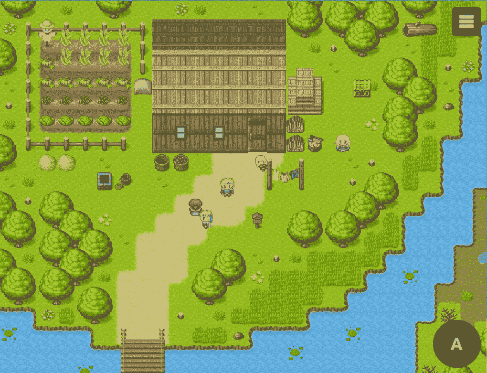
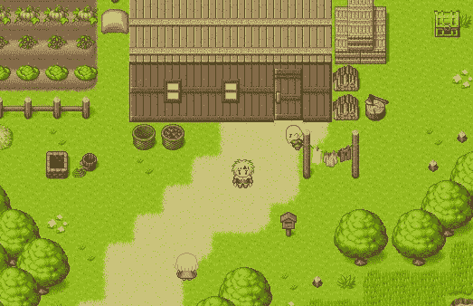
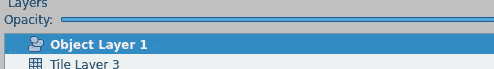
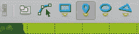
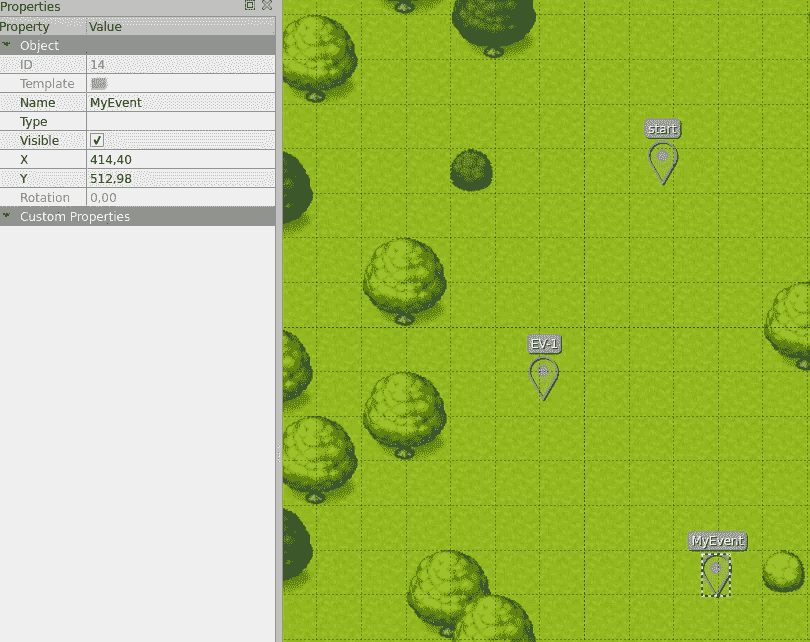

# 用 JavaScript 和 RPGJS 创建你自己的 RPG

> 原文：<https://javascript.plainenglish.io/create-an-rpg-mmorpg-game-in-javascript-in-a-few-minutes-with-rpgjs-8a86a713c2fe?source=collection_archive---------4----------------------->



# 介绍

创作一个游戏并不容易，有很多限制:性能、游戏性、兼容性等等。

创建一个在线游戏更加困难，因为你必须考虑低延迟、节省带宽、避免服务器过载、安全性等等。

问题是，如何在不使你的生活复杂化的情况下创建一个游戏？

JavaScript 中有几种创建游戏的框架:PixiJS、Phaser 等。但是我将谈论 RPGJS，它允许你创建 2D 角色扮演游戏。为什么要这么做？因为游戏玩法已经设定好了。(地图创建，角色移动，滚动，碰撞，动画等。)

# RPGJS 是什么？

我是 RPGJS 的创造者。这是一个开源项目，没有任何公司支持。只是一种挑战自我创造 RPG 的激情

[https://github.com/RSamaium/RPG-JS](https://github.com/RSamaium/RPG-JS)(800 多颗星星！)

> RPG 代表角色扮演游戏。这就像旧游戏如最终幻想，超时空触发器，甚至动作冒险游戏如塞尔达

我在 2011 年开始了第一个版本，但去年我用新的技术栈重新攻击了版本 3。客户端渲染用 PixiJS，服务器设计用 Node.js 和 TypeScript，GUI(菜单、对话框等)用 Vue.js。)

挑战:创建一个允许用相同的代码制作离线 RPG 和 MMORPG 的框架。我建议你在几分钟内创造一个 MMORPG！



Demo

演示: [https://demo.rpgjs.dev](https://demo.rpgjs.dev/)

# 开始

## 先决条件

您必须拥有 Node.js 14 版本。该框架在版本 15+上不工作。

## 装置

打开终端，运行以下命令行:

```
npx degit rpgjs/starter my-rpg-game
cd my-rpg-game
npm install
npm run dev
```

安装需要一点时间。别担心。然后去 [http://localhost:3000](http://localhost:3000) 看第一张渲染图

# 修改地图

我们将使用平铺地图编辑器来修改地图

1.  下载并安装软件([https://www.mapeditor.org](https://www.mapeditor.org/))
2.  进入*src/modules/main/server/maps/tmx/simple Map . tmx*，用平铺地图编辑器打开
3.  可以添加树木、土地等。

# 添加一个字符

1.  仍然在平铺地图编辑器中，转到对象层



Object Layer

1.  用*插入点*工具在地图上插入一个点



Insert Point

3.在 *name* 属性中放入事件的名称



Name property

4.转到 src/modules/main/server/events 并创建 npc.ts 文件。我们把下面的代码:

EvenData 装饰器允许您给出事件的一般信息:

*   第 4 行:上一步的事件名称
*   第 5 行:hitbox。在我们的地图中，一个单幅图块是 32x32px。我们指出，对于更真实的碰撞，hitbox 只有 16px 高。
*   第 11 行:在地图上创建事件时触发 onInit
*   第 12 行:我们给事件一个外观。外观在客户端的文件*src/modules/main/client/characters/characters . ts*中定义

为了更进一步，我们将让角色在玩家与(换句话说，当玩家按下非玩家角色(NPC)上的回车键时)互动时说话

*   第 14 行:当玩家在事件上按 Enter 键时，触发 *onAction* 方法
*   第 15 行:我们在相关的播放器上显示一个对话框。我增加了选项 *talkWith: this* 让角色在与玩家对话时转向玩家。还要注意，这是一个异步方法，因为只有当对话框关闭时，指令才会继续。

5.转到地图*src/modules/main/server/maps/sample map . ts*。我们将在这张地图上添加我们的活动！

第 3 行和第 11 行是唯一的变化。我在*事件*数组中添加了类！

# 结论

这是一个简单但强大的方法。您可以在修改后的地图上添加角色。所有连接的人都将看到新活动！

文档: [https://docs.rpgjs.dev](https://docs.rpgjs.dev/)

帮助:[https://community . rpgjs . dev](https://community.rpgjs.dev/)

*更多内容看* [***说白了就是***](http://plainenglish.io/) *。报名参加我们的* [***免费周报***](http://newsletter.plainenglish.io/) *。在我们的* [***社区不和谐***](https://discord.gg/GtDtUAvyhW) *获得独家获取写作机会和建议。*