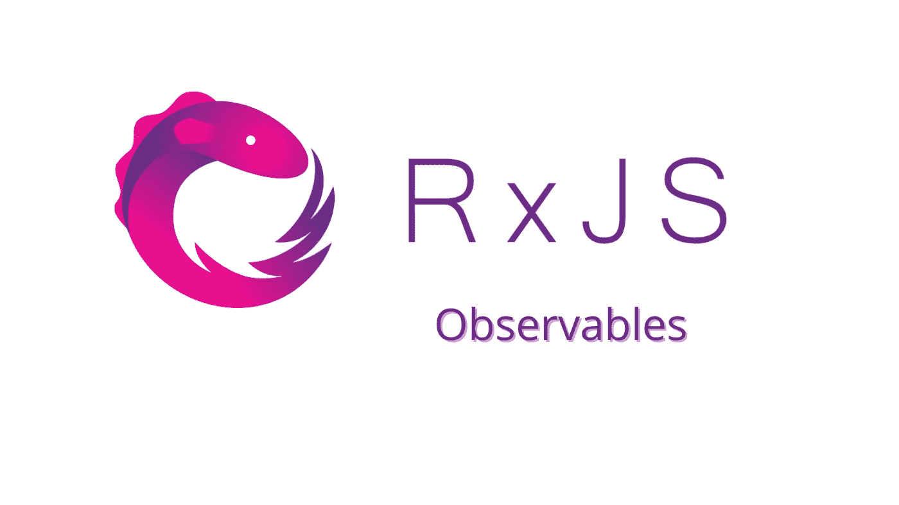

# 创建 RxJS 可观察值

> 原文：<https://javascript.plainenglish.io/create-an-rxjs-observable-98b90ecfda8e?source=collection_archive---------15----------------------->

我们将创建一个简单的从零开始计数的可观察对象。我们将在 Angular 中创建它，并在 React 中链接一个示例，但请记住，RxJS 与框架和库无关。



Create an RxJS Observable

请注意，有更好的方法来创造一个可观的。

建议使用内置的创建函数。正如在[文档](https://rxjs.dev/guide/observable#creating-observables)中所报告的，“最常见的是，使用创建函数来创建可观测量，比如 of、from、interval 等”。然而，为了简单起见，我们将使用新的可观测值，稍后我们将看一看创造函数。

# 创造一个可观察的

创建一个可观察对象的过程相当简单。

首先，我们需要从 rxjs 导入可观察的。

然后，我们通过调用接受一个参数的新的可观察构造函数来创建一个可观察对象。在下面的示例中，我们创建了一个每秒钟向订阅者发送一个数字的可观察对象。

```
// app.component.tsimport { Component } from '@angular/core';
import { Observable } from 'rxjs';const myObservable = new Observable((observer) => {
  let count = 0; setInterval(() => {
    observer.next(count);
    count++;
  }, 1000);
});@Component({
  selector: 'my-app',
  templateUrl: './app.component.html',
})
export class AppComponent {}
```

事实上，什么都不会发生，因为我们需要订阅一个可观察对象来消费它的值。

# 订阅可观察的

第一步需要我们创造一个可观察的。现在，我们希望将来自这个可观察对象的值记录到控制台。

请记住，可观察对象向观察者传递三种类型的通知:

*   **下一个**:发送数据(即数字、字符串、对象等。)
*   **错误**:发送一个 JavaScript 错误或异常。之后不会再有其他东西送来了。
*   **完成**:不发送数值。之后不会再有其他东西送来了。我们将从订阅可观察对象开始。

每次我们调用 observable.subscribe 时，调用都会触发一个独立于给定订户的执行。

换句话说，“订阅调用只是一种启动‘可观察的执行’并将值或事件交付给该执行的观察者的方式”， [rxjs.dev](https://rxjs.dev/guide/observable#creating-observables) 。

```
mySubscription = myObservable.subscribe(data => console.log(data));
```

如果我们看一下控制台，我们会注意到我们已经记录了来自可观察对象的值。但是，准确的说，我们应该说这是执行一个可观测的结果。“随着时间的推移，执行同步或异步地产生多个值”。

到目前为止，您可以在这里找到[角度代码](https://github.com/lorenzojkrl/rxjs-primer/blob/1d9c235397579f8839484b8426487ccc98a43847/hands-on-1/app-component.ts)和[反应代码](https://github.com/lorenzojkrl/rxjs-primer/blob/1d9c235397579f8839484b8426487ccc98a43847/hands-on-1/index.tsx)。由于您需要一个服务器(Angular 或 React 应用程序)来运行代码，因此您也可以在 StackBlitz ( [Angular](https://stackblitz.com/edit/angular-ivy-69rya5) ， [React](https://stackblitz.com/edit/react-ts-vmok1c) )上看到代码的实时运行。

这是开始使用 Observables 时你需要知道的。如果你想知道更多，这篇文章有一个[扩展，我们用 next、error 和 complete 向观察者添加更多内容。](https://www.vitainbeta.org/2022/02/15/hands-on-1-create-an-observable/)

接下来:[创建一个间隔为](/create-an-rxjs-observable-with-interval-669f1ef48b26)的 RxJS 可观察值

*更多内容看* [***说白了。报名参加我们的***](https://plainenglish.io/) **[***免费周报***](http://newsletter.plainenglish.io/) *。关注我们*[***Twitter***](https://twitter.com/inPlainEngHQ)*和*[***LinkedIn***](https://www.linkedin.com/company/inplainenglish/)*。加入我们的* [***社区***](https://discord.gg/GtDtUAvyhW) *。***