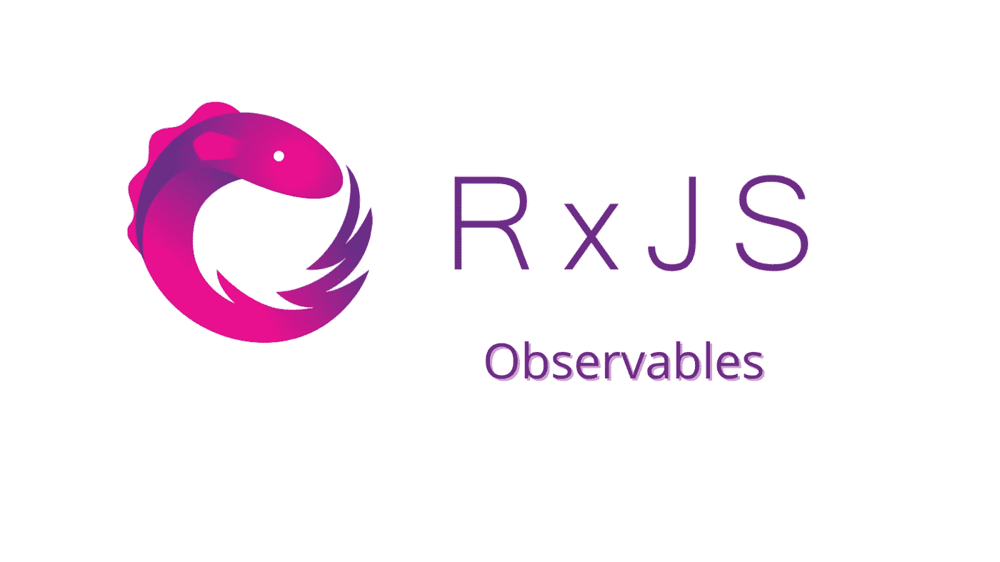

# 创建一个有间隔的 RxJS 可观察值

> 原文：<https://javascript.plainenglish.io/create-an-rxjs-observable-with-interval-669f1ef48b26?source=collection_archive---------3----------------------->

## [RxJS](https://medium.com/@lorenzozar/list/rxjs-39bc4f4110ec)

在另一篇文章中，我们[创建了一个简单的可观察对象](/create-an-rxjs-observable-98b90ecfda8e)。但是，建议使用内置的创建函数。



Create an RxJS Observable using interval

如[文档](https://rxjs.dev/guide/observable#creating-observables)中所述，“最常见的是，使用创建函数来创建可观察值，如 of、from、interval 等”。

按照这个建议，我们将使用 RxJS `interval`函数通过使用内置的创建函数来创建一个可观察对象。还是那句话，用 Angular 之类的框架还是 React 之类的库都无所谓。RxJS 是独立的。

# 创造一个可观察的

同样，创建可观察值的过程相当简单。

首先我们需要从 RxJS 导入`interval`。

`interval`内置函数是一个简单的函数，它“*创建一个观察对象，该观察对象每隔指定的时间间隔*”， [rxjs.dev](https://rxjs.dev/api/index/function/interval) 。

换句话说，多亏了`interval`，我们将获得一系列(可观察到的)上升数字。可观测的将发射整数，“T21”，在这些发射之间有你选择的恒定时间间隔。

在下面这段代码中，我们创建了一个每秒(1000 毫秒)发出一个序列号的可观察对象。

```
import { interval } from 'rxjs';const myObservable = interval(1000);
```

事实上，什么都不会发生，因为我们需要订阅一个可观察对象来消费它的值。

# 订阅可观察的

第一步需要我们创造一个可观察的。现在，我们希望将来自这个可观察对象的值记录到控制台。

```
import { interval } from 'rxjs';const myObservable = interval(1000);myObservable.subscribe((integer) => {
  console.log(integer);
});
```

就这么简单。myObservable 现在每秒发出一个整数流，你可以在控制台中看到。

即使我们没有使用任何可观察通知(`next`、`error`和`complete`)，可观察对象也在隐式使用`next`发送数据。


Create an Observable using RxJS interval

# RxJS 区间优势

像`interval`这样的内置观测器比定制观测器有几个优点。

如上所述，它们是现成的，易于使用。除了这些优势之外，一些内置的 Observables 在完成后会自动取消订阅。

请记住，为了避免内存泄漏，我们应该在结束时停止可观察到的内容。因为 myObservable 永远不会完成，所以想办法完成或者取消订阅那个可观察对象。

另一方面，一些内置的创建功能，如`of`和`from`会自行完成。在 [RxJS Primer](https://www.vitainbeta.org/2022/02/06/rxjs-primer/) 上查看更多信息，或者在 [Twitter](https://twitter.com/lorenzozar) 上联系我。

接下来: [RxJS 角度声明模式](https://betterprogramming.pub/rxjs-declarative-pattern-in-angular-cafba3983d21)

*更多内容看* [***说白了。报名参加我们的***](https://plainenglish.io/) **[***免费周报***](http://newsletter.plainenglish.io/) *。关注我们关于*[***Twitter***](https://twitter.com/inPlainEngHQ)*和*[***LinkedIn***](https://www.linkedin.com/company/inplainenglish/)*。加入我们的* [***社区***](https://discord.gg/GtDtUAvyhW) *。***