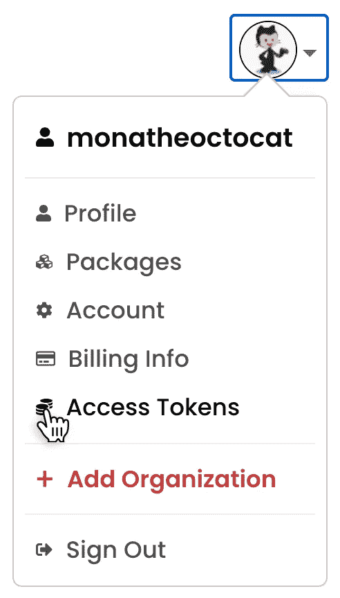

# 在 5 分钟内创建并发布您自己的 React Hook

> 原文：<https://javascript.plainenglish.io/create-and-publish-your-own-react-hook-in-under-5-minutes-c95592da4b1?source=collection_archive---------13----------------------->

你一直在使用其他人的反应钩，但对另一个有惊人的想法？在本文中，您将学习如何编写、更新和发布您自己的注册表钩子！

# 入门指南

我准备了一个模板库，你可以用它来启动你的包。它包括一些项目，这将使你容易得多！

可以在[我的 GitHub](https://github.com/driaug/react-hook-template) 上找到。

## 得到你的 NPM 代币

该模板利用 GitHub 动作自动发布您对 NPM 的最新更改。

要做到这一点，您首先需要获得您的 NPM 令牌，并将其添加为存储库机密。打开您的 NPM 帐户，并按照这些步骤[获取您的访问令牌。](https://docs.npmjs.com/creating-and-viewing-access-tokens)

一旦你有你的令牌，前往你的仓库。转到“设置”,然后转到“密码”选项卡。添加一个名为`NPM_TOKEN`的新存储库密码，并将您的令牌粘贴到那里！

## 给它起了个很酷的名字

前往`package.json`文件，并确保更新那里的所有信息！给你的新 React 钩子起一个酷但独特的名字。将您自己添加为作者，并更新所有路径和 URL 以使用您自己的名字。

## 这个模板里有什么

好了，是时候看看代码了！这个存储库有两个不同的部分。我们有`src`和`example`文件夹。Src 是你可以找到 React 钩子代码的地方，在模板中我们的钩子叫做`useHello`,它带有类型和一个 DocString 作为一个可靠的例子！

如果你打开示例文件夹，你会看到它包含了一个基本的 React 应用，这个应用使用了我们的`useHello`钩子。确保在添加自己的钩子时更新示例文件夹！

## 更新示例

因为一个存储库中有两个包，所以记住您需要启动并构建两个服务是很重要的。

如果您对钩子本身进行了修改，您可以用`npm run build`重新构建它(或者用`npm run watch`启动一个活动服务器)。

试着去掉原来的 useHello 钩子，添加自己的逻辑！

如果您对示例应用程序进行了更改，您将需要从示例文件夹中使用`npm run build`单独重新构建它！这些例子还附带了一个可以从`npm run start`开始的实时服务器。

# 发布你的钩子

太好了！您已完成更改，并准备将您的挂钩发布到 NPM。你所需要做的就是把你的修改推送到 GitHub，我们的动作会通过他们的 API 自动把所有东西部署到 NPM！

一旦操作完成运行，您可以通过导航到您的 NPM 帐户，点击您的个人资料图片并转到包查看您的新包！

人们现在可以下载并在他们的项目中使用你的 React 钩子了，祝贺你！

# 特别感谢

对于这篇文章，我要特别感谢[阿利斯泰尔·史密斯](https://alistair.sh/)。他的 [use-last-fm hook](https://github.com/alii/use-last-fm) 对设置来说是一个巨大的灵感，如果没有他的伟大工作，它不会如此先进！

祝你有美好的一天！💙

*更多内容看* [***说白了就是***](https://plainenglish.io/) *。报名参加我们的* [***免费周报***](http://newsletter.plainenglish.io/) *。关注我们关于*[***Twitter***](https://twitter.com/inPlainEngHQ)*和*[***LinkedIn***](https://www.linkedin.com/company/inplainenglish/)*。查看我们的* [***社区不和谐***](https://discord.gg/GtDtUAvyhW) *加入我们的* [***人才集体***](https://inplainenglish.pallet.com/talent/welcome) *。*