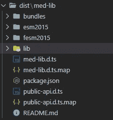

# 如何在 2022 年创建你的角度库

> 原文：<https://javascript.plainenglish.io/create-angular-library-2022-3965beee6dc6?source=collection_archive---------0----------------------->

## 除了为应用程序创建可重用的组件之外，还要创建可重用的库，以便在不同的项目之间共享。


以前运行过这个命令来安装某些插件或工具吗？有没有想过像`Angular/Material`、`lodash`、`moment.js`或`chart.js`这样的软件包是如何创建的？对于像我们前端开发人员这样的最终用户来说，这可能感觉像是魔术，只是`npm i`我们需要的包名和每个 UI 或方法现在都包含在我们的应用程序中了。

此外，您是否有多个项目具有您在一个项目中创建的相同的复杂定制组件？通常，我们只是将组件从一个项目复制粘贴到另一个项目。但是当有 bug 或者变更的时候，我们总是需要为一个变更更新多个项目。如果我们可以为这个复杂的定制组件创建一个库，并像我们使用`npm i`一样将其导入多个项目，那么当有更改或错误时，我们只需更新库代码，其他项目只需`npm i`发布最新的库即可获得错误修复或更改。

发展没有魔法。今天，我将向您介绍作为 Angular 开发人员，如何创建您的库并将其导入到您的项目中。

# 步骤 1:为库生成工作区

```
**ng new medium-lib — no-create-application** **cd medium-lib****ng generate library med-lib**
```

运行第一个命令，您将能够在您的文件夹中看到这些文件:


workspace generated by Angular

通过运行上面提供的第二个命令，将目录切换到工作区。运行第三个命令将生成工作空间中所需的库文件夹。


med-lib folder generated

# 步骤 2:在库中创建多个模块/组件

如果您想要为您的库创建多个模块/组件，您总是可以将所有的 med-lib 文件提取到一个 med-lib 文件夹中，并更新`public-api.ts`中的导出语句。


public-api.ts file

您可以通过下面的命令创建一个新模块。

```
**ng g module new-lib****ng g c new-lib --project med-lib**
```


将这两行添加到您现有的`public-api.ts`中，您的新模块和组件现在也导出了。


让我们为我们的库组件和服务创建一些方法和样式，并将其导入到我们在库项目中初始化的测试项目中。我们可以通过运行这个命令来初始化库根文件夹中的测试项目。

# 步骤 3:在库中生成虚拟角度应用程序来测试库

```
**ng g application testing**
```


现在您将能够在`projects/testing`下看到您新创建的角度应用程序。尝试使用`ng serve`运行您的角度应用程序。现在，您应该能够在浏览器上看到默认的角度模板。让我们做一些修改来定制我们的库组件和服务。


med-lib.component.ts


med-lib.service.ts

# 步骤 4:将您的库文件构建到一个可以由 Angular 应用程序导入的包中

现在是时候将您的库构建到一个可以由您的测试项目导入的包中了。

```
**ng build med-lib // build the library and output it to dist/med-lib****or****ng build med-lib --watch // to watch changes from your library files**
```



dist folder

您可以通过编辑您的`angular.json`文件中的配置来更改您的包或文件夹的名称。让我们回到前面创建的测试应用程序，测试我们创建的库。

# 步骤 5:将库包导入到测试应用程序中


app.module.ts

就像导入其他库一样，首先导入您的`app.module.ts`文件中的模块。


app.component.ts

导入我们之前在库中导出的**服务**和**方法**，并像使用其他库的方法一样使用它们。从 Angular 中清除 HTML 文件中的样板代码，并创建一个简单的模板来查看库组件及其方法是否正常工作。


app.component.html

现在运行`ng serve`，你应该能在你的浏览器里看到和我一样的东西， **localhost:4200** 。


恭喜你！🎉您已经成功地将角度库包创建、导出和导入到角度应用程序中。

# 下一步是什么？

在您成功地重构并构建了您的库之后，您有两种方法来共享您在不同项目中创建的这个库。

# 1.在您自己的私有服务器中本地托管库

您可以**将这个库打包到一个`.tgz`文件中，并将这个文件放在一个中央存储库中，这样所有的项目都可以访问它。**

```
**cd dist/med-lib/****npm pack // this will generate the .tgz file**
```

例如，我可以将我的库放在我的共享驱动器中。(例如:`shared-drive-address`:**H:/dev/angular/libraries/med-lib-0 . 0 . 1 . tgz**)。我所需要做的只是执行一个`npm install --save <shared-drive-address>`操作，这个库就会被安装到你的项目中。

# 2.npm 服务器中的主机库

您可以运行这些命令来发布您的库。请注意，对于这一步，您必须拥有一个 npm 帐户。你可以在这里注册账户，[https://www.npmjs.com/signup](https://www.npmjs.com/signup)。创建您的帐户后，您可以运行下面的命令来登录您当前计算机中的 npm 帐户。

```
**npm adduser // login npm in local machine****npm whoami // check that you have login to the right account****ng build med-lib****cd dist/med-lib****npm publish**
```

# **总结**

希望这篇文章能让您了解如何在当前项目中调整和重构代码，以及如何为跨多个应用程序使用的公共特性实现一个可共享的 **Angular 库**。现在，当您使用库和第三方包并阅读其代码时，您将不再觉得它是一个黑盒，而是能够理解不同作者如何创建和构建他们的库。

*编码一次，到处使用。*

现在，作为一名前端开发人员，您在您的角度之旅中领先了一步。如果你有其他方法来实现 Angular 库或者在不同的项目中共享代码，请在下面的评论中告诉我。我很想了解一下。干杯！

[](https://medium.com/@devjo/membership) [## 用我的推荐链接- DevJo 加入媒体

### 作为一个媒体会员，你的会员费的一部分会给你阅读的作家，你可以完全接触到每一个故事…

medium.com](https://medium.com/@devjo/membership) 

*更多内容看* [***说白了就是***](https://plainenglish.io/) *。报名参加我们的* [***免费周报***](http://newsletter.plainenglish.io/) *。关注我们关于*[***Twitter***](https://twitter.com/inPlainEngHQ)*和*[***LinkedIn***](https://www.linkedin.com/company/inplainenglish/)*。加入我们的* [***社区***](https://discord.gg/GtDtUAvyhW) *。*