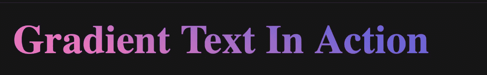
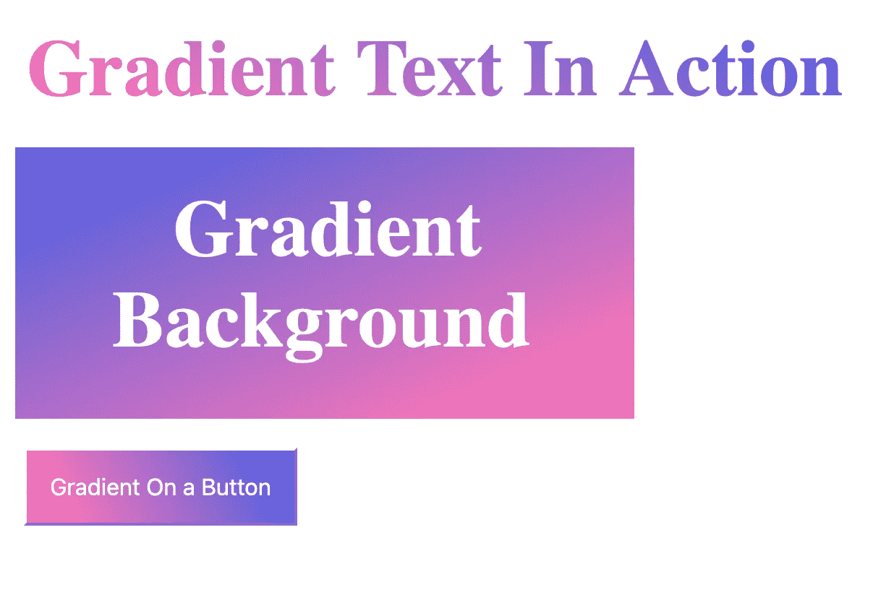

# 使用渐变创建漂亮的 Web 应用程序

> 原文：<https://javascript.plainenglish.io/create-awesome-looking-web-apps-using-gradients-41a5afc1d55d?source=collection_archive---------15----------------------->

## 以下是如何在您的 web 应用程序中应用渐变。


Photo by [Lucas Kapla](https://unsplash.com/@aznbokchoy?utm_source=unsplash&utm_medium=referral&utm_content=creditCopyText) on [Unsplash](https://unsplash.com/s/photos/colors?utm_source=unsplash&utm_medium=referral&utm_content=creditCopyText)

你曾经尝试过在 web 应用程序中创建或应用渐变吗？如果不是，那你来对地方了。这篇文章旨在帮助前端开发者使用 HTML 和 CSS 为他们的网站构建下一级渐变。

渐变将你无聊的 HTML 文本元素或容器背景转换成超级有趣和优雅的东西。这是许多组织使用的一个非常巧妙的技巧。如果你不相信我，去 Github 和 Instagram 这样的网站看看。从将它应用到行动号召按钮到文本卡片的背景或给文本本身着色，您几乎可以在任何地方创建和应用渐变。相信我！这会给你的网站增加很多活力。

# 什么是渐变？

这是许多网页设计师使用的技术。如果要我用一条线来描述的话——两种或两种以上相似的颜色混合形成一种新的颜色。



Image By Author

# 渐变的类型

CSS 中一般有三种类型的渐变，我们将借助例子逐一查看每一种——

# 1.线性梯度

顾名思义，我们用最少两种相交成一条直线的颜色来开发线性渐变。它包含一个方向和过渡停止。有多种方法可以将渐变应用到 web 元素。

## 句法

创建渐变的一般语法如下

```
background: linear-gradient( to Direction Color1, Color2);
```

**方向值-** *左、上、下、右*

**颜色值-** *Hexcode，rgba。*

# 2.径向梯度

我们用它们的中心来定义径向梯度。两种或两种以上的颜色从同一个中心出现，形成圆形或椭圆形。因此，颜色的混合从一个中心开始，并向前增长到边缘。

## 句法

```
background: radial-gradient(*SHAPE SIZE AT POSITION, Color1, Color2*);
```

**形状值-** *圆，椭圆*

**尺寸值-**-*中心，最远，角度*

# 3.圆锥梯度

我们用它们的中心来定义二次曲线梯度。两种或多种颜色围绕中心点旋转。因此，颜色或过渡的混合会围绕中心旋转。

## 句法

```
background: conic-gradient(red, orange, yellow, green, blue);
```



Image By Author

# 密码

下面的例子包含了三个最常见的用例，我们可以在 HTML 元素中应用线性渐变。

*   文本
*   Div 背景
*   按钮背景

## HTML 代码

```
<!-- Text --><div>
  <text id="textgradient"> 
    Gradient Text In Action
 </text>
</div><!-- Div Background --><div class="background">
 <b>
  <center>
    <Text id="textid"> 
      Gradient Background
    </Text>
   </center>
 </b>
</div><!-- Button Background--><div>
  <Button id="buttonid"> 
    Gradient On a Button
  </Button>
</div>
```

## CSS 代码

```
#textgradient{
  font-size: 55px;
  font-weight: bold;
  background: -webkit-linear-gradient( 64.5deg,  rgba(245,116,185,1) 14.7%, rgba(89,97,223,1) 88.7% );
  -webkit-background-clip: text;
  -webkit-text-fill-color: transparent;
}.background{
  width:420px;
  height:180px;
  background-image: linear-gradient( to left top,  rgba(245,116,185,1) 14.7%, rgba(89,97,223,1) 88.7% );
}#buttonid{
  margin-top:16px;
  font-size:16px;
  padding:16px;
  color: white;
  background-image: linear-gradient( 64.5deg,  rgba(245,116,185,1) 14.7%, rgba(89,97,223,1) 88.7% );

}
```

代码基本上是不言自明的。我们将背景属性应用于 HTML 文本元素的 id 或 class 属性。为了与其他浏览器兼容，我们使用了额外的 WebKit 属性。

这就是这篇文章的内容。感谢您阅读我的帖子，并走了这么远。

如果你喜欢这篇文章，你也可以看看我的其他文章。

[](/3-ways-senior-developers-stay-up-to-date-with-technology-trends-859f55566cfe) [## 高级开发人员紧跟技术趋势的 3 种方法

### 如何做一名高级开发人员，即使你不是。

javascript.plainenglish.io](/3-ways-senior-developers-stay-up-to-date-with-technology-trends-859f55566cfe) [](/10-engineering-blogs-i-read-to-stay-up-to-date-with-technology-trends-faa006460fd9) [## 我阅读的 10 个工程博客，以跟上技术趋势

### 2022 年及以后的顶级工程博客。

javascript.plainenglish.io](/10-engineering-blogs-i-read-to-stay-up-to-date-with-technology-trends-faa006460fd9) [](/12-terminal-commands-i-use-every-day-as-a-developer-4a38135ab305) [## 作为开发人员，我每天使用的 12 个终端命令

### 作为软件开发人员如何有效地使用计算机终端

javascript.plainenglish.io](/12-terminal-commands-i-use-every-day-as-a-developer-4a38135ab305) [](/heres-how-frontend-web-developers-get-your-browser-information-d2c86133fbbd) [## 以下是前端 Web 开发人员如何获取您的浏览器信息

### 这 6 个内置的单行代码识别设备和浏览器特定的信息。

javascript.plainenglish.io](/heres-how-frontend-web-developers-get-your-browser-information-d2c86133fbbd) 

*订阅媒体使用* [***我的会员链接***](https://karanjagota.medium.com/membership) *这样你就可以享受我所有的文章，让我们一起让这一年成为你生命中的一年。*

你觉得这篇文章有帮助吗？请在评论区告诉我。我很想知道你对此的看法。

*更多内容看* [***说白了就是***](https://plainenglish.io/) *。报名参加我们的* [***免费周报***](http://newsletter.plainenglish.io/) *。关注我们* [***推特***](https://twitter.com/inPlainEngHQ) *和*[***LinkedIn***](https://www.linkedin.com/company/inplainenglish/)*。加入我们的* [***社区不和谐***](https://discord.gg/GtDtUAvyhW) *。*