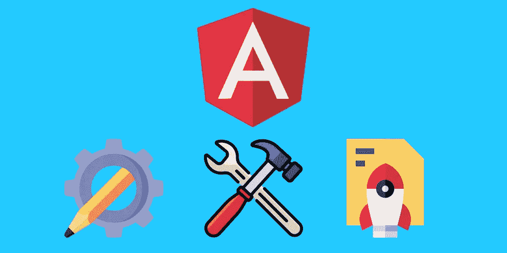
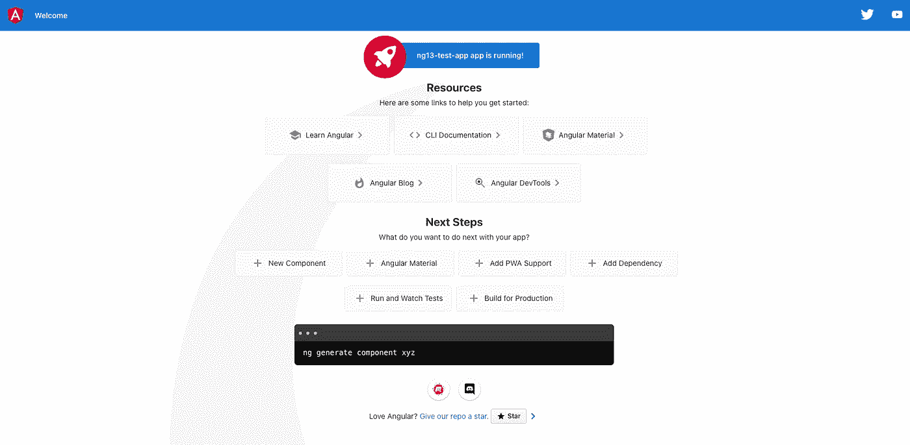

# 在几分钟内创建、构建和启动 Angular 13 应用程序

> 原文：<https://javascript.plainenglish.io/create-build-launch-angular-13-app-in-minutes-9dec29d3cbae?source=collection_archive---------1----------------------->

想进入 Angular 看看你的应用程序能运行多快吗？构建生产应用程序从未如此简单。在这篇文章中，我将带你快速了解如何开始你自己的 Angular 项目，并在几分钟内将它们发布到网上。

# 安装 Node.js

下载并安装 LTS 版本。在您的终端上做一个快速检查，看看您的节点是否正确安装在您的系统中。去你的终端输入`**node -v**`。你应该能看到这样的东西。

你也可以检查你的 npm 版本，看看你得到的版本是否和我的一样。运行`**npm -v**`。

# 将 Angular CLI 安装到您的计算机/笔记本电脑中

一旦完成。你可以运行这个命令来安装 Angular 到你的系统中。运行`**npm install -g @angular/cli**`安装 Angular。安装成功后，运行此命令检查您的 Angular 是否正确安装到您的机器中。运行`**ng version**`进行检查。你应该能看到这个。

# 使用 Angular/CLI 创建角度项目

现在我们准备好了。让我们从在您选择的目录中创建一个全新的 Angular 项目开始。在该特定目录中启动终端或 cmd 会话。跑`**ng new <application name>**`。为您的应用程序取一个您想要的唯一名称。

键入`Yes`添加角度路由，并选择 SCSS(我的选择)或任何你喜欢的 CSS 选项。项目创建完成后，您应该能够看到这一点。

现在，在您首选的 IDE 或文本编辑器中打开该目录。我建议使用 Atom 或 VS 代码，因为它们是最常见的，并且具有对 Angular 的 IDE 支持。

在您的 IDE 中的 Angular 项目目录下打开一个终端会话，并运行`**ng serve**`来构建并运行您的 [http://localhost:4200 中的应用程序。您应该会在终端上看到这条编译成功的消息。](http://localhost:4200.)

现在切换到你的浏览器，进入 [http://localhost:4200。](http://localhost:4200.)您应该能够看到下面的同一个屏幕。

🎉恭喜你！您已经成功地创建并构建了一个在本地机器上运行的 Angular 应用程序。

# 对角度项目进行更改

不要被 Angular 项目中的文件和结构的数量吓倒。要对当前屏幕进行编辑，请转至`src > app > app.component.html`。

删除 HTML 页面中的所有内容，并编写一些示例代码。

转到它的兄弟文件，`app.component.scss`或 CSS 或 sass 并粘贴它。

现在保存所有文件，返回浏览器。您应该能够看到您所做的更改。

一个居中的 div，包含您刚刚键入的示例文本。既然你已经学会了如何修改你的网页，那就继续编写一些漂亮的 HTML 和 CSS 代码，让你的网页看起来棒极了。

# 部署角度应用程序

当你把你的应用程序组件做得很棒之后，是时候把它发布到互联网上了。🚀

有一些提供商可以帮助你在几秒钟内将应用程序投入生产。在这里，我将和你一起通过***Firebase hosting***来部署你的 Angular app。去消防基地控制台。

 [## 登录- Google 帐户

### 编辑描述

console.firebase.google.com](https://console.firebase.google.com/u/0/) 

使用您的 Gmail 注册一个帐户。您应该能够看到下面的屏幕。

点击创建一个新项目。

输入您的项目名称，并点击完成安装过程，您应该能够成功地创建您的 Firebase 项目。回到你的角度项目目录终端。如果您的计算机上没有 Firebase 工具，请运行此命令来安装它。`***npm install -g firebase-tools***`

一旦完成，运行`**firebase login**`并输入您的 firebase 登录凭证来验证您的终端使用 Firebase 命令。

成功登录后，您需要在 Angular 项目中初始化 firebase 配置。运行`**firebase init**`在你的项目中初始化 firebase 配置。

你只需要选择主机来在互联网上部署你的 Angular 应用程序。一旦你选择了，点击`Enter`并选择`use an existing project`并选择你刚刚在 Firebase 控制台中创建的项目。在主机设置过程中，记得定义你的公共目录。当 Angular 在`dist/<application_name>`文件夹下构建我们的项目时，你也必须在你的 firebase 设置中定义它。您可以允许或不允许将 URL 重写到`index.html`，此时您不需要设置 Github 自动构建和部署。

一旦设置完成，你就进入了把你的网页放到互联网上的最后一步。运行`**ng build**`为生产构建您的 Angular 应用程序。

使用这个命令将它部署到您的 Firebase 主机— `firebase deploy`。完成后，您将看到部署已完成，您可以单击下面提供的托管 URL。

是的，你做到了~💯现在，您可以看到您在本地计算机上看到的确切网页，但现在是在互联网上。你可以把这个链接分发给你的朋友和家人，告诉他们这有多棒😎你要在几分钟内将一个 Angular 应用程序发布到互联网上。

# 摘要

希望你运行得很好，完成了创建、构建和部署你的 Angular 应用程序到互联网的所有步骤。我知道 Angular 的工作原理缺少很多步骤，如果你想创建多个页面和动态路径该怎么办。你可以从 Angular 官方文档中寻找这些信息，我会在下面留下链接。

 [## 有角的

### Angular 是一个构建移动和桌面 web 应用程序的平台。加入数百万开发者的社区…

angular.io](https://angular.io/) 

我写这篇文章的主要目的是帮助你开始并推动你用 Angular 构建一个令人惊奇的应用程序。如果你能部署你的应用程序并与我分享你的应用程序的链接，请在下面的评论中告诉我。我很想看看你对你的角度应用做了什么。

 [## 用我的推荐链接- DevJo 加入媒体

### 作为一个媒体会员，你的会员费的一部分会给你阅读的作家，你可以完全接触到每一个故事…

medium.com](https://medium.com/@devjo/membership) 

*更多内容尽在* [***说白了. io***](http://plainenglish.io/) *。报名参加我们的* [***免费周报***](http://newsletter.plainenglish.io/) *。在我们的* [***社区获得独家访问写作机会和建议***](https://discord.gg/GtDtUAvyhW) *。*