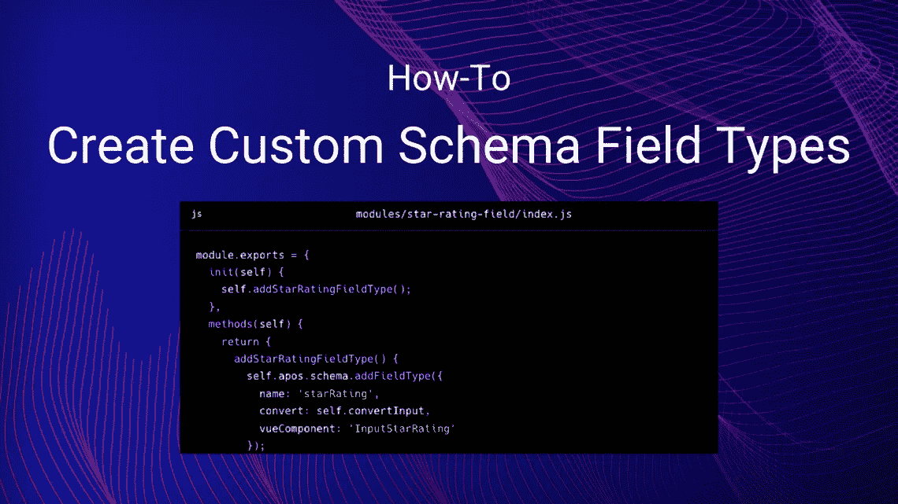

# 创建自定义架构字段类型

> 原文：<https://javascript.plainenglish.io/create-custom-schema-field-types-4e432fce4b99?source=collection_archive---------21----------------------->

## 关于如何在撇号 3 中创建自定义模式字段类型的指南。



撇号的[模式字段类型](https://v3.docs.apostrophecms.org/guide/content-schema.html)涵盖了许多情况，但是我们可能希望添加一个新的。

架构字段有两个部分:服务器端部分和浏览器端部分。服务器端部分负责净化从浏览器接收的输入，而浏览器端部分负责提供管理 UI。

# 实现服务器端部分

任何模块都可以在服务器端注册一个模式字段类型，就像这样，它允许编辑设置 1 到 5 颗星的“星级”，这在电影和餐馆评论中很常见。

请注意，此代码可以在任何模块中。这里我们选择只为这个新的字段类型创建一个模块，因为它可能会在几个模块中使用。

```
module.exports = {
  **init**(self) {
    self.addStarRatingFieldType();
  },
  **methods**(self) {
    **return** {
      **addStarRatingFieldType**() {
        self.apos.schema.addFieldType({
          name: 'starRating',
          convert: self.convertInput,
          vueComponent: 'InputStarRating'
        });
      },
      **async** **convertInput**(req, field, data, object) {
        **const** input = data[field.name];
        **if** ((data[field.name] == null) || (data[field.name] === '')) {
          **if** (field.required) {
            **throw** self.apos.error('notfound');
          }
        }
        object[field.name] = self.apos.launder.integer(input, field.def, 1, 5);
      }
    }
  }
}
```

在模块初始化时运行的`init`中，我们调用我们的`addStarRatingFieldType`方法。`init`是调用撇号进程启动时应该运行的代码的正确位置。

在`addStarRatingFieldType`中，我们调用`self.apos.schema.addFieldType`在服务器端添加我们的自定义字段类型。我们提供:

*   `name`，在将字段添加到模式时，可用作`type`设置。
*   `convert`，用于净化输入并将其复制到目的地的函数。我们通过我们的`convertInput`方法来达到这个目的。我们模块的方法可以作为`self`的属性使用。
*   `component`，编辑字段时显示的 Vue.js 组件的名称。

在`convertInput`中，我们整理输入并将其从`data[field.name]`复制到`object[field.name]`。由于我们不能信任浏览器，我们小心翼翼地用`[launder](https://npmjs.com/package/launder)`[模块](https://npmjs.com/package/launder)来净化它，该模块总是作为`apos.launder`可用。但是我们可以用任何我们喜欢的方式来验证输入，只要我们从不相信输入。

# 实现浏览器端部分

在浏览器端，我们需要一个定制的 Vue.js 组件。撇号提供了一个 Vue.js mixin，`AposInputMixin`，它为我们做了很多工作。

```
<template>
  <AposInputWrapper
    :modifiers="modifiers" :field="field"
    :error="effectiveError" :uid="uid"
    :display-options="displayOptions"
  >
    <template #body>
      <div class="apos-input-wrapper">
        <button v-for="index in 5" :key="index" @click="setValue(index)" class="rating">{{ isActive(index) ? '☆' : '★' }}</button>
        <button class="clear" @click="clear">Clear</button>
      </div>
    </template>
  </AposInputWrapper>
</template><script>
**import** AposInputMixin **from** 'Modules/@apostrophecms/schema/mixins/AposInputMixin';**export** **default** {
  name: 'InputStarRating',
  mixins: [ AposInputMixin ],
  methods: {
    **validate**(value) {
      **if** (this.field.required) {
        **if** (!value) {
          **return** 'required';
        }
      }
      **return** false;
    },
    **setValue**(index) {
      this.next = index;
    },
    **clear**() {
      this.next = null;
    },
    **isActive**(index) {
      **return** index <= this.next;
    }
  }
};
</script><style lang="scss" scoped>
  .rating {
    border: none;
    background-color: inherit;
    color: inherit;
    font-size: inherit;
  }
</style>
```

在我们的模板元素中，`AposInputWrapper`负责用标签、错误消息等来修饰我们的字段。我们所要做的就是传递一些提供给我们的标准道具。除此之外，我们的责任是向用户显示当前的`value`。我们还添加了事件处理程序来处理用户输入，如下所述。

在我们的脚本元素中，我们只有两项工作:每当值发生变化时，就给`this.next`分配一个新值，并验证用户的输入。`AposInputMixin`为我们做剩下的工作。

为了更新`this.next`，我们实现了响应点击事件的方法，如本例中的`setValue`和`clear`方法。为了验证用户的输入，我们实现了一个`validate`方法，它接受当前值并检查约束，如字段的`required`属性。如果有问题，我们返回一个错误代码如`required`、`min`或`max`，否则，我们返回`false`。现场配置可作为`this.field`提供给我们。

元素负责这个组件的 CSS。注意，SCSS 语法是可用的。为了避免冲突，建议使用`scoped`属性。

# 警告

*如果一开始似乎不起作用，请确保使用前面解释的* `*APOS_DEV=1*` *环境变量设置启动了* `*npm run dev*` *。这确保了撇号管理 UI 在每次代码更改时都会重新构建。当您更改完管理 UI 代码后，您可以停止使用它。*

# 将新的模式字段类型投入使用

现在，我们可以在任何片段或小部件中使用新的模式字段类型，就像我们使用`integer`字段一样:

```
fields: {
  add: {
    rating: {
      type: 'starRating',
      label: 'Star Rating',
      required: true
    }
  }
}
```

然后得到的值作为小部件的`stars`属性，是一个在`1`和`5`之间的整数值。

*更多内容请看*[***plain English . io***](http://plainenglish.io/)*。报名参加我们的* [***免费周报***](http://newsletter.plainenglish.io/) *。在我们的* [***社区***](https://discord.gg/GtDtUAvyhW) *获得独家获得写作机会和建议。*