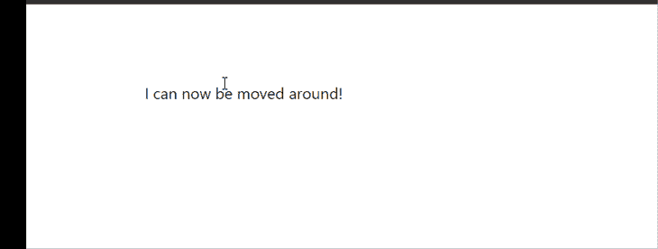
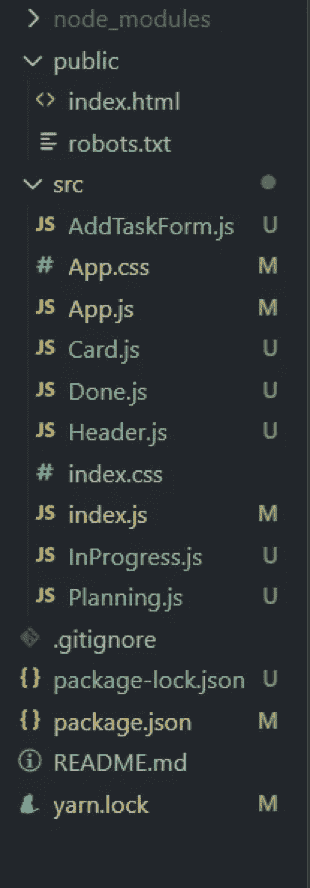
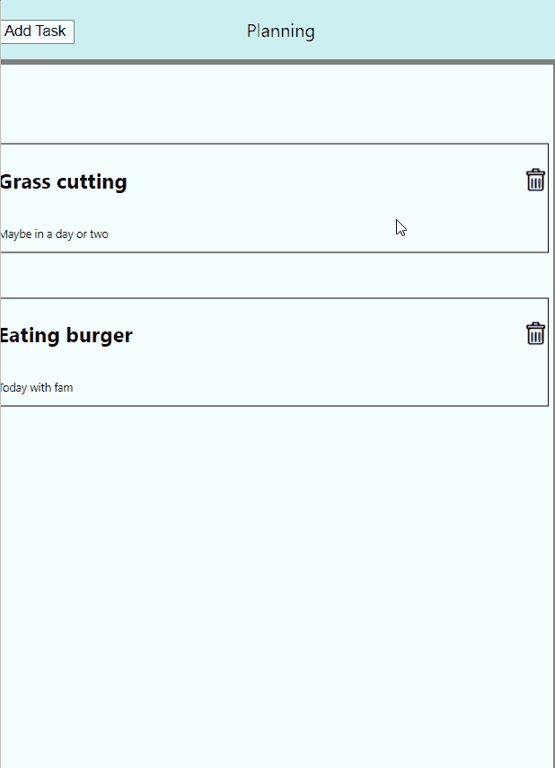

# 使用 React-Draggable 创建可拖动组件

> 原文：<https://javascript.plainenglish.io/create-draggable-components-with-react-draggable-ed5c97b96937?source=collection_archive---------9----------------------->

## 通过创建一个包含可拖动组件的任务列表，深入了解 React-Draggable。


Source: [https://coursework.vschool.io/](https://coursework.vschool.io/)

React-Draggable 库使用起来简单明了，它将 CSS 转换应用到 React 组件，允许您在 UI 上拖动组件。使用不同的道具让你改变组件的行为， [React-Draggable](https://github.com/react-grid-layout/react-draggable) 是创建直观、用户友好界面的绝佳选择。

在本教程中，我们将通过创建一个带有可拖动组件的任务列表来深入探索 React-Draggable。我们开始吧！

# 安装 React-Draggable

在安装 React-Draggable 之前，请确保您的本地计算机上已经设置了 React 项目。导航到项目并在终端中运行以下命令:

```
npm install react-draggable
```

现在，我们将从库中导入`<Draggable/>`组件。为了给元素或组件添加动作，我们可以简单地将`<Draggable/>`组件包装在它周围。

将以下代码添加到`App.js`:

```
import Draggable from "react-draggable";function App() {
  return (
 <Draggable>
      <div>I can now be moved around!</div>
    </Draggable>
  );
}export default App;
```

上面的代码将在浏览器中呈现以下输出:



现在你已经知道了 React-Draggable 库是如何工作的，让我们开始我们的任务列表。

# 设置 React 应用程序

安装了 React-Draggable 库之后，我们可以为我们的项目设置所需的文件结构，并查看我们将需要的组件。为了给关键组件分配唯一的键，我们需要安装一个`UUID()`，如下所示:

```
npm i uuid
```

我们的文件夹结构如下图所示:



# 创建任务列表

我们已经将项目的逻辑分解为三个不同的部分。我们的任务列表将使用三列来呈现它们各自的任务。

我们将添加一个表单元素来接收用户的输入，并将任务添加到相应的组件中。我们的`App.js`文件在其状态下处理主任务列表:

```
import "./App.css";
import { useState } from "react";function App() {
const [tasks, setTasks] = useState([]);
  const [addItem, setAddItem] = useState(false);
  const handleSubmit = () => {
    setAddItem(!addItem);
  };
  const addTask = (task) => {
    setTasks(task);
  };
  return (
  <div>
 </div> );
} export default App;
```

在上面的代码中，我们添加了以下函数:

*   `tasks`:保存将在屏幕上呈现的任务数组
*   `addItem`:显示和隐藏`AddForm`元素的状态，增加一个任务

现在我们已经准备好了状态，让我们创建其他组件。

# 标题组件

将以下代码添加到`Header.js`:

```
import React from "react";export default function Header({ handleSubmit }) {
  return (
    <div className='header'>
      <button onClick={handleSubmit} className='addButton'>
        Add Task
      </button>
      <p>Planning</p>
      <p>In Progress</p>
      <p>Done</p>
    </div>
  );
}
```

`</button>`获取`handleSubmit`函数作为道具，这将显示`AddForm`元素。设置好标题后，让我们创建`AddForm`元素:

# `AddForm`元素

将以下代码添加到`AddTaskForm.js`:

```
import React, { useState } from "react";
import { v4 as uuidv4 } from "uuid";export default function AddTaskForm({ setAddItem, addItem, tasks, setTasks }) {
  const [name, setName] = useState("");
  const [description, setDescription] = useState("");
  const [option, setOption] = useState(""); const handleSubmit = (e) => {
    e.preventDefault();
    let newTask = {
      id: uuidv4(),
      name: name,
      description: description,
      timeline: option,
    };
    setTasks([...tasks, newTask]);
    setAddItem(!addItem);
  };
  return (
    <div className='addForm'>
      <form onSubmit={(e) => handleSubmit(e)}>
        <input
          type='text'
          placeholder='Name'
          onChange={(e) => setName(e.target.value)}
        />
        <input
          type='text'
          placeholder='Description'
          onChange={(e) => setDescription(e.target.value)}
        />
        <select
          name='timeline'
          id='timeline'
          onChange={(e) => {
            setOption(e.target.value);
          }}
        >
          <option value=''></option>
          <option value='planning'>Planning</option>
          <option value='inprogress'>In-Progress</option>
          <option value='done'>Done</option>
        </select>
        <button type='submit'>Add</button>
      </form>
    </div>
  );
}
```

在上面的代码块中，我们有输入字段，它将接收用户提供的相关数据。每个任务都有一个`id`、`name`、`date`和`timeline`，由`select`元素取值。

当提交表单时，每个任务都将被添加到我们在`App.js`中创建的任务列表中。当表单提交成功后，它将被隐藏。

# 创建列

在我们的任务列表中，我们将有三个标题为`Planning`、`In Progress`和`Done`的列。让我们创建这些组件并添加它们各自的代码:

# `Planning.js`

```
import React from "react";
import Card from "./Card";export default function Planning({ tasks, addTask }) {
  return (
    <>
      {tasks
        .filter((item) => item.timeline === "planning")
        .map((e) => (
          <Card currentTask={e} tasks={tasks} addTask={addTask} />
        ))}
    </>
  );
}
```

# `InProgress.js`

```
import React from "react";
import Card from "./Card";export default function InProgress({ tasks, addTask }) {
  return (
    <>
      {tasks
        .filter((item) => item.timeline === "inprogress")
        .map((e) => (
          <Card currentTask={e} tasks={tasks} addTask={addTask} />
        ))}
    </>
  );
}
```

# `Done.js`

```
import React from "react";
import Card from "./Card";export default function Done({ tasks, addTask }) {
  return (
    <>
      {tasks
        .filter((item) => item.timeline === "done")
        .map((e) => (
          <Card currentTask={e} tasks={tasks} addTask={addTask} />
        ))}
    </>
  );
}
```

您可能已经注意到，所有这些组件都有相似的逻辑。我们正在获取任务，并使用`tasks.filter()`基于它们的时间线对它们进行过滤，这将删除不属于该列的任务对象。

例如，在 planning 组件中，`filter()`将删除其时间线属性中没有`planning`字符串的每个对象。

数组返回一个结果并呈现一个`<Card/>`组件。让我们在同一个目录中创建`Card.js`,并添加下面的代码片段:

```
import React from "react";
import Draggable from "react-draggable";export default function Card({ currentTask, tasks, addTask }) {
  return (
    <Draggable grid={[10, 10]} axis='y' bounds='parent'>
      <div className='card' key={currentTask.id}>
        <div className='heading'>
          <h3>{currentTask.name && currentTask.name}</h3>
           {
              const newTaskList = tasks.filter((item) => {
                if (item.id != currentTask.id) {
                  return item;
                }
              });
              addTask(newTaskList);
            }}
            src='https://toppng.com/uploads/preview/recycling-bin-vector-delete-icon-png-black-11563002079w1isxqyyiv.png'
            style={{ height: "20px", width: "20px" }}
          />
        </div>
        <p>{currentTask.description}</p>
      </div>
    </Draggable>
  );
}
```

`<Card/>`组件得到三个道具，是渲染和删除逻辑所需要的。

父 div `<Draggable>`是从我们的库中导入的，使得整个卡片是可移动的。默认情况下，您可以将卡片移动到屏幕上的任何位置。然而，为了防止它超出其父元素，我们将为一个`bounds`道具提供一个值。

# 删除任务

要删除任务，请添加以下代码:

```
const newTaskList = tasks.filter((item) => {
    if (item.id != currentTask.id) {
      return item;
    }
  }); addTask(newTaskList);
```

上面的代码块从`App.js`获取整个任务列表，然后创建一个新的列表，其中不包括当前任务。接下来，让我们导入`App.js`中的每个组件:

```
import "./App.css";
import { useState } from "react";
import Header from "./Header";
import Planning from "./Planning";
import InProgress from "./InProgress";
import Done from "./Done";
import AddTaskForm from "./AddTaskForm";
function App() {
  const [tasks, setTasks] = useState([]);
  const [addItem, setAddItem] = useState(false);
  const handleSubmit = () => {
    setAddItem(!addItem);
  };
  const addTask = (task) => {
    setTasks(task);
  };
  return (
    <div>
      <Header handleSubmit={handleSubmit} />
      <div className='mainGrid'>
        <div className='column'>
          <Planning tasks={tasks} addTask={addTask} />
        </div>
        <div className='column'>
          <InProgress tasks={tasks} addTask={addTask} />
        </div>
        <div className='column'>
          <Done tasks={tasks} addTask={addTask} />
        </div>
        {addItem && (
          <AddTaskForm
            addItem={addItem}
            setAddItem={setAddItem}
            tasks={tasks}
            setTasks={addTask}
          />
        )}
      </div>
    </div>
  );
}export default App;
```

最后，我们将在任务列表中添加样式。在`App.css`中添加以下代码:

```
.mainGrid{
  display: flex;
  flex-direction: row;
  justify-content: space-between;
  flex-wrap: wrap;
  height: 100vh;
}
.header{
  display: flex;
  flex-direction: row;
  justify-content: space-around;
  flex-wrap: wrap;
  background-color: rgb(205, 240, 240)
}
.column{
  width: 32vw;
  display: flex;
  flex-direction: column;
  border: 5px solid grey;
  background-color: azure;
  overflow: hidden;
}
.card{
  border: 1px solid black;
  background-color: white;
}
.card p{
  font-size: 10px;
  width: 30vw;
}
.heading{
  display: flex;
  flex-direction:row;
  align-items: center;
  justify-content: space-between;}
.addButton{
  position:absolute;
  top: 2.5%;
  left: 0%;
}
.addForm{
  height: 50vh;
  width: 50vw;
  background-color: lightblue;
  display: flex;
  align-items: center;
  justify-content: center;
  flex-direction: column;
  position: absolute;
  top: 25%;
  left: 25%;
}
.addForm form{
  display: flex;
  align-items: center;
  justify-content: center;
  flex-direction: column; 
}
```

当我们运行项目并将一个项目添加到任务列表中时，输出将如下图所示:


这些任务可在其各自的列中移动:



要删除任务，只需点击**删除**图标。

# 可拖动事件侦听器

react-draggable API 支持一系列回调方法来跟踪可拖动元素的移动:

*   `onDrag()` —该方法监听`drag`事件，并在`drag`正在进行时被触发
*   `onStart()` —该方法监听`drag`事件，并在拖动开始时被触发
*   `onStop()` —该方法监听`drag`事件，并在拖动停止时被触发
*   `onMouseDown()` —当鼠标按在可拖动的元素上时，该方法被触发
*   `onMouseUp()` —当鼠标在可拖动元素上释放时，该方法被触发
*   `onTouchStart()` —该方法在拖动开始之前在触摸环境中触发
*   `onTouchEnd()` —此方法在拖动停止之前在触摸环境中触发

# 可拖动组件上的事件侦听器用法

```
import Draggable, {DraggableCore} from 'react-draggable';
import React from 'react-dom'
function MyDraggableComponent() {
  const eventHandler = (e, data) => {
    console.log('Event Type', e.type);
    console.log({e, data});
  } return (
    <Draggable
        defaultPosition={{x: 0, y: 0}}
        onMouseDown={eventHandler}
        onStart={eventHandler}
        onDrag={eventHandler}
        onStop={eventHandler}>
        <div style={{border: "2px solid red", padding: "1rem", width: "30%"}}>
          <div className="handle">Drag from here</div>
          <div>This readme is really dragging on...</div>
        </div>
      </Draggable>
  )
}export default MyDraggableComponent;
```

`handler`函数接收`event`和`data`对象作为参数。

此外，`data`对象包含关于可拖动组件当前位置的信息。

# 可拖动组件道具

# `axis`

`axis`支柱决定可拖动物可以在哪个轴上移动。它接收以下字符串值:

*   `both`允许水平和垂直移动。这是轴的默认值
*   `x`限制水平轴的移动
*   `y`限制垂直轴的移动
*   停止所有运动

```
<Draggable axis="x">
  <div style={{border: "2px solid red", padding: "1rem", width: "30%"}}>
    <div className="handle">Drag from here</div>
    <div>This readme is really dragging on...</div>
  </div>
</Draggable>
```

# `handle`

`handle`道具定义了一个将被用作拖动手柄的选择器。

没有`handle`支撑，可拖动组件将被用作拖动手柄:

```
<Draggable handle=".handle">
  <div style={{border: "2px solid red", padding: "1rem", width: "30%"}}>
    <div style={{backgroundColor: "green", width: "30%"}} className="handle">
        Drag from here
    </div>
    <div>This readme is really dragging on...</div>
  </div>
</Draggable>
```

使用上面的代码片段，我们可以通过单击绿色背景色元素来移动可拖动组件。

# `defaultPosition`

`defaultPosition`支柱指定被拖动项目应该开始的`x`和`y`坐标:

```
<Draggable defaultPosition={{x: 0, y: 0}}>
  <div style={{border: "2px solid red", padding: "1rem", width: "30%"}}>
    <div className="handle">Drag from here</div>
    <div>This readme is really dragging on...</div>
  </div>
</Draggable>
```

# `disabled`

`disabled`属性接收一个布尔值。如果`true`，它将不会调用任何拖动处理程序，使得可拖动组件像一个完全静态的组件一样运行。

# `bounds`

`bounds`道具指定移动边界。它接收以下字符串值:

*   `parent`—`parent`值限制节点的`offsetParent`(相对或绝对位置的最近节点)内的移动
*   一个具有`left, top, right, and bottom`属性的对象，指示可拖动对象在每个方向上可以移动的距离

```
<Draggable bounds={{left: 0, top: 0, right: 100, bottom: 200}}>
  <div style={{border: "2px solid red", padding: "1rem", width: "30%"}}>
    <div className="handle">Drag from here</div>
    <div>This readme is really dragging on...</div>
  </div>
</Draggable>
```

使用上面的代码片段，我们的可拖动组件的移动将被限制在指定的值。

有关可拖动道具的更多信息，请查看[文档](https://www.npmjs.com/package/react-draggable)。

# 处理`findDOMNode`弃用错误

如果可拖动组件在 React Strict 模式下运行，警告`ReactDOM.findDOMNode()`将被弃用，并将记录在浏览器的控制台上。

避免此警告的方法是传递一个`nodeRef`，如下例所示:

```
function MyDraggableComponent() {
  const nodeRef = React.useRef(null);
  return (
    <Draggable nodeRef={nodeRef}>
      <div ref={nodeRef}>Example Target</div>
    </Draggable>
  );
}export default MyDraggableComponent;
```

# 结论

在你的应用程序中增加组件的移动对你的 UI 有好处，比如提高视觉兴趣和更好的组织。React-Draggable 库因其简单性和功能性是一个很好的选择。

在本教程中，我们使用 React-Draggable 创建了一个任务列表。要了解更多关于 React-Draggable 的信息，请务必访问 GitHub 页面。

*原帖发布于 LogRocket:*

[](https://blog.logrocket.com/create-draggable-components-react-draggable/) [## 使用 React-Draggable - LogRocket 博客创建可拖动组件

### React-Draggable 库简单易用，将 CSS 转换应用于 React 组件…

blog.logrocket.com](https://blog.logrocket.com/create-draggable-components-react-draggable/) 

*更多内容请看*[***plain English . io***](https://plainenglish.io/)*。报名参加我们的* [***免费周报***](http://newsletter.plainenglish.io/) *。关注我们关于*[***Twitter***](https://twitter.com/inPlainEngHQ)*和*[***LinkedIn***](https://www.linkedin.com/company/inplainenglish/)*。加入我们的* [***社区不和谐***](https://discord.gg/GtDtUAvyhW) *。*