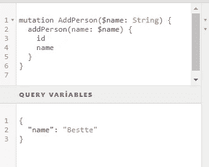

# 在 React App 中创建 GraphQL 突变并使用它们

> 原文：<https://javascript.plainenglish.io/create-graphql-mutations-in-react-app-and-use-them-1eeb89545033?source=collection_archive---------12----------------------->

## 在我们的 React 应用程序中使用 GraphQL 将数据保存到数据库！


Photo by [National Cancer Institute](https://unsplash.com/@nci?utm_source=medium&utm_medium=referral) on [Unsplash](https://unsplash.com?utm_source=medium&utm_medium=referral)

GraphQL 用于设计和使用 API。它还通过最大限度地减少必须通过网络传输的数据来提高应用程序在恶劣条件下的性能。在服务器端，有关于要发送给客户机的数据(模式、变异、查询)的信息。必要的添加、删除和更新操作通过变异结构和解析函数来执行。

GraphQL 服务器主要处理发送到服务器的 GraphQL 查询。请求与查询参数一起发送到服务器。

在本文中，我将使用常用的 Apollo 客户机结构。

在以简单的方式展示了查询和变异的用法之后，让我们继续我们的主题。

**用于查询:**

**突变:**

我们需要在模式中定义查询和变化:

```
module.exports = new GraphQLSchema({ query: QueryType, mutation: mutations});
```

## 在 React 中使用 GraphQL 突变

首先，从进口说起。

```
import React, { Component } from 'react';import gql from 'graphql-tag';import { graphql } from 'react-apollo';
```

`graphql-tag`:将 GraphQL 查询字符串解析成标准 GraphQL 的 JavaScript 模板文字标签。这是将查询传递给 [Apollo 客户端](https://github.com/apollographql/apollo-client)的推荐方法。

[欲了解更多信息，请点击此处。](https://www.npmjs.com/package/graphql-tag)

`react-apollo`:这是一个库，它有许多用于集成 GraphQL 和 react 的助手。React Apollo 允许您从 GraphQL 服务器获取数据，并使用 React 框架将数据用于构建复杂的反应式 ui

[欲了解更多信息，请点击此处。](https://www.npmjs.com/package/react-apollo)

我将使用基于类的组件，因为我将使类具有我将使用的多个函数。

首先创建一个构造函数:

```
constructor(props) { super(props); this.state = { name: '' }}
```

定义外部来源的突变。

```
const mutation = gql` mutation AddPerson($name: String){ addPerson(name: $name) { name }
}`;
```

我们将无法使用 props 传输数据，因为我们已经在外部定义了突变。这就是为什么我们要使用查询参数。将 GraphQL 用于查询参数:



如果你尝试`console.log(this.props);` ，你会看到变异。

如果您用`onSubmit()`从`mutate`发送姓名状态，您可以看到您添加到数据库中的一个人。

谢谢你。

[](https://bestte.medium.com/membership) [## 通过我的推荐链接加入 Medium—Beste

### 作为一个媒体会员，你的会员费的一部分会给你阅读的作家，你可以完全接触到每一个故事…

bestte.medium.com](https://bestte.medium.com/membership) [](/5-top-rated-q-a-for-angular-on-stack-overflow-bed610bf1c50) [## 5 堆栈上角溢出的顶级问答

### “这个项目从堆栈溢出开始”是开发人员如何开始她的故事。

javascript.plainenglish.io](/5-top-rated-q-a-for-angular-on-stack-overflow-bed610bf1c50) [](/how-to-work-with-the-angular-nebular-ui-library-and-use-a-simple-splash-screen-3dd0d1790478) [## 如何使用 Angular Nebular UI 库并使用简单的闪屏

### 闪屏在某些情况下是必要的，所以我想用一种非常简单的方式来展示它，我将谈谈…

javascript.plainenglish.io](/how-to-work-with-the-angular-nebular-ui-library-and-use-a-simple-splash-screen-3dd0d1790478) [](/how-to-use-sass-and-enjoy-css-with-dynamic-structure-900ea2adddf7) [## 如何使用 Sass，享受动态结构的 CSS

### 由于 CSS 是一个静态结构，我们必须不断重复代码。我们给 CSS 代码带来了动态结构…

javascript.plainenglish.io](/how-to-use-sass-and-enjoy-css-with-dynamic-structure-900ea2adddf7) [](/how-to-use-the-composition-api-to-get-data-from-service-with-vue-js-4da1eca19ad6) [## 如何使用组合 API 通过 Vue.js 从服务中获取数据

### 通过使用组合 API 而不是选项 API，可以使服务结构更加可用。

javascript.plainenglish.io](/how-to-use-the-composition-api-to-get-data-from-service-with-vue-js-4da1eca19ad6) 

*更多内容请看*[***plain English . io***](http://plainenglish.io/)*。报名参加我们的* [***免费周报***](http://newsletter.plainenglish.io/) *。在我们的* [***社区***](https://discord.gg/GtDtUAvyhW) *获得独家获得写作机会和建议。*